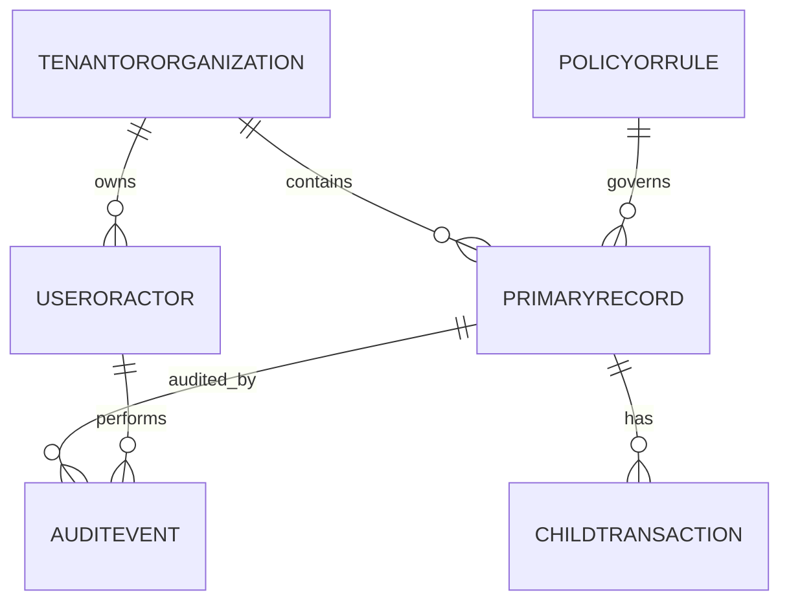

# Data Dictionary

This data dictionary is the canonical reference for **Backend as a Service Platform**. It defines shared terminology, entity semantics, and governance controls required to keep backend as a service workflows consistent across teams and services.

## Scope and Goals
- Establish a stable vocabulary for architecture, API, analytics, and operations teams.
- Define minimum required fields for core entities and expected relationship boundaries.
- Document data quality and retention controls needed for production readiness.

## Core Entities
| Entity | Description | Required Attributes |
|---|---|---|
| TenantOrOrganization | Top-level ownership boundary for data segregation | `org_id, name, status, region, created_at` |
| UserOrActor | Human/system principal that performs actions | `actor_id, org_id, role, status, last_active_at` |
| PrimaryRecord | Main lifecycle object handled by the platform | `record_id, org_id, state, owner_id, created_at, updated_at` |
| ChildTransaction | Operational transaction or sub-step linked to primary record | `txn_id, record_id, txn_type, amount_or_value, occurred_at` |
| PolicyOrRule | Versioned policy configuration that influences decisions | `policy_id, scope, version, effective_from, effective_to` |
| AuditEvent | Append-only evidence for state changes and controls | `audit_id, record_id, actor_id, action, reason_code, occurred_at` |

## Canonical Relationship Diagram

## Data Quality Controls
1. All write paths enforce required-field validation and referential integrity for mandatory foreign keys.
2. External imports must include provenance metadata (`source_system`, `source_ref`, `ingested_at`).
3. Status/state fields use controlled vocabularies and reject unknown values.
4. Duplicate detection runs on natural keys where business identity collisions are likely.
5. Sensitive fields carry classification tags to drive masking, encryption, and export behavior.

## Retention and Audit
- Operational records remain online for active workflow windows and support forensic queries.
- Historical records move to archive tiers by policy without breaking traceability.
- Audit events are immutable and linked through correlation ids for incident analysis.

## Operational Metadata Extensions

### API contract entities
| Entity | Key fields |
|---|---|
| `api_contract_versions` | `contract_version`, `effective_from`, `breaking_change` |
| `api_error_catalog` | `error_code`, `category`, `http_status`, `retryable` |
| `operation_records` | `operation_id`, `operation_type`, `state`, `started_at`, `finished_at` |

### Isolation entities
| Entity | Key fields |
|---|---|
| `tenant_boundaries` | `tenant_id`, `region_policy`, `data_residency_class` |
| `env_isolation_policies` | `env_id`, `egress_policy_id`, `secret_scope_id` |

### Lifecycle entities
| Entity | States encoded |
|---|---|
| `binding_lifecycle_events` | validating/active/switching/failed |
| `migration_runs` | planned/dry_run/applying/verified/completed/rolled_back |

### SLO + versioning entities
| Entity | Purpose |
|---|---|
| `sli_measurements` | stores per-minute SLI datapoints for latency, success, queue delay |
| `version_migration_matrix` | contract version vs adapter version compatibility |
