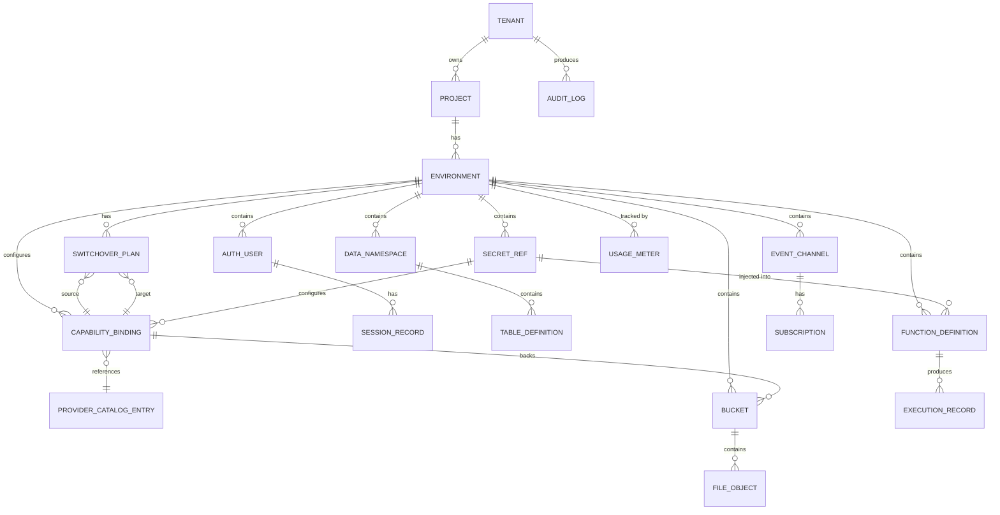

# Data Dictionary — Backend as a Service (BaaS) Platform

**Version:** 1.0  
**Status:** Approved  
**Last Updated:** 2025-01-01  

---

## Table of Contents

1. [Tenant](#1-tenant)
2. [Project](#2-project)
3. [Environment](#3-environment)
4. [CapabilityBinding](#4-capabilitybinding)
5. [ProviderCatalogEntry](#5-providercatalogentry)
6. [SwitchoverPlan](#6-switchoverplan)
7. [AuthUser](#7-authuser)
8. [SessionRecord](#8-sessionrecord)
9. [DataNamespace](#9-datanamespace)
10. [TableDefinition](#10-tabledefinition)
11. [FileObject](#11-fileobject)
12. [Bucket](#12-bucket)
13. [FunctionDefinition](#13-functiondefinition)
14. [ExecutionRecord](#14-executionrecord)
15. [EventChannel](#15-eventchannel)
16. [Subscription](#16-subscription)
17. [SecretRef](#17-secretref)
18. [UsageMeter](#18-usagemeter)
19. [AuditLog](#19-auditlog)
20. [Entity Relationship Overview](#20-entity-relationship-overview)

---

## Core Entities

## Tenant

**Description:** The top-level organizational entity. Represents a company, team, or individual that owns a subscription to the BaaS Platform. All resources are ultimately scoped to a Tenant.

**Table:** `control_plane.tenants`

| Attribute | Type | Nullable | Description | Validation |
|-----------|------|----------|-------------|------------|
| `id` | `UUID` | No | Primary key. Globally unique tenant identifier. | Auto-generated (UUID v4) |
| `slug` | `VARCHAR(63)` | No | URL-safe unique identifier used in API paths. | Regex: `^[a-z0-9][a-z0-9-]{1,61}[a-z0-9]$`; unique |
| `display_name` | `VARCHAR(255)` | No | Human-readable tenant name shown in the console. | 1–255 characters |
| `billing_email` | `VARCHAR(320)` | No | Email address for quota warnings and billing notifications. | Valid RFC 5321 email |
| `plan_tier` | `VARCHAR(50)` | No | Subscription plan: `free`, `starter`, `pro`, `enterprise`. | Enum validation |
| `status` | `VARCHAR(20)` | No | Lifecycle state: `active`, `frozen`, `deleted`. | Enum; default `active` |
| `created_at` | `TIMESTAMPTZ` | No | UTC timestamp of tenant creation. | Auto-set; immutable |
| `updated_at` | `TIMESTAMPTZ` | No | UTC timestamp of last modification. | Auto-updated on write |
| `deleted_at` | `TIMESTAMPTZ` | Yes | UTC timestamp of soft deletion. Null if active. | Set on soft delete |
| `metadata` | `JSONB` | Yes | Arbitrary tenant-level metadata (custom tags, notes). | Valid JSON object |
| `quota_config` | `JSONB` | No | JSON object encoding per-dimension quota limits. | Must conform to quota schema |

**Indexes:** `UNIQUE(slug)`, `INDEX(status, deleted_at)`

---

## Project

**Description:** A logical unit within a Tenant that groups related environments, resources, and configurations. A Tenant may own multiple Projects.

**Table:** `control_plane.projects`

| Attribute | Type | Nullable | Description | Validation |
|-----------|------|----------|-------------|------------|
| `id` | `UUID` | No | Primary key. | Auto-generated (UUID v4) |
| `tenant_id` | `UUID` | No | FK → `tenants.id`. Owning tenant. | Must reference existing tenant |
| `name` | `VARCHAR(255)` | No | Project name, unique within the tenant. | 1–255 chars; unique per tenant |
| `slug` | `VARCHAR(63)` | No | URL-safe name used in API paths. | Regex: `^[a-z0-9-]+$`; unique per tenant |
| `description` | `TEXT` | Yes | Human-readable description of the project. | Max 2,000 characters |
| `status` | `VARCHAR(20)` | No | `active`, `frozen`, `deleting`, `deleted`. | Enum; default `active` |
| `created_by` | `UUID` | No | FK → `auth_users.id`. User who created the project. | Must reference valid user |
| `created_at` | `TIMESTAMPTZ` | No | UTC creation timestamp. | Auto-set; immutable |
| `updated_at` | `TIMESTAMPTZ` | No | UTC last modification timestamp. | Auto-updated |
| `delete_scheduled_at` | `TIMESTAMPTZ` | Yes | When permanent deletion is scheduled (30 days after soft delete). | Set on soft delete |

**Indexes:** `UNIQUE(tenant_id, slug)`, `INDEX(tenant_id, status)`

---

## Environment

**Description:** A named deployment context within a Project. Environments provide complete isolation: separate database schemas, provider bindings, API keys, and secrets.

**Table:** `control_plane.environments`

| Attribute | Type | Nullable | Description | Validation |
|-----------|------|----------|-------------|------------|
| `id` | `UUID` | No | Primary key. | Auto-generated (UUID v4) |
| `project_id` | `UUID` | No | FK → `projects.id`. Owning project. | Must reference existing project |
| `name` | `VARCHAR(63)` | No | Environment name: `development`, `staging`, `production`, or custom. | Unique per project |
| `type` | `VARCHAR(20)` | No | Classification: `development`, `staging`, `production`. | Enum |
| `status` | `VARCHAR(20)` | No | `provisioning`, `active`, `maintenance`, `inactive`. | Enum; default `provisioning` |
| `db_schema_name` | `VARCHAR(63)` | No | PostgreSQL schema name allocated to this environment. | Auto-generated; unique in the database |
| `api_key_hash` | `VARCHAR(255)` | No | bcrypt hash of the current environment API key. | Cost factor ≥ 12 |
| `api_key_preview` | `VARCHAR(8)` | No | Last 8 characters of the API key (for display only). | Derived from key |
| `api_key_expires_at` | `TIMESTAMPTZ` | Yes | Expiry of the current API key; null = no expiry. | Must be future if set |
| `previous_api_key_hash` | `VARCHAR(255)` | Yes | bcrypt hash of the previous API key during rotation overlap. | Null when no rotation in progress |
| `previous_key_valid_until` | `TIMESTAMPTZ` | Yes | When the old key becomes invalid. | Set during key rotation |
| `created_at` | `TIMESTAMPTZ` | No | UTC creation timestamp. | Auto-set |
| `updated_at` | `TIMESTAMPTZ` | No | UTC last modification timestamp. | Auto-updated |

**Indexes:** `UNIQUE(project_id, name)`, `INDEX(project_id, status)`

---

## CapabilityBinding

**Description:** Associates a Project Environment with a specific ProviderCatalogEntry for a given capability (storage, functions, messaging). Stores encrypted configuration as a reference to an external secret.

**Table:** `control_plane.capability_bindings`

| Attribute | Type | Nullable | Description | Validation |
|-----------|------|----------|-------------|------------|
| `id` | `UUID` | No | Primary key. | Auto-generated |
| `environment_id` | `UUID` | No | FK → `environments.id`. Scoped environment. | Must reference existing env |
| `capability` | `VARCHAR(50)` | No | Capability type: `storage`, `functions`, `messaging`, `email`. | Enum |
| `catalog_entry_id` | `UUID` | No | FK → `provider_catalog_entries.id`. Which adapter to use. | Must reference active entry |
| `status` | `VARCHAR(20)` | No | `pending_validation`, `active`, `degraded`, `inactive`. | Enum |
| `config_secret_ref_id` | `UUID` | No | FK → `secret_refs.id`. Points to the configuration blob in the secret store. | Must reference valid SecretRef |
| `display_alias` | `VARCHAR(255)` | Yes | Human-readable label (e.g., "Production S3 Bucket"). | 1–255 chars |
| `validation_result` | `JSONB` | Yes | Last connectivity check result: `{ "ok": bool, "message": str, "checked_at": ts }`. | Valid JSON |
| `last_validated_at` | `TIMESTAMPTZ` | Yes | Timestamp of last successful validation. | Auto-set on check |
| `is_primary` | `BOOLEAN` | No | Whether this is the primary binding for the capability in this env. | Default true; unique per capability+env |
| `created_at` | `TIMESTAMPTZ` | No | UTC creation timestamp. | Auto-set |
| `updated_at` | `TIMESTAMPTZ` | No | UTC last modification timestamp. | Auto-updated |

**Indexes:** `UNIQUE(environment_id, capability) WHERE is_primary = true`, `INDEX(environment_id, capability, status)`

---

## ProviderCatalogEntry

**Description:** Registry of available provider adapters. Each entry defines an adapter type, version, required/optional configuration schema, and the image or package reference for the adapter implementation.

**Table:** `control_plane.provider_catalog_entries`

| Attribute | Type | Nullable | Description | Validation |
|-----------|------|----------|-------------|------------|
| `id` | `UUID` | No | Primary key. | Auto-generated |
| `provider_name` | `VARCHAR(100)` | No | Unique adapter name (e.g., `aws-s3`, `gcp-gcs`, `minio`). | Lowercase alphanumeric + hyphens |
| `version` | `VARCHAR(20)` | No | Semver version string. | Valid semver |
| `capability` | `VARCHAR(50)` | No | Capability this adapter implements. | Enum: same as CapabilityBinding.capability |
| `display_name` | `VARCHAR(255)` | No | Human-readable provider name (e.g., "Amazon S3"). | 1–255 chars |
| `description` | `TEXT` | Yes | Adapter description shown in the catalog UI. | Max 2,000 chars |
| `config_schema` | `JSONB` | No | JSON Schema (Draft-07) defining required/optional configuration fields. | Must be valid JSON Schema |
| `adapter_image` | `VARCHAR(500)` | Yes | Container image reference for the adapter. | Valid image URI if set |
| `adapter_package` | `VARCHAR(500)` | Yes | Package name/version for plugin-style adapters. | Valid package ref if set |
| `status` | `VARCHAR(20)` | No | `active`, `deprecated`, `sunset`. | Enum |
| `sunset_at` | `TIMESTAMPTZ` | Yes | When deprecated versions will stop accepting new bindings. | Future timestamp if set |
| `published_at` | `TIMESTAMPTZ` | No | When this catalog entry was published. | Auto-set |
| `published_by` | `UUID` | No | FK → `auth_users.id`. Who published the entry. | Must reference valid user |

**Indexes:** `UNIQUE(provider_name, version)`, `INDEX(capability, status)`

---

## SwitchoverPlan

**Description:** A structured, orchestrated plan to migrate a capability from one CapabilityBinding to another. Tracks state, safety gate results, and rollback capability.

**Table:** `control_plane.switchover_plans`

| Attribute | Type | Nullable | Description | Validation |
|-----------|------|----------|-------------|------------|
| `id` | `UUID` | No | Primary key. | Auto-generated |
| `environment_id` | `UUID` | No | FK → `environments.id`. | Must reference active env |
| `capability` | `VARCHAR(50)` | No | The capability being migrated. | Enum |
| `source_binding_id` | `UUID` | No | FK → `capability_bindings.id`. Current/old binding. | Must reference active binding |
| `target_binding_id` | `UUID` | No | FK → `capability_bindings.id`. Destination binding. | Must reference active binding |
| `status` | `VARCHAR(20)` | No | `draft`, `ready`, `in_progress`, `completed`, `rolled_back`, `failed`. | Enum |
| `safety_gates` | `JSONB` | No | JSON object with gate check results: `{ quiesce, connectivity, checksum }`. | Per-gate boolean + message |
| `initiated_by` | `UUID` | No | FK → `auth_users.id`. Actor who created the plan. | Must reference valid user |
| `started_at` | `TIMESTAMPTZ` | Yes | When execution began. | Set on transition to `in_progress` |
| `completed_at` | `TIMESTAMPTZ` | Yes | When execution completed or rolled back. | Set on terminal state |
| `rollback_reason` | `TEXT` | Yes | Human-readable explanation of why rollback occurred. | Set on `rolled_back` |
| `progress_pct` | `SMALLINT` | No | 0–100 progress indicator during data copy phase. | 0–100 range |
| `created_at` | `TIMESTAMPTZ` | No | UTC creation timestamp. | Auto-set |
| `updated_at` | `TIMESTAMPTZ` | No | UTC last modification timestamp. | Auto-updated |

**Indexes:** `INDEX(environment_id, capability, status)`, `INDEX(status) WHERE status = 'in_progress'`

---

## AuthUser

**Description:** A user account registered within a Project. Users authenticate via email/password, OAuth2, magic link, or anonymous session. Users are scoped to a Project (not cross-project).

**Table:** `auth_{environment_id}.users`  *(per-environment schema)*

| Attribute | Type | Nullable | Description | Validation |
|-----------|------|----------|-------------|------------|
| `id` | `UUID` | No | Primary key. Stable user ID used in JWTs and foreign keys. | Auto-generated (UUID v4) |
| `email` | `VARCHAR(320)` | Yes | User's email address. Null for anonymous users. | Valid email; unique per project env |
| `email_verified` | `BOOLEAN` | No | Whether the email has been verified via verification flow. | Default false |
| `password_hash` | `VARCHAR(255)` | Yes | bcrypt hash of the password. Null for OAuth-only users. | Cost ≥ 12 |
| `phone` | `VARCHAR(30)` | Yes | E.164-format phone number. | Valid E.164 if set |
| `phone_verified` | `BOOLEAN` | No | Whether the phone number has been verified. | Default false |
| `status` | `VARCHAR(20)` | No | `active`, `disabled`, `pending_verification`, `deleted`. | Enum |
| `roles` | `TEXT[]` | No | Array of role names assigned to the user. | Must reference defined roles |
| `mfa_enabled` | `BOOLEAN` | No | Whether MFA is enrolled for this user. | Default false |
| `mfa_secret_ref_id` | `UUID` | Yes | FK → `secret_refs.id`. TOTP seed stored in secret manager. | Null if MFA not enrolled |
| `last_login_at` | `TIMESTAMPTZ` | Yes | Timestamp of most recent successful authentication. | Updated on login |
| `last_login_ip` | `INET` | Yes | IP address of most recent login. | Valid IP |
| `login_attempt_count` | `SMALLINT` | No | Failed login attempts since last reset. | 0–32767 |
| `login_attempt_reset_at` | `TIMESTAMPTZ` | Yes | When the attempt counter was last reset. | Set on reset |
| `created_at` | `TIMESTAMPTZ` | No | UTC registration timestamp. | Auto-set; immutable |
| `updated_at` | `TIMESTAMPTZ` | No | UTC last modification timestamp. | Auto-updated |

**Indexes:** `UNIQUE(email) WHERE email IS NOT NULL AND status != 'deleted'`, `INDEX(status)`, `INDEX(last_login_at)`

---

## SessionRecord

**Description:** Server-side record of an active or revoked authentication session. Enables refresh token rotation, replay detection, and bulk session revocation.

**Table:** `auth_{environment_id}.sessions`

| Attribute | Type | Nullable | Description | Validation |
|-----------|------|----------|-------------|------------|
| `id` | `UUID` | No | Primary key. Also used as the `jti` (JWT ID) claim. | Auto-generated |
| `user_id` | `UUID` | No | FK → `users.id`. | Must reference existing user |
| `refresh_token_hash` | `VARCHAR(255)` | No | SHA-256 hash of the current refresh token value. | 64-char hex string |
| `previous_token_hash` | `VARCHAR(255)` | Yes | SHA-256 hash of the previously issued refresh token (replay detection window). | 64-char hex string |
| `status` | `VARCHAR(20)` | No | `active`, `revoked`, `expired`. | Enum |
| `issued_at` | `TIMESTAMPTZ` | No | When this session was first created. | Auto-set |
| `expires_at` | `TIMESTAMPTZ` | No | When the refresh token expires. | Must be future at creation |
| `last_used_at` | `TIMESTAMPTZ` | Yes | When the refresh token was last presented and rotated. | Updated on use |
| `revoked_at` | `TIMESTAMPTZ` | Yes | When the session was explicitly revoked. | Set on revocation |
| `revocation_reason` | `VARCHAR(100)` | Yes | Reason code: `logout`, `logout_all`, `security_rotation`, `hijack_suspected`. | Set on revocation |
| `device_fingerprint` | `VARCHAR(500)` | Yes | Hashed combination of user agent and accept headers. | For anomaly detection |
| `ip_address` | `INET` | No | IP at session creation time. | Valid IP |
| `user_agent` | `TEXT` | Yes | Raw user agent string at session creation. | Max 1,000 chars |

**Indexes:** `INDEX(user_id, status)`, `INDEX(refresh_token_hash)`, `INDEX(expires_at) WHERE status = 'active'`

---

## DataNamespace

**Description:** A PostgreSQL schema within the project's database environment, used to group related tables. Maps 1:1 with a PostgreSQL schema object.

**Table:** `control_plane.data_namespaces`

| Attribute | Type | Nullable | Description | Validation |
|-----------|------|----------|-------------|------------|
| `id` | `UUID` | No | Primary key. | Auto-generated |
| `environment_id` | `UUID` | No | FK → `environments.id`. | Must reference active env |
| `name` | `VARCHAR(63)` | No | Namespace name, maps to PostgreSQL schema name. | Regex: `^[a-z_][a-z0-9_]{0,62}$`; unique per env |
| `pg_schema_name` | `VARCHAR(63)` | No | Actual PostgreSQL schema name (may be prefixed with env ID). | Unique in the PG database |
| `description` | `TEXT` | Yes | Human-readable description. | Max 2,000 chars |
| `status` | `VARCHAR(20)` | No | `active`, `migrating`, `dropped`. | Enum |
| `created_by` | `UUID` | No | FK → `auth_users.id` or API key ID. | Must reference valid identity |
| `created_at` | `TIMESTAMPTZ` | No | UTC creation timestamp. | Auto-set |
| `updated_at` | `TIMESTAMPTZ` | No | UTC last modification timestamp. | Auto-updated |

**Indexes:** `UNIQUE(environment_id, name)`, `INDEX(environment_id, status)`

---

## TableDefinition

**Description:** Metadata record describing a table within a DataNamespace. Stores the column schema used by the Database API to generate SQL DDL and CRUD queries.

**Table:** `control_plane.table_definitions`

| Attribute | Type | Nullable | Description | Validation |
|-----------|------|----------|-------------|------------|
| `id` | `UUID` | No | Primary key. | Auto-generated |
| `namespace_id` | `UUID` | No | FK → `data_namespaces.id`. | Must reference active namespace |
| `name` | `VARCHAR(63)` | No | Table name. | Regex: `^[a-z_][a-z0-9_]{0,62}$`; unique per namespace |
| `pg_table_name` | `VARCHAR(63)` | No | Actual PostgreSQL table name. | Derived; unique in PG schema |
| `columns` | `JSONB` | No | Ordered array of column definitions: `[{name, type, nullable, default, unique, indexed}]`. | Validated against column type enum |
| `rls_policies` | `JSONB` | No | Array of RLS policy definitions: `[{name, role, predicate, operation}]`. | SQL predicate validated at definition time |
| `indexes` | `JSONB` | No | Array of additional index definitions beyond primary key. | Valid index spec |
| `current_migration_version` | `VARCHAR(50)` | No | The migration version this definition reflects. | Valid version string |
| `created_by` | `UUID` | No | Creating actor ID. | Must reference valid identity |
| `created_at` | `TIMESTAMPTZ` | No | UTC creation timestamp. | Auto-set |
| `updated_at` | `TIMESTAMPTZ` | No | UTC last modification timestamp. | Auto-updated |

**Indexes:** `UNIQUE(namespace_id, name)`, `INDEX(namespace_id)`

---

## FileObject

**Description:** Metadata record for a file stored in an object storage provider. The binary content resides in the provider; PostgreSQL holds only metadata and access control information.

**Table:** `storage_{environment_id}.file_objects`

| Attribute | Type | Nullable | Description | Validation |
|-----------|------|----------|-------------|------------|
| `id` | `UUID` | No | Primary key. Also used as the storage key in the provider. | Auto-generated (UUID v4) |
| `bucket_id` | `UUID` | No | FK → `buckets.id`. Parent bucket. | Must reference existing bucket |
| `name` | `TEXT` | No | User-provided file name (path). | 1–1,024 chars; valid UTF-8 |
| `size_bytes` | `BIGINT` | No | File size in bytes. | ≥ 0 |
| `mime_type` | `VARCHAR(255)` | Yes | MIME type detected or provided at upload. | Valid MIME type format if set |
| `checksum_sha256` | `VARCHAR(64)` | No | SHA-256 checksum of the file content. | 64-char hex string |
| `storage_provider_key` | `TEXT` | No | The key/path under which the file is stored in the provider. | Provider-specific format |
| `owner_user_id` | `UUID` | Yes | FK → `auth_users.id`. Null if uploaded via API key. | Must reference valid user if set |
| `status` | `VARCHAR(20)` | No | `uploading`, `scan_pending`, `active`, `quarantined`, `deleted`. | Enum |
| `scan_result` | `VARCHAR(20)` | Yes | Virus scan result: `clean`, `infected`, `error`. | Set by scan service |
| `scan_completed_at` | `TIMESTAMPTZ` | Yes | When the scan completed. | Set by scan service |
| `access_policy` | `VARCHAR(20)` | No | `public`, `private`, `signed`. Inherited from bucket if not overridden. | Enum |
| `metadata` | `JSONB` | Yes | User-supplied custom metadata key-value pairs. | Max 10 keys, keys ≤ 100 chars |
| `created_at` | `TIMESTAMPTZ` | No | UTC upload completion timestamp. | Auto-set |
| `deleted_at` | `TIMESTAMPTZ` | Yes | UTC soft-deletion timestamp. | Set on delete |

**Indexes:** `INDEX(bucket_id, status)`, `INDEX(owner_user_id)`, `INDEX(created_at DESC)`

---

## Bucket

**Description:** A named container for FileObjects, analogous to an S3 bucket or GCS bucket. Defines the access policy, associated CapabilityBinding, and quota.

**Table:** `storage_{environment_id}.buckets`

| Attribute | Type | Nullable | Description | Validation |
|-----------|------|----------|-------------|------------|
| `id` | `UUID` | No | Primary key. | Auto-generated |
| `environment_id` | `UUID` | No | FK → `environments.id`. | Must reference active env |
| `name` | `VARCHAR(255)` | No | Bucket name, unique within the environment. | Regex: `^[a-z0-9][a-z0-9-]{1,253}[a-z0-9]$` |
| `access_policy` | `VARCHAR(20)` | No | Default file access policy: `public`, `private`, `signed`. | Enum |
| `binding_id` | `UUID` | No | FK → `capability_bindings.id`. Which storage provider backs this bucket. | Must reference active storage binding |
| `max_file_size_bytes` | `BIGINT` | Yes | Maximum individual file size allowed. Null = use platform default (5 GB). | ≥ 1 if set |
| `allowed_mime_types` | `TEXT[]` | Yes | Whitelist of allowed MIME types. Null = all types allowed. | Valid MIME type strings |
| `virus_scan_enabled` | `BOOLEAN` | No | Whether uploaded files are submitted for virus scanning. | Default false |
| `total_size_bytes` | `BIGINT` | No | Running total of all active file sizes in the bucket. | Updated transactionally |
| `file_count` | `BIGINT` | No | Count of active files in the bucket. | Updated transactionally |
| `created_by` | `UUID` | No | Creating actor ID. | Must reference valid identity |
| `created_at` | `TIMESTAMPTZ` | No | UTC creation timestamp. | Auto-set |
| `updated_at` | `TIMESTAMPTZ` | No | UTC last modification timestamp. | Auto-updated |

**Indexes:** `UNIQUE(environment_id, name)`, `INDEX(binding_id)`

---

## FunctionDefinition

**Description:** Metadata for a deployed serverless function. Defines runtime, artifact reference, trigger configuration, resource limits, and associated secrets.

**Table:** `functions_{environment_id}.definitions`

| Attribute | Type | Nullable | Description | Validation |
|-----------|------|----------|-------------|------------|
| `id` | `UUID` | No | Primary key. | Auto-generated |
| `environment_id` | `UUID` | No | FK → `environments.id`. | Must reference active env |
| `name` | `VARCHAR(255)` | No | Function name, unique within environment. | Regex: `^[a-z][a-z0-9-]{0,253}$` |
| `runtime` | `VARCHAR(50)` | No | Execution runtime: `node18`, `node20`, `python311`, `python312`, `go121`. | Enum |
| `entrypoint` | `VARCHAR(255)` | No | Handler path within the artifact (e.g., `src/index.handler`). | Valid path string |
| `artifact_type` | `VARCHAR(20)` | No | `zip`, `container_image`. | Enum |
| `artifact_ref` | `TEXT` | No | Storage key (ZIP) or image URI (container). | Valid ref for artifact_type |
| `artifact_checksum` | `VARCHAR(64)` | No | SHA-256 of the artifact at deployment time. | 64-char hex |
| `timeout_seconds` | `INTEGER` | No | Max execution duration. | 1–900; default 30 |
| `memory_mb` | `INTEGER` | No | Memory allocation for each invocation. | 128–4096; default 256 |
| `max_concurrency` | `INTEGER` | No | Maximum simultaneous executions. | 1–500; default 10 |
| `env_vars` | `JSONB` | No | Map of static environment variable name → value (non-secret). | Max 50 keys |
| `secret_refs` | `JSONB` | No | Map of env var name → SecretRef ID for secret injection. | Max 20 entries |
| `trigger_config` | `JSONB` | No | Trigger definitions: HTTP, cron schedule, or channel subscription. | Validated against trigger schema |
| `binding_id` | `UUID` | No | FK → `capability_bindings.id`. Functions provider binding. | Must reference active functions binding |
| `status` | `VARCHAR(20)` | No | `deploying`, `active`, `deprecated`, `error`. | Enum |
| `deployed_at` | `TIMESTAMPTZ` | Yes | When the function was last successfully deployed. | Set on successful deploy |
| `created_by` | `UUID` | No | Actor who created/deployed the function. | Must reference valid identity |
| `created_at` | `TIMESTAMPTZ` | No | UTC creation timestamp. | Auto-set |
| `updated_at` | `TIMESTAMPTZ` | No | UTC last modification timestamp. | Auto-updated |

**Indexes:** `UNIQUE(environment_id, name)`, `INDEX(environment_id, status)`

---

## ExecutionRecord

**Description:** Immutable record of a single function execution. Created on invocation; updated as the execution progresses through states.

**Table:** `functions_{environment_id}.executions`

| Attribute | Type | Nullable | Description | Validation |
|-----------|------|----------|-------------|------------|
| `id` | `UUID` | No | Primary key. Unique execution ID, injected as `BAAS_EXECUTION_ID`. | Auto-generated |
| `function_id` | `UUID` | No | FK → `definitions.id`. | Must reference valid function |
| `trigger_type` | `VARCHAR(20)` | No | `http`, `cron`, `event`, `manual`. | Enum |
| `trigger_source` | `TEXT` | Yes | HTTP request ID, cron slot ID, or event ID that triggered execution. | Contextual |
| `status` | `VARCHAR(20)` | No | `queued`, `running`, `completed`, `failed`, `timeout`, `cancelled`. | Enum |
| `started_at` | `TIMESTAMPTZ` | Yes | When execution began. | Set when worker picks up |
| `completed_at` | `TIMESTAMPTZ` | Yes | When execution finished. | Set on terminal state |
| `duration_ms` | `INTEGER` | Yes | Wall-clock duration in milliseconds. | Computed on completion |
| `exit_code` | `INTEGER` | Yes | Process exit code. 0 = success. | Null if timeout/cancelled |
| `response_status` | `INTEGER` | Yes | HTTP response status returned by the function (HTTP-triggered only). | 100–599 |
| `error_message` | `TEXT` | Yes | Error description for failed/timeout executions. | Max 2,000 chars |
| `log_storage_key` | `TEXT` | Yes | Storage key pointing to the full stdout/stderr log artifact. | Set after log upload |
| `actor_user_id` | `UUID` | Yes | User who manually triggered (HTTP-triggered via user JWT). | Null for cron/event |
| `idempotency_key` | `VARCHAR(255)` | Yes | Deduplication key for cron slot replays. | Unique per function+slot |
| `created_at` | `TIMESTAMPTZ` | No | UTC record creation timestamp. | Auto-set; immutable |

**Indexes:** `INDEX(function_id, created_at DESC)`, `INDEX(status, created_at)`, `UNIQUE(function_id, idempotency_key) WHERE idempotency_key IS NOT NULL`

---

## EventChannel

**Description:** A named, policy-governed publish/subscribe channel used by the Realtime Service for WebSocket fan-out and webhook delivery.

**Table:** `realtime_{environment_id}.event_channels`

| Attribute | Type | Nullable | Description | Validation |
|-----------|------|----------|-------------|------------|
| `id` | `UUID` | No | Primary key. | Auto-generated |
| `environment_id` | `UUID` | No | FK → `environments.id`. | Must reference active env |
| `name` | `VARCHAR(255)` | No | Channel name, unique within environment. | Regex: `^[a-zA-Z0-9:._-]+$`; unique per env |
| `visibility` | `VARCHAR(20)` | No | `public` (anyone can subscribe), `private` (auth required), `presence` (auth + member tracking). | Enum |
| `publish_policy` | `VARCHAR(20)` | No | `authenticated_users`, `api_key_only`, `any`. | Enum |
| `auth_policy` | `JSONB` | Yes | Custom authorization policy for subscribe/publish (role conditions). | Valid policy JSON |
| `strict_auth` | `BOOLEAN` | No | If true, re-evaluate auth on every message publish. | Default false |
| `retention_seconds` | `INTEGER` | No | How long published messages are retained for replay. | 0–86400; default 0 |
| `max_message_size_bytes` | `INTEGER` | No | Maximum payload size per message. | 1–65536; default 4096 |
| `created_by` | `UUID` | No | Creating actor ID. | Must reference valid identity |
| `created_at` | `TIMESTAMPTZ` | No | UTC creation timestamp. | Auto-set |
| `updated_at` | `TIMESTAMPTZ` | No | UTC last modification timestamp. | Auto-updated |

**Indexes:** `UNIQUE(environment_id, name)`, `INDEX(environment_id, visibility)`

---

## Subscription

**Description:** A registered endpoint (WebSocket session or webhook URL) that receives events from one or more EventChannels. Tracks delivery status and retry state.

**Table:** `realtime_{environment_id}.subscriptions`

| Attribute | Type | Nullable | Description | Validation |
|-----------|------|----------|-------------|------------|
| `id` | `UUID` | No | Primary key. | Auto-generated |
| `channel_id` | `UUID` | No | FK → `event_channels.id`. | Must reference valid channel |
| `type` | `VARCHAR(20)` | No | `websocket`, `webhook`. | Enum |
| `websocket_session_id` | `VARCHAR(255)` | Yes | WebSocket connection ID (for type=websocket). | Set for websocket type |
| `webhook_url` | `TEXT` | Yes | Target HTTPS endpoint (for type=webhook). | Valid HTTPS URL; required for webhook |
| `webhook_secret_ref_id` | `UUID` | Yes | FK → `secret_refs.id`. HMAC signing key for webhook. | Required for webhook type |
| `event_filter` | `TEXT[]` | No | Array of event type patterns to match. `['*']` = all events. | Valid pattern array |
| `status` | `VARCHAR(20)` | No | `active`, `suspended`, `closed`. | Enum |
| `subscriber_user_id` | `UUID` | Yes | FK → `auth_users.id`. User who subscribed (websocket). | Null for API key subs |
| `consecutive_failures` | `SMALLINT` | No | Number of consecutive webhook delivery failures. | 0–5 |
| `last_failure_at` | `TIMESTAMPTZ` | Yes | Timestamp of most recent delivery failure. | Set on failure |
| `next_retry_at` | `TIMESTAMPTZ` | Yes | Scheduled time for next retry attempt. | Set on failure |
| `created_at` | `TIMESTAMPTZ` | No | UTC creation timestamp. | Auto-set |
| `updated_at` | `TIMESTAMPTZ` | No | UTC last modification timestamp. | Auto-updated |

**Indexes:** `INDEX(channel_id, status)`, `INDEX(next_retry_at) WHERE status = 'active' AND type = 'webhook'`

---

## SecretRef

**Description:** A reference to a secret stored in an external secret manager. The platform never stores the resolved secret value — only a pointer (path/ARN/ID) and a display alias.

**Table:** `control_plane.secret_refs`

| Attribute | Type | Nullable | Description | Validation |
|-----------|------|----------|-------------|------------|
| `id` | `UUID` | No | Primary key. | Auto-generated |
| `environment_id` | `UUID` | No | FK → `environments.id`. | Must reference active env |
| `alias` | `VARCHAR(255)` | No | Human-readable name for the secret (e.g., `stripe-api-key`). | Unique per environment |
| `provider` | `VARCHAR(50)` | No | Secret store type: `aws_secrets_manager`, `gcp_secret_manager`, `hashicorp_vault`, `azure_key_vault`. | Enum |
| `external_path` | `TEXT` | No | The path, ARN, or ID in the external secret store. | Non-empty; provider-specific format |
| `version_id` | `VARCHAR(255)` | Yes | Specific version to resolve. Null = latest. | Provider-specific format |
| `description` | `TEXT` | Yes | Description of what this secret is used for. | Max 1,000 chars |
| `last_rotated_at` | `TIMESTAMPTZ` | Yes | Last known rotation timestamp. | Updated on rotation event |
| `rotation_status` | `VARCHAR(20)` | No | `ok`, `rotating`, `failed`. | Enum; default `ok` |
| `created_by` | `UUID` | No | Creating actor ID. | Must reference valid identity |
| `created_at` | `TIMESTAMPTZ` | No | UTC creation timestamp. | Auto-set |
| `updated_at` | `TIMESTAMPTZ` | No | UTC last modification timestamp. | Auto-updated |

**Indexes:** `UNIQUE(environment_id, alias)`, `INDEX(environment_id, rotation_status)`

---

## UsageMeter

**Description:** Near-real-time usage counters per project/environment/dimension. Used for quota enforcement and billing analytics.

**Table:** `control_plane.usage_meters`

| Attribute | Type | Nullable | Description | Validation |
|-----------|------|----------|-------------|------------|
| `id` | `UUID` | No | Primary key. | Auto-generated |
| `environment_id` | `UUID` | No | FK → `environments.id`. | Must reference existing env |
| `dimension` | `VARCHAR(100)` | No | What is being measured: `api_calls`, `storage_bytes`, `function_invocations`, `function_compute_minutes`, `egress_bytes`, `websocket_connections`. | Enum |
| `period_start` | `TIMESTAMPTZ` | No | Start of the metering period (usually month start). | Must be start-of-day UTC |
| `period_end` | `TIMESTAMPTZ` | No | End of the metering period. | Must be after period_start |
| `current_value` | `BIGINT` | No | Current accumulated usage for this dimension in the period. | ≥ 0 |
| `quota_limit` | `BIGINT` | Yes | Quota limit for this dimension. Null = unlimited. | > 0 if set |
| `last_updated_at` | `TIMESTAMPTZ` | No | When `current_value` was last updated. | Auto-updated; cached ≤ 60 s |
| `warning_emitted_at` | `TIMESTAMPTZ` | Yes | When the 80%-quota warning was last emitted. | Prevents duplicate warnings |

**Indexes:** `UNIQUE(environment_id, dimension, period_start)`, `INDEX(environment_id, period_start DESC)`

---

## AuditLog

**Description:** Immutable, append-only record of all write operations across all platform resources. The underlying PostgreSQL role has INSERT + SELECT only; UPDATE and DELETE are revoked.

**Table:** `audit.log_entries`

| Attribute | Type | Nullable | Description | Validation |
|-----------|------|----------|-------------|------------|
| `id` | `UUID` | No | Primary key. | Auto-generated |
| `tenant_id` | `UUID` | No | Owning tenant. | Must reference valid tenant |
| `project_id` | `UUID` | Yes | Project context. Null for platform-level events. | FK if set |
| `environment_id` | `UUID` | Yes | Environment context. | FK if set |
| `event_type` | `VARCHAR(100)` | No | Dot-notated event type (e.g., `auth.user.registered`). | Non-empty string |
| `actor_type` | `VARCHAR(20)` | No | `user`, `api_key`, `service`, `platform_operator`. | Enum |
| `actor_id` | `VARCHAR(255)` | No | ID of the actor (user UUID, API key ID, or service name). | Non-empty |
| `actor_ip` | `INET` | Yes | IP address of the actor at request time. | Valid IP if available |
| `actor_user_agent` | `TEXT` | Yes | HTTP user agent string. | Max 1,000 chars |
| `resource_type` | `VARCHAR(100)` | No | Type of resource affected (e.g., `auth_user`, `file_object`). | Non-empty |
| `resource_id` | `VARCHAR(255)` | No | ID of the affected resource. | Non-empty |
| `action` | `VARCHAR(50)` | No | Action performed: `create`, `update`, `delete`, `login`, `logout`, `invoke`, `publish`, etc. | Enum |
| `before_state` | `JSONB` | Yes | Snapshot of the resource state before the action. Null for create. | PII fields redacted |
| `after_state` | `JSONB` | Yes | Snapshot of the resource state after the action. Null for delete. | PII fields redacted |
| `request_id` | `UUID` | Yes | Correlation ID from the HTTP request. | UUID format |
| `trace_id` | `VARCHAR(64)` | Yes | OpenTelemetry trace ID for distributed tracing correlation. | Hex string |
| `occurred_at` | `TIMESTAMPTZ` | No | UTC timestamp when the event occurred. | Immutable; set at insert time |

**Indexes:** `INDEX(tenant_id, occurred_at DESC)`, `INDEX(actor_id, occurred_at DESC)`, `INDEX(resource_type, resource_id, occurred_at DESC)`, `INDEX(event_type, occurred_at DESC)`

**Note:** No UPDATE or DELETE privileges are granted on this table to any application role. Partition by month for efficient retention management.

---

## Canonical Relationship Diagram

## Data Quality Controls

| Control | Scope | Enforcement | Notes |
|---|---|---|---|
| Tenant isolation | All entities | Row-level security, schema-per-tenant | Prevents cross-tenant data leakage |
| Resource quota enforcement | Project, Capability | Pre-write validation | Prevents unbounded resource creation |
| Audit log immutability | AuditLog | Append-only DB role | Ensures compliance trail integrity |
| Soft delete retention | All entities | Deleted flag, 30-day retention | Prevents accidental permanent loss |
| Secret encryption | SecretRef | AES-256 KMS-backed | Ensures no plaintext secrets at rest |
| Usage meter accuracy | UsageMeter | Idempotent counters with dedup key | Prevents double-billing |
