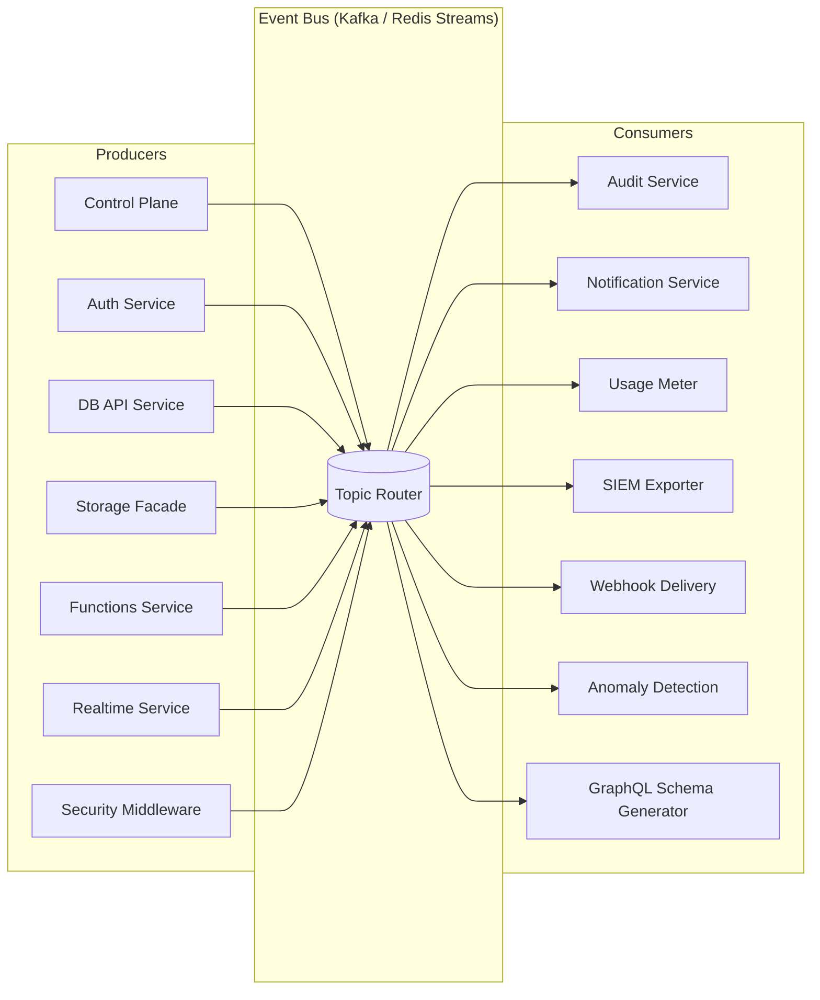

# Event Catalog — Backend as a Service (BaaS) Platform

**Version:** 1.0  
**Status:** Approved  
**Last Updated:** 2025-01-01  

All events follow a common envelope schema. The payload is the event-specific body.

---

## Common Event Envelope

```json
{
  "event_id": "uuid-v4",
  "event_type": "domain.resource.action",
  "schema_version": "1.0",
  "tenant_id": "uuid",
  "project_id": "uuid",
  "environment_id": "uuid",
  "occurred_at": "ISO-8601 UTC",
  "producer": "service-name",
  "trace_id": "otel-trace-id",
  "payload": { ... }
}
```

---

## Table of Contents

1. [Tenancy Events](#1-tenancy-events)
2. [Auth Events](#2-auth-events)
3. [Data Events](#3-data-events)
4. [Storage Events](#4-storage-events)
5. [Functions Events](#5-functions-events)
6. [Realtime Events](#6-realtime-events)
7. [Provider / Control Events](#7-provider--control-events)
8. [Security Events](#8-security-events)
9. [Event Flow Overview](#9-event-flow-overview)

---

## 1. Tenancy Events

---

### EVT-001 — TenantCreated

| Field | Value |
|-------|-------|
| **Event Type** | `tenancy.tenant.created` |
| **Producer** | Control Plane Service |
| **Consumers** | Audit Service, Notification Service, Quota Manager |
| **Ordering** | Keyed by `tenant_id`; must be processed before any project events for this tenant |
| **SLA** | Delivered within 2 seconds of write commit |

**Payload Schema:**
```json
{
  "tenant_id": "uuid",
  "slug": "string",
  "display_name": "string",
  "billing_email": "string",
  "plan_tier": "free|starter|pro|enterprise",
  "created_by": "uuid"
}
```

---

### EVT-002 — ProjectCreated

| Field | Value |
|-------|-------|
| **Event Type** | `tenancy.project.created` |
| **Producer** | Control Plane Service |
| **Consumers** | Audit Service, Environment Provisioner, Quota Manager |
| **Ordering** | Keyed by `project_id`; at-least-once delivery |
| **SLA** | Delivered within 2 seconds; idempotent consumption required |

**Payload Schema:**
```json
{
  "project_id": "uuid",
  "tenant_id": "uuid",
  "name": "string",
  "slug": "string",
  "created_by": "uuid"
}
```

---

### EVT-003 — EnvironmentProvisioned

| Field | Value |
|-------|-------|
| **Event Type** | `tenancy.environment.provisioned` |
| **Producer** | Control Plane / Environment Provisioner |
| **Consumers** | Audit Service, DB Schema Manager, Usage Meter Initializer |
| **Ordering** | Keyed by `environment_id`; must follow `ProjectCreated` for the same project |
| **SLA** | Delivered within 5 seconds |

**Payload Schema:**
```json
{
  "environment_id": "uuid",
  "project_id": "uuid",
  "name": "string",
  "type": "development|staging|production",
  "db_schema_name": "string",
  "provisioned_by": "uuid"
}
```

---

### EVT-004 — ProjectDeleted

| Field | Value |
|-------|-------|
| **Event Type** | `tenancy.project.deleted` |
| **Producer** | Control Plane Service |
| **Consumers** | Audit Service, Resource Cleanup Worker, Quota Manager |
| **Ordering** | Keyed by `project_id`; after this event, all child resource events are invalid |
| **SLA** | Delivered within 5 seconds |

**Payload Schema:**
```json
{
  "project_id": "uuid",
  "tenant_id": "uuid",
  "deletion_type": "soft|permanent",
  "deleted_by": "uuid",
  "scheduled_permanent_deletion_at": "ISO-8601|null"
}
```

---

### EVT-005 — QuotaWarning

| Field | Value |
|-------|-------|
| **Event Type** | `tenancy.quota.warning` |
| **Producer** | Usage Meter / Quota Manager |
| **Consumers** | Notification Service, Audit Service |
| **Ordering** | Best-effort; deduplication required (one warning per period) |
| **SLA** | Delivered within 60 seconds of threshold breach |

**Payload Schema:**
```json
{
  "environment_id": "uuid",
  "dimension": "storage_bytes|api_calls|function_invocations|...",
  "current_value": 8500000000,
  "quota_limit": 10000000000,
  "pct_used": 85.0,
  "period_start": "ISO-8601",
  "period_end": "ISO-8601"
}
```

---

### EVT-006 — ApiKeyRotated

| Field | Value |
|-------|-------|
| **Event Type** | `tenancy.api_key.rotated` |
| **Producer** | Control Plane Service |
| **Consumers** | Audit Service |
| **Ordering** | Keyed by `environment_id` |
| **SLA** | Delivered within 2 seconds |

**Payload Schema:**
```json
{
  "environment_id": "uuid",
  "old_key_preview": "last-8-chars",
  "new_key_preview": "last-8-chars",
  "overlap_valid_until": "ISO-8601",
  "rotated_by": "uuid"
}
```

---

## 2. Auth Events

---

### EVT-007 — UserRegistered

| Field | Value |
|-------|-------|
| **Event Type** | `auth.user.registered` |
| **Producer** | Auth Service |
| **Consumers** | Audit Service, Notification Service (welcome email), Analytics |
| **Ordering** | Keyed by `user_id` |
| **SLA** | Delivered within 2 seconds |

**Payload Schema:**
```json
{
  "user_id": "uuid",
  "environment_id": "uuid",
  "registration_method": "email_password|oauth2|magic_link|anonymous",
  "oauth_provider": "google|github|microsoft|null",
  "email_hash": "sha256-of-email",
  "ip_address": "string",
  "user_agent": "string"
}
```
*Note: Email address is not included in the event payload — only a SHA-256 hash for correlation. Full PII is in the Auth Service database only.*

---

### EVT-008 — SessionCreated

| Field | Value |
|-------|-------|
| **Event Type** | `auth.session.created` |
| **Producer** | Auth Service |
| **Consumers** | Audit Service, Anomaly Detection |
| **Ordering** | Keyed by `session_id` |
| **SLA** | Delivered within 1 second |

**Payload Schema:**
```json
{
  "session_id": "uuid",
  "user_id": "uuid",
  "environment_id": "uuid",
  "auth_method": "email_password|oauth2|magic_link|refresh_token",
  "ip_address": "string",
  "user_agent": "string",
  "expires_at": "ISO-8601"
}
```

---

### EVT-009 — SessionRevoked

| Field | Value |
|-------|-------|
| **Event Type** | `auth.session.revoked` |
| **Producer** | Auth Service |
| **Consumers** | Audit Service, Session Cache Invalidator |
| **Ordering** | Keyed by `session_id`; must be processed before any future auth checks for this session |
| **SLA** | Delivered within 1 second; cache invalidation within 5 seconds |

**Payload Schema:**
```json
{
  "session_id": "uuid",
  "user_id": "uuid",
  "environment_id": "uuid",
  "revocation_reason": "logout|logout_all|security_rotation|hijack_suspected|expired",
  "revoked_by": "uuid|system",
  "ip_address": "string"
}
```

---

### EVT-010 — PasswordResetRequested

| Field | Value |
|-------|-------|
| **Event Type** | `auth.user.password_reset_requested` |
| **Producer** | Auth Service |
| **Consumers** | Notification Service (sends reset email), Audit Service |
| **Ordering** | Best-effort; at-least-once |
| **SLA** | Notification delivered within 5 seconds |

**Payload Schema:**
```json
{
  "user_id": "uuid",
  "environment_id": "uuid",
  "reset_token_expires_at": "ISO-8601",
  "ip_address": "string"
}
```

---

### EVT-011 — PasswordChanged

| Field | Value |
|-------|-------|
| **Event Type** | `auth.user.password_changed` |
| **Producer** | Auth Service |
| **Consumers** | Audit Service, Notification Service (security alert email), Session Invalidator |
| **Ordering** | Keyed by `user_id` |
| **SLA** | Delivered within 2 seconds; all sessions must be invalidated within 30 seconds |

**Payload Schema:**
```json
{
  "user_id": "uuid",
  "environment_id": "uuid",
  "change_method": "reset_token|authenticated_change",
  "sessions_revoked_count": 3,
  "ip_address": "string"
}
```

---

### EVT-012 — MfaEnrolled

| Field | Value |
|-------|-------|
| **Event Type** | `auth.user.mfa_enrolled` |
| **Producer** | Auth Service |
| **Consumers** | Audit Service |
| **Ordering** | Keyed by `user_id` |
| **SLA** | Delivered within 2 seconds |

**Payload Schema:**
```json
{
  "user_id": "uuid",
  "environment_id": "uuid",
  "mfa_type": "totp",
  "enrolled_at": "ISO-8601"
}
```

---

### EVT-013 — OAuthProviderLinked

| Field | Value |
|-------|-------|
| **Event Type** | `auth.user.oauth_provider_linked` |
| **Producer** | Auth Service |
| **Consumers** | Audit Service |
| **Ordering** | Keyed by `user_id` |
| **SLA** | Delivered within 2 seconds |

**Payload Schema:**
```json
{
  "user_id": "uuid",
  "environment_id": "uuid",
  "provider": "google|github|microsoft|oidc",
  "provider_subject": "masked-subject-id"
}
```

---

## 3. Data Events

---

### EVT-014 — NamespaceCreated

| Field | Value |
|-------|-------|
| **Event Type** | `data.namespace.created` |
| **Producer** | Database API Service |
| **Consumers** | Audit Service, PG Schema Manager |
| **Ordering** | Keyed by `namespace_id` |
| **SLA** | Delivered within 2 seconds |

**Payload Schema:**
```json
{
  "namespace_id": "uuid",
  "environment_id": "uuid",
  "name": "string",
  "pg_schema_name": "string",
  "created_by": "uuid"
}
```

---

### EVT-015 — TableCreated

| Field | Value |
|-------|-------|
| **Event Type** | `data.table.created` |
| **Producer** | Database API Service |
| **Consumers** | Audit Service, GraphQL Schema Generator |
| **Ordering** | Keyed by `table_id`; must follow `NamespaceCreated` |
| **SLA** | Delivered within 2 seconds |

**Payload Schema:**
```json
{
  "table_id": "uuid",
  "namespace_id": "uuid",
  "environment_id": "uuid",
  "name": "string",
  "columns": [{"name": "string", "type": "string", "nullable": true}],
  "created_by": "uuid"
}
```

---

### EVT-016 — MigrationQueued

| Field | Value |
|-------|-------|
| **Event Type** | `data.migration.queued` |
| **Producer** | Database API Service |
| **Consumers** | Audit Service, Migration Orchestrator |
| **Ordering** | Keyed by `migration_id` |
| **SLA** | Delivered within 2 seconds |

**Payload Schema:**
```json
{
  "migration_id": "uuid",
  "namespace_id": "uuid",
  "environment_id": "uuid",
  "version": "string",
  "description": "string",
  "is_destructive": false,
  "queued_by": "uuid"
}
```

---

### EVT-017 — MigrationApplied

| Field | Value |
|-------|-------|
| **Event Type** | `data.migration.applied` |
| **Producer** | Migration Orchestrator |
| **Consumers** | Audit Service, Migration Gate Checker, GraphQL Schema Generator |
| **Ordering** | Keyed by `namespace_id`; strictly ordered per namespace |
| **SLA** | Delivered within 5 seconds of DDL execution |

**Payload Schema:**
```json
{
  "migration_id": "uuid",
  "namespace_id": "uuid",
  "environment_id": "uuid",
  "version": "string",
  "applied_at": "ISO-8601",
  "duration_ms": 150,
  "applied_by": "uuid|system"
}
```

---

### EVT-018 — MigrationRolledBack

| Field | Value |
|-------|-------|
| **Event Type** | `data.migration.rolled_back` |
| **Producer** | Migration Orchestrator |
| **Consumers** | Audit Service |
| **Ordering** | Keyed by `namespace_id` |
| **SLA** | Delivered within 5 seconds |

**Payload Schema:**
```json
{
  "migration_id": "uuid",
  "namespace_id": "uuid",
  "environment_id": "uuid",
  "version": "string",
  "reason": "string",
  "rolled_back_by": "uuid"
}
```

---

### EVT-019 — RlsPolicyCreated

| Field | Value |
|-------|-------|
| **Event Type** | `data.rls_policy.created` |
| **Producer** | Database API Service |
| **Consumers** | Audit Service |
| **Ordering** | Keyed by `table_id` |
| **SLA** | Delivered within 2 seconds |

**Payload Schema:**
```json
{
  "policy_id": "uuid",
  "table_id": "uuid",
  "environment_id": "uuid",
  "name": "string",
  "role": "string",
  "operation": "SELECT|INSERT|UPDATE|DELETE|ALL",
  "created_by": "uuid"
}
```

---

## 4. Storage Events

---

### EVT-020 — BucketCreated

| Field | Value |
|-------|-------|
| **Event Type** | `storage.bucket.created` |
| **Producer** | Storage Facade Service |
| **Consumers** | Audit Service |
| **Ordering** | Keyed by `bucket_id` |
| **SLA** | Delivered within 2 seconds |

**Payload Schema:**
```json
{
  "bucket_id": "uuid",
  "environment_id": "uuid",
  "name": "string",
  "access_policy": "public|private|signed",
  "binding_id": "uuid",
  "created_by": "uuid"
}
```

---

### EVT-021 — FileUploaded

| Field | Value |
|-------|-------|
| **Event Type** | `storage.file.uploaded` |
| **Producer** | Storage Facade Service |
| **Consumers** | Audit Service, Virus Scanner, Webhook Delivery (if subscribed), Usage Meter |
| **Ordering** | Keyed by `file_id`; at-least-once |
| **SLA** | Delivered within 3 seconds of upload completion |

**Payload Schema:**
```json
{
  "file_id": "uuid",
  "bucket_id": "uuid",
  "environment_id": "uuid",
  "name": "string",
  "size_bytes": 1048576,
  "mime_type": "image/jpeg",
  "checksum_sha256": "hex-string",
  "owner_user_id": "uuid|null",
  "uploaded_by_api_key": "key-preview|null"
}
```

---

### EVT-022 — FileDeleted

| Field | Value |
|-------|-------|
| **Event Type** | `storage.file.deleted` |
| **Producer** | Storage Facade Service |
| **Consumers** | Audit Service, Provider Deletion Worker, Usage Meter |
| **Ordering** | Keyed by `file_id` |
| **SLA** | Delivered within 2 seconds |

**Payload Schema:**
```json
{
  "file_id": "uuid",
  "bucket_id": "uuid",
  "environment_id": "uuid",
  "name": "string",
  "size_bytes": 1048576,
  "deleted_by": "uuid"
}
```

---

### EVT-023 — SignedUrlGenerated

| Field | Value |
|-------|-------|
| **Event Type** | `storage.signed_url.generated` |
| **Producer** | Storage Facade Service |
| **Consumers** | Audit Service |
| **Ordering** | Best-effort |
| **SLA** | Delivered within 2 seconds |

**Payload Schema:**
```json
{
  "file_id": "uuid",
  "bucket_id": "uuid",
  "environment_id": "uuid",
  "expiry_seconds": 3600,
  "generated_by": "uuid",
  "url_preview": "https://...?token=****"
}
```

---

### EVT-024 — FileScanCompleted

| Field | Value |
|-------|-------|
| **Event Type** | `storage.file.scan_completed` |
| **Producer** | Virus Scanner Service |
| **Consumers** | Storage Facade (update file status), Audit Service, Notification Service |
| **Ordering** | Keyed by `file_id` |
| **SLA** | Delivered within 60 seconds of scan completion |

**Payload Schema:**
```json
{
  "file_id": "uuid",
  "bucket_id": "uuid",
  "environment_id": "uuid",
  "scan_result": "clean|infected|error",
  "threat_name": "string|null",
  "scanner_version": "string",
  "scanned_at": "ISO-8601"
}
```

---

### EVT-025 — BucketPolicyUpdated

| Field | Value |
|-------|-------|
| **Event Type** | `storage.bucket.policy_updated` |
| **Producer** | Storage Facade Service |
| **Consumers** | Audit Service |
| **Ordering** | Keyed by `bucket_id` |
| **SLA** | Delivered within 2 seconds |

**Payload Schema:**
```json
{
  "bucket_id": "uuid",
  "environment_id": "uuid",
  "old_policy": "private",
  "new_policy": "signed",
  "updated_by": "uuid"
}
```

---

## 5. Functions Events

---

### EVT-026 — FunctionDeployed

| Field | Value |
|-------|-------|
| **Event Type** | `functions.function.deployed` |
| **Producer** | Functions Service |
| **Consumers** | Audit Service, Provider Adapter (deploys to provider) |
| **Ordering** | Keyed by `function_id` |
| **SLA** | Delivered within 5 seconds |

**Payload Schema:**
```json
{
  "function_id": "uuid",
  "environment_id": "uuid",
  "name": "string",
  "runtime": "string",
  "artifact_checksum": "hex-string",
  "version_tag": "string",
  "deployed_by": "uuid"
}
```

---

### EVT-027 — ExecutionTriggered

| Field | Value |
|-------|-------|
| **Event Type** | `functions.execution.triggered` |
| **Producer** | Functions Service |
| **Consumers** | Worker Pool, Audit Service |
| **Ordering** | Keyed by `execution_id`; strict ordering per function for serial modes |
| **SLA** | Worker picks up within 2 seconds |

**Payload Schema:**
```json
{
  "execution_id": "uuid",
  "function_id": "uuid",
  "environment_id": "uuid",
  "trigger_type": "http|cron|event|manual",
  "trigger_source": "string|null",
  "idempotency_key": "string|null",
  "actor_user_id": "uuid|null"
}
```

---

### EVT-028 — ExecutionCompleted

| Field | Value |
|-------|-------|
| **Event Type** | `functions.execution.completed` |
| **Producer** | Worker |
| **Consumers** | Audit Service, Usage Meter, Caller Response (HTTP-triggered) |
| **Ordering** | Keyed by `execution_id` |
| **SLA** | Delivered within 2 seconds of completion |

**Payload Schema:**
```json
{
  "execution_id": "uuid",
  "function_id": "uuid",
  "environment_id": "uuid",
  "status": "completed",
  "duration_ms": 248,
  "exit_code": 0,
  "response_status": 200,
  "compute_minutes": 0.004
}
```

---

### EVT-029 — ExecutionFailed

| Field | Value |
|-------|-------|
| **Event Type** | `functions.execution.failed` |
| **Producer** | Worker |
| **Consumers** | Audit Service, Notification Service (if alerting configured) |
| **Ordering** | Keyed by `execution_id` |
| **SLA** | Delivered within 2 seconds |

**Payload Schema:**
```json
{
  "execution_id": "uuid",
  "function_id": "uuid",
  "environment_id": "uuid",
  "status": "failed|timeout|cancelled",
  "error_code": "runtime_error|execution_timeout|out_of_memory|secret_resolution_failed",
  "error_message": "string",
  "duration_ms": 30001,
  "exit_code": 1
}
```

---

### EVT-030 — CronScheduleTriggered

| Field | Value |
|-------|-------|
| **Event Type** | `functions.cron.triggered` |
| **Producer** | Scheduler Service |
| **Consumers** | Functions Service (creates ExecutionTriggered) |
| **Ordering** | Keyed by `function_id + cron_slot` for deduplication |
| **SLA** | Triggered within ±30 seconds of scheduled time |

**Payload Schema:**
```json
{
  "function_id": "uuid",
  "environment_id": "uuid",
  "cron_expression": "0 0 * * *",
  "scheduled_slot": "ISO-8601",
  "idempotency_key": "fnid-20250101T000000Z"
}
```

---

## 6. Realtime Events

---

### EVT-031 — ChannelCreated

| Field | Value |
|-------|-------|
| **Event Type** | `realtime.channel.created` |
| **Producer** | Realtime Service |
| **Consumers** | Audit Service |
| **Ordering** | Keyed by `channel_id` |
| **SLA** | Delivered within 2 seconds |

**Payload Schema:**
```json
{
  "channel_id": "uuid",
  "environment_id": "uuid",
  "name": "string",
  "visibility": "public|private|presence",
  "created_by": "uuid"
}
```

---

### EVT-032 — SubscriptionCreated

| Field | Value |
|-------|-------|
| **Event Type** | `realtime.subscription.created` |
| **Producer** | Realtime Service |
| **Consumers** | Audit Service |
| **Ordering** | Keyed by `subscription_id` |
| **SLA** | Delivered within 2 seconds |

**Payload Schema:**
```json
{
  "subscription_id": "uuid",
  "channel_id": "uuid",
  "type": "websocket|webhook",
  "subscriber_id": "uuid|null",
  "webhook_url_preview": "https://example.com/...|null",
  "event_filter": ["storage.file.uploaded", "auth.user.*"]
}
```

---

### EVT-033 — MessagePublished

| Field | Value |
|-------|-------|
| **Event Type** | `realtime.channel.message_published` |
| **Producer** | Realtime Service |
| **Consumers** | Fan-out Engine, Webhook Delivery, Audit Service (high-value channels only) |
| **Ordering** | Keyed by `channel_id`; ordered within channel |
| **SLA** | Fan-out to all subscribers within 500 ms p99 |

**Payload Schema:**
```json
{
  "message_id": "uuid",
  "channel_id": "uuid",
  "environment_id": "uuid",
  "publisher_id": "uuid|api-key-preview",
  "payload_size_bytes": 512,
  "subscriber_count": 42
}
```
*Note: Message payload body is NOT included in the event catalog entry — it is streamed directly to subscribers, not re-published through the event bus.*

---

### EVT-034 — WebhookDelivered

| Field | Value |
|-------|-------|
| **Event Type** | `realtime.webhook.delivered` |
| **Producer** | Webhook Delivery Service |
| **Consumers** | Audit Service |
| **Ordering** | Best-effort |
| **SLA** | Recorded within 5 seconds of HTTP response received |

**Payload Schema:**
```json
{
  "subscription_id": "uuid",
  "delivery_attempt": 1,
  "target_url_preview": "https://example.com/...",
  "http_status": 200,
  "latency_ms": 143,
  "delivered_at": "ISO-8601"
}
```

---

### EVT-035 — WebhookDeliveryFailed

| Field | Value |
|-------|-------|
| **Event Type** | `realtime.webhook.delivery_failed` |
| **Producer** | Webhook Delivery Service |
| **Consumers** | Audit Service, Notification Service, Subscription Status Updater |
| **Ordering** | Keyed by `subscription_id` |
| **SLA** | Delivered within 5 seconds of final retry failure |

**Payload Schema:**
```json
{
  "subscription_id": "uuid",
  "channel_id": "uuid",
  "environment_id": "uuid",
  "total_attempts": 5,
  "last_http_status": 503,
  "last_error": "connection timeout",
  "suspended_at": "ISO-8601"
}
```

---

### EVT-036 — PresenceMemberJoined

| Field | Value |
|-------|-------|
| **Event Type** | `realtime.presence.member_joined` |
| **Producer** | Realtime Service |
| **Consumers** | Presence State Manager, Channel Subscribers |
| **Ordering** | Keyed by `channel_id`; broadcast to channel members |
| **SLA** | Broadcast within 500 ms |

**Payload Schema:**
```json
{
  "channel_id": "uuid",
  "session_id": "string",
  "user_id": "uuid|null",
  "user_info": {"display_name": "string"},
  "joined_at": "ISO-8601"
}
```

---

## 7. Provider / Control Events

---

### EVT-037 — BindingActivated

| Field | Value |
|-------|-------|
| **Event Type** | `control.binding.activated` |
| **Producer** | Control Plane Service |
| **Consumers** | Audit Service |
| **Ordering** | Keyed by `binding_id` |
| **SLA** | Delivered within 2 seconds |

**Payload Schema:**
```json
{
  "binding_id": "uuid",
  "environment_id": "uuid",
  "capability": "storage|functions|messaging",
  "provider_name": "aws-s3",
  "provider_version": "1.2.0",
  "activated_by": "uuid"
}
```

---

### EVT-038 — BindingValidationFailed

| Field | Value |
|-------|-------|
| **Event Type** | `control.binding.validation_failed` |
| **Producer** | Control Plane Service |
| **Consumers** | Audit Service, Notification Service |
| **Ordering** | Best-effort |
| **SLA** | Delivered within 2 seconds |

**Payload Schema:**
```json
{
  "binding_id": "uuid",
  "environment_id": "uuid",
  "capability": "string",
  "provider_name": "string",
  "failure_reason": "connectivity_timeout|auth_rejected|missing_permission",
  "attempted_by": "uuid"
}
```

---

### EVT-039 — SwitchoverStarted

| Field | Value |
|-------|-------|
| **Event Type** | `control.switchover.started` |
| **Producer** | Migration Orchestrator |
| **Consumers** | Audit Service, Progress Tracker, Operations Dashboard |
| **Ordering** | Keyed by `plan_id` |
| **SLA** | Delivered within 5 seconds of execution start |

**Payload Schema:**
```json
{
  "plan_id": "uuid",
  "environment_id": "uuid",
  "capability": "string",
  "source_binding_id": "uuid",
  "target_binding_id": "uuid",
  "initiated_by": "uuid",
  "started_at": "ISO-8601"
}
```

---

### EVT-040 — SwitchoverCompleted

| Field | Value |
|-------|-------|
| **Event Type** | `control.switchover.completed` |
| **Producer** | Migration Orchestrator |
| **Consumers** | Audit Service, Operations Dashboard, Notification Service |
| **Ordering** | Keyed by `plan_id`; must follow `SwitchoverStarted` |
| **SLA** | Delivered within 5 seconds of completion |

**Payload Schema:**
```json
{
  "plan_id": "uuid",
  "environment_id": "uuid",
  "capability": "string",
  "new_primary_binding_id": "uuid",
  "data_checksum_verified": true,
  "objects_migrated": 14523,
  "bytes_migrated": 8543219456,
  "duration_seconds": 3612,
  "completed_at": "ISO-8601"
}
```

---

### EVT-041 — SwitchoverRolledBack

| Field | Value |
|-------|-------|
| **Event Type** | `control.switchover.rolled_back` |
| **Producer** | Migration Orchestrator |
| **Consumers** | Audit Service, Operations Dashboard, Notification Service |
| **Ordering** | Keyed by `plan_id` |
| **SLA** | Delivered within 5 seconds |

**Payload Schema:**
```json
{
  "plan_id": "uuid",
  "environment_id": "uuid",
  "capability": "string",
  "original_binding_id": "uuid",
  "rollback_reason": "checksum_mismatch|connectivity_lost|manual_abort",
  "rolled_back_by": "uuid|system",
  "rolled_back_at": "ISO-8601"
}
```

---

## 8. Security Events

---

### EVT-042 — SecretRotated

| Field | Value |
|-------|-------|
| **Event Type** | `security.secret.rotated` |
| **Producer** | Secret Manager Integration / Control Plane |
| **Consumers** | Audit Service, Functions Service (cache invalidation) |
| **Ordering** | Keyed by `secret_ref_id` |
| **SLA** | Delivered within 5 seconds; function runtime cache invalidated within 30 seconds |

**Payload Schema:**
```json
{
  "secret_ref_id": "uuid",
  "environment_id": "uuid",
  "alias": "string",
  "provider": "aws_secrets_manager|gcp_secret_manager|...",
  "rotated_by": "uuid|system",
  "rotation_type": "manual|scheduled",
  "rotated_at": "ISO-8601"
}
```

---

### EVT-043 — UnauthorizedAccess

| Field | Value |
|-------|-------|
| **Event Type** | `security.unauthorized_access` |
| **Producer** | API Gateway / Auth Middleware |
| **Consumers** | Audit Service, SIEM Exporter, Anomaly Detection |
| **Ordering** | Best-effort; high volume possible |
| **SLA** | Delivered within 5 seconds; SIEM export within 60 seconds |

**Payload Schema:**
```json
{
  "environment_id": "uuid|null",
  "resource_type": "string",
  "resource_id": "string",
  "actor_ip": "string",
  "attempted_action": "string",
  "failure_reason": "token_expired|invalid_scope|tenant_mismatch|resource_not_found",
  "request_id": "uuid"
}
```

---

### EVT-044 — AuditPolicyChanged

| Field | Value |
|-------|-------|
| **Event Type** | `security.audit_policy.changed` |
| **Producer** | Control Plane Service |
| **Consumers** | Audit Service |
| **Ordering** | Keyed by `environment_id` |
| **SLA** | Delivered within 2 seconds |

**Payload Schema:**
```json
{
  "environment_id": "uuid",
  "changed_by": "uuid",
  "old_policy": {"retention_days": 365},
  "new_policy": {"retention_days": 730}
}
```

---

### EVT-045 — SessionHijackSuspected

| Field | Value |
|-------|-------|
| **Event Type** | `security.session.hijack_suspected` |
| **Producer** | Auth Service |
| **Consumers** | Audit Service, SIEM Exporter, Notification Service (email to user) |
| **Ordering** | Keyed by `user_id`; CRITICAL priority |
| **SLA** | Session revocation within 1 second; event delivered within 5 seconds |

**Payload Schema:**
```json
{
  "user_id": "uuid",
  "environment_id": "uuid",
  "session_id": "uuid",
  "detection_reason": "refresh_token_replay",
  "all_sessions_revoked": true,
  "requester_ip": "string",
  "detected_at": "ISO-8601"
}
```

---

## 9. Event Flow Overview


