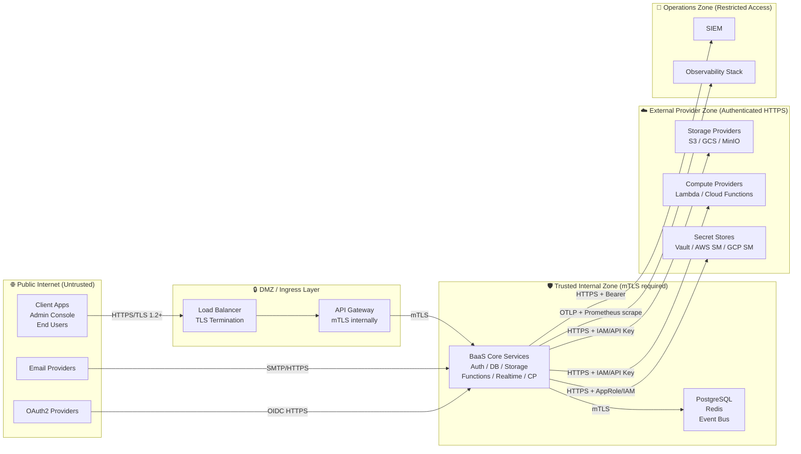

# System Context Diagram — Backend as a Service (BaaS) Platform

**Version:** 1.0  
**Status:** Approved  
**Last Updated:** 2025-01-01  
**C4 Level:** 1 — System Context  

---

## Table of Contents

1. [System Context Overview](#1-system-context-overview)
2. [Primary System Context Diagram (C4 Level 1)](#2-primary-system-context-diagram-c4-level-1)
3. [External System Descriptions](#3-external-system-descriptions)
4. [Trust Boundary Definitions](#4-trust-boundary-definitions)
5. [Data Classification by Integration](#5-data-classification-by-integration)
6. [SLA Commitments per Integration](#6-sla-commitments-per-integration)
7. [Integration Contract Summary](#7-integration-contract-summary)

---

## 1. System Context Overview

The BaaS Platform sits at the center of a multi-actor ecosystem. It is consumed by human users (Project Owners, App Developers, End Users) and by automated systems (client applications, CI/CD pipelines, monitoring infrastructure). It depends on a set of external systems for cloud provider capabilities, secret management, identity federation, and observability.

This document captures the C4 Level 1 view: what exists, who uses it, and what it depends on — without describing internal architecture.

**Key architectural decisions at this level:**
- The BaaS Platform exposes a single, versioned API surface. All consumer interactions go through this surface, never directly to backend providers.
- External providers (AWS, GCP, MinIO) are opaque behind the adapter layer. Consumers never hold provider-specific credentials.
- Secret values never transit through the BaaS Platform at rest — only SecretRef pointers are stored.
- All external integrations are authenticated; no integration relies on network-level access alone.

---

## 2. Primary System Context Diagram (C4 Level 1)

```mermaid
graph TB
    %% People / Human Actors
    ProjectOwner(["👤 Project Owner\n\nOrganization that owns a BaaS tenant.\nManages projects, environments,\nprovider bindings, and quotas."])
    AppDeveloper(["👤 App Developer\n\nEngineer building applications\non top of the BaaS Platform.\nUses Auth, DB, Storage,\nFunctions, and Realtime APIs."])
    EndUser(["👤 End User\n\nConsumer of applications built\non the BaaS Platform.\nAuthenticates and accesses\ndata through tenant apps."])
    PlatformOperator(["👤 Platform Operator\n\nSRE / DevOps team that deploys,\nmonitors, and maintains\nthe BaaS Platform itself."])
    SecurityAdmin(["👤 Security Admin\n\nManages audit logs, secret\nrotation, RBAC, and\ncompliance reporting."])

    %% Central System
    BaaS["🏗️ BaaS Platform\n\nSelf-hostable, multi-tenant Backend-as-a-Service.\nProvides unified REST/WebSocket APIs for:\n- Authentication (JWT, OAuth2, MFA)\n- PostgreSQL-backed Database\n- Object Storage\n- Serverless Functions\n- Realtime Messaging\n- Control Plane (provider management)"]

    %% External Systems
    PostgreSQL[("🐘 PostgreSQL 15+\n\nPrimary persistent data store.\nHolds all platform metadata,\nauth records, file metadata,\nand audit logs.")]
    Redis[("⚡ Redis\n\nIn-memory session cache,\nrefresh token store,\nrate-limit counters,\nrealtime pub/sub broker.")]
    AWSS3["☁️ AWS S3\n\nObject storage provider.\nHolds binary file content\nfor tenants using the\nAWS S3 adapter."]
    GCPGCS["☁️ GCP Cloud Storage\n\nObject storage provider.\nHolds binary file content\nfor tenants using the\nGCS adapter."]
    MinIO["☁️ MinIO\n\nSelf-hosted S3-compatible\nobject storage for on-premise\nor private cloud deployments."]
    AWSLambda["⚡ AWS Lambda\n\nServerless compute provider.\nExecutes tenant functions for\ntenants using the Lambda adapter."]
    GCPFunctions["⚡ GCP Cloud Functions\n\nServerless compute provider.\nExecutes tenant functions for\ntenants using the GCP adapter."]
    SecretManager["🔐 External Secret Store\n\nVault / AWS Secrets Manager /\nGCP Secret Manager /\nAzure Key Vault.\nHolds raw credential values;\nBaaS only stores references."]
    OAuthProvider["🌐 OAuth2 / OIDC Provider\n\nGoogle, GitHub, Microsoft,\nor any OIDC-compliant IdP.\nUsed for federated login\nflows."]
    EmailProvider["📧 Email Provider\n\nSendGrid / AWS SES /\nor custom SMTP.\nDelivers verification emails,\npassword resets, notifications."]
    SIEM["🛡️ SIEM System\n\nSplunk / ELK / Datadog.\nReceives structured audit\nevents for security monitoring\nand compliance reporting."]
    ObservabilityStack["📊 Observability Stack\n\nPrometheus + Grafana /\nDatadog / New Relic.\nCollects metrics, traces, and\nlogs from BaaS services."]
    VirusScanner["🔍 Virus Scanner\n\nClamAV / commercial AV API.\nScans uploaded files for\nmalware before making them\naccessible."]

    %% Human → BaaS relationships
    ProjectOwner -->|"Manages projects, environments,\nbindings via Web Console / API"| BaaS
    AppDeveloper -->|"Calls Auth, DB, Storage,\nFunctions, Realtime APIs\nvia SDK / REST"| BaaS
    EndUser -->|"Authenticates and accesses data\nthrough tenant applications\n(indirect via App Developer's app)"| BaaS
    PlatformOperator -->|"Deploys, configures,\nand monitors via\nOperator API / Helm"| BaaS
    SecurityAdmin -->|"Reviews audit logs,\nrotates secrets,\nconfigures retention policies"| BaaS

    %% BaaS → Internal Infrastructure
    BaaS -->|"Reads/writes all\nplatform data"| PostgreSQL
    BaaS -->|"Session cache, rate limits,\npub/sub fan-out"| Redis

    %% BaaS → Storage Providers
    BaaS -->|"Upload/download/delete\nobject blobs (S3 API)"| AWSS3
    BaaS -->|"Upload/download/delete\nobject blobs (GCS API)"| GCPGCS
    BaaS -->|"Upload/download/delete\nobject blobs (S3-compatible)"| MinIO

    %% BaaS → Compute Providers
    BaaS -->|"Deploy functions,\ninvoke executions (Lambda API)"| AWSLambda
    BaaS -->|"Deploy functions,\ninvoke executions (GCF API)"| GCPFunctions

    %% BaaS → Security Systems
    BaaS -->|"Resolve SecretRef values\nat runtime (read-only)"| SecretManager
    BaaS -->|"OIDC authorization code\nexchange and token validation"| OAuthProvider

    %% BaaS → Supporting Services
    BaaS -->|"Send transactional emails:\nverification, reset, alerts"| EmailProvider
    BaaS -->|"Stream structured audit\nevents (JSON over HTTPS/Syslog)"| SIEM
    BaaS -->|"Expose /metrics, /traces;\nreceive alert callbacks"| ObservabilityStack
    BaaS -->|"Submit files for scanning;\nreceive scan result callback"| VirusScanner
```

---

## 3. External System Descriptions

### 3.1 PostgreSQL 15+

| Attribute | Value |
|-----------|-------|
| **Role** | Primary persistent data store for all platform entities |
| **Interface** | Standard PostgreSQL wire protocol; connection pool via PgBouncer |
| **Authentication** | Mutual TLS + per-service role-based credentials |
| **Data Scope** | All platform metadata; auth records; file metadata; audit logs |
| **Provisioning** | Externally provisioned; BaaS Platform does not manage the PG server |
| **Dependencies** | Multi-AZ replication required in production |

### 3.2 Redis

| Attribute | Value |
|-----------|-------|
| **Role** | In-memory session cache, refresh token store, rate-limit counters, realtime pub/sub |
| **Interface** | Redis RESP2/RESP3 protocol; TLS enabled |
| **Authentication** | AUTH password + ACL rules per service |
| **Data Scope** | Session JTI cache, rate-limit sliding windows, WebSocket fan-out topics, distributed semaphores |
| **Persistence** | AOF enabled for session data; pub/sub data is ephemeral |

### 3.3 AWS S3 / GCP Cloud Storage / MinIO

| Attribute | Value |
|-----------|-------|
| **Role** | Object binary content storage, backing tenant file buckets |
| **Interface** | S3-compatible REST API (S3 / GCS S3-interop / MinIO) |
| **Authentication** | IAM roles or access key pairs (stored as SecretRefs, never in BaaS DB) |
| **Data Scope** | Binary file content only; metadata stored in PostgreSQL |
| **Data Classification** | Tenant-defined; platform treats as opaque bytes |

### 3.4 AWS Lambda / GCP Cloud Functions

| Attribute | Value |
|-----------|-------|
| **Role** | Serverless compute execution environment for tenant functions |
| **Interface** | AWS SDK (Lambda) / Google Cloud SDK (Cloud Functions) REST APIs |
| **Authentication** | IAM service account / role (stored as SecretRef) |
| **Data Scope** | Function artifacts (stored temporarily), execution output/logs |
| **Isolation** | Each tenant function runs in its own isolated execution environment at the provider level |

### 3.5 External Secret Store (Vault / AWS SM / GCP SM / Azure KV)

| Attribute | Value |
|-----------|-------|
| **Role** | Authoritative store for all raw sensitive credentials |
| **Interface** | Vault KV API / AWS SDK / GCP SDK / Azure SDK; all over HTTPS |
| **Authentication** | BaaS service identity (Vault AppRole / IAM role); least-privilege, read-only for most services |
| **Data Scope** | Provider credentials, function secrets, signing keys |
| **Critical Constraint** | BaaS Platform NEVER stores resolved secret values; only the path/ARN reference |

### 3.6 OAuth2 / OIDC Provider

| Attribute | Value |
|-----------|-------|
| **Role** | Federated identity provider for OAuth2/OIDC login flows |
| **Interface** | OIDC Discovery endpoint + authorization code flow (RFC 6749 / OIDC Core) |
| **Authentication** | Client ID + Client Secret (stored as SecretRef) |
| **Data Scope** | ID token, access token, user profile claims (email, name, subject) |
| **PII Handling** | OAuth profile data mapped to platform AuthUser; only necessary claims stored |

### 3.7 Email Provider

| Attribute | Value |
|-----------|-------|
| **Role** | Delivery of transactional emails (verification, password reset, alerts) |
| **Interface** | SMTP or provider-specific REST API (SendGrid API / AWS SES API) |
| **Authentication** | API key (stored as SecretRef) |
| **Data Scope** | Recipient email addresses, token links (no raw secrets), notification content |

### 3.8 SIEM System

| Attribute | Value |
|-----------|-------|
| **Role** | Security event aggregation and compliance reporting |
| **Interface** | HTTPS webhook (JSON POST) or RFC 5424 Syslog over TLS |
| **Authentication** | Bearer token or mTLS (configured per SIEM type) |
| **Data Scope** | Audit log events (redacted PII); security events |
| **Delivery SLA** | Events delivered within 60 seconds of occurrence |

### 3.9 Observability Stack

| Attribute | Value |
|-----------|-------|
| **Role** | Metrics collection, distributed tracing, alerting |
| **Interface** | Prometheus scrape (`/metrics`), OTLP gRPC/HTTP for traces, structured JSON logs |
| **Authentication** | Prometheus service account; OTLP bearer token |
| **Data Scope** | Performance metrics, traces (no PII in span attributes), structured logs |

### 3.10 Virus Scanner

| Attribute | Value |
|-----------|-------|
| **Role** | Malware detection for uploaded file content |
| **Interface** | REST API (commercial) or ClamAV TCP socket (open source) |
| **Authentication** | API key or network-level trust for local ClamAV |
| **Data Scope** | Binary file content submitted for scan; scan result (clean/infected/error) |
| **SLA** | Scan completed within 60 seconds for files ≤ 100 MB |

---

## 4. Trust Boundary Definitions

### Trust Levels

| Boundary | Trust Level | Authentication | Encryption |
|----------|-------------|---------------|------------|
| Public Internet → API Gateway | Untrusted | JWT / API Key | TLS 1.2+ mandatory |
| API Gateway → Core Services | Semi-trusted | mTLS | mTLS (encrypted + authenticated) |
| Core Services → PostgreSQL | Trusted internal | PG role + mTLS | TLS over PG wire protocol |
| Core Services → Redis | Trusted internal | AUTH password + ACL | TLS |
| Core Services → Cloud Providers | External authenticated | IAM / API Key | HTTPS |
| Core Services → Secret Store | External authenticated | AppRole / IAM (read-only) | HTTPS |
| Core Services → SIEM | External authenticated | Bearer token | HTTPS |

---

## 5. Data Classification by Integration

| Integration | Data Sensitivity | Classification | Handling Requirements |
|-------------|-----------------|----------------|----------------------|
| PostgreSQL | High | PII + Credentials (hashed) + Business data | Encrypted at rest (AES-256); bcrypt for passwords; SecretRefs for credentials |
| Redis | Medium | Session tokens (hashed); rate-limit state | TLS; token hashes only (not raw tokens) |
| AWS S3 / GCS / MinIO | Tenant-defined | Tenant file content (up to Confidential) | TLS in transit; provider-side encryption at rest; access via signed URLs |
| AWS Lambda / GCF | Medium | Function code; execution environment | Artifacts are tenant IP; secrets injected at runtime; stdout/stderr captured securely |
| Secret Store | Critical | Raw credential values | Never stored in BaaS DB; accessed read-only at runtime; audit log on every access |
| OAuth2 Provider | High | PII (email, name); OAuth tokens | Token exchange only; minimum profile claims stored; OIDC nonce validation |
| Email Provider | High | Recipient email (PII); token links | TLS; no raw secrets in email bodies; links are time-limited single-use tokens |
| SIEM | Medium | Audit events (PII redacted); security events | PII fields (email, full name) are redacted or hashed in exported events |
| Observability Stack | Low | Metrics; trace metadata (no PII) | No PII in span attributes; service-level logs scrubbed of secret values |
| Virus Scanner | High | Binary file content | Transmitted over TLS; scanner result only stored in platform DB; scanner must not retain content |

---

## 6. SLA Commitments per Integration

| Integration | Platform Dependency | Degraded Mode | Recovery SLA |
|-------------|---------------------|---------------|--------------|
| **PostgreSQL** | Hard — platform non-functional without it | None (primary data store) | RTO: 1 min (failover to replica); RPO: 0 (synchronous replication) |
| **Redis** | Soft — platform degrades without it | Auth falls back to DB-only session validation (higher latency); realtime disabled | RTO: 5 min; sessions survive Redis restart |
| **AWS S3 / GCS / MinIO** | Soft per binding | Storage reads/writes for affected binding return 503; other bindings unaffected | Provider SLA applies; platform surfaces provider status in console |
| **AWS Lambda / GCF** | Soft per binding | Function invocations return 503 for affected binding | Provider SLA applies |
| **Secret Store** | Moderate — secrets cached for 5 min | Cached resolution continues for 5 min; new function invocations queue | RTO: 5 min cache window |
| **OAuth2 Provider** | Soft — OAuth login fails; email/password unaffected | Email/password and magic link continue; OAuth returns 503 | Provider SLA applies; fallback is always available |
| **Email Provider** | Soft — verification/reset emails delayed | Emails queued; user notified to check spam | Delivery within 15 min when provider recovers |
| **SIEM** | Non-critical — audit events buffered | Audit events queued locally for up to 1 hour | Buffered events delivered on reconnect; no data loss for ≤ 1 hour outage |
| **Observability Stack** | Non-critical — internal metrics continue | Metrics still collected; dashboards unavailable | No platform degradation |
| **Virus Scanner** | Soft — files quarantined if scanner unavailable | Files held in `scan_pending` status; not accessible until scan | Scans replayed when scanner recovers |

---

## 7. Integration Contract Summary

| Integration | Protocol | Auth Method | Direction | Data Volume |
|-------------|----------|-------------|-----------|-------------|
| Client Apps → BaaS | HTTPS REST / WebSocket | JWT / API Key | Inbound | Variable (high during spikes) |
| BaaS → PostgreSQL | PG wire / TLS | Role + mTLS cert | Outbound | High (all reads/writes) |
| BaaS → Redis | Redis RESP3 / TLS | AUTH + ACL | Outbound | Very high (session ops, pub/sub) |
| BaaS → S3/GCS/MinIO | HTTPS (S3 API) | IAM / Access Key | Outbound | High (file content streams) |
| BaaS → Lambda/GCF | HTTPS (AWS/GCP SDK) | IAM role | Outbound | Medium (invocations) |
| BaaS → Secret Store | HTTPS | AppRole / IAM | Outbound | Low (resolved at invocation time, cached) |
| BaaS → OAuth2 Provider | HTTPS (OIDC) | Client ID + Secret | Outbound | Low (login events only) |
| BaaS → Email Provider | HTTPS / SMTP | API Key / credentials | Outbound | Low |
| BaaS → SIEM | HTTPS webhook / Syslog TLS | Bearer token / mTLS | Outbound | Medium (audit event stream) |
| Observability → BaaS | HTTP scrape / OTLP push | Prometheus SA / Bearer | Inbound | Medium (metrics + traces) |
| VirusScanner → BaaS | HTTPS callback | Webhook secret (HMAC) | Inbound (callback) | Low |
