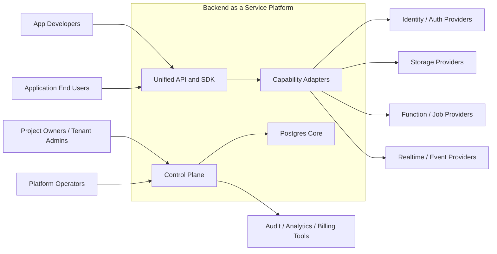

# System Context Diagram - Backend as a Service Platform

## Context Notes

- Project owners and operators primarily use the control plane to provision projects, configure bindings, and review platform health.
- Developers and downstream applications use the unified facade and should not need provider-specific logic for supported features.
- External providers remain behind adapter boundaries rather than being exposed directly as the platform contract.
