# Use Case Diagram — Backend as a Service (BaaS) Platform

**Version:** 1.0  
**Status:** Approved  
**Last Updated:** 2025-01-01  

---

## 1. Primary Use Case Diagram

The following diagram shows all actors and their relationships to the platform's use cases. Use cases are grouped by capability domain.

```mermaid
graph LR
    %% Actors
    PO([Project Owner])
    AD([App Developer])
    EU([End User])
    OPS([Platform Operator])
    SEC([Security Admin])
    AM([Adapter Maintainer])

    %% Tenancy Use Cases
    subgraph Tenancy["🏢 Tenancy & Projects"]
        UC001[UC-001: Create Tenant & Project]
        UC001b[Manage Environments]
        UC001c[Set Quotas]
        UC001d[Rotate API Keys]
        UC001e[Soft-Delete Project]
    end

    %% Auth Use Cases
    subgraph Auth["🔐 Authentication"]
        UC003[UC-003: Register User]
        UC003b[Login — Email/Password]
        UC003c[Login — OAuth2]
        UC003d[Login — Magic Link]
        UC003e[Manage Sessions]
        UC003f[Enable MFA]
    end

    %% Database Use Cases
    subgraph Database["🗄️ Database"]
        UC004[UC-004: Create Namespace & Tables]
        UC004b[CRUD Records]
        UC004c[Apply Filters & Pagination]
        UC004d[Define RLS Policies]
        UC004e[Manage Migrations]
        UC004f[Promote Migration to Production]
    end

    %% Storage Use Cases
    subgraph Storage["📁 Storage"]
        UC005[UC-005: Create Bucket]
        UC005b[Upload File]
        UC005c[Generate Signed URL]
        UC005d[Delete File]
        UC005e[Configure Access Policy]
    end

    %% Functions Use Cases
    subgraph Functions["⚡ Functions & Jobs"]
        UC006[UC-006: Deploy Function]
        UC006b[Invoke Function — HTTP]
        UC006c[Schedule Cron Job]
        UC006d[View Execution Logs]
        UC006e[Inject Secrets]
    end

    %% Realtime Use Cases
    subgraph Realtime["📡 Realtime"]
        UC007[UC-007: Create Channel]
        UC007b[Subscribe via WebSocket]
        UC007c[Publish Message]
        UC007d[Register Webhook]
        UC007e[Manage Presence]
    end

    %% Control Plane Use Cases
    subgraph ControlPlane["⚙️ Control Plane"]
        UC002[UC-002: Bind Provider]
        UC008[UC-008: Switchover Provider]
        UC002b[Browse Provider Catalog]
        UC002c[Validate Binding]
        UC008b[Monitor Switchover Progress]
        UC008c[Rollback Switchover]
    end

    %% Security Use Cases
    subgraph Security["🛡️ Security & Compliance"]
        SEC001[Review Audit Log]
        SEC002[Rotate Secrets]
        SEC003[Export to SIEM]
        SEC004[Configure Retention Policies]
        SEC005[Manage RBAC Roles]
    end

    %% Observability Use Cases
    subgraph Observability["📊 Observability"]
        OBS001[View Usage Dashboard]
        OBS002[Monitor SLO Metrics]
        OBS003[Configure Alerts]
        OBS004[Trace Requests]
    end

    %% Adapter Catalog Use Cases
    subgraph Catalog["🔌 Adapter Catalog"]
        CAT001[Register Adapter]
        CAT002[Version & Deprecate Adapter]
        CAT003[Define Config Schema]
    end

    %% Project Owner Relationships
    PO --> UC001
    PO --> UC001b
    PO --> UC001c
    PO --> UC001d
    PO --> UC001e
    PO --> UC002
    PO --> UC008
    PO --> UC008b
    PO --> UC008c
    PO --> OBS001

    %% App Developer Relationships
    AD --> UC003
    AD --> UC004
    AD --> UC004b
    AD --> UC004c
    AD --> UC004d
    AD --> UC004e
    AD --> UC004f
    AD --> UC005
    AD --> UC005b
    AD --> UC005c
    AD --> UC005e
    AD --> UC006
    AD --> UC006b
    AD --> UC006c
    AD --> UC006d
    AD --> UC006e
    AD --> UC007
    AD --> UC007b
    AD --> UC007c
    AD --> UC007d
    AD --> UC002b

    %% End User Relationships
    EU --> UC003b
    EU --> UC003c
    EU --> UC003d
    EU --> UC003e
    EU --> UC003f
    EU --> UC004b
    EU --> UC005b
    EU --> UC005c
    EU --> UC007b
    EU --> UC007c

    %% Platform Operator Relationships
    OPS --> OBS002
    OPS --> OBS003
    OPS --> OBS004
    OPS --> OBS001
    OPS --> UC001

    %% Security Admin Relationships
    SEC --> SEC001
    SEC --> SEC002
    SEC --> SEC003
    SEC --> SEC004
    SEC --> SEC005

    %% Adapter Maintainer Relationships
    AM --> CAT001
    AM --> CAT002
    AM --> CAT003
```

---

## 2. System Interaction Diagram

This diagram shows how external systems interact with the BaaS Platform and the relationships between internal services.

```mermaid
graph TB
    subgraph External_Actors["External Actors"]
        ClientApp[Client Application\nWeb / Mobile / Server]
        AdminConsole[Admin Console\nWeb UI]
        ProviderAWS[AWS\nS3 / Lambda / SES]
        ProviderGCP[GCP\nGCS / Cloud Functions / Pub/Sub]
        ProviderMinIO[MinIO\nSelf-Hosted]
        SecretStore[Secret Store\nVault / AWS SM / GCP SM]
        SIEM[SIEM\nSplunk / ELK]
        OAuthProvider[OAuth2 Provider\nGoogle / GitHub / Microsoft]
        VirusScanner[Virus Scanner\nClamAV / Commercial]
    end

    subgraph BaaS_Platform["BaaS Platform"]
        GW[API Gateway]
        subgraph Core_Services["Core Services"]
            AuthSvc[Auth Service]
            DBSvc[Database API Service]
            StoreSvc[Storage Facade]
            FnSvc[Functions Service]
            RTSvc[Realtime Service]
            CPSvc[Control Plane Service]
        end
        subgraph Internal_Infra["Internal Infrastructure"]
            PG[(PostgreSQL)]
            Redis[(Redis)]
            EventBus[Event Bus\nKafka/Redis Streams]
            AuditSvc[Audit Service]
        end
    end

    %% Client interactions
    ClientApp -->|HTTPS REST/WebSocket| GW
    AdminConsole -->|HTTPS REST| GW

    %% Gateway routing
    GW --> AuthSvc
    GW --> DBSvc
    GW --> StoreSvc
    GW --> FnSvc
    GW --> RTSvc
    GW --> CPSvc

    %% Internal data
    AuthSvc --> PG
    AuthSvc --> Redis
    DBSvc --> PG
    StoreSvc --> PG
    FnSvc --> PG
    RTSvc --> Redis
    CPSvc --> PG

    %% Event bus
    AuthSvc --> EventBus
    DBSvc --> EventBus
    StoreSvc --> EventBus
    FnSvc --> EventBus
    RTSvc --> EventBus
    CPSvc --> EventBus
    EventBus --> AuditSvc
    AuditSvc --> PG

    %% External provider integrations
    StoreSvc -->|S3 API| ProviderAWS
    StoreSvc -->|GCS API| ProviderGCP
    StoreSvc -->|S3-Compatible| ProviderMinIO
    FnSvc -->|Lambda API| ProviderAWS
    FnSvc -->|Cloud Functions API| ProviderGCP
    RTSvc -->|SNS/SQS| ProviderAWS
    RTSvc -->|Pub/Sub| ProviderGCP

    %% Secret resolution
    AuthSvc -->|Resolve secrets| SecretStore
    CPSvc -->|Resolve secrets| SecretStore
    FnSvc -->|Resolve secrets at runtime| SecretStore

    %% SIEM export
    AuditSvc -->|Structured JSON events| SIEM

    %% OAuth2
    AuthSvc -->|OIDC token exchange| OAuthProvider

    %% Virus scanning
    StoreSvc -->|Submit file for scan| VirusScanner
    VirusScanner -->|Scan result callback| StoreSvc
```

---

## 3. Actor Descriptions

| Actor | Type | Description | Primary Capabilities |
|-------|------|-------------|---------------------|
| **Project Owner** | Human — Primary | Organization or individual that owns a BaaS tenant. Manages projects, environments, provider bindings, and billing. | Tenancy, Control Plane, Observability |
| **App Developer** | Human — Primary | Engineer building applications on the platform. Uses Auth, DB, Storage, Functions, and Realtime APIs. | Auth, Database, Storage, Functions, Realtime |
| **End User** | Human — Secondary | Consumer of applications built on the platform. Indirectly uses Auth and Data services through the application. | Auth (via app), Data (via app), Storage (via app) |
| **Platform Operator** | Human — Internal | DevOps/SRE team responsible for deploying and operating the BaaS Platform itself. | Observability, Infrastructure, Tenant provisioning |
| **Security Admin** | Human — Internal | Manages audit logs, secrets, RBAC policies, and compliance configurations. | Audit Log, Secret Management, RBAC, Retention Policies |
| **Adapter Maintainer** | Human — Internal | Platform engineer who builds and publishes provider adapters to the catalog. | Provider Catalog |
| **Client Application** | System — External | Web, mobile, or server-side application built on the platform. Consumes BaaS APIs. | All API surfaces |
| **Admin Console** | System — External | Web-based UI for project owners and developers to manage their BaaS resources. | All management surfaces |
| **AWS / GCP / MinIO** | System — External | Cloud storage, compute, and messaging providers that back the BaaS capabilities. | Storage, Functions, Messaging |
| **Secret Store** | System — External | External secret manager (Vault, AWS SM, GCP SM) that holds sensitive credentials. | Secret Resolution |
| **SIEM** | System — External | Security information and event management system that receives audit events. | Audit Export |
| **OAuth2 Provider** | System — External | Identity provider for federated login (Google, GitHub, Microsoft). | Authentication |
| **Virus Scanner** | System — External | Malware scanning service invoked after file uploads. | Storage Security |

---

## 4. Use Case Summary Table

| Use Case ID | Name | Primary Actor(s) | Capability Domain | FR References |
|-------------|------|-----------------|-------------------|---------------|
| UC-001 | Tenant Onboarding & Project Setup | Project Owner | Tenancy | FR-001–FR-008 |
| UC-002 | Provider Binding & Configuration | Project Owner | Control Plane | FR-050–FR-052 |
| UC-003 | User Registration & Authentication | App Developer, End User | Authentication | FR-009–FR-018 |
| UC-004 | Schema Creation & Data Access | App Developer, End User | Database | FR-019–FR-028 |
| UC-005 | File Upload & Access Control | App Developer, End User | Storage | FR-029–FR-035 |
| UC-006 | Function Deployment & Invocation | App Developer | Functions | FR-036–FR-043 |
| UC-007 | Realtime Channel & Messaging | App Developer, End User | Realtime | FR-044–FR-049 |
| UC-008 | Provider Switchover Orchestration | Project Owner | Control Plane | FR-053–FR-055 |
