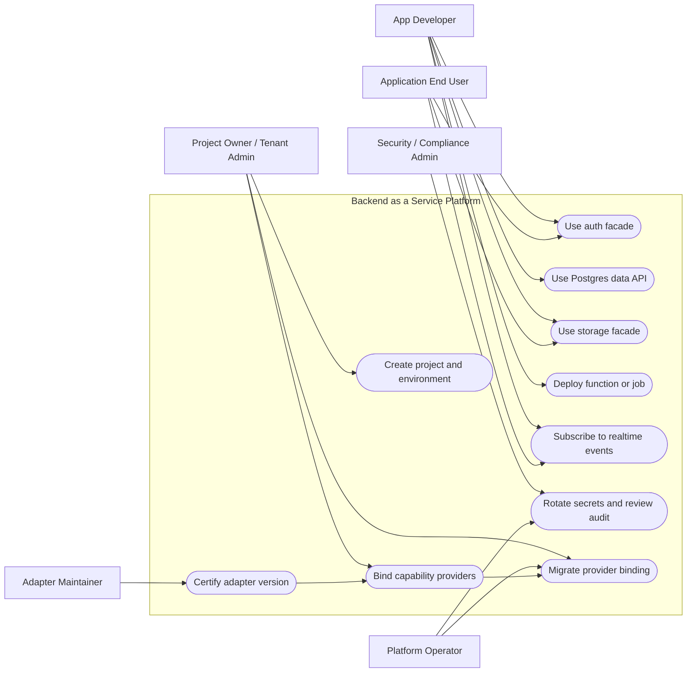

# Use Case Diagram - Backend as a Service Platform

```mermaid
flowchart LR
    owner[Project Owner / Tenant Admin]
    dev[App Developer]
    ops[Platform Operator]
    sec[Security / Compliance Admin]
    adp[Adapter Maintainer]
    enduser[Application End User]

    subgraph system[Backend as a Service Platform]
        uc1([Create project and environment])
        uc2([Bind capability providers])
        uc3([Use auth facade])
        uc4([Use Postgres data API])
        uc5([Use storage facade])
        uc6([Deploy function or job])
        uc7([Subscribe to realtime events])
        uc8([Rotate secrets and review audit])
        uc9([Migrate provider binding])
        uc10([Certify adapter version])
    end

    owner --> uc1
    owner --> uc2
    owner --> uc9
    dev --> uc3
    dev --> uc4
    dev --> uc5
    dev --> uc6
    dev --> uc7
    sec --> uc8
    ops --> uc8
    ops --> uc9
    adp --> uc10
    enduser --> uc3
    enduser --> uc5
    enduser --> uc7
    uc2 --> uc9
    uc10 --> uc2
```
