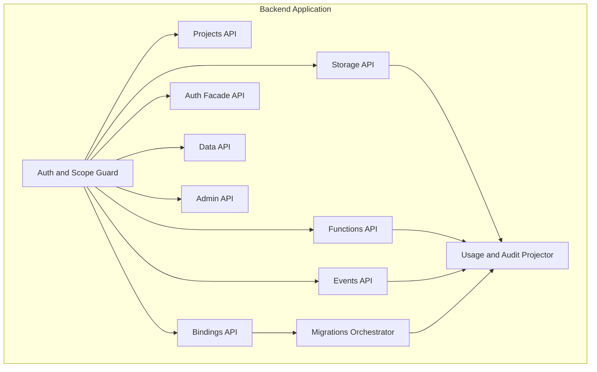

# C4 Component Diagram - Backend as a Service Platform

```mermaid
flowchart TB
    subgraph backend[Backend Application]
        auth[Auth and Scope Guard]
        projectsApi[Projects API]
        bindingsApi[Bindings API]
        authApi[Auth Facade API]
        dataApi[Data API]
        storageApi[Storage API]
        functionsApi[Functions API]
        eventsApi[Events API]
        adminApi[Admin API]
        migration[Migrations Orchestrator]
        projector[Usage and Audit Projector]
    end

    auth --> projectsApi
    auth --> bindingsApi
    auth --> authApi
    auth --> dataApi
    auth --> storageApi
    auth --> functionsApi
    auth --> eventsApi
    auth --> adminApi
    bindingsApi --> migration
    storageApi --> projector
    functionsApi --> projector
    eventsApi --> projector
    migration --> projector
```
