# C4 Level 3 Component Diagram — Backend as a Service Platform

## Table of Contents
1. [C4 Component Diagram: Core API Container](#1-c4-component-diagram-core-api-container)
2. [C4 Component Diagram: Adapter Mesh Container](#2-c4-component-diagram-adapter-mesh-container)
3. [Component Description Table](#3-component-description-table)
4. [Key Design Decisions](#4-key-design-decisions)
5. [Dependency Injection & Configuration](#5-dependency-injection--configuration)
6. [Component Health Check Requirements](#6-component-health-check-requirements)

---

## 1. C4 Component Diagram: Core API Container

```mermaid
graph TB
    subgraph Clients["External Clients"]
        WebApp["Web Application\n[Browser / SPA]"]
        MobileApp["Mobile App\n[iOS / Android]"]
        ServerApp["Server-Side App\n[Service Account]"]
        AdminCLI["Admin CLI\n[baas-cli]"]
    end

    subgraph CoreAPI["Core API Container [Node.js / Go]"]
        direction TB

        subgraph GatewayLayer["API Gateway Layer"]
            Router["Router\n[Express / Chi]\nPath matching, versioning"]
            AuthMW["Auth Middleware\n[JWT RS256 validation]\nExtracts caller context"]
            IdempFilter["Idempotency Filter\n[Redis NX]\nKey-based dedup"]
            RateLimiter["Rate Limiter\n[Redis token bucket]\nPer-project throttling"]
            ErrMapper["Error Mapper\n[domain→HTTP]\nNormalises error envelope"]
        end

        subgraph ControlPlane["Control Plane Components"]
            ProjSvc["Project Service\n[Go struct]\nProject/Env CRUD"]
            BindingSvc["Capability Binding Service\n[Go struct]\nBinding lifecycle + switchover"]
            SecretSvc["Secret Service\n[Go struct]\nSecret ref management"]
            SwitchSvc["Switchover Orchestrator\n[Go struct]\nDry-run + apply + rollback"]
        end

        subgraph AuthFacade["Auth Facade Components"]
            AuthSvc["Auth Service\n[Go struct]\nRegister, login, sessions"]
            OAuthHdlr["OAuth Handler\n[Go struct]\nPKCE, state, callback"]
            SessionMgr["Session Manager\n[Go struct]\nJWT issue + revoke"]
            MFAHdlr["MFA Handler\n[Go struct]\nTOTP enroll + verify"]
            TokenIssuer["Token Issuer\n[Go struct]\nRS256 signing"]
        end

        subgraph DataAPI["Data API Components"]
            DataSvc["Data API Service\n[Go struct]\nRow CRUD + raw SELECT"]
            MigRunner["Migration Runner\n[Go struct]\nAdvisory lock + up/down SQL"]
            RLSMgr["RLS Policy Manager\n[Go struct]\nPolicy CRUD + context injection"]
            SchemaVal["Schema Validator\n[Go struct + JSON Schema]\nColumn type validation"]
        end

        subgraph StorageFacade["Storage Facade Components"]
            StoreSvc["Storage Facade Service\n[Go struct]\nBucket + file lifecycle"]
            UploadHdlr["Upload Handler\n[Go struct]\nStreaming multipart + checksum"]
            SignedUrlGen["Signed URL Generator\n[Go struct]\nHMAC-SHA256 tokens"]
        end

        subgraph FunctionsFacade["Functions Facade Components"]
            FuncSvc["Functions Facade Service\n[Go struct]\nDeploy + invoke + schedule"]
            DeployPipe["Deployment Pipeline\n[Go struct]\nScan → package → deploy"]
            ExecDisp["Execution Dispatcher\n[Go struct]\nQueue claim + worker dispatch"]
            SchedMgr["Schedule Manager\n[Go struct]\npg_cron integration"]
        end

        subgraph EventsFacade["Events Facade Components"]
            EventSvc["Events Facade Service\n[Go struct]\nChannel + pub/sub"]
            FanoutEng["Fanout Engine\n[Kafka consumer]\nSubscriber fan-out"]
            WebhookDisp["Webhook Dispatcher\n[Go struct]\nHTTP delivery + retry"]
            WSGateway["WebSocket Gateway\n[Gorilla WS]\nRealtime client connections"]
        end

        subgraph CrossCutting["Cross-Cutting Components"]
            AuditSvc["Audit Service\n[Go struct]\nImmutable event log"]
            ReportSvc["Reporting Service\n[Go struct]\nUsage + SLO metrics"]
            SLOEngine["SLO Engine\n[Go struct]\nBurn rate + error budget"]
        end
    end

    subgraph ExternalSystems["External Systems"]
        PGDB["PostgreSQL 16\n[Primary Database]"]
        RedisCluster["Redis Cluster 7\n[Cache / Session / Rate Limit]"]
        KafkaBroker["Apache Kafka\n[Message Broker]"]
        AdapterMesh["Adapter Mesh Container\n[see diagram 2]"]
    end

    WebApp & MobileApp & ServerApp & AdminCLI -->|"HTTPS REST/WebSocket"| Router

    Router --> AuthMW --> IdempFilter --> RateLimiter --> ErrMapper
    ErrMapper --> ProjSvc & BindingSvc & SecretSvc & SwitchSvc
    ErrMapper --> AuthSvc & OAuthHdlr
    ErrMapper --> DataSvc & MigRunner
    ErrMapper --> StoreSvc & UploadHdlr & SignedUrlGen
    ErrMapper --> FuncSvc
    ErrMapper --> EventSvc & WSGateway

    AuthSvc --> SessionMgr --> TokenIssuer
    OAuthHdlr --> AdapterMesh
    SessionMgr --> RedisCluster
    MFAHdlr --> SessionMgr

    DataSvc --> RLSMgr --> PGDB
    MigRunner --> PGDB
    SchemaVal --> DataSvc

    StoreSvc --> UploadHdlr --> AdapterMesh
    StoreSvc --> PGDB
    SignedUrlGen --> PGDB

    FuncSvc --> DeployPipe --> AdapterMesh
    FuncSvc --> ExecDisp --> AdapterMesh
    SchedMgr --> PGDB

    EventSvc --> KafkaBroker
    FanoutEng --> KafkaBroker
    FanoutEng --> WebhookDisp --> PGDB
    FanoutEng --> WSGateway

    BindingSvc --> AdapterMesh
    SwitchSvc --> AdapterMesh

    AuditSvc --> PGDB
    ReportSvc --> PGDB
    SLOEngine --> PGDB

    AuthMW --> RedisCluster
    IdempFilter --> RedisCluster
    RateLimiter --> RedisCluster
```



---

## 2. C4 Component Diagram: Adapter Mesh Container

```mermaid
graph TB
    subgraph CoreAPI["Core API Container"]
        BindingSvc2["Capability Binding Service"]
        StoreSvc2["Storage Facade Service"]
        FuncSvc2["Functions Facade Service"]
        EventSvc2["Events Facade Service"]
        AuthSvc2["OAuth Handler"]
        SwitchSvc2["Switchover Orchestrator"]
    end

    subgraph AdapterMesh["Adapter Mesh Container [Go]"]
        AdapReg["Adapter Registry\n[Go map]\nMaps provider_key → IAdapter impl"]
        AdapRouter["Adapter Router\n[Go struct]\nCapability type → active binding → adapter"]
        AdapHC["Adapter Health Checker\n[Go + goroutines]\nPeriodic health probes per binding"]
        CompatVal["Compatibility Validator\n[Go struct]\nChecks config schema versions"]
        MigGate["Migration Gatekeeper\n[Go struct]\nBlocks apply if SLO breach or unhealthy"]

        subgraph AuthAdapters["Auth Adapters"]
            GitHubAdapter["GitHubOAuthAdapter\n[Go struct]\nGitHub OAuth2 + OIDC"]
            GoogleAdapter["GoogleOAuthAdapter\n[Go struct]\nGoogle OIDC"]
            GenericOIDC["GenericOIDCAdapter\n[Go struct]\nCustom OIDC providers"]
        end

        subgraph StorageAdapters["Storage Adapters"]
            S3Adapter["S3StorageAdapter\n[Go struct + AWS SDK v2]"]
            GCSAdapter["GCSStorageAdapter\n[Go struct + GCS client]"]
            AzureAdapter["AzureBlobAdapter\n[Go struct + Azure SDK]"]
        end

        subgraph FunctionsAdapters["Functions Adapters"]
            LambdaAdapter["LambdaFunctionsAdapter\n[Go struct + Lambda SDK]"]
            CloudRunAdapter["CloudRunAdapter\n[Go struct + Cloud Run API]"]
            KnativeAdapter["KnativeAdapter\n[Go struct + Knative REST]"]
        end

        subgraph EventsAdapters["Events Adapters"]
            KafkaAdapter["KafkaEventsAdapter\n[Go struct + Sarama]"]
            SQSSNSAdapter["SQSSNSAdapter\n[Go struct + AWS SDK]"]
            PubSubAdapter["GCPPubSubAdapter\n[Go struct + PubSub client]"]
        end

        subgraph SecretAdapters["Secret Adapters"]
            AWSSecretsAdapter["AWSSecretsManagerAdapter\n[Go struct + SM SDK]"]
            VaultAdapter["HashiCorpVaultAdapter\n[Go struct + vault/api]"]
            GCPSecretAdapter["GCPSecretManagerAdapter\n[Go struct + SM client]"]
        end
    end

    subgraph ExternalProviders["External Cloud Providers"]
        GitHub["GitHub.com"]
        Google["Google APIs"]
        AWSCloud["AWS\n(S3, Lambda, SM, SQS/SNS)"]
        GCPCloud["GCP\n(GCS, Cloud Run, PubSub, SM)"]
        AzureCloud["Azure\n(Blob Storage)"]
        KafkaCluster["Self-hosted Kafka"]
        VaultServer["HashiCorp Vault"]
    end

    subgraph Persistence["Persistence"]
        PGDB2["PostgreSQL\n(binding configs, health status)"]
    end

    BindingSvc2 & StoreSvc2 & FuncSvc2 & EventSvc2 & AuthSvc2 & SwitchSvc2 -->|"in-proc / gRPC"| AdapRouter

    AdapRouter --> AdapReg
    AdapReg --> GitHubAdapter & GoogleAdapter & GenericOIDC
    AdapReg --> S3Adapter & GCSAdapter & AzureAdapter
    AdapReg --> LambdaAdapter & CloudRunAdapter & KnativeAdapter
    AdapReg --> KafkaAdapter & SQSSNSAdapter & PubSubAdapter
    AdapReg --> AWSSecretsAdapter & VaultAdapter & GCPSecretAdapter

    AdapHC --> AdapReg
    AdapHC --> PGDB2
    CompatVal --> PGDB2
    MigGate --> AdapHC
    MigGate --> PGDB2

    GitHubAdapter --> GitHub
    GoogleAdapter --> Google
    S3Adapter & LambdaAdapter & SQSSNSAdapter & AWSSecretsAdapter --> AWSCloud
    GCSAdapter & CloudRunAdapter & PubSubAdapter & GCPSecretAdapter --> GCPCloud
    AzureAdapter --> AzureCloud
    KafkaAdapter --> KafkaCluster
    VaultAdapter --> VaultServer
```



---

## 3. Component Description Table

| Component | Technology | Responsibility | Interfaces |
|-----------|------------|----------------|------------|
| `Router` | Chi (Go) / Express (Node) | HTTP path matching, middleware chain assembly, API version routing | Ingress HTTP(S) |
| `Auth Middleware` | Go middleware + RS256 | Validates JWT; extracts `tenant_id`, `project_id`, `user_id`, `roles` into context | In-process context |
| `Idempotency Filter` | Redis SET NX | Stores `(project_id, caller_id, idempotency_key) → response`; returns cached result on replay | Redis RESP3 |
| `Rate Limiter` | Redis token bucket | Enforces per-project, per-IP token buckets; sets `X-RateLimit-*` headers | Redis RESP3 |
| `Error Mapper` | Go struct | Maps domain errors to HTTP status + JSON error envelope | In-process |
| `Project Service` | Go struct + PostgreSQL | Project and environment CRUD; soft-delete; quota enforcement | PostgreSQL wire |
| `Capability Binding Service` | Go struct | Binding lifecycle state machine; triggers validation via Adapter Mesh | In-proc + Adapter Mesh |
| `Secret Service` | Go struct | Secret ref CRUD; delegates value resolution to Secret Adapters | In-proc + vault adapter |
| `Switchover Orchestrator` | Go struct (Saga) | Coordinates dry-run → prepare → apply → verify; writes checkpoints | In-proc + Adapter Mesh + PG |
| `Auth Service` | Go struct | Register, login (password + OAuth), session management, password reset | In-proc + PG + Redis |
| `OAuth Handler` | Go struct | Builds authorization URLs; handles callbacks; normalises profiles | HTTP redirect + adapter |
| `Session Manager` | Go struct | Issues, validates, refreshes, and revokes sessions | Redis + PostgreSQL |
| `Token Issuer` | Go struct + RS256 | Signs access and refresh JWTs with rotating key pair | In-proc |
| `MFA Handler` | Go struct + TOTP | TOTP enroll (QR code), verify code, manage backup codes | In-proc + PostgreSQL |
| `Data API Service` | Go struct | Row CRUD and raw parameterised SELECT with RLS context injection | PostgreSQL wire |
| `Migration Runner` | Go struct | Acquires `pg_advisory_lock`; executes `up_sql`/`down_sql`; writes status | PostgreSQL wire |
| `RLS Policy Manager` | Go struct | Manages `CREATE/DROP POLICY` statements; injects session GUCs | PostgreSQL wire |
| `Schema Validator` | Go struct + JSON Schema | Validates column definitions and filter expressions before execution | In-proc |
| `Storage Facade Service` | Go struct | Bucket and file lifecycle; dedup by checksum; quota metering | PG + Adapter Mesh |
| `Upload Handler` | Go struct | Streams multipart upload; computes SHA-256 on-the-fly; routes to provider | Multipart HTTP → adapter |
| `Signed URL Generator` | Go struct | Creates `HMAC-SHA256` tokens; stores grant in PostgreSQL | In-proc + PostgreSQL |
| `Functions Facade Service` | Go struct | Function CRUD; orchestrates deployment pipeline; sync/async invoke | PG + Adapter Mesh |
| `Deployment Pipeline` | Go struct | Triggers SAST scan → packages artifact → calls functions adapter | HTTP + adapter |
| `Execution Dispatcher` | Go struct | Claims execution record (`SELECT FOR UPDATE SKIP LOCKED`); dispatches to runtime | PG + adapter |
| `Schedule Manager` | Go struct + pg_cron | Manages `pg_cron` jobs; updates `next_run_at` | PostgreSQL |
| `Events Facade Service` | Go struct | Channel CRUD; publishes to Kafka topic; manages subscriptions | PG + Kafka |
| `Fanout Engine` | Kafka consumer group | Reads events from Kafka; routes to webhook dispatcher / WebSocket gateway | Kafka + in-proc |
| `Webhook Dispatcher` | Go struct | Delivers HTTP POST with HMAC signature; retries with exponential back-off | HTTP + PostgreSQL |
| `WebSocket Gateway` | Gorilla WebSocket | Maintains persistent WS connections; pushes events to connected clients | WebSocket |
| `Adapter Registry` | Go map + reflection | Maps `provider_key` strings to concrete adapter instances | In-proc |
| `Adapter Router` | Go struct | Resolves active binding for (env, capability_type) → correct adapter | In-proc + PostgreSQL |
| `Adapter Health Checker` | Goroutine pool | Probes each adapter every 30 s; stores health status; feeds SLO engine | In-proc + PostgreSQL |
| `Compatibility Validator` | Go struct | Compares adapter config schema versions against stored binding configs | In-proc + PostgreSQL |
| `Migration Gatekeeper` | Go struct | Blocks switchover `apply` if SLO burn rate > 2× or adapter unhealthy | In-proc |
| `SLO Engine` | Go struct | Aggregates SLI windows; calculates error budget; fires burn-rate alerts | PostgreSQL |
| `Audit Service` | Go struct | Writes `AuditEvent` records asynchronously; buffered COPY to PostgreSQL | PostgreSQL COPY |
| `Reporting Service` | Go struct | Queries usage meters and SLI aggregates; formats reports | PostgreSQL (read replica) |

---

## 4. Key Design Decisions

| Decision | Rationale | Trade-off |
|----------|-----------|-----------|
| **Single PostgreSQL as source of truth** | Simplifies consistency; ACID transactions; RLS built-in | Vertical scaling limits; mitigated by pgBouncer + read replicas |
| **Adapter pattern with registry** | Pluggable providers without changing application code; enables switchover | Adapter interface must be kept stable; versioning required |
| **Saga pattern for switchovers** | Long-running multi-step operation needs compensation logic | More complex than 2PC; requires checkpoint table |
| **RLS via session GUCs** | Row-level isolation without application-level filters; enforced by PG | All queries must set GUCs; missed GUC = full table access risk |
| **Kafka for fanout, not HTTP** | Decouples publisher from subscriber latency; durable; supports replay | Adds operational complexity; Kafka cluster must be HA |
| **Redis for idempotency keys** | O(1) lookup; 24-hour TTL handled natively by Redis `EX` | Redis down → idempotency not enforced (degraded mode) |
| **JWT RS256 with rotating keys** | Asymmetric signing; public key distributed to adapters for local validation | Key rotation window requires `nbf` claim tolerance |
| **Signed URL with HMAC-SHA256** | Stateless URL validation without DB lookup for hot download path | Token cannot be revoked before expiry (mitigated by short TTL) |
| **pg_cron for scheduling** | No external scheduler dependency; transactionally consistent | Single-point; pg_cron limited to one leader |
| **Buffered async audit writes** | Avoids adding audit latency to critical request path | Small risk of lost events on crash (buffer ≤ 500ms / 100 events) |

---

## 5. Dependency Injection & Configuration

All components are wired via a **constructor injection** container (Wire for Go). Configuration is loaded in layers:

```
1. Defaults (compiled-in)
2. config/base.yaml  (committed, non-secret)
3. config/{env}.yaml (environment-specific, committed)
4. Environment variables (override any YAML key, 12-factor)
5. Secret refs (resolved at startup from vault; injected into adapters)
```

Adapter instances are created once at startup and registered into `AdapterRegistry`. The registry is **read-only** after boot; hot-reload of adapter configs is not supported (requires rolling restart).

Each service receives only the interfaces it needs — no service holds a reference to the concrete adapter type.

---

## 6. Component Health Check Requirements

| Component | Endpoint / Mechanism | Healthy Criteria | Unhealthy Action |
|-----------|---------------------|-----------------|------------------|
| `Router` | `GET /v1/ops/health` → 200 | Process alive | K8s liveness probe restarts pod |
| `PostgreSQL connection` | `SELECT 1` via pgBouncer | Response < 100ms | Pod marked not-ready; alert |
| `Redis connection` | `PING` | Response < 20ms | Idempotency/rate-limit degraded mode |
| `Kafka producer` | Metadata fetch from broker | All required topics exist | Events facade returns 503 |
| `S3StorageAdapter` | `HEAD s3://bucket/healthcheck` | HTTP 200/403 (auth ok) | Binding marked `failed`; alert |
| `GCSStorageAdapter` | `storage.buckets.get` | Returns bucket metadata | Binding marked `failed` |
| `LambdaFunctionsAdapter` | `lambda:GetAccountSettings` | Returns 200 | Function invocations blocked |
| `KafkaEventsAdapter` | `DescribeCluster` | Broker reachable | Events publish returns 503 |
| `VaultAdapter` | `vault.sys.Health()` | Vault unsealed | Secret resolution fails; alert fired |
| `Adapter Health Checker` | Background goroutine every 30 s | All active bindings healthy | `BurnRateAlerter` triggered; `MigrationGatekeeper` blocks apply |
| `SLO Engine` | Internal metric check | Burn rate < configured threshold | `BurnRateAlerter` fires webhook + email |
