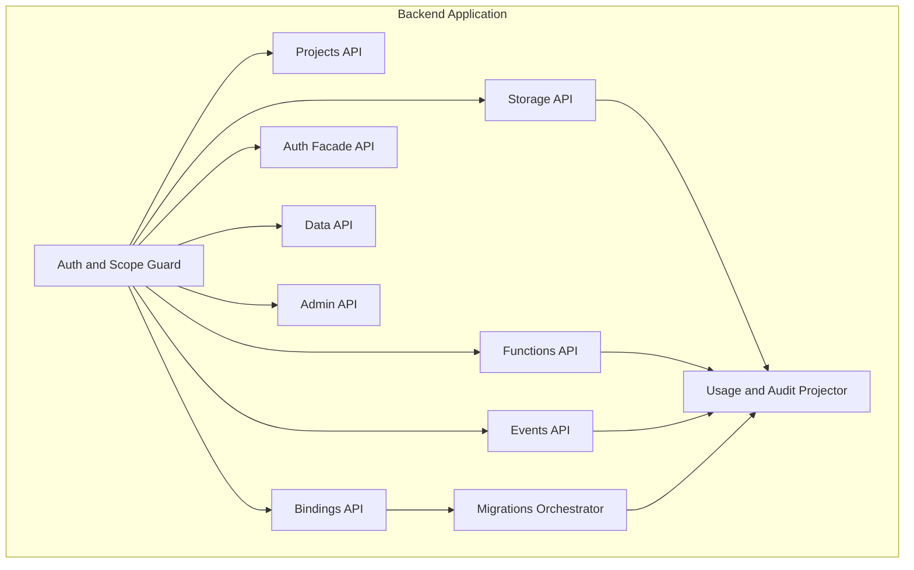

# C4 Component Diagram - Backend as a Service Platform

## Component Interaction Addendum

- **Contract Validator Component:** schema validation, version negotiation, idempotency replay.
- **Isolation Guard Component:** scope extraction, policy checks, tenant boundary enforcement.
- **Lifecycle Orchestrator:** manages state transitions for binding, migration, release.
- **Error Mapper:** normalizes adapter/provider errors to platform taxonomy.
- **SLO Publisher:** emits per-request metrics tagged by tenant/project/env/capability.
