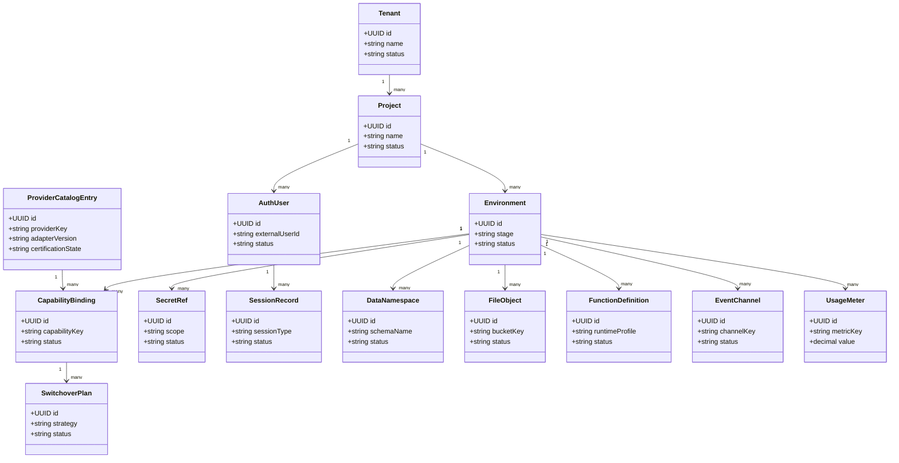

# Class Diagram - Backend as a Service Platform

```mermaid
classDiagram
    class Tenant {
      +UUID id
      +string name
      +string status
    }
    class Project {
      +UUID id
      +string name
      +string status
    }
    class Environment {
      +UUID id
      +string stage
      +string status
    }
    class CapabilityBinding {
      +UUID id
      +string capabilityKey
      +string status
    }
    class ProviderCatalogEntry {
      +UUID id
      +string providerKey
      +string adapterVersion
      +string certificationState
    }
    class SwitchoverPlan {
      +UUID id
      +string strategy
      +string status
    }
    class SecretRef {
      +UUID id
      +string scope
      +string status
    }
    class AuthUser {
      +UUID id
      +string externalUserId
      +string status
    }
    class SessionRecord {
      +UUID id
      +string sessionType
      +string status
    }
    class DataNamespace {
      +UUID id
      +string schemaName
      +string status
    }
    class FileObject {
      +UUID id
      +string bucketKey
      +string status
    }
    class FunctionDefinition {
      +UUID id
      +string runtimeProfile
      +string status
    }
    class EventChannel {
      +UUID id
      +string channelKey
      +string status
    }
    class UsageMeter {
      +UUID id
      +string metricKey
      +decimal value
    }

    Tenant "1" --> "many" Project
    Project "1" --> "many" Environment
    Environment "1" --> "many" CapabilityBinding
    ProviderCatalogEntry "1" --> "many" CapabilityBinding
    CapabilityBinding "1" --> "many" SwitchoverPlan
    Environment "1" --> "many" SecretRef
    Project "1" --> "many" AuthUser
    AuthUser "1" --> "many" SessionRecord
    Environment "1" --> "many" DataNamespace
    Environment "1" --> "many" FileObject
    Environment "1" --> "many" FunctionDefinition
    Environment "1" --> "many" EventChannel
    Environment "1" --> "many" UsageMeter
```
