# Class Diagrams — Backend as a Service Platform

## Table of Contents
1. [Domain Layer](#1-domain-layer)
2. [Application Service Layer](#2-application-service-layer)
3. [Infrastructure / Adapter Layer](#3-infrastructure--adapter-layer)
4. [Class Responsibility Table](#4-class-responsibility-table)

---

## 1. Domain Layer

```mermaid
classDiagram
    class Tenant {
        +UUID id
        +String slug
        +String name
        +PlanTier planTier
        +Map~String,Object~ metadata
        +DateTime createdAt
        +addProject(name, slug) Project
        +suspend() void
        +isWithinProjectQuota() bool
    }

    class Project {
        +UUID id
        +UUID tenantId
        +String slug
        +String name
        +ProjectStatus status
        +Map~String,Object~ metadata
        +DateTime createdAt
        +addEnvironment(slug, type) Environment
        +suspend() void
        +delete() void
    }

    class Environment {
        +UUID id
        +UUID projectId
        +String slug
        +EnvironmentType type
        +Map~String,Object~ config
        +createBinding(capTypeId, providerId, config) CapabilityBinding
        +createBucket(name, config) Bucket
        +createFunction(name, config) FunctionDefinition
        +createChannel(name, type) EventChannel
        +createNamespace(name) DataNamespace
    }

    class CapabilityBinding {
        +UUID id
        +UUID environmentId
        +UUID capabilityTypeId
        +UUID providerCatalogEntryId
        +String displayName
        +BindingStatus status
        +int version
        +Map~String,Object~ configSnapshot
        +UUID previousProviderId
        +DateTime activatedAt
        +validate() void
        +activate() void
        +initiateSwitchover(targetProviderId, targetConfig) SwitchoverPlan
        +rollback() void
        +deprecate() void
        +fail(errorDetail) void
    }

    class SwitchoverPlan {
        +UUID id
        +UUID bindingId
        +UUID targetProviderId
        +SwitchoverStatus status
        +SwitchoverStrategy strategy
        +Map~String,Object~ targetConfig
        +Map~String,Object~ dryRunResult
        +String notes
        +addCheckpoint(phase, status, result) SwitchoverCheckpoint
        +executeDryRun() DryRunResult
        +apply() void
        +rollback() void
        +complete() void
    }

    class SwitchoverCheckpoint {
        +UUID id
        +UUID planId
        +String phase
        +CheckpointStatus status
        +Map~String,Object~ result
        +String errorDetail
        +DateTime recordedAt
        +pass(result) void
        +fail(errorDetail) void
    }

    class SecretRef {
        +UUID id
        +UUID projectId
        +UUID environmentId
        +String name
        +SecretProvider provider
        +String externalRef
        +String description
        +DateTime lastRotatedAt
        +rotate(newExternalRef) void
        +resolve() String
    }

    class AuthUser {
        +UUID id
        +UUID projectId
        +String email
        +bool emailVerified
        +String passwordHash
        +String name
        +String avatarUrl
        +UserStatus status
        +Map~String,Object~ metadata
        +verifyEmail() void
        +suspend(reason) void
        +reactivate() void
        +delete() void
        +checkPassword(raw) bool
        +setPassword(raw) void
    }

    class SessionRecord {
        +UUID id
        +UUID userId
        +String accessTokenHash
        +String refreshTokenHash
        +String ipAddress
        +bool mfaVerified
        +DateTime expiresAt
        +DateTime revokedAt
        +isValid() bool
        +revoke() void
        +refresh(newAccessToken, newRefreshToken) void
    }

    class MFAConfig {
        +UUID id
        +UUID userId
        +MFAMethod method
        +Bytes secretEncrypted
        +List~String~ backupCodes
        +bool active
        +DateTime enrolledAt
        +generateTOTP() String
        +verify(code) bool
        +activate() void
        +deactivate() void
    }

    class DataNamespace {
        +UUID id
        +UUID environmentId
        +String name
        +String pgSchema
        +String description
        +createTable(name, columns) TableDefinition
        +createMigration(name, upSql, downSql) SchemaMigration
        +drop() void
    }

    class TableDefinition {
        +UUID id
        +UUID namespaceId
        +String tableName
        +List~ColumnDef~ columnDefinitions
        +bool rlsEnabled
        +TableStatus status
        +addColumn(column) void
        +dropColumn(name) void
        +enableRLS() void
        +deprecate() void
    }

    class SchemaMigration {
        +UUID id
        +UUID namespaceId
        +String name
        +String upSql
        +String downSql
        +MigrationStatus status
        +int ordinal
        +DateTime appliedAt
        +dryRun() DryRunLog
        +apply() void
        +rollback() void
        +verify() bool
    }

    class Bucket {
        +UUID id
        +UUID environmentId
        +String name
        +long maxSizeBytes
        +int maxFileSizeBytes
        +List~String~ allowedMimeTypes
        +BucketVisibility visibility
        +bool versioningEnabled
        +validateFile(name, mimeType, size) void
        +delete() void
    }

    class FileObject {
        +UUID id
        +UUID bucketId
        +String filePath
        +long sizeBytes
        +String mimeType
        +String storageKey
        +String checksumSha256
        +Map~String,Object~ metadata
        +DateTime deletedAt
        +generateSignedUrl(operation, expiresIn) SignedAccessGrant
        +softDelete() void
    }

    class SignedAccessGrant {
        +UUID id
        +UUID fileId
        +String operation
        +String tokenHash
        +String allowedCidr
        +DateTime expiresAt
        +bool used
        +validate(token, ip) bool
        +markUsed() void
        +isExpired() bool
    }

    class FunctionDefinition {
        +UUID id
        +UUID environmentId
        +String name
        +String runtime
        +FunctionStatus status
        +int timeoutSeconds
        +int memoryMb
        +Map~String,String~ envVars
        +deploy(artifactUrl) DeploymentArtifact
        +invoke(payload) ExecutionRecord
        +addSchedule(cron, timezone) FunctionSchedule
        +deprecate() void
        +archive() void
    }

    class DeploymentArtifact {
        +UUID id
        +UUID functionId
        +String versionTag
        +String artifactUrl
        +String artifactHash
        +ScanStatus scanStatus
        +DeploymentStatus status
        +Map~String,Object~ scanReport
        +DateTime deployedAt
        +passScan(report) void
        +failScan(report) void
        +activate() void
        +retire() void
    }

    class ExecutionRecord {
        +UUID id
        +UUID functionId
        +UUID deploymentId
        +TriggerType triggerType
        +Map~String,Object~ inputPayload
        +Map~String,Object~ outputPayload
        +ExecutionStatus status
        +int durationMs
        +String logUrl
        +String errorDetail
        +dispatch() void
        +start() void
        +complete(output, durationMs) void
        +fail(error) void
        +timeout() void
        +archive() void
    }

    class FunctionSchedule {
        +UUID id
        +UUID functionId
        +String cronExpression
        +String timezone
        +bool enabled
        +Map~String,Object~ payload
        +DateTime nextRunAt
        +DateTime lastRunAt
        +enable() void
        +disable() void
        +updateNextRun() void
    }

    class EventChannel {
        +UUID id
        +UUID environmentId
        +String name
        +ChannelType type
        +bool persistent
        +int retentionHours
        +publish(eventType, payload) void
        +subscribe(subscriberType, endpoint) Subscription
        +delete() void
    }

    class Subscription {
        +UUID id
        +UUID channelId
        +SubscriberType subscriberType
        +String endpoint
        +SubscriptionStatus status
        +Map filterExpression
        +Map retryPolicy
        +pause() void
        +resume() void
        +cancel() void
        +addDeliveryRecord(eventType, payload) DeliveryRecord
    }

    class DeliveryRecord {
        +UUID id
        +UUID subscriptionId
        +String eventType
        +Map~String,Object~ payload
        +DeliveryStatus status
        +int attemptCount
        +DateTime lastAttemptedAt
        +markDelivered() void
        +markFailed() void
        +deadLetter() void
        +incrementAttempt() void
    }

    Tenant "1" --> "many" Project
    Project "1" --> "many" Environment
    Project "1" --> "many" SecretRef
    Project "1" --> "many" AuthUser
    Environment "1" --> "many" CapabilityBinding
    Environment "1" --> "many" DataNamespace
    Environment "1" --> "many" Bucket
    Environment "1" --> "many" FunctionDefinition
    Environment "1" --> "many" EventChannel
    CapabilityBinding "1" --> "many" SwitchoverPlan
    SwitchoverPlan "1" --> "many" SwitchoverCheckpoint
    AuthUser "1" --> "many" SessionRecord
    AuthUser "1" --> "0..1" MFAConfig
    DataNamespace "1" --> "many" TableDefinition
    DataNamespace "1" --> "many" SchemaMigration
    Bucket "1" --> "many" FileObject
    FileObject "1" --> "many" SignedAccessGrant
    FunctionDefinition "1" --> "many" DeploymentArtifact
    FunctionDefinition "1" --> "many" ExecutionRecord
    FunctionDefinition "1" --> "many" FunctionSchedule
    EventChannel "1" --> "many" Subscription
    Subscription "1" --> "many" DeliveryRecord
```

---

## 2. Application Service Layer

```mermaid
classDiagram
    class AuthService {
        -IAuthAdapter authAdapter
        -ISessionStore sessionStore
        -IAuditService auditService
        -ISecretService secretService
        +registerUser(cmd RegisterUserCmd) AuthUser
        +loginWithPassword(cmd LoginCmd) SessionTokens
        +loginWithOAuth(cmd OAuthCallbackCmd) SessionTokens
        +refreshSession(refreshToken) SessionTokens
        +revokeSession(sessionId, userId) void
        +listSessions(userId) List~SessionRecord~
        +requestPasswordReset(email, projectId) void
        +confirmPasswordReset(token, newPassword) void
        +enrollMFA(userId) MFAEnrollmentResult
        +verifyMFA(userId, code) bool
        +disableMFA(userId) void
        +getCurrentUser(userId) AuthUser
        +updateUserProfile(userId, cmd) AuthUser
        +suspendUser(userId, reason) void
        +reactivateUser(userId) void
    }

    class DataApiService {
        -IDatastore datastore
        -RLSPolicyManager rlsPolicyManager
        -IMigrationRunner migrationRunner
        -IAuditService auditService
        +createNamespace(cmd) DataNamespace
        +dropNamespace(namespaceId) void
        +createTable(namespaceId, cmd) TableDefinition
        +alterTable(tableId, cmd) TableDefinition
        +dropTable(tableId) void
        +queryRows(namespaceId, table, filter, pagination, ctx) QueryResult
        +insertRow(namespaceId, table, data, ctx) Map
        +updateRow(namespaceId, table, rowId, data, ctx) Map
        +deleteRow(namespaceId, table, rowId, ctx) void
        +executeRawQuery(sql, params, ctx) QueryResult
        +createMigration(namespaceId, cmd) SchemaMigration
        +dryRunMigration(migrationId) DryRunLog
        +applyMigration(migrationId) void
        +rollbackMigration(migrationId) void
        +createRLSPolicy(namespaceId, table, policy) void
        +deleteRLSPolicy(policyId) void
    }

    class StorageFacadeService {
        -IStorageAdapter storageAdapter
        -IBucketRepository bucketRepo
        -IFileRepository fileRepo
        -IUsageMeterService usageMeter
        +createBucket(envId, cmd) Bucket
        +getBucket(bucketId) Bucket
        +updateBucket(bucketId, cmd) Bucket
        +deleteBucket(bucketId) void
        +listFiles(bucketId, prefix, pagination) FileListResult
        +uploadFile(bucketId, file, metadata) FileObject
        +downloadFile(fileId) FileStream
        +deleteFile(fileId) void
        +generateSignedUrl(fileId, cmd) SignedUrlResult
        +validateSignedToken(token, ip) FileObject
        +createAccessGrant(bucketId, cmd) SignedAccessGrant
        +revokeAccessGrant(grantId) void
    }

    class FunctionsFacadeService {
        -IFunctionsAdapter functionsAdapter
        -IFunctionRepository functionRepo
        -IExecutionRepository execRepo
        -IScheduleManager scheduleManager
        -ILogAggregator logAggregator
        +createFunction(envId, cmd) FunctionDefinition
        +updateFunction(funcId, cmd) FunctionDefinition
        +deleteFunction(funcId) void
        +deployArtifact(funcId, artifactUrl, versionTag) DeploymentArtifact
        +getDeploymentStatus(deploymentId) DeploymentArtifact
        +invokeSync(funcId, payload, callerId) ExecutionResult
        +invokeAsync(funcId, payload, callerId) String
        +getExecution(execId) ExecutionRecord
        +listExecutions(funcId, filter, pagination) List~ExecutionRecord~
        +createSchedule(funcId, cmd) FunctionSchedule
        +deleteSchedule(scheduleId) void
        +listSchedules(funcId) List~FunctionSchedule~
    }

    class EventsFacadeService {
        -IEventsAdapter eventsAdapter
        -IChannelRepository channelRepo
        -ISubscriptionRepository subRepo
        -IDeliveryRepository deliveryRepo
        -IFanoutEngine fanoutEngine
        +createChannel(envId, cmd) EventChannel
        +deleteChannel(channelId) void
        +publishEvent(channelId, eventType, payload, publisherId) String
        +createSubscription(channelId, cmd) Subscription
        +cancelSubscription(subId) void
        +pauseSubscription(subId) void
        +resumeSubscription(subId) void
        +registerWebhook(envId, cmd) Subscription
        +deleteWebhook(webhookId) void
        +listDeliveryRecords(subId, filter) List~DeliveryRecord~
        +getWebSocketToken(userId, envId) String
    }

    class CapabilityBindingService {
        -IBindingRepository bindingRepo
        -IProviderCatalogRepository catalogRepo
        -IAdapterRegistry adapterRegistry
        -IAuditService auditService
        +createBinding(envId, cmd) CapabilityBinding
        +updateBinding(bindingId, cmd) CapabilityBinding
        +deleteBinding(bindingId) void
        +validateBinding(bindingId) ValidationResult
        +getBinding(bindingId) CapabilityBinding
        +listBindings(envId) List~CapabilityBinding~
        +getBindingHistory(bindingId) List~BindingHistoryEntry~
        +initiateSwitch(bindingId, cmd) SwitchoverPlan
        +rollbackBinding(bindingId) void
    }

    class MigrationOrchestratorService {
        -ISwitchoverRepository planRepo
        -IAdapterRegistry adapterRegistry
        -IParityChecker parityChecker
        -IAuditService auditService
        +createPlan(cmd) SwitchoverPlan
        +executeDryRun(planId) DryRunResult
        +applyPlan(planId) void
        +rollbackPlan(planId) void
        +getPlan(planId) SwitchoverPlan
        +listPlans(bindingId) List~SwitchoverPlan~
        +getCheckpoints(planId) List~SwitchoverCheckpoint~
        -runPrerequisiteChecks(plan) CheckResult
        -runParityCheck(old, new, sampleSize) ParityResult
        -executeRollback(plan) void
    }

    class SecretService {
        -ISecretVaultAdapter vaultAdapter
        -ISecretRefRepository secretRepo
        -IAuditService auditService
        +registerSecret(projectId, cmd) SecretRef
        +getSecretMetadata(secretId) SecretRef
        +listSecrets(projectId) List~SecretRef~
        +rotateSecret(secretId, newExternalRef) SecretRef
        +deleteSecret(secretId) void
        +resolveSecretValue(secretRef) String
    }

    class AuditService {
        -IAuditRepository auditRepo
        -IMessageBus messageBus
        +log(event AuditEvent) void
        +queryLogs(filter, pagination) List~AuditLog~
        +getLog(logId) AuditLog
    }

    class ReportingService {
        -IUsageMeterRepository usageRepo
        -ISLORepository sloRepo
        -ISLIRepository sliRepo
        +getUsageSummary(projectId, period) UsageSummary
        +getCapabilityHealth(projectId) List~BindingHealth~
        +getErrorBudget(sloId) ErrorBudgetReport
        +listSLOPolicies(bindingId) List~SLOPolicy~
        +createSLOPolicy(bindingId, cmd) SLOPolicy
    }

    AuthService --> DataApiService : uses (user storage)
    CapabilityBindingService --> MigrationOrchestratorService : delegates switchover
    FunctionsFacadeService --> EventsFacadeService : publishes execution events
    StorageFacadeService --> EventsFacadeService : publishes storage events
    AuthService --> AuditService
    DataApiService --> AuditService
    StorageFacadeService --> AuditService
    FunctionsFacadeService --> AuditService
    CapabilityBindingService --> AuditService
    SecretService --> AuditService
    ReportingService --> AuditService : reads logs
```

---

## 3. Infrastructure / Adapter Layer

```mermaid
classDiagram
    class IAuthAdapter {
        <<interface>>
        +buildAuthorizationUrl(config, state, scopes) String
        +exchangeCodeForTokens(code, config) OAuthTokens
        +fetchUserProfile(accessToken) NormalizedProfile
        +validateToken(token) TokenClaims
        +revokeToken(token) void
    }

    class IStorageAdapter {
        <<interface>>
        +validateConfig(config) ValidationResult
        +uploadObject(key, content, mimeType, options) UploadResult
        +downloadObject(key) ObjectStream
        +deleteObject(key) void
        +headObject(key) ObjectMeta
        +listObjects(prefix, limit, cursor) ObjectList
        +generatePresignedUrl(key, operation, expiresIn) String
        +healthCheck() HealthStatus
    }

    class IFunctionsAdapter {
        <<interface>>
        +validateConfig(config) ValidationResult
        +deployFunction(funcDef, artifact) DeployResult
        +invokeFunction(funcDef, payload, timeout) InvokeResult
        +deleteFunction(funcId) void
        +getFunctionLogs(execId, limit) LogStream
        +healthCheck() HealthStatus
    }

    class IEventsAdapter {
        <<interface>>
        +validateConfig(config) ValidationResult
        +createTopic(name, config) void
        +publishMessage(topic, key, value) MessageOffset
        +subscribe(topic, groupId, handler) ConsumerHandle
        +deleteTopic(name) void
        +healthCheck() HealthStatus
    }

    class ISecretVaultAdapter {
        <<interface>>
        +resolveSecret(externalRef) String
        +rotateSecret(externalRef, newValue) void
        +deleteSecret(externalRef) void
        +healthCheck() HealthStatus
    }

    class JwtOAuthAdapter {
        -String clientId
        -String clientSecret
        -String authorizationEndpoint
        -String tokenEndpoint
        -String userInfoEndpoint
        -JwtKeySet keySet
        +buildAuthorizationUrl(config, state, scopes) String
        +exchangeCodeForTokens(code, config) OAuthTokens
        +fetchUserProfile(accessToken) NormalizedProfile
        +validateToken(token) TokenClaims
        +revokeToken(token) void
        -verifySignature(token, keySet) bool
        -extractClaims(token) Map
    }

    class S3StorageAdapter {
        -AmazonS3Client s3Client
        -String region
        -String defaultBucket
        -String kmsKeyId
        +validateConfig(config) ValidationResult
        +uploadObject(key, content, mimeType, options) UploadResult
        +downloadObject(key) ObjectStream
        +deleteObject(key) void
        +headObject(key) ObjectMeta
        +listObjects(prefix, limit, cursor) ObjectList
        +generatePresignedUrl(key, operation, expiresIn) String
        +healthCheck() HealthStatus
        -buildS3Key(projectId, bucketName, filePath) String
        -applyServerSideEncryption(request) void
    }

    class GCSStorageAdapter {
        -Storage gcsClient
        -String projectId
        -String defaultBucket
        +validateConfig(config) ValidationResult
        +uploadObject(key, content, mimeType, options) UploadResult
        +downloadObject(key) ObjectStream
        +deleteObject(key) void
        +headObject(key) ObjectMeta
        +listObjects(prefix, limit, cursor) ObjectList
        +generatePresignedUrl(key, operation, expiresIn) String
        +healthCheck() HealthStatus
    }

    class LambdaFunctionsAdapter {
        -LambdaClient lambdaClient
        -String region
        -String executionRoleArn
        +validateConfig(config) ValidationResult
        +deployFunction(funcDef, artifact) DeployResult
        +invokeFunction(funcDef, payload, timeout) InvokeResult
        +deleteFunction(funcId) void
        +getFunctionLogs(execId, limit) LogStream
        +healthCheck() HealthStatus
        -buildFunctionName(envId, funcId) String
        -mapRuntime(baasRuntime) String
    }

    class CloudRunFunctionsAdapter {
        -CloudRunClient cloudRunClient
        -String region
        -String serviceAccount
        +validateConfig(config) ValidationResult
        +deployFunction(funcDef, artifact) DeployResult
        +invokeFunction(funcDef, payload, timeout) InvokeResult
        +deleteFunction(funcId) void
        +getFunctionLogs(execId, limit) LogStream
        +healthCheck() HealthStatus
    }

    class KafkaEventsAdapter {
        -KafkaProducer producer
        -KafkaConsumer consumer
        -String bootstrapServers
        -String schemaRegistryUrl
        +validateConfig(config) ValidationResult
        +createTopic(name, config) void
        +publishMessage(topic, key, value) MessageOffset
        +subscribe(topic, groupId, handler) ConsumerHandle
        +deleteTopic(name) void
        +healthCheck() HealthStatus
        -serializeMessage(value) Bytes
        -buildTopicName(envId, channelName) String
    }

    class SQSSNSEventsAdapter {
        -SQSClient sqsClient
        -SNSClient snsClient
        -String region
        +validateConfig(config) ValidationResult
        +createTopic(name, config) void
        +publishMessage(topic, key, value) MessageOffset
        +subscribe(topic, groupId, handler) ConsumerHandle
        +deleteTopic(name) void
        +healthCheck() HealthStatus
    }

    class AwsSecretsManagerAdapter {
        -SecretsManagerClient smClient
        -String region
        +resolveSecret(externalRef) String
        +rotateSecret(externalRef, newValue) void
        +deleteSecret(externalRef) void
        +healthCheck() HealthStatus
    }

    class HashiCorpVaultAdapter {
        -VaultClient vaultClient
        -String vaultAddr
        -String mountPath
        +resolveSecret(externalRef) String
        +rotateSecret(externalRef, newValue) void
        +deleteSecret(externalRef) void
        +healthCheck() HealthStatus
    }

    IAuthAdapter <|.. JwtOAuthAdapter
    IStorageAdapter <|.. S3StorageAdapter
    IStorageAdapter <|.. GCSStorageAdapter
    IFunctionsAdapter <|.. LambdaFunctionsAdapter
    IFunctionsAdapter <|.. CloudRunFunctionsAdapter
    IEventsAdapter <|.. KafkaEventsAdapter
    IEventsAdapter <|.. SQSSNSEventsAdapter
    ISecretVaultAdapter <|.. AwsSecretsManagerAdapter
    ISecretVaultAdapter <|.. HashiCorpVaultAdapter
```

---

## 4. Class Responsibility Table

| Class | Layer | Responsibility | Design Pattern |
|-------|-------|----------------|----------------|
| `Tenant` | Domain | Root aggregate for all tenant-owned resources | Aggregate Root |
| `Project` | Domain | Project context boundary; owns environments | Aggregate Root |
| `Environment` | Domain | Logical deployment scope; hosts capability bindings, DB, storage, functions, events | Entity |
| `CapabilityBinding` | Domain | Manages a specific provider assignment for a capability type | Entity, State Machine |
| `SwitchoverPlan` | Domain | Orchestrates provider migration steps | Entity, Saga |
| `AuthUser` | Domain | User identity with lifecycle | Aggregate Root, State Machine |
| `SessionRecord` | Domain | Represents an authenticated session | Entity |
| `MFAConfig` | Domain | TOTP/SMS/email MFA configuration | Value Object |
| `DataNamespace` | Domain | Maps to a PostgreSQL schema; owns table defs and migrations | Entity |
| `TableDefinition` | Domain | Tracks API-managed table schema | Entity |
| `SchemaMigration` | Domain | Holds up/down SQL and migration status | Entity, State Machine |
| `Bucket` | Domain | Storage container with validation rules | Entity |
| `FileObject` | Domain | File metadata and lifecycle | Entity |
| `FunctionDefinition` | Domain | Serverless function with deployment lifecycle | Aggregate Root, State Machine |
| `ExecutionRecord` | Domain | Single function execution trace | Entity, State Machine |
| `EventChannel` | Domain | Pub/sub channel with persistence settings | Entity |
| `Subscription` | Domain | Delivery endpoint for channel events | Entity |
| `AuthService` | Application | Orchestrates auth flows; delegates to adapter | Application Service |
| `DataApiService` | Application | API layer for DB operations; enforces RLS context | Application Service |
| `StorageFacadeService` | Application | File lifecycle; delegates to storage adapter | Facade, Application Service |
| `FunctionsFacadeService` | Application | Function lifecycle and invocation | Facade, Application Service |
| `EventsFacadeService` | Application | Channel management and pub/sub orchestration | Facade, Application Service |
| `CapabilityBindingService` | Application | Binding CRUD; triggers validation and switchover | Application Service |
| `MigrationOrchestratorService` | Application | Coordinates switchover plan execution | Orchestrator / Saga |
| `SecretService` | Application | Secret ref lifecycle; delegates resolution to vault adapter | Application Service |
| `AuditService` | Application | Writes and queries immutable audit log events | Application Service |
| `ReportingService` | Application | Aggregates usage and SLO metrics | Application Service, Query Service |
| `IAuthAdapter` | Infrastructure | Contract for OAuth/JWT provider | Interface / Port |
| `IStorageAdapter` | Infrastructure | Contract for object storage providers | Interface / Port |
| `IFunctionsAdapter` | Infrastructure | Contract for serverless runtimes | Interface / Port |
| `IEventsAdapter` | Infrastructure | Contract for message broker providers | Interface / Port |
| `JwtOAuthAdapter` | Infrastructure | OIDC/OAuth2 + JWT implementation | Adapter |
| `S3StorageAdapter` | Infrastructure | AWS S3 implementation | Adapter |
| `GCSStorageAdapter` | Infrastructure | Google Cloud Storage implementation | Adapter |
| `LambdaFunctionsAdapter` | Infrastructure | AWS Lambda implementation | Adapter |
| `KafkaEventsAdapter` | Infrastructure | Apache Kafka implementation | Adapter |
| `AwsSecretsManagerAdapter` | Infrastructure | AWS Secrets Manager implementation | Adapter |
| `HashiCorpVaultAdapter` | Infrastructure | HashiCorp Vault implementation | Adapter |
