# Component Diagram — Backend as a Service Platform

## Table of Contents
1. [Primary Component Diagram](#1-primary-component-diagram)
2. [Component Interface Contract Table](#2-component-interface-contract-table)
3. [Inter-Service Communication](#3-inter-service-communication)
4. [Scaling Characteristics](#4-scaling-characteristics)

---

## 1. Primary Component Diagram

```mermaid
graph TB
    subgraph "API Gateway"
        Router["Router\n(path matching, versioning)"]
        AuthMW["AuthMiddleware\n(JWT validation)"]
        IdempFilter["IdempotencyFilter\n(key dedup via Redis)"]
        RateLimiter["RateLimiter\n(token bucket, Redis)"]
        ContractVR["ContractVersionResolver\n(Accept header / path)"]
        ErrMapper["ErrorMapper\n(domain → HTTP codes)"]
    end

    subgraph "Control Plane"
        ProjCtrl["ProjectController"]
        EnvCtrl["EnvironmentController"]
        BindCtrl["BindingController"]
        SecretCtrl["SecretController"]
        SwitchCtrl["SwitchoverController"]
    end

    subgraph "Auth Facade"
        AuthRouter["AuthRouter"]
        OAuthHandler["OAuthHandler\n(PKCE + state)"]
        SessionMgr["SessionManager\n(JWT issue/revoke)"]
        MFAHandler["MFAHandler\n(TOTP/SMS)"]
        TokenIssuer["TokenIssuer\n(access + refresh)"]
    end

    subgraph "Data API Service"
        NSCtrl["NamespaceController"]
        MigRunner["MigrationRunner\n(advisory lock)"]
        QueryExec["QueryExecutor\n(parameterised SQL)"]
        RLSMgr["RLSPolicyManager"]
        SchemaVal["SchemaValidator\n(JSON Schema)"]
    end

    subgraph "Storage Facade"
        BktCtrl["BucketController"]
        UploadHdlr["UploadHandler\n(streaming multipart)"]
        SignedUrlGen["SignedUrlGenerator\n(HMAC-SHA256)"]
        MetaStore["MetadataStore\n(PostgreSQL)"]
        ProvRouter["ProviderRouter\n(S3/GCS/Azure)"]
    end

    subgraph "Functions Facade"
        FuncCtrl["FunctionController"]
        DeployPipe["DeploymentPipeline\n(scan → deploy)"]
        ExecDisp["ExecutionDispatcher\n(queue + worker)"]
        SchedMgr["ScheduleManager\n(pg_cron)"]
        LogAgg["LogAggregator\n(streaming ingest)"]
    end

    subgraph "Events Facade"
        ChanCtrl["ChannelController"]
        PubHdlr["PublishHandler"]
        SubMgr["SubscriptionManager"]
        WebhookDisp["WebhookDispatcher\n(retry + dead-letter)"]
        FanoutEng["FanoutEngine\n(Kafka consumer group)"]
    end

    subgraph "Adapter Mesh"
        AdapReg["AdapterRegistry\n(provider_key → impl)"]
        AdapHC["AdapterHealthChecker\n(periodic probe)"]
        AdapRouter["AdapterRouter\n(capability → adapter)"]
        CompatVal["CompatibilityValidator\n(schema version check)"]
    end

    subgraph "SLO Engine"
        SLICol["SLICollector\n(metrics scraper)"]
        ErrBudget["ErrorBudgetCalculator"]
        BurnAlert["BurnRateAlerter\n(threshold triggers)"]
        MigGate["MigrationGatekeeper\n(blocks apply if SLO breach)"]
    end

    subgraph "External Providers"
        S3["AWS S3"]
        GCS["GCP GCS"]
        Lambda["AWS Lambda"]
        CloudRun["GCP Cloud Run"]
        Kafka["Apache Kafka"]
        Vault["HashiCorp Vault"]
    end

    subgraph "Persistence"
        PG["PostgreSQL\n(primary)"]
        Redis["Redis\n(sessions, rate limits, idempotency)"]
    end

    Router --> AuthMW --> IdempFilter --> RateLimiter --> ContractVR --> ErrMapper
    ErrMapper --> ProjCtrl & EnvCtrl & BindCtrl & SecretCtrl & SwitchCtrl
    ErrMapper --> AuthRouter & OAuthHandler
    ErrMapper --> NSCtrl & QueryExec
    ErrMapper --> BktCtrl & UploadHdlr
    ErrMapper --> FuncCtrl
    ErrMapper --> ChanCtrl & PubHdlr

    BindCtrl --> AdapReg
    SwitchCtrl --> MigGate
    MigGate --> AdapHC

    AuthRouter --> SessionMgr --> TokenIssuer
    OAuthHandler --> AdapRouter
    SessionMgr --> Redis
    MFAHandler --> SessionMgr

    NSCtrl --> SchemaVal --> MigRunner --> PG
    QueryExec --> RLSMgr --> PG

    UploadHdlr --> MetaStore --> PG
    UploadHdlr --> ProvRouter --> AdapRouter
    SignedUrlGen --> MetaStore

    DeployPipe --> AdapRouter
    ExecDisp --> AdapRouter
    SchedMgr --> PG
    LogAgg --> PG

    PubHdlr --> FanoutEng
    FanoutEng --> WebhookDisp & SubMgr
    SubMgr --> Redis

    AdapRouter --> S3 & GCS & Lambda & CloudRun & Kafka & Vault
    AdapHC --> S3 & GCS & Lambda & CloudRun & Kafka

    SLICol --> PG
    ErrBudget --> SLICol
    BurnAlert --> ErrBudget
```

---

## 2. Component Interface Contract Table

| Component | Exposes | Consumes | Protocol |
|-----------|---------|----------|----------|
| `Router` | HTTP(S) ingress on `:443` | — | HTTPS/HTTP2 |
| `AuthMiddleware` | Validated caller context | Redis (session cache), PostgreSQL (user lookup) | In-process + Redis |
| `IdempotencyFilter` | Idempotency enforcement | Redis (`SET NX EX`) | In-process + Redis |
| `RateLimiter` | Token bucket enforcement | Redis (sliding window counters) | In-process + Redis |
| `ContractVersionResolver` | Versioned route mapping | — | In-process |
| `ErrorMapper` | Normalised error envelope | — | In-process |
| `ProjectController` | REST `/v1/projects` | PostgreSQL | REST → PostgreSQL |
| `BindingController` | REST `/v1/.../bindings` | AdapterMesh, PostgreSQL | REST → gRPC/in-proc |
| `SwitchoverController` | REST `/v1/ops/switchover-plans` | MigrationGatekeeper, AdapterMesh | REST → in-proc |
| `AuthRouter` | REST `/v1/auth/*` | SessionManager, MFAHandler | REST → in-proc |
| `OAuthHandler` | OAuth2 redirect flow | AdapterRouter (IAuthAdapter) | REST → HTTP |
| `SessionManager` | JWT issue/validate | TokenIssuer, Redis, PostgreSQL | In-proc + Redis |
| `TokenIssuer` | Signed JWT tokens | Secret (signing key) | In-proc |
| `QueryExecutor` | Row CRUD, raw SELECT | PostgreSQL (RLS context set) | PostgreSQL wire |
| `MigrationRunner` | Migration apply/rollback | PostgreSQL advisory lock | PostgreSQL wire |
| `RLSPolicyManager` | RLS policy CRUD | PostgreSQL | PostgreSQL wire |
| `UploadHandler` | Multipart file upload | ProviderRouter, MetadataStore | HTTP multipart → S3/GCS |
| `SignedUrlGenerator` | Signed download URLs | MetadataStore | In-proc |
| `DeploymentPipeline` | Artifact scan + deploy | AdapterRouter (IFunctionsAdapter) | gRPC / HTTP |
| `ExecutionDispatcher` | Sync/async invocation | AdapterRouter, PostgreSQL | In-proc + PostgreSQL |
| `ScheduleManager` | Cron-based invocation | PostgreSQL (`pg_cron`) | PostgreSQL |
| `PublishHandler` | Event publish to topic | FanoutEngine (Kafka producer) | Kafka |
| `FanoutEngine` | Fan-out to subscribers | WebhookDispatcher, SubManager | Kafka consumer |
| `WebhookDispatcher` | HTTP webhook delivery | External URLs, PostgreSQL | HTTP + PostgreSQL |
| `AdapterRegistry` | Provider key → adapter class | — | In-proc |
| `AdapterHealthChecker` | Health probe per provider | All adapters | HTTP / SDK |
| `MigrationGatekeeper` | Switchover apply gate | SLI data, AdapterHealthChecker | In-proc |
| `SLICollector` | SLI metrics scrape | PostgreSQL, adapter health probes | In-proc |
| `BurnRateAlerter` | SLO burn rate alerts | ErrorBudgetCalculator | In-proc → webhook/email |

---

## 3. Inter-Service Communication

| From | To | Style | Transport | Notes |
|------|----|-------|-----------|-------|
| API Gateway | All Facade Services | Synchronous | In-process (monolith) or REST (microservices) | Versioned internal contracts |
| Auth Facade | PostgreSQL | Synchronous | PostgreSQL wire protocol | Connection pool (pgBouncer) |
| Auth Facade | Redis | Synchronous | Redis resp3 | Session cache, rate limit tokens |
| Data API Service | PostgreSQL | Synchronous | PostgreSQL wire | RLS context set per request |
| Storage Facade | Provider Adapters | Synchronous | HTTPS / AWS SDK / GCS SDK | Retries with exponential back-off |
| Storage Facade | PostgreSQL | Synchronous | PostgreSQL wire | File metadata |
| Functions Facade | Provider Adapters | Synchronous (invoke) / Async (deploy) | Lambda SDK / Cloud Run API | Timeout enforced at facade |
| Events Facade → FanoutEngine | Kafka | Async | Kafka producer/consumer | At-least-once delivery |
| FanoutEngine → WebhookDispatcher | Internal queue | Async | In-proc channel or SQS | Decoupled retry |
| WebhookDispatcher → External | HTTP | Async | HTTPS POST | Signed payload, retry 5× |
| SwitchoverController → Adapter Mesh | In-process | Synchronous | In-proc | Dry-run / apply calls |
| SLO Engine → Alerting | Outbound | Async | HTTP webhook / email | Threshold-based |
| Audit events | PostgreSQL | Async (buffered) | PostgreSQL COPY | Buffered 500ms or 100 events |

---

## 4. Scaling Characteristics

| Component | Scaling Strategy | Stateful? | Notes |
|-----------|-----------------|-----------|-------|
| `Router` / `AuthMiddleware` | Horizontal (stateless pods) | No | Behind L7 load balancer |
| `IdempotencyFilter` | Horizontal | No | State in Redis |
| `RateLimiter` | Horizontal | No | State in Redis |
| `Auth Facade` | Horizontal | No | Sessions in Redis + PostgreSQL |
| `Data API Service` | Horizontal | No | DB connection pool via pgBouncer |
| `Storage Facade` | Horizontal | No | S3/GCS handle throughput |
| `UploadHandler` | Horizontal | No | Streaming; no local disk |
| `Functions Facade` | Horizontal | No | Provider handles worker scaling |
| `ExecutionDispatcher` | Horizontal | No | Workers competing on DB queue |
| `ScheduleManager` | Single-leader (leader election) | Semi | Only one scheduler per env |
| `FanoutEngine` | Horizontal (Kafka partitions) | No | Partition count = max parallelism |
| `WebhookDispatcher` | Horizontal | No | Retry state in PostgreSQL |
| `Adapter Mesh` | Horizontal | No | Registry loaded from PostgreSQL at startup |
| `AdapterHealthChecker` | Single-leader or all-peers | No | Results stored in PostgreSQL |
| `SLO Engine` | Single-leader | No | Aggregation window per pod |
| `PostgreSQL` | Vertical + read replicas | Yes | Primary for writes; replicas for reports |
| `Redis` | Clustered (Redis Cluster) | Yes | 3-node cluster minimum |
| `Kafka` | Horizontal (brokers + partitions) | Yes | Partition replication factor ≥ 2 |
