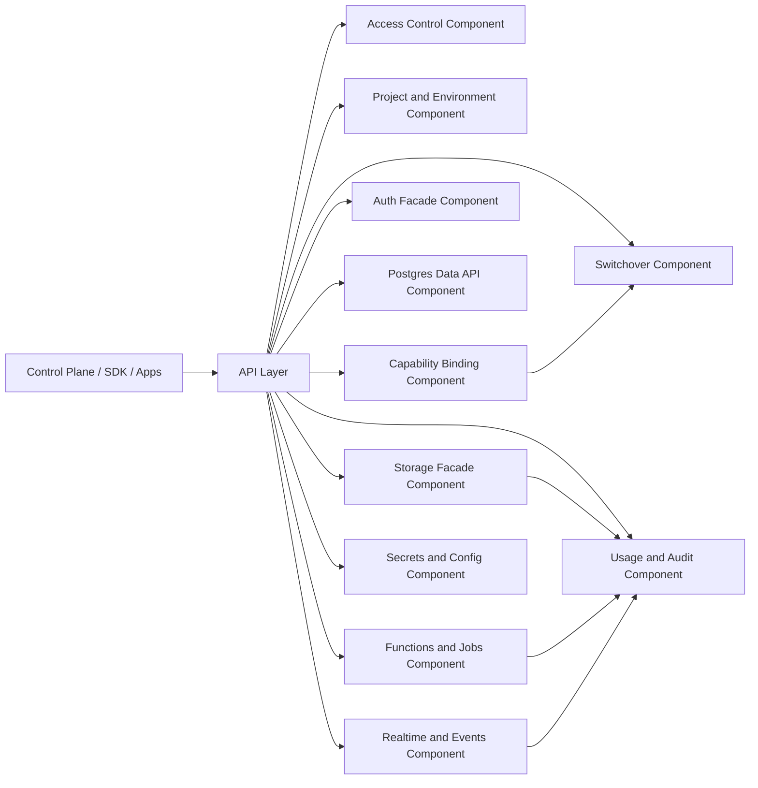

# Component Diagram - Backend as a Service Platform

## Component Responsibilities

| Component | Responsibility |
|-----------|----------------|
| Access Control | Tenant, project, environment, and role scoping |
| Project and Environment | Provisioning and lifecycle state |
| Capability Binding | Provider selection and compatibility checks |
| Auth Facade | Identity and session abstraction |
| Postgres Data API | Schema-aware CRUD and policy mediation |
| Storage Facade | Files, buckets, metadata, signed access |
| Functions and Jobs | Deployments, schedules, executions |
| Realtime and Events | Channels, subscriptions, fanout, webhooks |
| Secrets and Config | Secret references, provider config, rotations |
| Switchover | Migration plans, cutover, rollback |
| Usage and Audit | Metering, operational visibility, immutable history |

## Component Flow Enhancements

| Component | Input contract | Output contract |
|---|---|---|
| Contract Gateway | HTTP + headers | Canonical command object |
| Policy Engine | command + claims | allow/deny with reason code |
| Adapter Driver | command + binding config | provider response/error |
| State Store | operation updates | lifecycle snapshots |
| Telemetry Sink | result metadata | SLI datapoints + alerts |
