# ERD & Database Schema — Backend as a Service Platform

## Table of Contents
1. [Entity-Relationship Diagram](#1-entity-relationship-diagram)
2. [SQL Table Definitions](#2-sql-table-definitions)
3. [Indexing Strategy](#3-indexing-strategy)
4. [Row-Level Security Policies](#4-row-level-security-policies)
5. [Partition Strategy](#5-partition-strategy)
6. [Data Retention Policy](#6-data-retention-policy)

---

## 1. Entity-Relationship Diagram

```mermaid
erDiagram
    tenants {
        uuid   id PK
        string slug
        string name
        string plan_tier
        timestamptz created_at
    }
    projects {
        uuid   id PK
        uuid   tenant_id FK
        string slug
        string name
        string status
        timestamptz created_at
    }
    environments {
        uuid   id PK
        uuid   project_id FK
        string slug
        string type
        jsonb  config
    }
    capability_types {
        uuid   id PK
        string slug
        string name
        jsonb  required_config_schema
    }
    provider_catalog_entries {
        uuid   id PK
        uuid   capability_type_id FK
        string provider_key
        string display_name
        string version
        jsonb  config_schema
        boolean certified
    }
    capability_bindings {
        uuid   id PK
        uuid   environment_id FK
        uuid   capability_type_id FK
        uuid   provider_catalog_entry_id FK
        string status
        int    version
        jsonb  config_snapshot
        timestamptz activated_at
    }
    switchover_plans {
        uuid   id PK
        uuid   binding_id FK
        uuid   target_provider_id FK
        string status
        string strategy
        jsonb  target_config
        timestamptz created_at
    }
    switchover_checkpoints {
        uuid   id PK
        uuid   plan_id FK
        string phase
        string status
        jsonb  result
        timestamptz recorded_at
    }
    secret_refs {
        uuid   id PK
        uuid   project_id FK
        string name
        string provider
        string external_ref
        timestamptz last_rotated_at
    }
    auth_users {
        uuid   id PK
        uuid   project_id FK
        string email
        string password_hash
        string status
        jsonb  metadata
        timestamptz created_at
    }
    auth_providers {
        uuid   id PK
        uuid   project_id FK
        string provider_type
        jsonb  config
        boolean enabled
    }
    session_records {
        uuid   id PK
        uuid   user_id FK
        string access_token_hash
        string refresh_token_hash
        string ip_address
        timestamptz expires_at
        timestamptz created_at
    }
    mfa_configs {
        uuid   id PK
        uuid   user_id FK
        string method
        string secret_encrypted
        boolean active
    }
    data_namespaces {
        uuid   id PK
        uuid   environment_id FK
        string name
        string pg_schema
        timestamptz created_at
    }
    table_definitions {
        uuid   id PK
        uuid   namespace_id FK
        string table_name
        jsonb  column_definitions
        string status
        timestamptz created_at
    }
    schema_migrations {
        uuid   id PK
        uuid   namespace_id FK
        string name
        text   up_sql
        text   down_sql
        string status
        int    ordinal
        timestamptz applied_at
    }
    buckets {
        uuid   id PK
        uuid   environment_id FK
        string name
        bigint max_size_bytes
        int    max_file_size_bytes
        jsonb  allowed_mime_types
        string visibility
        timestamptz created_at
    }
    file_objects {
        uuid   id PK
        uuid   bucket_id FK
        string file_path
        bigint size_bytes
        string mime_type
        string storage_key
        string checksum_sha256
        timestamptz created_at
    }
    signed_access_grants {
        uuid   id PK
        uuid   file_id FK
        string operation
        string token_hash
        inet   allowed_cidr
        timestamptz expires_at
        boolean used
    }
    function_definitions {
        uuid   id PK
        uuid   environment_id FK
        string name
        string runtime
        string status
        int    timeout_seconds
        int    memory_mb
        jsonb  env_vars
        timestamptz created_at
    }
    deployment_artifacts {
        uuid   id PK
        uuid   function_id FK
        string version_tag
        string artifact_url
        string scan_status
        string status
        timestamptz deployed_at
    }
    execution_records {
        uuid   id PK
        uuid   function_id FK
        uuid   deployment_id FK
        string trigger_type
        jsonb  input_payload
        jsonb  output_payload
        string status
        int    duration_ms
        timestamptz started_at
        timestamptz completed_at
    }
    function_schedules {
        uuid   id PK
        uuid   function_id FK
        string cron_expression
        boolean enabled
        timestamptz next_run_at
        timestamptz last_run_at
    }
    event_channels {
        uuid   id PK
        uuid   environment_id FK
        string name
        string type
        boolean persistent
        int    retention_hours
        timestamptz created_at
    }
    subscriptions {
        uuid   id PK
        uuid   channel_id FK
        string subscriber_type
        string endpoint
        string status
        jsonb  filter_expression
        timestamptz created_at
    }
    delivery_records {
        uuid   id PK
        uuid   subscription_id FK
        string event_type
        jsonb  payload
        string status
        int    attempt_count
        timestamptz last_attempted_at
    }
    usage_meters {
        uuid        id PK
        uuid        project_id FK
        string      metric_name
        bigint      value
        string      unit
        timestamptz window_start
        timestamptz window_end
    }
    audit_logs {
        uuid        id PK
        uuid        tenant_id FK
        uuid        project_id FK
        uuid        actor_id
        string      actor_type
        string      action
        string      resource_type
        uuid        resource_id
        jsonb       before_state
        jsonb       after_state
        string      ip_address
        string      request_id
        timestamptz occurred_at
    }
    api_contract_releases {
        uuid   id PK
        string version
        string status
        date   deprecated_at
        date   sunset_at
        text   changelog
    }
    slo_policies {
        uuid   id PK
        uuid   binding_id FK
        string metric_name
        float  target_ratio
        int    window_days
        float  error_budget_minutes
    }
    sli_window_aggregates {
        uuid        id PK
        uuid        slo_policy_id FK
        float       good_count
        float       total_count
        float       burn_rate
        timestamptz window_start
        timestamptz window_end
    }
    error_occurrences {
        uuid        id PK
        uuid        slo_policy_id FK
        string      error_code
        string      details
        timestamptz occurred_at
    }

    tenants          ||--o{ projects                : "owns"
    projects         ||--o{ environments             : "has"
    environments     ||--o{ capability_bindings      : "configures"
    capability_types ||--o{ provider_catalog_entries : "has"
    capability_types ||--o{ capability_bindings      : "typed by"
    provider_catalog_entries ||--o{ capability_bindings : "implements"
    capability_bindings      ||--o{ switchover_plans    : "migrates via"
    switchover_plans         ||--o{ switchover_checkpoints : "records"
    projects         ||--o{ secret_refs              : "stores"
    projects         ||--o{ auth_users               : "has"
    projects         ||--o{ auth_providers           : "configures"
    auth_users       ||--o{ session_records          : "owns"
    auth_users       ||--o| mfa_configs              : "has"
    environments     ||--o{ data_namespaces          : "contains"
    data_namespaces  ||--o{ table_definitions        : "defines"
    data_namespaces  ||--o{ schema_migrations        : "tracks"
    environments     ||--o{ buckets                  : "contains"
    buckets          ||--o{ file_objects             : "stores"
    file_objects     ||--o{ signed_access_grants     : "grants"
    environments     ||--o{ function_definitions     : "hosts"
    function_definitions ||--o{ deployment_artifacts  : "deploys"
    function_definitions ||--o{ execution_records     : "runs"
    function_definitions ||--o{ function_schedules    : "scheduled by"
    deployment_artifacts ||--o{ execution_records    : "executes"
    environments     ||--o{ event_channels           : "has"
    event_channels   ||--o{ subscriptions            : "subscribed by"
    subscriptions    ||--o{ delivery_records         : "delivers via"
    projects         ||--o{ usage_meters             : "tracked by"
    tenants          ||--o{ audit_logs               : "recorded in"
    capability_bindings ||--o{ slo_policies          : "governed by"
    slo_policies     ||--o{ sli_window_aggregates    : "aggregates"
    slo_policies     ||--o{ error_occurrences        : "records"
```



---

## 2. SQL Table Definitions

```sql
-- ============================================================
-- EXTENSION & SCHEMA SETUP
-- ============================================================
CREATE EXTENSION IF NOT EXISTS "pgcrypto";
CREATE EXTENSION IF NOT EXISTS "pg_trgm";
CREATE SCHEMA IF NOT EXISTS baas;
SET search_path TO baas, public;

-- ============================================================
-- TENANTS
-- ============================================================
CREATE TABLE tenants (
    id           UUID        PRIMARY KEY DEFAULT gen_random_uuid(),
    slug         TEXT        NOT NULL UNIQUE,
    name         TEXT        NOT NULL,
    plan_tier    TEXT        NOT NULL DEFAULT 'free' CHECK (plan_tier IN ('free','starter','pro','enterprise')),
    metadata     JSONB       NOT NULL DEFAULT '{}',
    created_at   TIMESTAMPTZ NOT NULL DEFAULT NOW(),
    updated_at   TIMESTAMPTZ NOT NULL DEFAULT NOW(),
    deleted_at   TIMESTAMPTZ
);

-- ============================================================
-- PROJECTS
-- ============================================================
CREATE TABLE projects (
    id           UUID        PRIMARY KEY DEFAULT gen_random_uuid(),
    tenant_id    UUID        NOT NULL REFERENCES tenants(id) ON DELETE RESTRICT,
    slug         TEXT        NOT NULL,
    name         TEXT        NOT NULL,
    status       TEXT        NOT NULL DEFAULT 'active' CHECK (status IN ('active','suspended','deleted')),
    metadata     JSONB       NOT NULL DEFAULT '{}',
    created_at   TIMESTAMPTZ NOT NULL DEFAULT NOW(),
    updated_at   TIMESTAMPTZ NOT NULL DEFAULT NOW(),
    UNIQUE (tenant_id, slug)
);

-- ============================================================
-- ENVIRONMENTS
-- ============================================================
CREATE TABLE environments (
    id           UUID        PRIMARY KEY DEFAULT gen_random_uuid(),
    project_id   UUID        NOT NULL REFERENCES projects(id) ON DELETE CASCADE,
    slug         TEXT        NOT NULL,
    type         TEXT        NOT NULL CHECK (type IN ('development','staging','production')),
    config       JSONB       NOT NULL DEFAULT '{}',
    created_at   TIMESTAMPTZ NOT NULL DEFAULT NOW(),
    updated_at   TIMESTAMPTZ NOT NULL DEFAULT NOW(),
    UNIQUE (project_id, slug)
);

-- ============================================================
-- CAPABILITY TYPES
-- ============================================================
CREATE TABLE capability_types (
    id                      UUID  PRIMARY KEY DEFAULT gen_random_uuid(),
    slug                    TEXT  NOT NULL UNIQUE,
    name                    TEXT  NOT NULL,
    description             TEXT,
    required_config_schema  JSONB NOT NULL DEFAULT '{}',
    created_at              TIMESTAMPTZ NOT NULL DEFAULT NOW()
);

-- ============================================================
-- PROVIDER CATALOG ENTRIES
-- ============================================================
CREATE TABLE provider_catalog_entries (
    id                   UUID    PRIMARY KEY DEFAULT gen_random_uuid(),
    capability_type_id   UUID    NOT NULL REFERENCES capability_types(id),
    provider_key         TEXT    NOT NULL UNIQUE,
    display_name         TEXT    NOT NULL,
    version              TEXT    NOT NULL,
    config_schema        JSONB   NOT NULL DEFAULT '{}',
    health_check_config  JSONB   NOT NULL DEFAULT '{}',
    certified            BOOLEAN NOT NULL DEFAULT FALSE,
    deprecated           BOOLEAN NOT NULL DEFAULT FALSE,
    created_at           TIMESTAMPTZ NOT NULL DEFAULT NOW(),
    updated_at           TIMESTAMPTZ NOT NULL DEFAULT NOW()
);

-- ============================================================
-- CAPABILITY BINDINGS
-- ============================================================
CREATE TABLE capability_bindings (
    id                        UUID  PRIMARY KEY DEFAULT gen_random_uuid(),
    environment_id            UUID  NOT NULL REFERENCES environments(id) ON DELETE RESTRICT,
    capability_type_id        UUID  NOT NULL REFERENCES capability_types(id),
    provider_catalog_entry_id UUID  NOT NULL REFERENCES provider_catalog_entries(id),
    display_name              TEXT  NOT NULL,
    status                    TEXT  NOT NULL DEFAULT 'draft'
        CHECK (status IN ('draft','validating','active','switching','failed','deprecated')),
    version                   INT   NOT NULL DEFAULT 1,
    config_snapshot           JSONB NOT NULL DEFAULT '{}',
    previous_provider_id      UUID  REFERENCES provider_catalog_entries(id),
    activated_at              TIMESTAMPTZ,
    created_at                TIMESTAMPTZ NOT NULL DEFAULT NOW(),
    updated_at                TIMESTAMPTZ NOT NULL DEFAULT NOW(),
    UNIQUE (environment_id, capability_type_id)
);

-- ============================================================
-- SWITCHOVER PLANS
-- ============================================================
CREATE TABLE switchover_plans (
    id                  UUID  PRIMARY KEY DEFAULT gen_random_uuid(),
    binding_id          UUID  NOT NULL REFERENCES capability_bindings(id),
    target_provider_id  UUID  NOT NULL REFERENCES provider_catalog_entries(id),
    status              TEXT  NOT NULL DEFAULT 'planned'
        CHECK (status IN ('planned','dry-run','preparing','applying','verifying','completed','rolled-back')),
    strategy            TEXT  NOT NULL DEFAULT 'blue_green'
        CHECK (strategy IN ('blue_green','canary','in_place')),
    target_config       JSONB NOT NULL DEFAULT '{}',
    dry_run_result      JSONB,
    notes               TEXT,
    initiated_by        UUID,
    created_at          TIMESTAMPTZ NOT NULL DEFAULT NOW(),
    updated_at          TIMESTAMPTZ NOT NULL DEFAULT NOW()
);

-- ============================================================
-- SWITCHOVER CHECKPOINTS
-- ============================================================
CREATE TABLE switchover_checkpoints (
    id           UUID  PRIMARY KEY DEFAULT gen_random_uuid(),
    plan_id      UUID  NOT NULL REFERENCES switchover_plans(id) ON DELETE CASCADE,
    phase        TEXT  NOT NULL,
    status       TEXT  NOT NULL CHECK (status IN ('pending','running','passed','failed','skipped')),
    result       JSONB NOT NULL DEFAULT '{}',
    error_detail TEXT,
    recorded_at  TIMESTAMPTZ NOT NULL DEFAULT NOW()
);

-- ============================================================
-- SECRET REFS
-- ============================================================
CREATE TABLE secret_refs (
    id               UUID  PRIMARY KEY DEFAULT gen_random_uuid(),
    project_id       UUID  NOT NULL REFERENCES projects(id) ON DELETE CASCADE,
    environment_id   UUID  REFERENCES environments(id),
    name             TEXT  NOT NULL,
    provider         TEXT  NOT NULL DEFAULT 'aws_secrets_manager'
        CHECK (provider IN ('aws_secrets_manager','hashicorp_vault','gcp_secret_manager','azure_keyvault')),
    external_ref     TEXT  NOT NULL,
    description      TEXT,
    last_rotated_at  TIMESTAMPTZ,
    created_at       TIMESTAMPTZ NOT NULL DEFAULT NOW(),
    UNIQUE (project_id, name)
);

-- ============================================================
-- AUTH USERS
-- ============================================================
CREATE TABLE auth_users (
    id              UUID  PRIMARY KEY DEFAULT gen_random_uuid(),
    project_id      UUID  NOT NULL REFERENCES projects(id) ON DELETE CASCADE,
    email           TEXT  NOT NULL,
    email_verified  BOOLEAN NOT NULL DEFAULT FALSE,
    password_hash   TEXT,
    name            TEXT,
    avatar_url      TEXT,
    status          TEXT  NOT NULL DEFAULT 'pending'
        CHECK (status IN ('pending','active','suspended','deleted')),
    metadata        JSONB NOT NULL DEFAULT '{}',
    created_at      TIMESTAMPTZ NOT NULL DEFAULT NOW(),
    updated_at      TIMESTAMPTZ NOT NULL DEFAULT NOW(),
    UNIQUE (project_id, email)
);

-- ============================================================
-- AUTH PROVIDERS (OAuth configurations)
-- ============================================================
CREATE TABLE auth_providers (
    id            UUID    PRIMARY KEY DEFAULT gen_random_uuid(),
    project_id    UUID    NOT NULL REFERENCES projects(id) ON DELETE CASCADE,
    provider_type TEXT    NOT NULL CHECK (provider_type IN ('github','google','apple','microsoft','custom_oidc')),
    client_id     TEXT    NOT NULL,
    client_secret_ref TEXT NOT NULL,
    scopes        TEXT[]  NOT NULL DEFAULT '{}',
    config        JSONB   NOT NULL DEFAULT '{}',
    enabled       BOOLEAN NOT NULL DEFAULT TRUE,
    created_at    TIMESTAMPTZ NOT NULL DEFAULT NOW(),
    UNIQUE (project_id, provider_type)
);

-- ============================================================
-- SESSION RECORDS
-- ============================================================
CREATE TABLE session_records (
    id                  UUID  PRIMARY KEY DEFAULT gen_random_uuid(),
    user_id             UUID  NOT NULL REFERENCES auth_users(id) ON DELETE CASCADE,
    access_token_hash   TEXT  NOT NULL,
    refresh_token_hash  TEXT  NOT NULL,
    ip_address          INET,
    user_agent          TEXT,
    mfa_verified        BOOLEAN NOT NULL DEFAULT FALSE,
    expires_at          TIMESTAMPTZ NOT NULL,
    revoked_at          TIMESTAMPTZ,
    created_at          TIMESTAMPTZ NOT NULL DEFAULT NOW()
) PARTITION BY RANGE (created_at);

CREATE TABLE session_records_y2025 PARTITION OF session_records
    FOR VALUES FROM ('2025-01-01') TO ('2026-01-01');

-- ============================================================
-- MFA CONFIGS
-- ============================================================
CREATE TABLE mfa_configs (
    id               UUID    PRIMARY KEY DEFAULT gen_random_uuid(),
    user_id          UUID    NOT NULL REFERENCES auth_users(id) ON DELETE CASCADE UNIQUE,
    method           TEXT    NOT NULL CHECK (method IN ('totp','sms','email')),
    secret_encrypted BYTEA   NOT NULL,
    backup_codes     TEXT[], 
    active           BOOLEAN NOT NULL DEFAULT FALSE,
    enrolled_at      TIMESTAMPTZ,
    created_at       TIMESTAMPTZ NOT NULL DEFAULT NOW()
);

-- ============================================================
-- DATA NAMESPACES
-- ============================================================
CREATE TABLE data_namespaces (
    id             UUID  PRIMARY KEY DEFAULT gen_random_uuid(),
    environment_id UUID  NOT NULL REFERENCES environments(id) ON DELETE RESTRICT,
    name           TEXT  NOT NULL,
    pg_schema      TEXT  NOT NULL UNIQUE,
    description    TEXT,
    created_at     TIMESTAMPTZ NOT NULL DEFAULT NOW(),
    UNIQUE (environment_id, name)
);

-- ============================================================
-- TABLE DEFINITIONS
-- ============================================================
CREATE TABLE table_definitions (
    id                  UUID  PRIMARY KEY DEFAULT gen_random_uuid(),
    namespace_id        UUID  NOT NULL REFERENCES data_namespaces(id) ON DELETE CASCADE,
    table_name          TEXT  NOT NULL,
    column_definitions  JSONB NOT NULL DEFAULT '[]',
    rls_enabled         BOOLEAN NOT NULL DEFAULT FALSE,
    status              TEXT  NOT NULL DEFAULT 'active' CHECK (status IN ('active','deprecated','dropped')),
    created_at          TIMESTAMPTZ NOT NULL DEFAULT NOW(),
    updated_at          TIMESTAMPTZ NOT NULL DEFAULT NOW(),
    UNIQUE (namespace_id, table_name)
);

-- ============================================================
-- SCHEMA MIGRATIONS
-- ============================================================
CREATE TABLE schema_migrations (
    id           UUID  PRIMARY KEY DEFAULT gen_random_uuid(),
    namespace_id UUID  NOT NULL REFERENCES data_namespaces(id) ON DELETE RESTRICT,
    name         TEXT  NOT NULL,
    up_sql       TEXT  NOT NULL,
    down_sql     TEXT,
    status       TEXT  NOT NULL DEFAULT 'planned'
        CHECK (status IN ('planned','dry-run','applying','verified','failed','completed','rolled-back')),
    ordinal      INT   NOT NULL,
    applied_by   UUID,
    dry_run_log  TEXT,
    error_detail TEXT,
    applied_at   TIMESTAMPTZ,
    created_at   TIMESTAMPTZ NOT NULL DEFAULT NOW(),
    UNIQUE (namespace_id, ordinal)
);

-- ============================================================
-- BUCKETS
-- ============================================================
CREATE TABLE buckets (
    id                   UUID    PRIMARY KEY DEFAULT gen_random_uuid(),
    environment_id       UUID    NOT NULL REFERENCES environments(id) ON DELETE RESTRICT,
    name                 TEXT    NOT NULL,
    max_size_bytes       BIGINT  NOT NULL DEFAULT 10737418240,
    max_file_size_bytes  INT     NOT NULL DEFAULT 52428800,
    allowed_mime_types   TEXT[]  NOT NULL DEFAULT '{}',
    visibility           TEXT    NOT NULL DEFAULT 'private' CHECK (visibility IN ('public','private')),
    versioning_enabled   BOOLEAN NOT NULL DEFAULT FALSE,
    created_at           TIMESTAMPTZ NOT NULL DEFAULT NOW(),
    updated_at           TIMESTAMPTZ NOT NULL DEFAULT NOW(),
    UNIQUE (environment_id, name)
);

-- ============================================================
-- FILE OBJECTS
-- ============================================================
CREATE TABLE file_objects (
    id              UUID    PRIMARY KEY DEFAULT gen_random_uuid(),
    bucket_id       UUID    NOT NULL REFERENCES buckets(id) ON DELETE CASCADE,
    file_path       TEXT    NOT NULL,
    size_bytes      BIGINT  NOT NULL,
    mime_type       TEXT    NOT NULL,
    storage_key     TEXT    NOT NULL,
    checksum_sha256 TEXT    NOT NULL,
    metadata        JSONB   NOT NULL DEFAULT '{}',
    deleted_at      TIMESTAMPTZ,
    created_at      TIMESTAMPTZ NOT NULL DEFAULT NOW(),
    UNIQUE (bucket_id, file_path)
);

-- ============================================================
-- SIGNED ACCESS GRANTS
-- ============================================================
CREATE TABLE signed_access_grants (
    id           UUID    PRIMARY KEY DEFAULT gen_random_uuid(),
    file_id      UUID    NOT NULL REFERENCES file_objects(id) ON DELETE CASCADE,
    operation    TEXT    NOT NULL CHECK (operation IN ('download','upload','delete')),
    token_hash   TEXT    NOT NULL UNIQUE,
    allowed_cidr CIDR,
    expires_at   TIMESTAMPTZ NOT NULL,
    used         BOOLEAN NOT NULL DEFAULT FALSE,
    used_at      TIMESTAMPTZ,
    created_by   UUID,
    created_at   TIMESTAMPTZ NOT NULL DEFAULT NOW()
);

-- ============================================================
-- FUNCTION DEFINITIONS
-- ============================================================
CREATE TABLE function_definitions (
    id              UUID  PRIMARY KEY DEFAULT gen_random_uuid(),
    environment_id  UUID  NOT NULL REFERENCES environments(id) ON DELETE RESTRICT,
    name            TEXT  NOT NULL,
    description     TEXT,
    runtime         TEXT  NOT NULL CHECK (runtime IN ('nodejs20','python312','go122','ruby33','java21')),
    handler         TEXT  NOT NULL,
    status          TEXT  NOT NULL DEFAULT 'draft'
        CHECK (status IN ('draft','uploaded','scanning','ready','scan-failed','deploying','active','deprecated','archived')),
    timeout_seconds INT   NOT NULL DEFAULT 30,
    memory_mb       INT   NOT NULL DEFAULT 128,
    env_vars        JSONB NOT NULL DEFAULT '{}',
    created_at      TIMESTAMPTZ NOT NULL DEFAULT NOW(),
    updated_at      TIMESTAMPTZ NOT NULL DEFAULT NOW(),
    UNIQUE (environment_id, name)
);

-- ============================================================
-- DEPLOYMENT ARTIFACTS
-- ============================================================
CREATE TABLE deployment_artifacts (
    id            UUID  PRIMARY KEY DEFAULT gen_random_uuid(),
    function_id   UUID  NOT NULL REFERENCES function_definitions(id) ON DELETE CASCADE,
    version_tag   TEXT  NOT NULL,
    artifact_url  TEXT  NOT NULL,
    artifact_hash TEXT  NOT NULL,
    scan_status   TEXT  NOT NULL DEFAULT 'pending'
        CHECK (scan_status IN ('pending','scanning','passed','failed')),
    scan_report   JSONB,
    status        TEXT  NOT NULL DEFAULT 'pending'
        CHECK (status IN ('pending','active','retired','failed')),
    deployed_at   TIMESTAMPTZ,
    created_at    TIMESTAMPTZ NOT NULL DEFAULT NOW(),
    UNIQUE (function_id, version_tag)
);

-- ============================================================
-- EXECUTION RECORDS  (partitioned by month)
-- ============================================================
CREATE TABLE execution_records (
    id              UUID  NOT NULL DEFAULT gen_random_uuid(),
    function_id     UUID  NOT NULL REFERENCES function_definitions(id),
    deployment_id   UUID  NOT NULL REFERENCES deployment_artifacts(id),
    trigger_type    TEXT  NOT NULL CHECK (trigger_type IN ('http','schedule','event','manual')),
    trigger_ref     TEXT,
    input_payload   JSONB,
    output_payload  JSONB,
    status          TEXT  NOT NULL DEFAULT 'queued'
        CHECK (status IN ('queued','dispatched','running','completed','failed','timed-out','archived')),
    duration_ms     INT,
    log_url         TEXT,
    error_detail    TEXT,
    started_at      TIMESTAMPTZ,
    completed_at    TIMESTAMPTZ,
    created_at      TIMESTAMPTZ NOT NULL DEFAULT NOW(),
    PRIMARY KEY (id, created_at)
) PARTITION BY RANGE (created_at);

CREATE TABLE execution_records_y2025m01 PARTITION OF execution_records
    FOR VALUES FROM ('2025-01-01') TO ('2025-02-01');
CREATE TABLE execution_records_y2025m02 PARTITION OF execution_records
    FOR VALUES FROM ('2025-02-01') TO ('2025-03-01');

-- ============================================================
-- FUNCTION SCHEDULES
-- ============================================================
CREATE TABLE function_schedules (
    id               UUID    PRIMARY KEY DEFAULT gen_random_uuid(),
    function_id      UUID    NOT NULL REFERENCES function_definitions(id) ON DELETE CASCADE,
    cron_expression  TEXT    NOT NULL,
    timezone         TEXT    NOT NULL DEFAULT 'UTC',
    enabled          BOOLEAN NOT NULL DEFAULT TRUE,
    payload          JSONB   NOT NULL DEFAULT '{}',
    next_run_at      TIMESTAMPTZ,
    last_run_at      TIMESTAMPTZ,
    created_at       TIMESTAMPTZ NOT NULL DEFAULT NOW()
);

-- ============================================================
-- EVENT CHANNELS
-- ============================================================
CREATE TABLE event_channels (
    id              UUID    PRIMARY KEY DEFAULT gen_random_uuid(),
    environment_id  UUID    NOT NULL REFERENCES environments(id) ON DELETE RESTRICT,
    name            TEXT    NOT NULL,
    type            TEXT    NOT NULL CHECK (type IN ('broadcast','queue','topic')),
    persistent      BOOLEAN NOT NULL DEFAULT FALSE,
    retention_hours INT     NOT NULL DEFAULT 24,
    created_at      TIMESTAMPTZ NOT NULL DEFAULT NOW(),
    UNIQUE (environment_id, name)
);

-- ============================================================
-- SUBSCRIPTIONS
-- ============================================================
CREATE TABLE subscriptions (
    id                UUID  PRIMARY KEY DEFAULT gen_random_uuid(),
    channel_id        UUID  NOT NULL REFERENCES event_channels(id) ON DELETE CASCADE,
    subscriber_type   TEXT  NOT NULL CHECK (subscriber_type IN ('webhook','websocket','function','queue')),
    endpoint          TEXT  NOT NULL,
    status            TEXT  NOT NULL DEFAULT 'active' CHECK (status IN ('active','paused','failed','cancelled')),
    filter_expression JSONB,
    retry_policy      JSONB NOT NULL DEFAULT '{"max_attempts":5,"backoff":"exponential"}',
    created_at        TIMESTAMPTZ NOT NULL DEFAULT NOW()
);

-- ============================================================
-- DELIVERY RECORDS  (partitioned by month)
-- ============================================================
CREATE TABLE delivery_records (
    id                UUID  NOT NULL DEFAULT gen_random_uuid(),
    subscription_id   UUID  NOT NULL REFERENCES subscriptions(id),
    event_type        TEXT  NOT NULL,
    payload           JSONB NOT NULL,
    status            TEXT  NOT NULL DEFAULT 'pending'
        CHECK (status IN ('pending','delivered','failed','dead-lettered')),
    attempt_count     INT   NOT NULL DEFAULT 0,
    last_attempted_at TIMESTAMPTZ,
    delivered_at      TIMESTAMPTZ,
    created_at        TIMESTAMPTZ NOT NULL DEFAULT NOW(),
    PRIMARY KEY (id, created_at)
) PARTITION BY RANGE (created_at);

-- ============================================================
-- USAGE METERS  (partitioned by month)
-- ============================================================
CREATE TABLE usage_meters (
    id           UUID        NOT NULL DEFAULT gen_random_uuid(),
    project_id   UUID        NOT NULL REFERENCES projects(id),
    metric_name  TEXT        NOT NULL,
    value        BIGINT      NOT NULL DEFAULT 0,
    unit         TEXT        NOT NULL,
    window_start TIMESTAMPTZ NOT NULL,
    window_end   TIMESTAMPTZ NOT NULL,
    PRIMARY KEY (id, window_start)
) PARTITION BY RANGE (window_start);

-- ============================================================
-- AUDIT LOGS  (partitioned by month)
-- ============================================================
CREATE TABLE audit_logs (
    id             UUID        NOT NULL DEFAULT gen_random_uuid(),
    tenant_id      UUID        NOT NULL REFERENCES tenants(id),
    project_id     UUID        REFERENCES projects(id),
    actor_id       UUID,
    actor_type     TEXT        NOT NULL CHECK (actor_type IN ('user','service_account','system')),
    action         TEXT        NOT NULL,
    resource_type  TEXT        NOT NULL,
    resource_id    UUID,
    before_state   JSONB,
    after_state    JSONB,
    ip_address     INET,
    request_id     TEXT,
    occurred_at    TIMESTAMPTZ NOT NULL DEFAULT NOW(),
    PRIMARY KEY (id, occurred_at)
) PARTITION BY RANGE (occurred_at);

CREATE TABLE audit_logs_y2025m01 PARTITION OF audit_logs
    FOR VALUES FROM ('2025-01-01') TO ('2025-02-01');

-- ============================================================
-- API CONTRACT RELEASES
-- ============================================================
CREATE TABLE api_contract_releases (
    id            UUID  PRIMARY KEY DEFAULT gen_random_uuid(),
    version       TEXT  NOT NULL UNIQUE,
    status        TEXT  NOT NULL DEFAULT 'active' CHECK (status IN ('active','deprecated','sunset')),
    deprecated_at DATE,
    sunset_at     DATE,
    changelog     TEXT,
    released_at   DATE  NOT NULL DEFAULT CURRENT_DATE
);

-- ============================================================
-- SLO POLICIES
-- ============================================================
CREATE TABLE slo_policies (
    id                   UUID   PRIMARY KEY DEFAULT gen_random_uuid(),
    binding_id           UUID   NOT NULL REFERENCES capability_bindings(id) ON DELETE CASCADE,
    metric_name          TEXT   NOT NULL,
    target_ratio         FLOAT  NOT NULL CHECK (target_ratio > 0 AND target_ratio <= 1),
    window_days          INT    NOT NULL DEFAULT 30,
    error_budget_minutes FLOAT  NOT NULL,
    created_at           TIMESTAMPTZ NOT NULL DEFAULT NOW()
);

-- ============================================================
-- SLI WINDOW AGGREGATES
-- ============================================================
CREATE TABLE sli_window_aggregates (
    id              UUID  PRIMARY KEY DEFAULT gen_random_uuid(),
    slo_policy_id   UUID  NOT NULL REFERENCES slo_policies(id) ON DELETE CASCADE,
    good_count      FLOAT NOT NULL DEFAULT 0,
    total_count     FLOAT NOT NULL DEFAULT 0,
    burn_rate       FLOAT NOT NULL DEFAULT 0,
    window_start    TIMESTAMPTZ NOT NULL,
    window_end      TIMESTAMPTZ NOT NULL
);

-- ============================================================
-- ERROR OCCURRENCES
-- ============================================================
CREATE TABLE error_occurrences (
    id              UUID  PRIMARY KEY DEFAULT gen_random_uuid(),
    slo_policy_id   UUID  NOT NULL REFERENCES slo_policies(id) ON DELETE CASCADE,
    error_code      TEXT  NOT NULL,
    details         TEXT,
    occurred_at     TIMESTAMPTZ NOT NULL DEFAULT NOW()
);
```

---

## 3. Indexing Strategy

| Table | Column(s) | Index Type | Rationale |
|-------|-----------|------------|-----------|
| `projects` | `tenant_id` | B-Tree | Most queries filter by tenant |
| `projects` | `status` | B-Tree partial (`WHERE status != 'deleted'`) | Exclude deleted rows efficiently |
| `capability_bindings` | `environment_id, capability_type_id` | Unique B-Tree | Enforce one binding per capability per env |
| `capability_bindings` | `status` | B-Tree | Health checks filter by status |
| `auth_users` | `project_id, email` | Unique B-Tree | Login lookups |
| `auth_users` | `status` | B-Tree partial (`WHERE status = 'active'`) | Active user queries |
| `session_records` | `user_id, expires_at` | B-Tree | Session validation lookups |
| `session_records` | `access_token_hash` | Hash | O(1) token lookup |
| `execution_records` | `function_id, created_at` | B-Tree | Function execution history |
| `execution_records` | `status, created_at` | B-Tree | Queue/dispatcher queries |
| `audit_logs` | `tenant_id, occurred_at` | B-Tree | Audit queries (always tenant-scoped) |
| `audit_logs` | `resource_type, resource_id` | B-Tree | Per-resource audit trail |
| `audit_logs` | `actor_id` | B-Tree | Actor-specific queries |
| `file_objects` | `bucket_id, file_path` | B-Tree | File lookup by path |
| `file_objects` | `checksum_sha256` | B-Tree | De-duplication checks |
| `delivery_records` | `subscription_id, status` | B-Tree | Retry processor queries |
| `usage_meters` | `project_id, metric_name, window_start` | B-Tree | Usage aggregation |
| `schema_migrations` | `namespace_id, ordinal` | Unique B-Tree | Migration ordering |
| `signed_access_grants` | `token_hash` | Hash | O(1) token validation |
| `signed_access_grants` | `expires_at` | B-Tree | Cleanup of expired grants |
| `switchover_plans` | `binding_id, status` | B-Tree | Active plan queries |

---

## 4. Row-Level Security Policies

```sql
-- Enable RLS on tenant-scoped tables
ALTER TABLE projects ENABLE ROW LEVEL SECURITY;
ALTER TABLE environments ENABLE ROW LEVEL SECURITY;
ALTER TABLE capability_bindings ENABLE ROW LEVEL SECURITY;
ALTER TABLE auth_users ENABLE ROW LEVEL SECURITY;
ALTER TABLE audit_logs ENABLE ROW LEVEL SECURITY;
ALTER TABLE file_objects ENABLE ROW LEVEL SECURITY;

-- Projects: tenants can only see their own projects
CREATE POLICY projects_tenant_isolation ON projects
    USING (tenant_id = current_setting('app.current_tenant_id')::UUID);

-- Environments: inherit project isolation
CREATE POLICY environments_project_isolation ON environments
    USING (project_id IN (
        SELECT id FROM projects
        WHERE tenant_id = current_setting('app.current_tenant_id')::UUID
    ));

-- Auth users: project-scoped
CREATE POLICY auth_users_project_isolation ON auth_users
    USING (project_id = current_setting('app.current_project_id')::UUID);

-- Auth users: users can only see/update their own record
CREATE POLICY auth_users_self_access ON auth_users
    USING (id = current_setting('app.current_user_id')::UUID);

-- Audit logs: tenant-scoped, auditors see all, admins see own project
CREATE POLICY audit_logs_tenant_isolation ON audit_logs
    USING (
        tenant_id = current_setting('app.current_tenant_id')::UUID
        AND (
            current_setting('app.current_role') = 'tenant_auditor'
            OR project_id = current_setting('app.current_project_id')::UUID
        )
    );

-- File objects: accessible only within the correct environment's buckets
CREATE POLICY file_objects_env_isolation ON file_objects
    USING (bucket_id IN (
        SELECT b.id FROM buckets b
        JOIN environments e ON b.environment_id = e.id
        WHERE e.project_id = current_setting('app.current_project_id')::UUID
    ));
```

---

## 5. Partition Strategy

| Table | Partition Key | Strategy | Retention |
|-------|---------------|----------|-----------|
| `audit_logs` | `occurred_at` | Range by month | 13 months (sliding) |
| `execution_records` | `created_at` | Range by month | 6 months hot, archive to cold storage |
| `delivery_records` | `created_at` | Range by month | 3 months |
| `usage_meters` | `window_start` | Range by month | 25 months (billing lookback) |
| `session_records` | `created_at` | Range by year | Auto-expire by `expires_at` |

New partitions are created automatically by a scheduled `pg_cron` job 7 days before month-end. Old partitions are detached (not dropped) and archived to a read-replica.

---

## 6. Data Retention Policy

| Table | Retention Period | Mechanism | Notes |
|-------|-----------------|-----------|-------|
| `audit_logs` | 13 months | Partition detach + archive | Regulatory compliance minimum |
| `execution_records` | 6 months active | Partition detach | Long-term: cold store (S3/GCS) |
| `session_records` | Expire by `expires_at` | Nightly cleanup job | Revoked sessions purged immediately |
| `signed_access_grants` | 30 days after expiry | Nightly cleanup | Used grants purged after 7 days |
| `delivery_records` | 90 days | Partition detach | Dead-lettered kept 30 extra days |
| `usage_meters` | 25 months | Partition detach | Billing lookback requirement |
| `auth_users` (deleted) | 30 days soft-delete | Nightly purge | GDPR right-to-erasure |
| `file_objects` (deleted) | 7 days soft-delete | Nightly purge | Recoverability window |
| `switchover_plans` | Indefinite | No auto-delete | Audit trail for compliance |
| `schema_migrations` | Indefinite | No auto-delete | Full migration history required |
