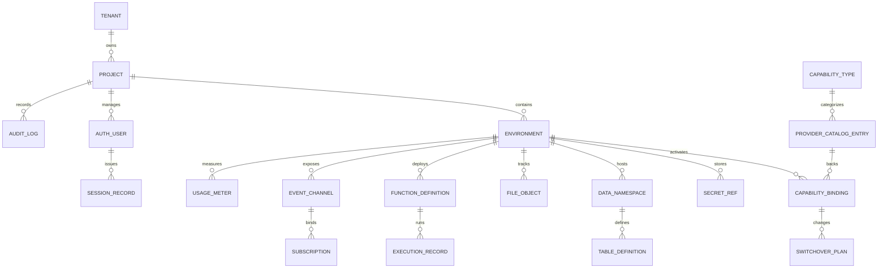

# ERD and Database Schema - Backend as a Service Platform

## Table Notes

| Table | Notes |
|-------|-------|
| tenants | Customer boundary and plan context |
| projects | Logical app workspaces |
| environments | Dev/staging/prod or tenant-defined stages |
| capability_bindings | Active capability-to-provider relationships |
| provider_catalog_entries | Certified adapter versions and provider metadata |
| switchover_plans | Provider migration orchestration records |
| secret_refs | Secret references, not raw secret material |
| auth_users | Auth facade user identities |
| session_records | Session lifecycle and token state |
| data_namespaces | Schema-scoped data API metadata |
| table_definitions | Table metadata and policy configuration |
| file_objects | Provider-independent storage metadata |
| function_definitions | Deployed function or job descriptors |
| execution_records | Invocation history |
| event_channels | Realtime or messaging namespaces |
| subscriptions | Webhook, event, or channel subscribers |
| usage_meters | Usage measurements by capability |
| audit_logs | Immutable operational history |
