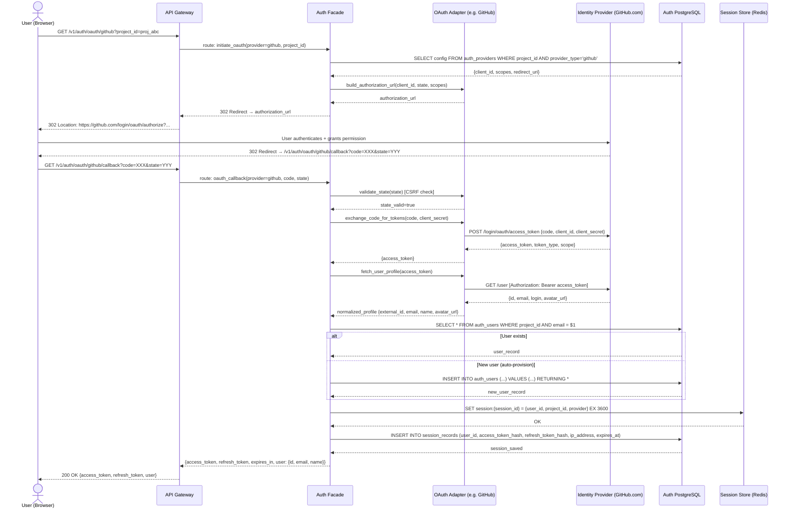

# Sequence Diagrams — Backend as a Service Platform

## Table of Contents
1. [User Login via OAuth Provider](#1-user-login-via-oauth-provider)
2. [Postgres Data Query with RLS](#2-postgres-data-query-with-rls)
3. [File Upload with Signed URL](#3-file-upload-with-signed-url)
4. [Function Invocation: Synchronous](#4-function-invocation-synchronous)
5. [Realtime Message Publish and Fan-out](#5-realtime-message-publish-and-fan-out)
6. [Provider Switchover: Dry Run Phase](#6-provider-switchover-dry-run-phase)

---

## 1. User Login via OAuth Provider



---

## 2. Postgres Data Query with RLS

```mermaid
sequenceDiagram
    actor Dev  as Developer (Client App)
    participant GW   as API Gateway
    participant DAS  as Data API Service
    participant RLS  as RLS Policy Manager
    participant PG   as PostgreSQL (app schema)

    Dev->>GW: GET /v1/db/namespaces/app/tables/orders/rows?filter=status eq "pending"
    Note over GW: Validate JWT; extract project_id, user_id, roles

    GW->>DAS: query_rows(namespace=app, table=orders, filter, project_id, user_id, roles)

    DAS->>RLS: get_active_policies(namespace=app, table=orders, roles)
    RLS-->>DAS: [{policy: "user_owns_order", sql: "user_id = $current_user"}]

    DAS->>PG: SET LOCAL app.current_tenant_id = 'tenant_xyz'
    DAS->>PG: SET LOCAL app.current_project_id = 'proj_abc'
    DAS->>PG: SET LOCAL app.current_user_id = 'usr_123'
    DAS->>PG: SET LOCAL app.current_role = 'db_reader'

    DAS->>PG: BEGIN
    DAS->>PG: SELECT * FROM app.orders WHERE status = $1 LIMIT $2 OFFSET $3
    Note over PG: PostgreSQL evaluates RLS policies automatically
    Note over PG: Only rows where user_id = current_user_id are returned

    alt Query succeeds
        PG-->>DAS: [{id, user_id, status, total_cents, ...}, ...]
        DAS->>PG: COMMIT
        DAS-->>GW: {rows: [...], pagination: {next_cursor, total}}
        GW-->>Dev: 200 OK {data: [...], pagination: {...}}
    else RLS blocks all rows
        PG-->>DAS: [] (empty result set)
        DAS->>PG: COMMIT
        DAS-->>GW: {rows: [], pagination: {total: 0}}
        GW-->>Dev: 200 OK {data: [], pagination: {total: 0}}
    else SQL error / timeout
        PG-->>DAS: ERROR: query timeout
        DAS->>PG: ROLLBACK
        DAS-->>GW: 422 DB_QUERY_ERROR
        GW-->>Dev: 422 {error: {code: "DB_QUERY_ERROR", message: "..."}}
    end
```

---

## 3. File Upload with Signed URL

```mermaid
sequenceDiagram
    actor Dev   as Developer (Client)
    participant GW    as API Gateway
    participant SF    as Storage Facade
    participant PGMD  as PostgreSQL (metadata)
    participant PA    as Provider Adapter (S3)
    participant S3    as AWS S3

    Dev->>GW: POST /v1/storage/buckets/bkt_9xzq01/files\nContent-Type: multipart/form-data
    Note over GW: Validate JWT; extract project, env, roles

    GW->>SF: upload_file(bucket_id=bkt_9xzq01, file_name, mime_type, size, content)

    SF->>PGMD: SELECT * FROM buckets WHERE id = $1 AND environment_id = $2
    PGMD-->>SF: bucket_config {max_file_size, allowed_mime_types, visibility}

    alt File too large
        SF-->>GW: 413 STORAGE_OBJECT_TOO_LARGE
        GW-->>Dev: 413 {error: {code: "STORAGE_OBJECT_TOO_LARGE"}}
    else MIME type not allowed
        SF-->>GW: 422 VALIDATION_ENUM_MISMATCH
        GW-->>Dev: 422 {error: ...}
    else Validation passed
        SF->>SF: compute SHA-256 checksum of content
        SF->>PGMD: SELECT id FROM file_objects WHERE bucket_id=$1 AND checksum_sha256=$2
        Note over SF,PGMD: De-duplication check

        alt Duplicate file (same checksum)
            PGMD-->>SF: existing_file_id
            SF-->>GW: 200 OK (existing file metadata, no re-upload)
            GW-->>Dev: 200 OK {data: {file_id: existing_file_id, ...}}
        else New file
            SF->>PA: generate_upload_key(bucket_name, file_path, mime_type)
            PA-->>SF: storage_key (e.g., "proj_abc/env_prod/bkt_9xzq01/uuid/filename.jpg")

            SF->>PA: upload_object(storage_key, content, mime_type, server_side_encryption=AES256)
            PA->>S3: PUT s3://baas-prod/{storage_key}\nContent-Type: image/jpeg\nx-amz-server-side-encryption: AES256
            S3-->>PA: 200 OK {ETag}
            PA-->>SF: {etag, storage_key}

            SF->>PGMD: INSERT INTO file_objects (bucket_id, file_path, size_bytes, mime_type, storage_key, checksum_sha256) RETURNING *
            PGMD-->>SF: file_record {id, file_path, size_bytes, ...}

            SF->>PGMD: UPDATE usage_meters SET value = value + $size WHERE project_id = $1 AND metric_name = 'storage_bytes'

            SF-->>GW: {file_id, file_path, size_bytes, mime_type, created_at}
            GW-->>Dev: 201 Created {data: {file_id, ...}}
        end
    end
```

---

## 4. Function Invocation: Synchronous

```mermaid
sequenceDiagram
    actor Dev    as Developer (Client)
    participant GW    as API Gateway
    participant FF    as Functions Facade
    participant ExDB  as Execution DB (PostgreSQL)
    participant ED    as Execution Dispatcher
    participant PR    as Provider Runtime (Lambda/equivalent)
    participant LA    as Log Aggregator

    Dev->>GW: POST /v1/functions/fn_resize01/invoke\n{payload: {file_id, width, height}}
    Note over GW: Validate JWT; quota check

    GW->>FF: invoke_sync(function_id=fn_resize01, payload, caller_id)

    FF->>ExDB: SELECT fd.*, da.artifact_url FROM function_definitions fd\nJOIN deployment_artifacts da ON da.function_id = fd.id\nWHERE fd.id = $1 AND fd.status = 'active' AND da.status = 'active'
    ExDB-->>FF: {function_def, active_deployment}

    alt Function not active
        FF-->>GW: 404 NOT_FOUND_RESOURCE
        GW-->>Dev: 404 {error: {code: "NOT_FOUND_RESOURCE"}}
    else Function active
        FF->>ExDB: INSERT INTO execution_records (function_id, deployment_id, trigger_type, input_payload, status)\nVALUES ($1, $2, 'http', $3, 'queued') RETURNING id
        ExDB-->>FF: execution_id=exec_99ZZQ1

        FF->>ED: dispatch_sync(execution_id, function_config, payload)
        ED->>ExDB: UPDATE execution_records SET status='dispatched', started_at=NOW() WHERE id=$1

        ED->>PR: invoke(artifact_url, handler, payload, timeout=30s, memory=128MB, env_vars)
        Note over PR: Cold start or warm container selected

        loop Heartbeat every 5 s
            PR-->>ED: heartbeat(execution_id, elapsed_ms)
        end

        alt Execution completes in time
            PR-->>ED: result {output_payload, duration_ms, log_stream}
            ED->>ExDB: UPDATE execution_records SET status='completed', output_payload=$1, duration_ms=$2, completed_at=NOW() WHERE id=$3
            ED->>LA: ingest_logs(execution_id, log_stream)
            LA-->>ED: log_url
            ED->>ExDB: UPDATE execution_records SET log_url=$1 WHERE id=$2
            ED-->>FF: {execution_id, status=completed, output_payload, duration_ms}
            FF->>ExDB: UPDATE usage_meters SET value = value + 1 WHERE metric_name='function_invocations'
            FF-->>GW: {execution_id, status, result, duration_ms}
            GW-->>Dev: 200 OK {data: {execution_id, status, result, duration_ms}}

        else Execution times out
            ED->>PR: kill(execution_id)
            ED->>ExDB: UPDATE execution_records SET status='timed-out', error_detail='TIMEOUT', completed_at=NOW() WHERE id=$1
            ED-->>FF: {execution_id, status=timed-out}
            FF-->>GW: 504 FUNCTION_TIMEOUT
            GW-->>Dev: 504 {error: {code: "FUNCTION_TIMEOUT"}}

        else Runtime error
            PR-->>ED: error {exception, stack_trace}
            ED->>ExDB: UPDATE execution_records SET status='failed', error_detail=$1, completed_at=NOW() WHERE id=$2
            ED-->>FF: {execution_id, status=failed, error_detail}
            FF-->>GW: 200 OK (execution completed but function failed)
            GW-->>Dev: 200 OK {data: {execution_id, status: "failed", error: {...}}}
        end
    end
```

---

## 5. Realtime Message Publish and Fan-out

```mermaid
sequenceDiagram
    actor Pub   as Publisher (Service)
    participant GW    as API Gateway
    participant EF    as Events Facade
    participant EVDB  as Events PostgreSQL
    participant MB    as Message Bus (Kafka)
    participant FE    as Fanout Engine (consumer group)
    participant WD    as Webhook Dispatcher
    participant WSG   as WebSocket Gateway
    actor Sub1  as Subscriber A (WebSocket)
    actor Sub2  as Subscriber B (Webhook)

    Pub->>GW: POST /v1/events/channels/ch_realtime01/publish\n{event_type: "order.updated", payload: {...}}
    Note over GW: Validate JWT; rate limit check

    GW->>EF: publish(channel_id=ch_realtime01, event_type, payload, publisher_id)

    EF->>EVDB: SELECT * FROM event_channels WHERE id=$1 AND environment_id=$2
    EVDB-->>EF: channel_config {type: "broadcast", persistent: true, retention_hours: 24}

    EF->>MB: produce(topic="env_prod.ch_realtime01", key=event_id,\nvalue={event_id, event_type, payload, occurred_at, publisher_id})
    MB-->>EF: ack (offset committed)
    EF-->>GW: {event_id, status: "accepted"}
    GW-->>Pub: 202 Accepted {data: {event_id}}

    Note over MB: Message persisted in Kafka topic

    MB->>FE: consume(topic="env_prod.ch_realtime01")
    FE->>EVDB: SELECT * FROM subscriptions WHERE channel_id=$1 AND status='active'
    EVDB-->>FE: [{sub_id_A, type: websocket, endpoint: conn_xyz}, {sub_id_B, type: webhook, endpoint: https://...}]

    par Fan-out to WebSocket subscribers
        FE->>WSG: deliver(connection_id=conn_xyz, event_type, payload)
        WSG-->>Sub1: WS frame: {event_type: "order.updated", payload: {...}}
        Sub1-->>WSG: ack (implicit connection alive)
    and Fan-out to Webhook subscribers
        FE->>WD: dispatch(subscription_id=sub_id_B, webhook_url, payload)
        WD->>EVDB: INSERT INTO delivery_records (subscription_id, event_type, payload, status='pending')
        WD->>Sub2: POST https://customer.example.com/hooks {event_type, payload, signature}
        alt Webhook responds 2xx
            Sub2-->>WD: 200 OK
            WD->>EVDB: UPDATE delivery_records SET status='delivered', delivered_at=NOW() WHERE id=$1
        else Webhook fails or times out
            Sub2-->>WD: 500 / timeout
            WD->>EVDB: UPDATE delivery_records SET status='failed', attempt_count=attempt_count+1 WHERE id=$1
            Note over WD: Retry with exponential back-off (5s, 30s, 5m, 30m, 2h)
        end
    end
```

---

## 6. Provider Switchover: Dry Run Phase

```mermaid
sequenceDiagram
    actor Admin  as Platform Admin
    participant GW    as API Gateway
    participant MO    as Migration Orchestrator
    participant PGCP  as Control Plane PostgreSQL
    participant OA    as Old Provider Adapter (S3)
    participant NA    as New Provider Adapter (GCS)
    participant PC    as Parity Checker
    participant AUD   as Audit Logger

    Admin->>GW: POST /v1/ops/switchover-plans/plan_ZZ1001/dry-run
    Note over GW: Validate admin JWT; check plan status=planned

    GW->>MO: execute_dry_run(plan_id=plan_ZZ1001)

    MO->>PGCP: SELECT sp.*, cb.*, pce_target.* FROM switchover_plans sp\nJOIN capability_bindings cb ON cb.id = sp.binding_id\nJOIN provider_catalog_entries pce_target ON pce_target.id = sp.target_provider_id\nWHERE sp.id = $1
    PGCP-->>MO: plan_details {binding_id, target_provider=gcp_gcs, config, strategy=blue_green}

    MO->>PGCP: UPDATE switchover_plans SET status='dry-run' WHERE id=$1
    MO->>PGCP: INSERT INTO switchover_checkpoints (plan_id, phase='dry-run-started', status='running')

    MO->>OA: health_check(binding_config_old)
    OA-->>MO: {healthy: true, latency_ms: 45, region: "us-east-1"}

    MO->>PGCP: INSERT INTO switchover_checkpoints (plan_id, phase='old-provider-health', status='passed', result={...})

    MO->>NA: validate_config(target_config)
    Note over NA: Test GCS credentials, bucket existence, IAM permissions

    alt New provider config invalid
        NA-->>MO: {valid: false, errors: ["bucket not found"]}
        MO->>PGCP: INSERT INTO switchover_checkpoints (plan_id, phase='new-provider-config', status='failed', result={errors})
        MO->>PGCP: UPDATE switchover_plans SET status='planned', dry_run_result={error} WHERE id=$1
        MO-->>GW: {dry_run_passed: false, errors: ["bucket not found"]}
        GW-->>Admin: 200 OK {data: {dry_run_passed: false, ...}}
    else New provider config valid
        NA-->>MO: {valid: true, latency_ms: 62}
        MO->>PGCP: INSERT INTO switchover_checkpoints (plan_id, phase='new-provider-config', status='passed')

        MO->>PC: run_parity_check(old_adapter=OA, new_adapter=NA, sample_size=100)
        PC->>OA: list_objects(prefix="/", limit=100)
        OA-->>PC: [{key, size, etag, last_modified}, ...]

        loop For each sampled object
            PC->>NA: head_object(key)
            Note over PC,NA: Check if object exists in new provider (for pre-seeded buckets)
        end

        PC->>OA: read_object(sample_key_1)
        PC->>NA: read_object(sample_key_1)
        Note over PC: Compare checksums; measure latency delta

        PC-->>MO: {parity_score: 1.0, latency_delta_ms: 17, missing_objects: 0, checksum_mismatches: 0}

        MO->>PGCP: INSERT INTO switchover_checkpoints (plan_id, phase='parity-check', status='passed', result={parity_score, ...})
        MO->>PGCP: UPDATE switchover_plans SET status='planned', dry_run_result={passed: true, parity_score, latency_delta} WHERE id=$1

        MO->>AUD: log(actor=admin, action='switchover.dry_run_completed', resource=plan_ZZ1001, result=passed)

        MO-->>GW: {dry_run_passed: true, parity_score: 1.0, latency_delta_ms: 17, recommendation: "safe_to_apply"}
        GW-->>Admin: 200 OK {data: {dry_run_passed: true, parity_score: 1.0, recommendation: "safe_to_apply"}}
    end
```
