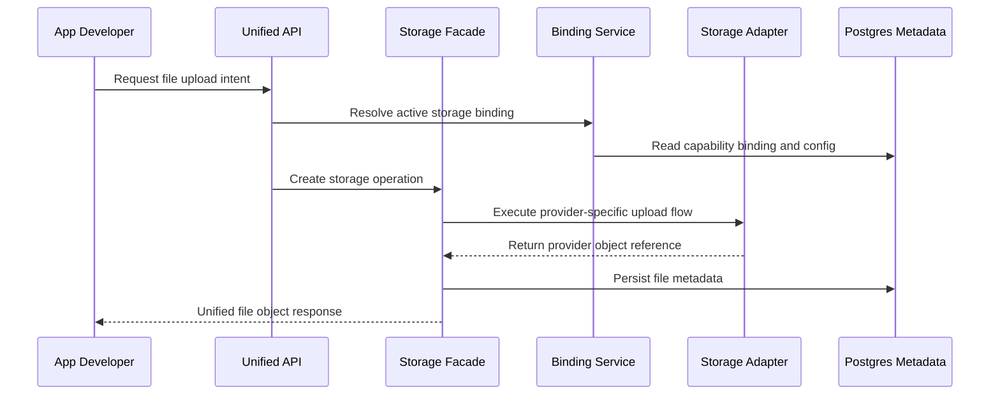
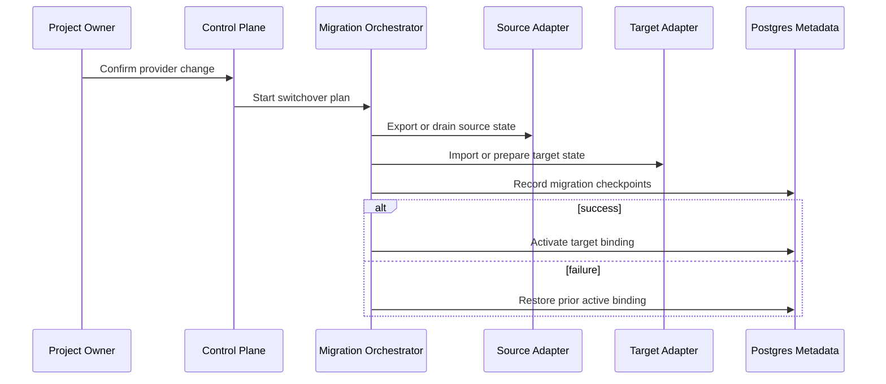
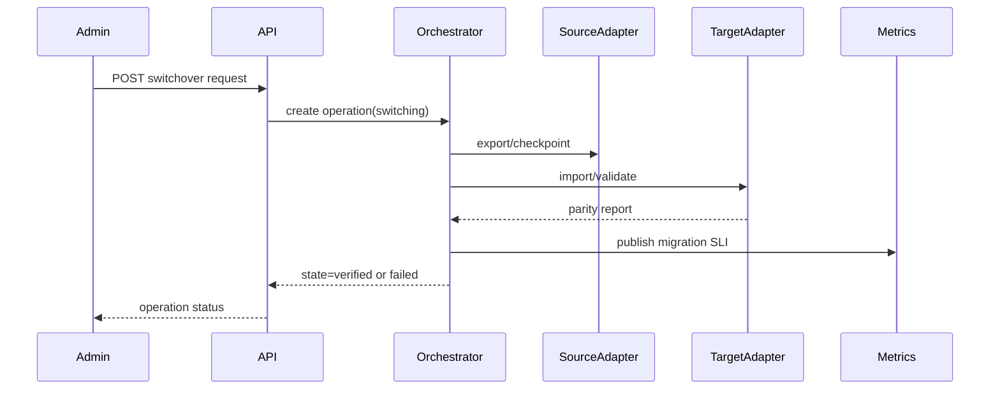

# Sequence Diagram - Backend as a Service Platform

```mermaid
sequenceDiagram
    participant Dev as App Developer
    participant API as Unified API
    participant Storage as Storage Facade
    participant Bind as Binding Service
    participant Adapter as Storage Adapter
    participant Meta as Postgres Metadata

    Dev->>API: Request file upload intent
    API->>Bind: Resolve active storage binding
    Bind->>Meta: Read capability binding and config
    API->>Storage: Create storage operation
    Storage->>Adapter: Execute provider-specific upload flow
    Adapter-->>Storage: Return provider object reference
    Storage->>Meta: Persist file metadata
    Storage-->>Dev: Unified file object response
```

## Switchover Orchestration Sequence

```mermaid
sequenceDiagram
    participant Owner as Project Owner
    participant CP as Control Plane
    participant Mig as Migration Orchestrator
    participant Old as Source Adapter
    participant New as Target Adapter
    participant Meta as Postgres Metadata

    Owner->>CP: Confirm provider change
    CP->>Mig: Start switchover plan
    Mig->>Old: Export or drain source state
    Mig->>New: Import or prepare target state
    Mig->>Meta: Record migration checkpoints
    alt success
        Mig->>Meta: Activate target binding
    else failure
        Mig->>Meta: Restore prior active binding
    end
```

## Sequence Expansion: Provider Switchover

```mermaid
sequenceDiagram
participant Admin
participant API
participant Orchestrator
participant SourceAdapter
participant TargetAdapter
participant Metrics
Admin->>API: POST switchover request
API->>Orchestrator: create operation(switching)
Orchestrator->>SourceAdapter: export/checkpoint
Orchestrator->>TargetAdapter: import/validate
TargetAdapter-->>Orchestrator: parity report
Orchestrator->>Metrics: publish migration SLI
Orchestrator-->>API: state=verified or failed
API-->>Admin: operation status
```
