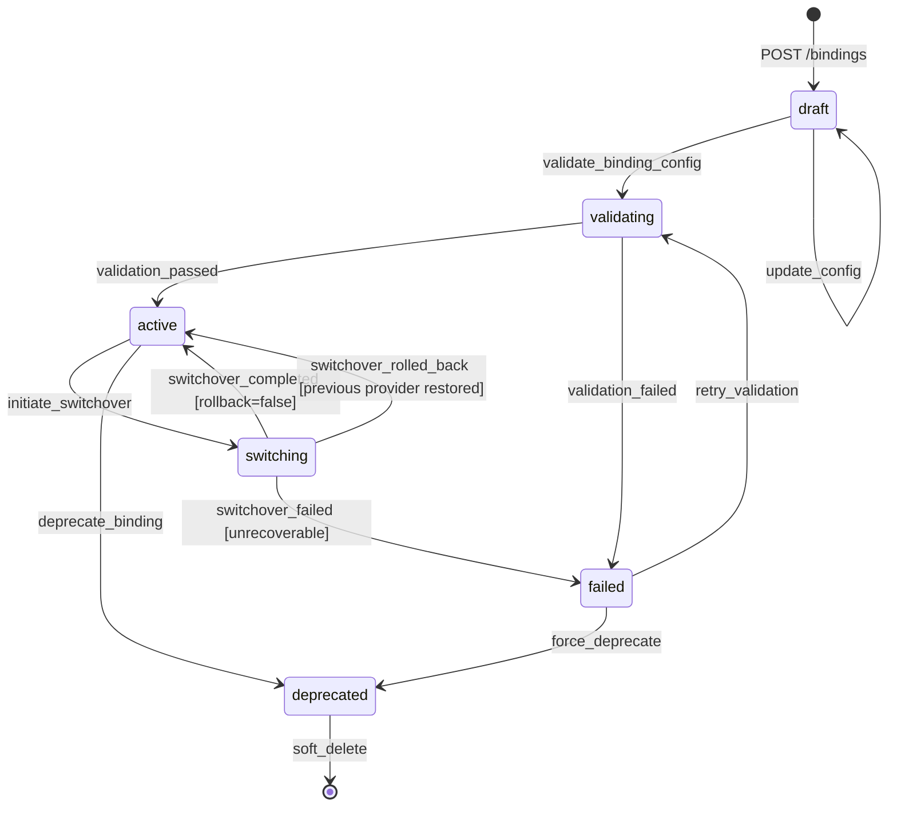
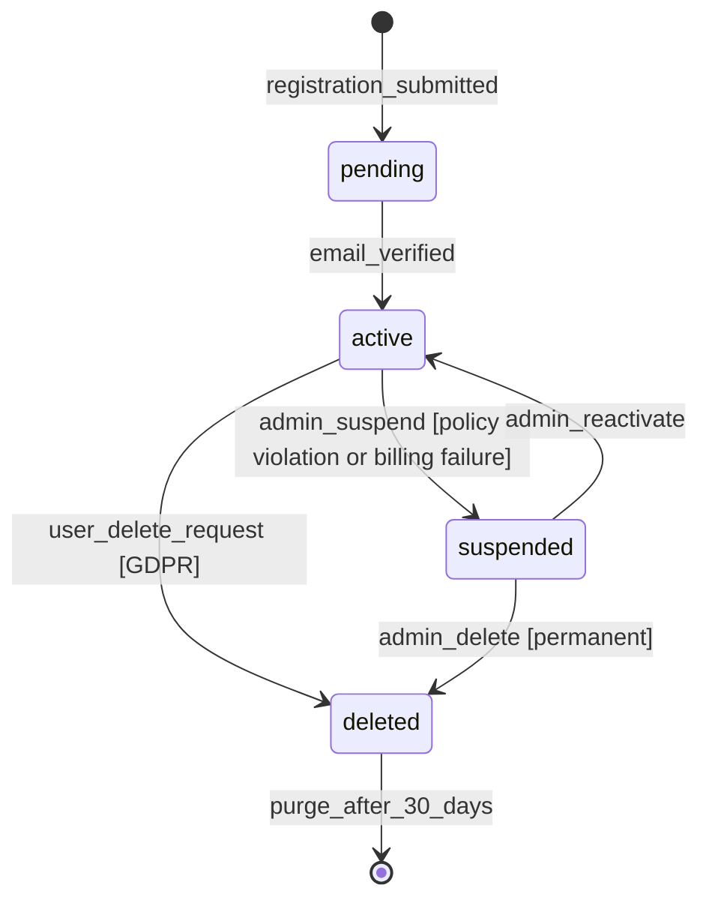

# State Machine Diagrams — Backend as a Service Platform

## Table of Contents
1. [CapabilityBinding State Machine](#1-capabilitybinding-state-machine)
2. [SwitchoverPlan State Machine](#2-switchoverplan-state-machine)
3. [FunctionDefinition State Machine](#3-functiondefinition-state-machine)
4. [ExecutionRecord State Machine](#4-executionrecord-state-machine)
5. [AuthUser State Machine](#5-authuser-state-machine)
6. [SchemaMigration State Machine](#6-schemamigration-state-machine)

---

## 1. CapabilityBinding State Machine



### 1.1 Transition Trigger / Guard Matrix

| From | To | Trigger | Guard | Side-Effect / Action |
|------|----|---------|-------|----------------------|
| `draft` | `validating` | `POST .../validate` or auto on create | Config fields pass JSON schema check | Async validation job enqueued |
| `draft` | `draft` | `PATCH .../bindings/{id}` | Status must be `draft` | Config snapshot updated |
| `validating` | `active` | Validation job callback: `PASSED` | Provider connectivity check returns 200 | `activated_at` stamped; audit log written |
| `validating` | `failed` | Validation job callback: `FAILED` | — | Error details stored; alert fired |
| `active` | `switching` | `POST .../bindings/{id}/switch` | A `switchover_plan` in `applying` state exists | `previous_provider_id` captured |
| `active` | `deprecated` | `POST .../bindings/{id}/deprecate` | No running switchover plan | All dependants notified |
| `switching` | `active` | Switchover plan reaches `completed` | Parity check passed | New provider ID set; version incremented |
| `switching` | `active` | Switchover plan reaches `rolled-back` | Previous config still valid | Previous provider restored |
| `switching` | `failed` | Switchover plan reaches `failed` + rollback failed | — | Incident alert; requires manual intervention |
| `failed` | `validating` | `POST .../bindings/{id}/validate` | — | Previous error cleared |
| `failed` | `deprecated` | Admin force-deprecate | — | Audit log; notification |
| `deprecated` | (terminal) | Soft-delete | No active switchover plans | Deleted in DB after retention window |

### 1.2 Compensation / Rollback Rules

- If `switching → failed`: The platform attempts automatic rollback to `previous_provider_id`. On rollback success → `active`. On rollback failure → `failed` with `MANUAL_INTERVENTION_REQUIRED` flag set.
- If `validating` times out (>5 min): transitions to `failed` with code `VALIDATION_TIMEOUT`.
- `deprecated` bindings cannot be re-activated; a new binding must be created.

---

## 2. SwitchoverPlan State Machine

```mermaid
stateDiagram-v2
    [*] --> planned : POST /ops/switchover-plans

    planned --> dry-run : POST .../dry-run
    planned --> preparing : POST .../apply [dry_run_first=false]

    dry-run --> planned : dry_run_completed [parity=passed]
    dry-run --> planned : dry_run_completed [parity=failed, operator reviews]

    planned --> preparing : POST .../apply [after successful dry-run]

    preparing --> applying : prerequisites_met
    preparing --> rolled-back : prerequisite_failed

    applying --> verifying : migration_applied
    applying --> rolled-back : apply_error [auto-rollback triggered]

    verifying --> completed : verification_passed
    verifying --> rolled-back : verification_failed [auto-rollback triggered]

    completed --> [*]
    rolled-back --> [*]
```

### 2.1 Transition Trigger / Guard Matrix

| From | To | Trigger | Guard | Side-Effect / Action |
|------|----|---------|-------|----------------------|
| `planned` | `dry-run` | `POST .../dry-run` | Binding is in `active` or `switching` state | Dry-run worker enqueued; checkpoints created |
| `dry-run` | `planned` | Dry-run worker completes | — | `dry_run_result` stored; operator notified |
| `planned` | `preparing` | `POST .../apply` | `dry_run_first=false` OR dry-run result is `parity=passed` | Preparation checklist initiated |
| `preparing` | `applying` | All prerequisite checks pass | Network route, secret access, schema compatibility | Binding transitions to `switching` |
| `preparing` | `rolled-back` | Prerequisite fails | — | Binding stays `switching`; plan archived |
| `applying` | `verifying` | Data migration/config sync complete | — | Parity checker started |
| `applying` | `rolled-back` | Apply error | Auto-rollback succeeded | Previous provider config restored |
| `verifying` | `completed` | Parity checker passes all assertions | Error rate delta < 0.1% | Binding transitions to `active` (new provider) |
| `verifying` | `rolled-back` | Parity check fails | — | Traffic drained from new provider |

### 2.2 Compensation / Rollback Rules

- All `applying` steps write to `switchover_checkpoints` so any failure can identify the last safe restore point.
- Rollback replays `down_sql`-equivalent operations in reverse checkpoint order.
- After `rolled-back`, a new plan must be created for another attempt; the old plan is immutable.

---

## 3. FunctionDefinition State Machine

```mermaid
stateDiagram-v2
    [*] --> draft : POST /functions

    draft --> uploaded : artifact_uploaded

    uploaded --> scanning : scan_triggered [auto on upload]

    scanning --> ready : scan_passed
    scanning --> scan-failed : scan_rejected

    scan-failed --> uploaded : re-upload_artifact

    ready --> deploying : POST .../deployments

    deploying --> active : deployment_succeeded
    deploying --> ready : deployment_failed [artifact retained]

    active --> deploying : new_deployment [rolling update]
    active --> deprecated : POST .../deprecate
    active --> active : config_updated [env_vars, timeout, memory]

    deprecated --> archived : POST .../archive
    archived --> [*]
```

### 3.1 Transition Trigger / Guard Matrix

| From | To | Trigger | Guard | Side-Effect / Action |
|------|----|---------|-------|----------------------|
| `draft` | `uploaded` | Artifact upload completes | Checksum verified; file not zero bytes | `deployment_artifacts` record created with `scan_status=pending` |
| `uploaded` | `scanning` | Auto-triggered post-upload | Scan provider configured | SAST/SCA scanner invoked asynchronously |
| `scanning` | `ready` | Scanner callback: PASSED | No critical CVEs; no forbidden APIs | `scan_report` stored; notification sent |
| `scanning` | `scan-failed` | Scanner callback: REJECTED | Critical vulnerabilities found | Scan report stored; developer alerted |
| `scan-failed` | `uploaded` | New artifact uploaded | — | Old artifact retained for audit |
| `ready` | `deploying` | `POST .../deployments` | No other deployment in progress | Deployment pipeline initiated |
| `deploying` | `active` | Deployment pipeline callback: SUCCESS | Health check probe passes | Previous deployment retired; traffic routed |
| `deploying` | `ready` | Deployment pipeline callback: FAILED | — | Artifact retained; error detail stored |
| `active` | `deprecated` | `POST .../deprecate` | No running executions | Dependants notified; schedules disabled |
| `deprecated` | `archived` | `POST .../archive` | Deprecated for > 30 days | Artifact URL purged after retention window |

### 3.2 Compensation / Rollback Rules

- `deploying → ready` (failed): Previous active deployment remains in place. No traffic disruption.
- Artifacts in `scan-failed` are retained for audit for 90 days then purged.
- `archived` functions cannot be restored; a new function must be created.

---

## 4. ExecutionRecord State Machine

```mermaid
stateDiagram-v2
    [*] --> queued : execution_enqueued

    queued --> dispatched : worker_picks_up

    dispatched --> running : runtime_started

    running --> completed : execution_returned_result
    running --> failed : execution_threw_exception
    running --> timed-out : execution_exceeded_timeout

    completed --> archived : archive_after_retention
    failed --> archived : archive_after_retention
    timed-out --> archived : archive_after_retention

    archived --> [*]
```

### 4.1 Transition Trigger / Guard Matrix

| From | To | Trigger | Guard | Side-Effect / Action |
|------|----|---------|-------|----------------------|
| (new) | `queued` | `POST .../invoke` or schedule trigger | Function is `active`; quota not exceeded | `execution_records` row inserted; `started_at` null |
| `queued` | `dispatched` | Worker claims record via `SELECT FOR UPDATE SKIP LOCKED` | Worker has capacity | Worker ID stamped; `started_at` set |
| `dispatched` | `running` | Runtime container sends start heartbeat | Container started within 10 s | Heartbeat timestamp updated |
| `running` | `completed` | Runtime returns result payload | — | `output_payload` stored; `duration_ms` set; usage meter incremented |
| `running` | `failed` | Runtime throws unhandled exception | — | `error_detail` + stack trace stored; retry policy evaluated |
| `running` | `timed-out` | Timeout watchdog fires | `duration_ms >= timeout_seconds * 1000` | Container killed; `error_detail` set to TIMEOUT |
| `completed/failed/timed-out` | `archived` | Nightly archive job | Record older than retention threshold | Moved to cold partition; log URL generated |

### 4.2 Compensation / Rollback Rules

- `failed` executions with `trigger_type=schedule` are retried up to 3 times with exponential back-off.
- `timed-out` executions are **never** retried automatically (side-effect safety).
- HTTP-triggered `failed` executions return the error to the caller immediately; no automatic retry.
- `dispatched` records not seen as `running` within 10 s trigger a dead-worker recovery: reset to `queued`.

---

## 5. AuthUser State Machine



### 5.1 Transition Trigger / Guard Matrix

| From | To | Trigger | Guard | Side-Effect / Action |
|------|----|---------|-------|----------------------|
| (new) | `pending` | `POST /auth/register` | Email not already registered in project | Verification email dispatched; `pending` for 48 h |
| `pending` | `active` | Email verification link clicked | Token not expired; token not already used | `email_verified=true`; default role assigned |
| `pending` | (expired) | 48-hour timer | Email never verified | Record soft-marked `status=deleted`; no account data stored |
| `active` | `suspended` | Admin action or billing automation | — | All sessions revoked; login blocked; user notified |
| `active` | `deleted` | User self-delete or GDPR erasure request | No outstanding billing | PII scrambled within 24 h; sessions revoked |
| `suspended` | `active` | Admin `POST /auth/users/{id}/reactivate` | — | New session can be created; notification sent |
| `suspended` | `deleted` | Admin permanent delete | — | PII scrambled within 24 h |
| `deleted` | (purged) | Nightly purge job after 30 days | — | Row hard-deleted; audit log retained |

### 5.2 Compensation / Rollback Rules

- `deleted → active` is **not permitted**. Deletion is irreversible after the 30-day soft-delete window.
- Suspension is immediately effective: the next request by a suspended user returns `403 AUTHZ_FORBIDDEN`.
- MFA config is nullified on deletion but the `mfa_configs` row is retained for audit for 90 days.

---

## 6. SchemaMigration State Machine

```mermaid
stateDiagram-v2
    [*] --> planned : POST /db/migrations

    planned --> dry-run : POST .../migrations/{id}/dry-run

    dry-run --> planned : dry_run_completed [no errors]
    dry-run --> planned : dry_run_failed [errors reported, operator reviews]

    planned --> applying : POST .../migrations/{id}/apply

    applying --> verified : migration_sql_executed_successfully

    verified --> completed : verification_checks_pass
    verified --> rolled-back : verification_checks_fail [auto-rollback]

    applying --> failed : sql_execution_error

    failed --> rolled-back : rollback_sql_executed
    failed --> failed : rollback_also_failed [MANUAL_INTERVENTION]

    completed --> [*]
    rolled-back --> [*]
```

### 6.1 Transition Trigger / Guard Matrix

| From | To | Trigger | Guard | Side-Effect / Action |
|------|----|---------|-------|----------------------|
| (new) | `planned` | `POST /db/migrations` | `up_sql` is non-empty; `ordinal` is next in sequence | Migration record created; `down_sql` recommended |
| `planned` | `dry-run` | `POST .../dry-run` | No other migration in `applying` state for the namespace | SQL run in a transaction that is immediately rolled back; result logged |
| `dry-run` | `planned` | Dry-run job completes | — | `dry_run_log` stored; status resets to `planned` |
| `planned` | `applying` | `POST .../apply` | Namespace migration lock acquired; no migration in progress | Distributed lock set; `applying` recorded |
| `applying` | `verified` | SQL transaction committed | No SQL errors | Lock released; `applied_at` stamped |
| `verified` | `completed` | Post-migration checks pass (row counts, constraint validation) | — | `status=completed`; dependent services notified |
| `verified` | `rolled-back` | Post-migration checks fail | `down_sql` is available | `down_sql` executed; checksum verified |
| `applying` | `failed` | SQL error during execution | — | Transaction rolled back by PG; `error_detail` stored |
| `failed` | `rolled-back` | `down_sql` execution succeeds | — | Namespace lock released; alert fired |
| `failed` | `failed` (stuck) | `down_sql` also fails | — | `MANUAL_INTERVENTION_REQUIRED` flag; DBA paged |

### 6.2 Compensation / Rollback Rules

- Every migration **must** include `down_sql` for production namespaces (enforced by the API).
- The migration runner acquires a distributed advisory lock (`pg_advisory_lock`) keyed on the namespace ID.
- If the applying process crashes mid-migration, the lock is released by PG on connection drop and the migration is reset to `failed` by the recovery watchdog.
- `completed` and `rolled-back` are terminal; a corrective migration must be created as a new record.
