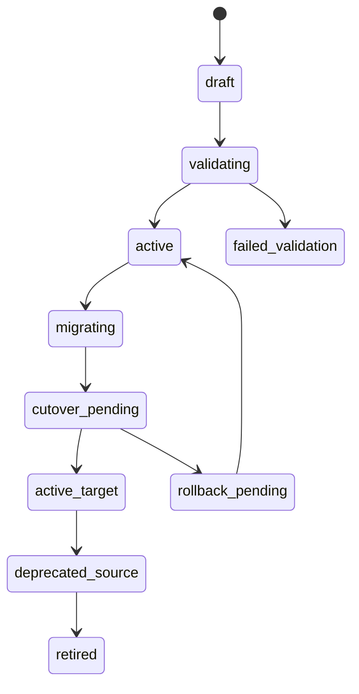
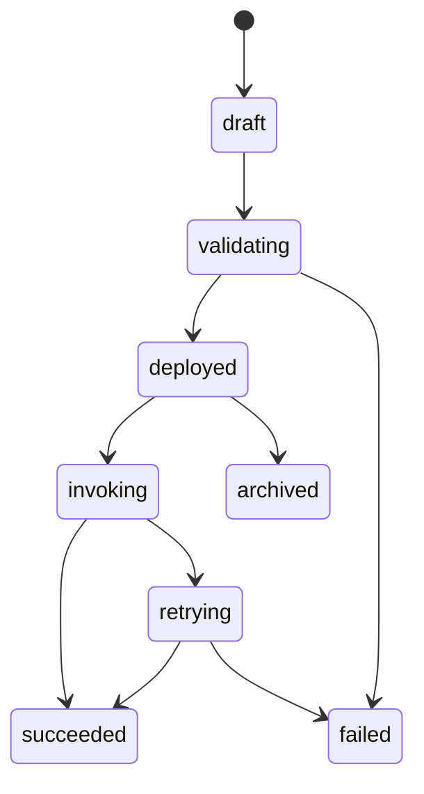
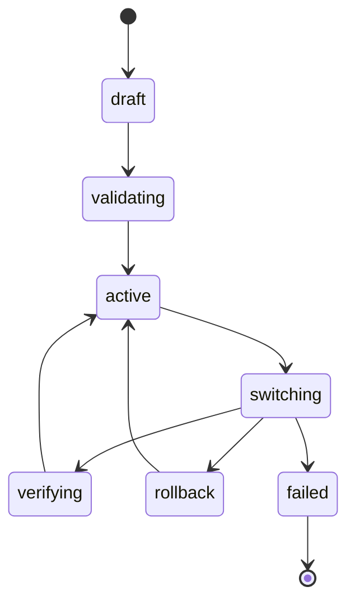

# State Machine Diagram - Backend as a Service Platform

## Capability Binding Lifecycle

## Function Deployment Lifecycle

## Additional State Machines

- Invalid transition attempts return `STATE_INVALID_TRANSITION`.
- Transition guards include contract compatibility checks and SLO burn-rate gates.
