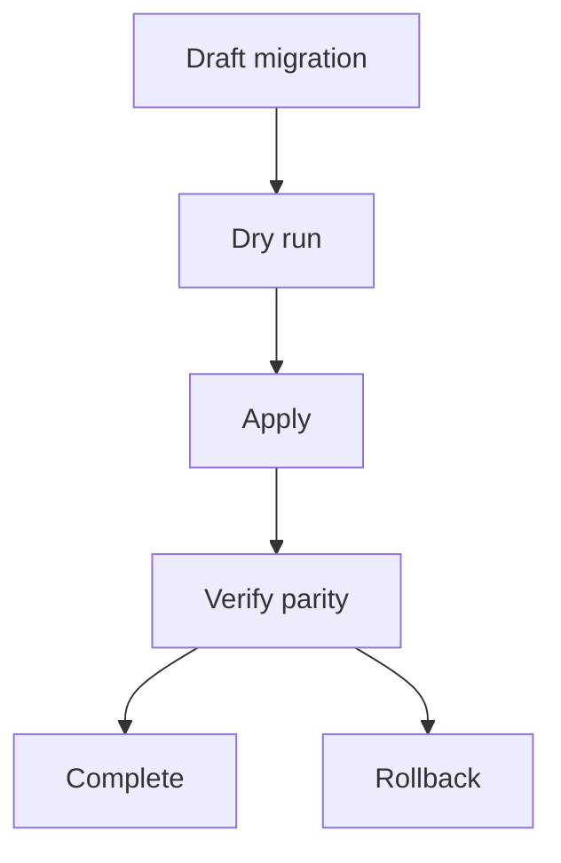

# Edge Cases - Data API and Schema

| Scenario | Risk | Mitigation |
|----------|------|------------|
| Developer applies breaking schema migration directly in production | App outage or data loss | Require migration planning, validation, and environment-aware promotion |
| Row or role policy metadata drifts from actual database policy | Security gap | Track policy deployment status and verify reconciliation against Postgres |
| Long-running migration holds locks on hot tables | API degradation | Support online migration strategies and maintenance windows |
| Unsupported query operator differs across adapters or SDK layers | Behavior mismatch | Publish compatibility notes and reject unsupported semantics explicitly |
| Data namespace restored from backup while metadata is stale | Inconsistent access behavior | Treat schema metadata and database state as jointly recoverable units |

## Deep Edge Cases: Data API and Schema

- Online migrations that add non-null columns must use expand/contract with default backfill.
- Concurrent schema publish requests require optimistic locking and `STATE_SCHEMA_VERSION_CONFLICT`.

