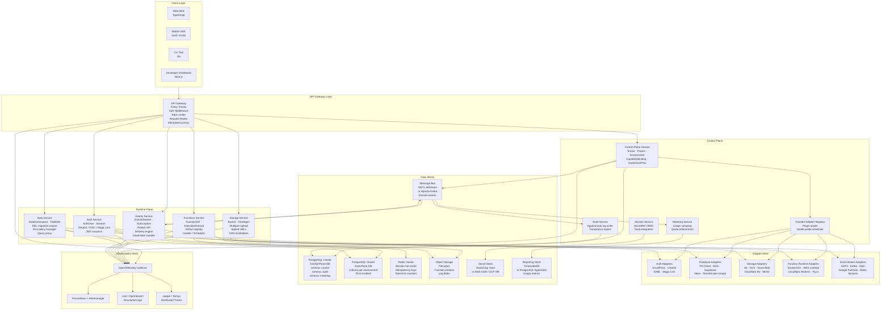
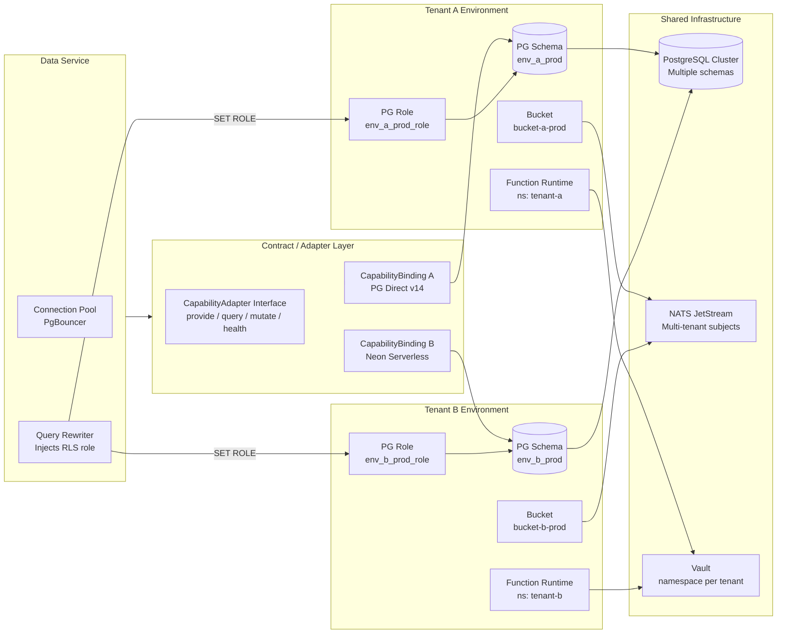

# Architecture Diagram — Backend as a Service (BaaS) Platform

## 1. Architecture Style Decision

The BaaS Platform adopts an **event-driven microservices** architecture with the following key decisions:

| Decision | Choice | Rationale |
|---|---|---|
| Service decomposition | Domain-aligned microservices | Independent deployability, team ownership, capability isolation |
| Inter-service communication | Async via Message Bus (NATS JetStream / Kafka) | Loose coupling, backpressure, replay support |
| Synchronous calls | REST/gRPC within bounded contexts only | Avoid distributed transactions |
| API surface | Single API Gateway with unified auth middleware | Developer ergonomics, rate limiting, versioning |
| Control-plane storage | Shared PostgreSQL cluster (schema-per-service) | Strong consistency for tenant/project metadata |
| Data-plane storage | Isolated PostgreSQL schemas per environment | Tenant isolation, RLS enforcement |
| Secrets management | External vault (HashiCorp Vault / AWS SSM) | Zero-knowledge principle; platform never stores secret values |
| Observability | OpenTelemetry traces + Prometheus metrics + structured logs | Unified across all services |
| Multi-tenancy | Logical isolation (schema-per-environment) with physical isolation option for ENTERPRISE | Cost efficiency with security boundary |

---

## 2. Full System Architecture

---

## 3. Component Responsibility Table

| Component | Layer | Primary Responsibility | Key Dependencies |
|---|---|---|---|
| API Gateway | Gateway | Request routing, JWT validation, rate limiting, idempotency enforcement, API versioning | Redis (rate limits), Auth Service (token introspect) |
| Control Plane Service | Control | Tenant/Project/Environment CRUD, CapabilityBinding lifecycle, SwitchoverPlan orchestration | PostgreSQL (control), Message Bus, Secrets Service |
| Provider Adapter Registry | Control | Loads adapter plugins, schedules health probes, maintains ProviderCatalogEntry | Control Plane Service, all Adapters |
| Metering Service | Control | Samples usage counters from domain events, enforces quotas, exposes billing metrics | Message Bus, TimescaleDB, Control Plane Service |
| Audit Service | Control | Consumes AuditEntry events, writes append-only log, handles compliance export requests | Message Bus, PostgreSQL (audit schema) |
| Secrets Service | Control | Manages SecretRef records, proxies Vault reads for adapter config, handles rotation | HashiCorp Vault / AWS SSM, PostgreSQL (control) |
| Auth Service | Runtime | AuthUser and SessionRecord management, OAuth2/OIDC federation, JWT issuance, MFA | PostgreSQL (data plane), Redis, Auth Adapters |
| Data Service | Runtime | DDL migrations, RLS policy management, query proxy with tenant-scoped connection pooling | PostgreSQL (data plane), Database Adapters |
| Storage Service | Runtime | Bucket/object CRUD, multipart upload coordination, signed URL generation, CDN hooks | Storage Adapters, Object Store, PostgreSQL (control) |
| Functions Service | Runtime | Function deployment, artifact management, sync/async invocation, cron scheduling | Function Runtime Adapters, Object Store, Message Bus |
| Events Service | Runtime | Channel/Subscription management, event publishing, delivery with retry/DLQ | Event Broker Adapters, Message Bus, PostgreSQL (control) |
| Auth Adapters | Adapter Mesh | Normalise federated identity protocols (OAuth2, SAML, Magic Link) to internal model | External IdPs |
| Database Adapters | Adapter Mesh | Translate platform DDL/query operations to provider-specific SQL or API | PostgreSQL variants, Neon, Supabase |
| Storage Adapters | Adapter Mesh | Map Bucket/Object operations to provider SDK (S3, GCS, R2, MinIO) | Cloud Storage APIs |
| Function Runtime Adapters | Adapter Mesh | Deploy artifacts and invoke functions on target runtime (Docker, Lambda, Workers) | Container registries, Cloud Function APIs |
| Event Broker Adapters | Adapter Mesh | Publish/subscribe normalisation across NATS, Kafka, SQS, Pub/Sub | Message broker endpoints |
| PostgreSQL (Control) | Data Store | Persistent store for all control-plane aggregates; schema isolation per service | — |
| PostgreSQL (Data Plane) | Data Store | Developer-managed relational data; schema-per-environment; RLS enforced | — |
| Redis Cluster | Data Store | Session cache, idempotency key store, distributed rate-limit counters | — |
| NATS JetStream / Kafka | Data Store | Durable domain event bus; per-service consumer groups; replay support | — |
| Object Storage | Data Store | Raw bytes for file objects, function artifacts, execution log blobs | — |
| Secret Store (Vault) | Data Store | Encrypted storage for all credential values; never touches platform DB | — |
| TimescaleDB / Hypertable | Data Store | Time-series metrics for metering, billing aggregation, SLO dashboards | — |

---

## 4. Cross-Cutting Concerns

### 4.1 Authentication Middleware
Every request to the API Gateway passes through a two-stage auth middleware:
1. **JWT Validation** — Verifies `HS256` / `RS256` signature, expiry, issuer, and audience claims.
2. **Scope Enforcement** — Checks that the token's project claim matches the requested resource's `projectId`; service tokens carry additional capability scopes.

Project-level API keys are exchanged at the gateway for short-lived JWTs; keys are never forwarded upstream.

### 4.2 Idempotency
All mutating HTTP methods (`POST`, `PUT`, `DELETE`) support an `Idempotency-Key` header. The gateway stores request fingerprints in Redis with a 24-hour TTL. Replayed requests with the same key return the cached response without re-executing side effects.

### 4.3 Tenancy Scoping
Every database query executed by a runtime service is wrapped by a middleware that:
- Sets `SET search_path = <environment_schema>` for data-plane queries.
- Prepends a `WHERE tenant_id = $tenantId` clause via query rewriting for control-plane queries.
- Enforces PostgreSQL RLS via a per-request role (`SET ROLE env_<environmentId>_role`).

### 4.4 API Versioning
The API is versioned at the URL path level (`/v1/`, `/v2/`). Breaking changes require a new major version. Deprecation notices are surfaced via response headers (`Sunset`, `Deprecation`). The gateway routes versions in parallel during transition periods.

### 4.5 Observability
All services emit:
- **Structured JSON logs** with `trace_id`, `span_id`, `tenant_id`, `project_id`, `request_id`.
- **OpenTelemetry traces** with automatic HTTP and DB instrumentation.
- **Prometheus metrics** for RED (Rate, Errors, Duration) per endpoint, plus domain-specific counters (e.g., `baas_auth_sessions_created_total`).

---

## 5. Failure Isolation Boundaries

| Boundary | Isolation Mechanism | Blast Radius on Failure |
|---|---|---|
| Per-service process | Separate container/pod per service | Single capability unavailable |
| Per-environment DB schema | PostgreSQL schema isolation + separate roles | Single environment's data affected |
| Adapter Mesh | Circuit breaker (Resilience4j / Go-Breaker) per adapter instance | Single provider degraded; platform routes to secondary |
| Message Bus | Consumer group per service; DLQ per topic | Message backlog isolated; other services unaffected |
| Secret Store | Read-through cache with 5-minute TTL | Short-lived availability on Vault outage |
| Rate Limiter | Per-tenant sliding window in Redis | Single tenant throttled; others unaffected |
| Function Execution | Ephemeral sandbox per invocation (timeout + memory limit) | Single execution killed; function service healthy |

---

## 6. Isolation and Contract Layer Diagram

---

## 7. Scalability Characteristics

| Service | Scaling Axis | Bottleneck | Strategy |
|---|---|---|---|
| API Gateway | Horizontal (stateless) | CPU (TLS termination) | Auto-scale pods; offload TLS to LB |
| Control Plane Service | Horizontal (stateless) | DB write contention on Tenant table | Optimistic locking; CQRS read replicas |
| Auth Service | Horizontal (stateless) | Redis session cache throughput | Redis Cluster with sharding; JWT verification is CPU-bound |
| Data Service | Horizontal (stateless) | PgBouncer connection pool saturation | Increase pool size; statement-level pooling; read replicas for SELECT |
| Storage Service | Horizontal (stateless) | Bandwidth to object store | CDN offloading; multipart parallelism |
| Functions Service | Horizontal + vertical | Cold-start latency | Pre-warmed pool; concurrency limits per function |
| Events Service | Horizontal (partitioned) | Message broker throughput | Partition by `environmentId`; consumer group rebalancing |
| Metering Service | Horizontal | TimescaleDB ingest rate | Batched writes; continuous aggregation policies |
| Audit Service | Horizontal | PostgreSQL append throughput | Partitioned table by month; async write via queue |

---

## 8. Technology Stack

| Layer | Technology | Version | Rationale |
|---|---|---|---|
| API Gateway | Kong (open-source) or Envoy Proxy | Kong 3.x / Envoy 1.29 | Plugin ecosystem; OIDC, rate-limit, idempotency plugins |
| Control Plane Service | Go | 1.22+ | Low latency, strong concurrency, small binary footprint |
| Auth Service | Node.js (Fastify) | Node 20 LTS | Rich OAuth2/OIDC library ecosystem (passport, jose) |
| Data Service | Go | 1.22+ | Tight PostgreSQL integration via `pgx`; DDL safety |
| Storage Service | Go | 1.22+ | High-throughput streaming; AWS SDK Go v2 |
| Functions Service | Rust (Axum) | Rust stable | Memory safety, zero-cost async for scheduler path |
| Events Service | Node.js (Fastify) | Node 20 LTS | Mature NATS/Kafka client libraries |
| Metering Service | Go | 1.22+ | Efficient time-window aggregation |
| Audit Service | Go | 1.22+ | Append-only write patterns; minimal dependencies |
| Developer Dashboard | Next.js + TypeScript | Next.js 14 | SSR + RSC for fast dashboard load; Vercel-deployable |
| Primary Database | PostgreSQL | 16.x | JSONB, RLS, logical replication, pgvector for future AI features |
| Session Cache | Redis | 7.x | RESP3, Cluster mode, LFU eviction for sessions |
| Message Bus | NATS JetStream | 2.10.x | Lightweight, at-least-once, replay; Kafka as enterprise alternative |
| Object Storage | AWS S3 / MinIO (self-hosted) | — | S3-compatible API; MinIO for on-prem |
| Secret Store | HashiCorp Vault | 1.16.x | Dynamic secrets, lease renewal, KV v2 |
| Metrics | Prometheus + Grafana | — | Pull-based; Thanos for long-term retention |
| Tracing | OpenTelemetry + Jaeger | OTel 1.x | Vendor-neutral; W3C Trace Context |
| Logging | Fluent Bit → OpenSearch | — | Structured JSON; tenant-scoped index aliases |
| CI/CD | GitHub Actions + ArgoCD | — | GitOps; progressive delivery with Argo Rollouts |
| Container Runtime | Kubernetes (k8s) | 1.30+ | Pod isolation; HPA; NetworkPolicy for tenant namespaces |
