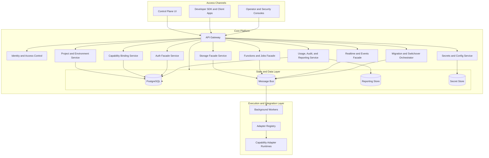

# Architecture Diagram - Backend as a Service Platform

## Responsibilities

| Component | Responsibility |
|-----------|----------------|
| Project and Environment Service | Provision tenants, projects, environments, and lifecycle state |
| Capability Binding Service | Attach providers to capabilities with compatibility validation |
| Auth Facade Service | Stable identity, session, and token semantics |
| Postgres Data API Service | Schema-aware data access and migration tracking |
| Storage Facade Service | File abstraction, metadata, uploads, downloads, access grants |
| Functions and Jobs Facade | Deploy, invoke, schedule, and track executions |
| Realtime and Events Facade | Channels, subscriptions, event fanout, webhook semantics |
| Migration and Switchover Orchestrator | Provider change plans, cutover, rollback, and auditability |
| Adapter Registry | Adapter catalog, certification state, compatibility profiles |
