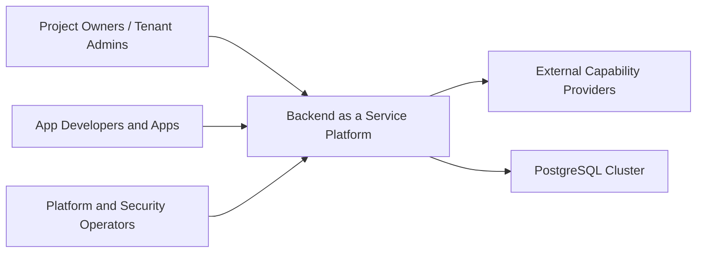
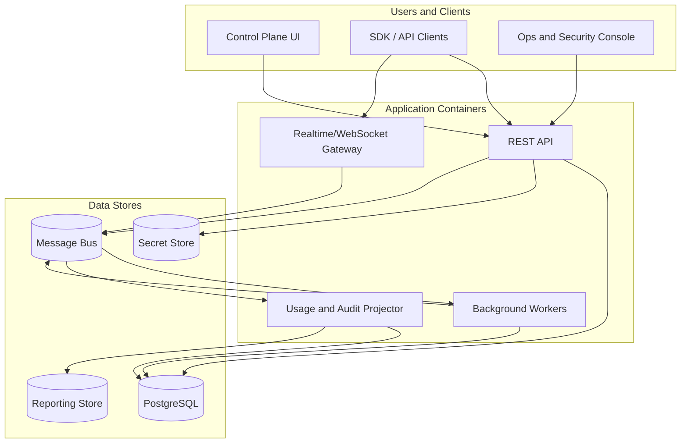

# C4 Context and Container Diagrams - Backend as a Service Platform

## C4 Context

```mermaid
flowchart LR
    owners[Project Owners / Tenant Admins]
    devs[App Developers and Apps]
    ops[Platform and Security Operators]
    providers[External Capability Providers]
    postgres[PostgreSQL Cluster]

    system[Backend as a Service Platform]

    owners --> system
    devs --> system
    ops --> system
    system --> providers
    system --> postgres
```

## C4 Container

```mermaid
flowchart TB
    subgraph users[Users and Clients]
        controlUI[Control Plane UI]
        devSDK[SDK / API Clients]
        adminUI[Ops and Security Console]
    end

    subgraph app[Application Containers]
        api[REST API]
        ws[Realtime/WebSocket Gateway]
        workers[Background Workers]
        projector[Usage and Audit Projector]
    end

    subgraph stores[Data Stores]
        db[(PostgreSQL)]
        queue[(Message Bus)]
        reporting[(Reporting Store)]
        secrets[(Secret Store)]
    end

    controlUI --> api
    devSDK --> api
    devSDK --> ws
    adminUI --> api
    api --> db
    api --> secrets
    api --> queue
    ws --> queue
    workers --> db
    workers --> queue
    projector --> db
    projector --> reporting
    queue --> workers
    queue --> projector
```
