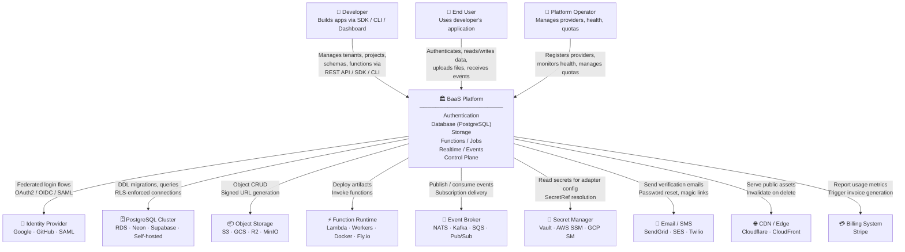
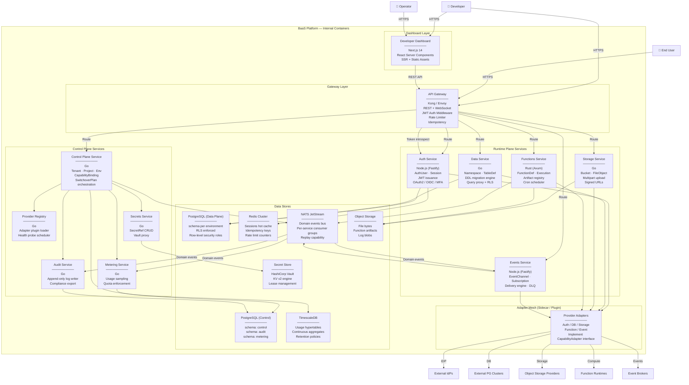
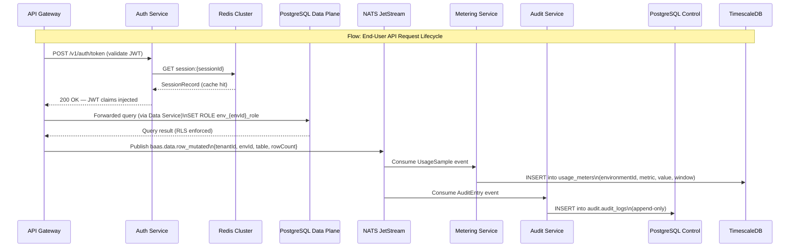

# C4 Model — Context and Container Diagrams

## 1. C4 Level 1 — System Context

### 1.1 Actors and External Systems

| Actor / System | Type | Description |
|---|---|---|
| Developer | Person | Builds applications on the BaaS Platform via SDK, CLI, or Dashboard |
| End User | Person | Consumer of a developer's application; authenticates and stores data through the platform |
| Platform Operator | Person | Manages provider catalog, system health, global quotas, and platform upgrades |
| Identity Provider (IdP) | External System | OAuth2/OIDC provider (Google, GitHub, Apple, SAML enterprise IdP) |
| PostgreSQL Cluster | External System | Managed or self-hosted PostgreSQL (Amazon RDS, Neon, Supabase, Cloud SQL, bare-metal PG) |
| Object Storage Provider | External System | S3-compatible blob store (AWS S3, GCS, Azure Blob, Cloudflare R2, MinIO) |
| Function Runtime | External System | Serverless compute environment (Docker/OCI, AWS Lambda, Cloudflare Workers, Fly.io) |
| Event Broker | External System | Message/event streaming system (NATS JetStream, Apache Kafka, AWS SQS, Google Pub/Sub) |
| Secret Manager | External System | External vault for credential storage (HashiCorp Vault, AWS SSM, GCP Secret Manager) |
| Email / SMS Provider | External System | Transactional communication (SendGrid, AWS SES, Twilio) for auth flows |
| CDN / Edge | External System | Content delivery network for public asset serving (Cloudflare, CloudFront, Fastly) |
| Billing System | External System | Subscription billing platform (Stripe) receiving usage data from the platform |

### 1.2 Context Diagram

---

## 2. C4 Level 2 — Container Diagram

### 2.1 Container Overview

### 2.2 Container Responsibility Table

| Container | Contract Responsibility | Isolation Responsibility | Lifecycle Responsibility | Tech Stack |
|---|---|---|---|---|
| API Gateway | Expose unified REST + WebSocket API on `/v1/`; enforce JWT auth, rate limits, idempotency keys | Route requests to correct service by path prefix; strip internal headers; inject `x-tenant-id` | Stateless; rolling deployment; zero-downtime reload of plugin config | Kong 3.x / Envoy; Lua plugins |
| Developer Dashboard | Provide web UI for tenant onboarding, project management, schema editor, logs viewer | Render only resources belonging to the authenticated developer's tenant | SPA + SSR; deployed independently of API services | Next.js 14, TypeScript, Tailwind CSS |
| Control Plane Service | Manage lifecycle of Tenant, Project, Environment, CapabilityBinding, SwitchoverPlan aggregates | Enforce per-tenant quota before creating resources; multi-tenant write isolation | Long-running service; leader election for switchover orchestration | Go 1.22, pgx/v5, NATS client |
| Provider Registry | Maintain ProviderCatalogEntry; load and version adapter plugins; run health probes on schedule | Isolate adapter panics/crashes from platform health; circuit-break unhealthy providers | Plugin hot-reload without service restart | Go 1.22, plugin system via shared library |
| Metering Service | Consume usage events from NATS; aggregate into UsageMeter records; enforce quotas | Per-tenant usage windows; quota state stored per environment | Stateless workers with at-least-once processing | Go 1.22, TimescaleDB, NATS JetStream |
| Audit Service | Write AuditLog entries from `AuditEntry` events; support compliance export (CSV/JSON) | Append-only table; no update/delete APIs exposed | Partitioned table by month; retention enforced by partition drop | Go 1.22, PostgreSQL partitioned table |
| Secrets Service | CRUD SecretRef records; proxy Vault reads for adapter config resolution | Never return secret values in API responses; only aliases and metadata | Secret rotation triggers `SecretRefRotated` event | Go 1.22, Vault SDK |
| Auth Service | Authenticate end users; issue JWTs; manage sessions; handle OAuth2/OIDC/MFA flows | Project-scoped user namespaces; session revocation via Redis | Stateless; session store is Redis (eviction-safe via DB fallback) | Node.js 20, Fastify, jose, passport |
| Data Service | Manage DataNamespace and TableDefinition; execute DDL migrations; proxy queries with RLS | Schema-per-environment isolation; per-request PostgreSQL role switching | Schema versioning with rollback support | Go 1.22, pgx/v5, golang-migrate |
| Storage Service | Manage Bucket and FileObject; handle multipart upload; generate signed URLs; invalidate CDN | Bucket-scoped ACLs; signed URLs expire automatically | Soft-delete with configurable retention | Go 1.22, AWS SDK Go v2 |
| Functions Service | Deploy FunctionDefinition; manage artifacts; invoke synchronously and asynchronously; schedule crons | Sandboxed execution per invocation; timeout + memory enforcement | Blue/green artifact swap; execution history pruning | Rust (Axum), Tokio async runtime |
| Events Service | Manage EventChannel and Subscription; publish events; deliver with retry/DLQ; handle dead subscriptions | Per-environment channel namespacing; subscription filter enforcement | At-least-once delivery; DLQ for dead subscriptions | Node.js 20, Fastify, NATS/Kafka clients |
| Adapter Mesh | Implement `CapabilityAdapter` interface for each supported provider; normalise error codes | Circuit breaker per adapter instance; health probe result caching | Loaded dynamically by Provider Registry | Go shared plugins / Node.js modules |
| PostgreSQL (Control) | Persistent state for all control-plane aggregates | Schema-per-service within the cluster; row-level tenant filtering | Managed PostgreSQL 16; logical replication to read replicas | PostgreSQL 16, PgBouncer |
| PostgreSQL (Data Plane) | Developer-managed relational data per environment | Schema-per-environment; RLS via dedicated roles | DDL migrations applied by Data Service | PostgreSQL 16, PgBouncer |
| Redis Cluster | Session hot cache, idempotency key deduplication, distributed rate-limit counters | Key namespacing by `tenant:{tenantId}:*` | TTL-based eviction; Redis Cluster for HA | Redis 7, Redis Cluster |
| NATS JetStream | Durable domain event bus with replay | Per-environment subjects; consumer group isolation | Stream retention by time and message count | NATS Server 2.10 |
| TimescaleDB | Time-series usage metrics storage | Hypertable partitioned by `environment_id` and time | Continuous aggregation + retention policies | TimescaleDB 2.x on PostgreSQL 16 |

---

## 3. C4 Level 2 — Data Flow Between Containers

This diagram focuses on how data moves between containers for the most critical cross-cutting flows.

---

## 4. Integration Contracts with External Systems

### 4.1 PostgreSQL Cluster (Data Plane Provider)
- **Protocol:** PostgreSQL wire protocol (libpq-compatible)
- **Auth:** Certificate + username/password stored in Vault; retrieved via SecretRef
- **Contract:** Platform creates one schema per environment (`env_{environmentId}`), one owner role, and a read-only replica role. DDL changes are applied via `golang-migrate` with advisory locks. RLS is enabled by default on all platform-managed tables.
- **Failure handling:** Connection pool health check every 30 seconds; circuit breaker trips after 5 consecutive failures; BindingDegraded event emitted.

### 4.2 Identity Providers (Auth Adapters)
- **Protocol:** OAuth2 Authorization Code Flow with PKCE; SAML 2.0 SP-initiated SSO; OIDC Discovery endpoint
- **Contract:** Platform acts as OAuth2/OIDC Relying Party. Adapter normalises provider-specific claims (`sub`, `email`, `name`, `picture`) to `AuthUser` fields. State parameter prevents CSRF. Nonce prevents replay.
- **Failure handling:** IdP timeout returns `502 IdP Unavailable` to caller; fallback to email/password if available.

### 4.3 Object Storage Providers (Storage Adapters)
- **Protocol:** AWS S3-compatible REST API (S3, GCS with interop, R2, MinIO)
- **Contract:** Adapter maps `Bucket` → S3 bucket (or prefix within a shared bucket for cost efficiency). Signed URLs use `PUT` for upload and `GET` for download; TTL configurable per Bucket. Checksum verification via `Content-MD5` or `x-amz-checksum-sha256`.
- **Failure handling:** Upload failures trigger retry with exponential backoff (3 attempts); multipart uploads are aborted on terminal failure.

### 4.4 Function Runtimes (Function Runtime Adapters)
- **Protocol:** OCI image push to container registry; Lambda ZIP/container deploy via AWS SDK; Workers deploy via Cloudflare REST API
- **Contract:** Adapter pushes artifact, registers function configuration (env vars resolved from Vault), and returns an invocation endpoint. Sync invocations use HTTP; async invocations publish `ExecutionQueued` to NATS.
- **Failure handling:** Deployment failures roll back to previous artifact version; execution timeouts emit `ExecutionFailed` with `exit_code: TIMEOUT`.

### 4.5 Event Brokers (Event Broker Adapters)
- **Protocol:** NATS JetStream publish API; Kafka Producer/Consumer API; SQS `SendMessage` / `ReceiveMessage`; Google Pub/Sub gRPC
- **Contract:** Each `EventChannel` maps to a NATS subject or Kafka topic with the naming convention `baas.{environmentId}.{channelName}`. Delivery is at-least-once; consumers must handle idempotency.
- **Failure handling:** Failed deliveries are retried per `RetryPolicy`; after exhaustion, message is moved to DLQ topic `baas.{environmentId}.{channelName}.dlq`.

### 4.6 Secret Managers (Secrets Service)
- **Protocol:** HashiCorp Vault KV v2 API; AWS SSM `GetParameter` / `PutParameter`; GCP Secret Manager gRPC
- **Contract:** Secrets are stored under `baas/{tenantId}/{alias}` in Vault. Adapter resolves a `SecretRef` to the actual value at runtime; value is held in-memory only for the duration of the operation. Vault leases are renewed automatically.
- **Failure handling:** 5-minute read-through cache for adapter configs. On Vault unavailability, requests requiring credential resolution return `503 Secret Unavailable` rather than stale data.
