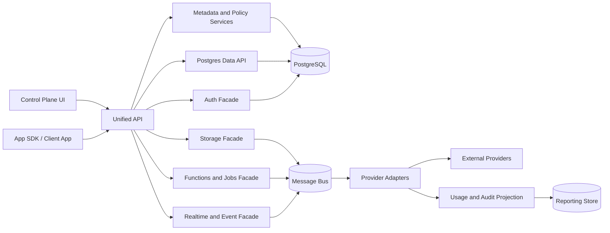
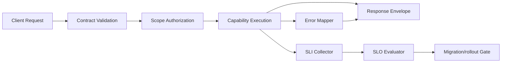

# Data Flow Diagram - Backend as a Service Platform

## Data Flow Notes

1. PostgreSQL stores platform metadata and powers the core data API.
2. Provider-facing capability operations flow through internal facade services and adapters rather than direct client integration.
3. Async tasks such as execution dispatch, event delivery, usage aggregation, and migration work are queue-backed.

## Data Flow Expansion: Error + SLO + Migration Signals

