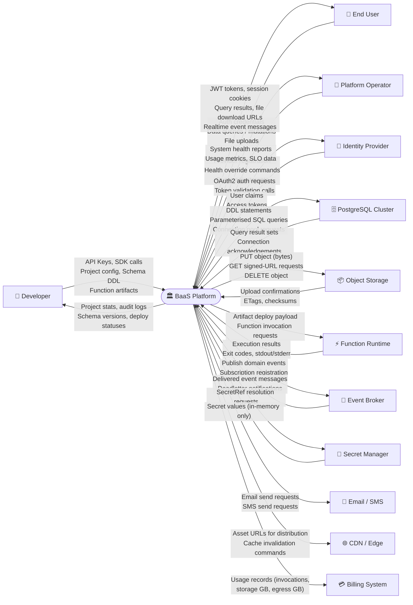
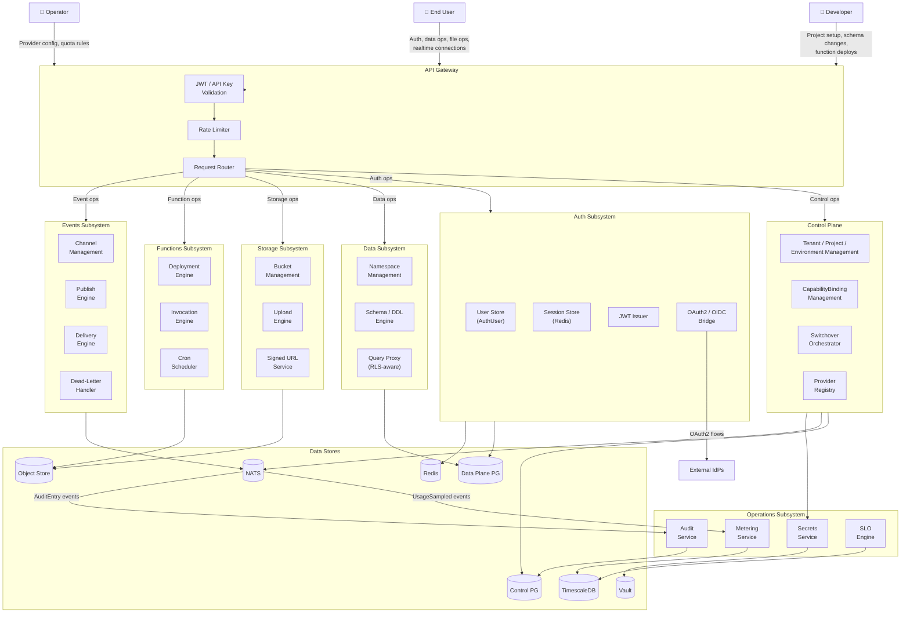
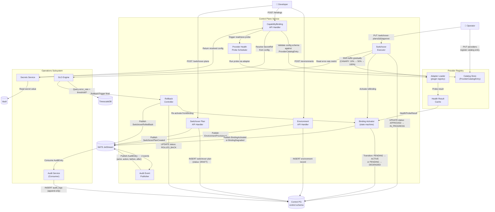
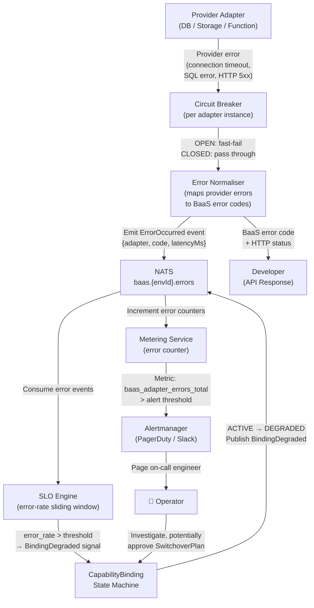

# Data Flow Diagram — Backend as a Service (BaaS) Platform

## 1. DFD Level 0 — System as a Black Box

This diagram shows all external entities and the data flows crossing the system boundary.

---

## 2. DFD Level 1 — Decomposed into Major Subsystems

---

## 3. DFD Level 2 — Control Plane Detail (Provider Binding, Switchover, Audit)

---

## 4. Error Signal Flow

This diagram shows how errors propagate from adapter calls through the SLO engine and back to the developer.

---

## 5. Data Store Summary Table

| Store Name | Type | Data Owner | Access Pattern | Retention Policy |
|---|---|---|---|---|
| PostgreSQL — control schema | OLTP Relational | Control Plane Service | Point queries by ID; joins for tenant hierarchy | Until explicit deletion; soft-delete with 30-day purge |
| PostgreSQL — audit schema | Append-only Relational | Audit Service | Append writes; bulk reads for compliance export | 90 days (FREE), 1 year (PRO/ENTERPRISE); partition drop |
| PostgreSQL — metering schema | OLTP Relational (aggregated) | Metering Service | Write aggregates per window; read for billing | 13 months rolling |
| PostgreSQL — data plane schema | OLTP Relational (per env) | Data Service (developer-owned data) | Developer-defined queries; RLS-filtered | Developer-controlled; soft-delete + 7-day grace |
| Redis Cluster | In-memory Key-Value | Auth Service (sessions); API Gateway (idempotency, rate-limit) | GET/SET/DEL by key; sliding window counters | Sessions: TTL = access token expiry; Idempotency keys: 24h TTL |
| NATS JetStream | Distributed Message Log | Platform-wide (event bus) | Publish by subject; consume by consumer group | Stream retention: 7 days or 10 GB per stream |
| Object Storage (S3/R2/GCS) | Blob Store | Storage Service (file objects); Functions Service (artifacts) | PUT/GET/DELETE by key; presigned URL | FileObjects: per-Bucket `retentionDays` setting; Artifacts: until function deleted |
| TimescaleDB | Time-Series | Metering Service; SLO Engine | INSERT time-series rows; continuous aggregates; range queries | Hypertable retention: 13 months; compressed chunks after 7 days |
| HashiCorp Vault | Encrypted KV Store | Secrets Service | Read by path (`baas/{tenantId}/{alias}`); lease renewal | Per-secret TTL; no auto-purge; manual rotation |

---

## 6. Data Classification Table

| Data Category | Examples | Classification Level | Encryption at Rest | Encryption in Transit |
|---|---|---|---|---|
| Tenant credentials | API keys, billing info | **Confidential** | AES-256 (Vault-managed) | TLS 1.3 mandatory |
| Auth user credentials | Password hashes, MFA secrets | **Confidential** | Argon2id hash + DB encryption | TLS 1.3 mandatory |
| Session tokens (access) | JWT bearer tokens | **Confidential** | Stored encrypted in Redis | TLS 1.3; short TTL (15 min) |
| Session tokens (refresh) | Opaque refresh tokens | **Confidential** | Hashed in DB (HMAC-SHA256) | TLS 1.3 |
| CapabilityBinding config | DB passwords, S3 keys | **Confidential** | SecretRef only; values in Vault | Vault API uses TLS 1.3 |
| Developer schema / table definitions | Column names, types, RLS policies | **Internal** | PostgreSQL transparent encryption | TLS 1.3 |
| Developer data rows | Application domain data | **Varies (developer-defined)** | PostgreSQL TDE; column-level encryption option | TLS 1.3 |
| File object bytes | User uploads, documents | **Varies (developer-defined)** | SSE-S3 / SSE-KMS at storage layer | TLS 1.3; signed URL HTTPS |
| Function artifacts | OCI images, ZIP bundles | **Internal** | Registry encryption at rest | TLS 1.3 |
| Execution logs | Function stdout/stderr | **Internal** | Object storage SSE | TLS 1.3 |
| Audit log entries | Actor, action, before/after snapshots | **Confidential** | AES-256 at PostgreSQL level; before/after JSON encrypted | TLS 1.3 |
| Usage metrics | Invocation counts, storage GB | **Internal** | TimescaleDB standard encryption | TLS 1.3 |
| Public file objects | Developer-designated public assets | **Public** | SSE (transparent) | HTTPS via CDN; HTTP allowed if explicitly enabled |
