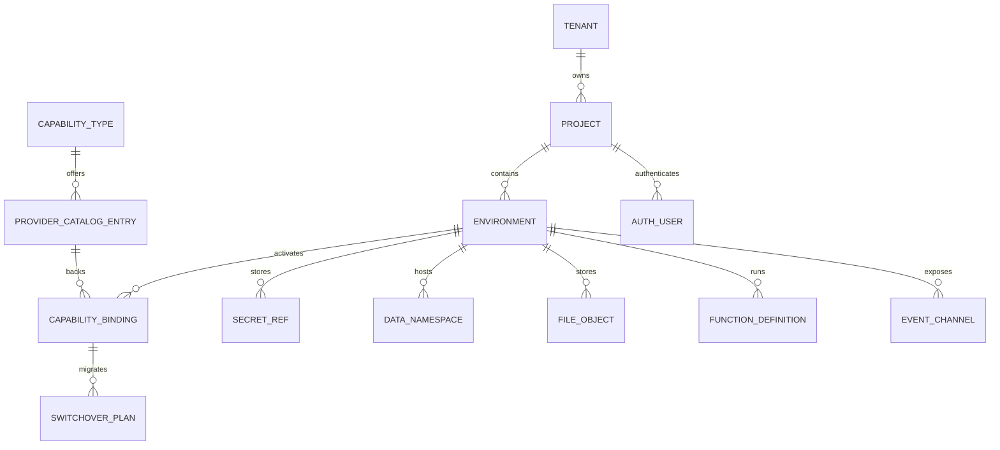

# Domain Model - Backend as a Service Platform

## Core Domain Areas

| Domain Area | Key Concepts |
|-------------|--------------|
| Tenancy and Governance | Tenant, Project, Environment, RoleAssignment, AuditLog |
| Capability Management | CapabilityType, ProviderCatalogEntry, CapabilityBinding, SwitchoverPlan |
| Secrets and Configuration | SecretRef, ConfigValue, CompatibilityProfile |
| Auth and Identity | AuthUser, IdentityProviderLink, SessionRecord |
| Data and Schema | DataNamespace, TableDefinition, SchemaMigration |
| Files and Storage | FileObject, Bucket, SignedAccessGrant |
| Functions and Jobs | FunctionDefinition, DeploymentArtifact, ExecutionRecord |
| Events and Messaging | EventChannel, Subscription, DeliveryRecord |
| Usage and Operations | UsageMeter, HealthSignal, IncidentMarker |

## Relationship Summary
- A **tenant** owns many projects, and each project owns many environments.
- Each **environment** binds one active provider per capability domain through capability bindings.
- A **provider catalog entry** describes a certified adapter and its supported compatibility profile.
- **Switchover plans** orchestrate migration between bindings while preserving facade stability.
- PostgreSQL stores project metadata, policy state, and the core data API structures.

