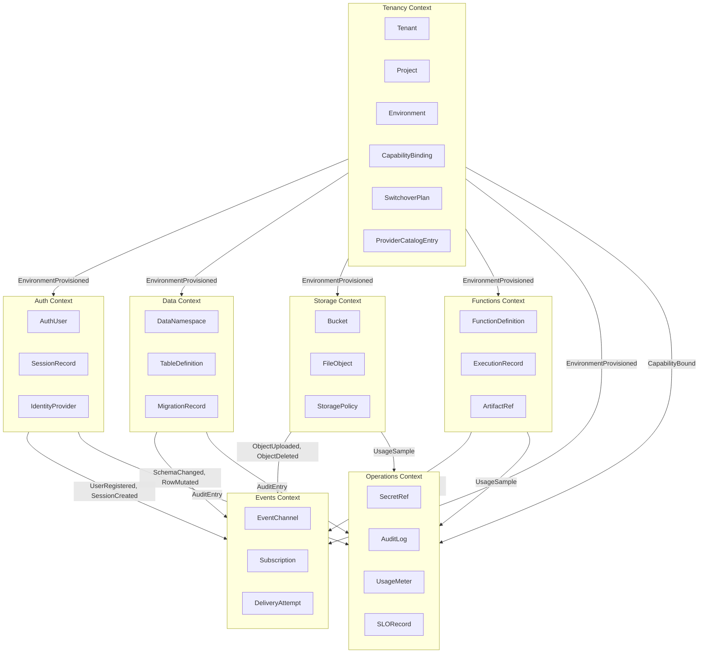
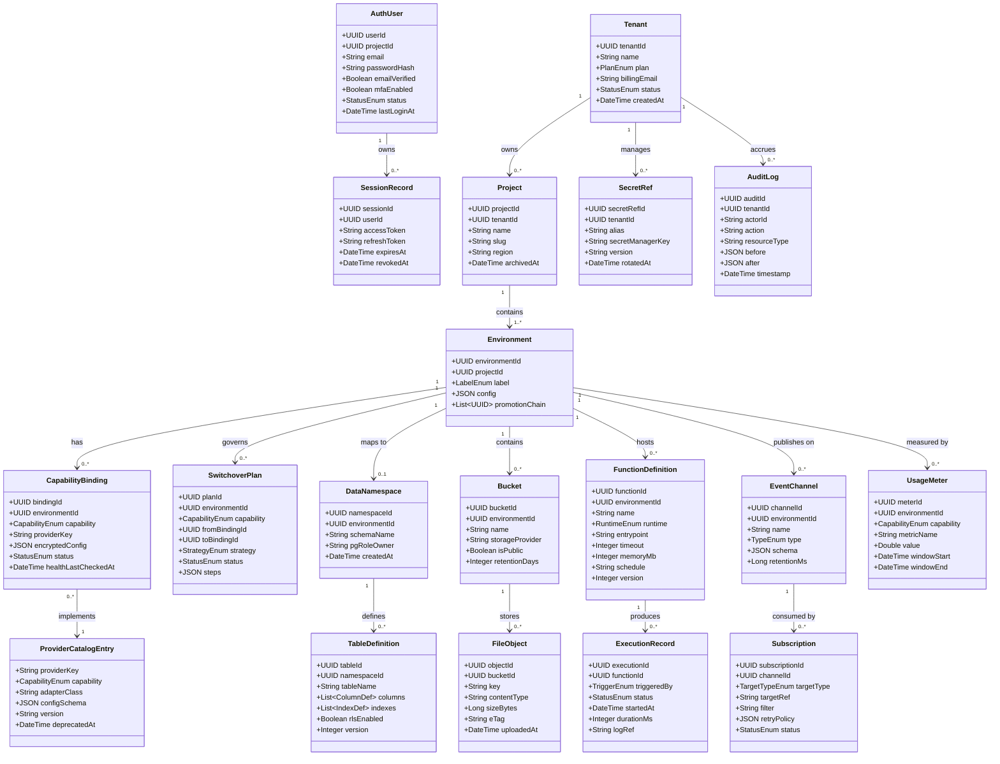

# Domain Model — Backend as a Service (BaaS) Platform

## 1. Introduction

This document defines the canonical domain model for the BaaS Platform. The platform is organised around **multi-tenant project management** with pluggable external capability providers and a PostgreSQL-backed runtime. Each domain concept is mapped to a bounded context, an owning microservice, and a set of domain events and invariants.

Domain boundaries are drawn around **capability** (what the platform does for a developer), **tenancy** (who owns what), and **operations** (how the platform manages provider health and compliance). Cross-context communication is always event-driven; synchronous calls are permitted only within a single bounded context.

---

## 2. Bounded Context Map

---

## 3. Core Aggregates

### 3.1 Tenant
The root multi-tenancy concept. A Tenant owns one or more Projects and is the billing/contract unit.

**Fields:** `tenantId` (UUID), `name` (string), `plan` (enum: FREE | PRO | ENTERPRISE), `billingEmail`, `createdAt`, `status` (ACTIVE | SUSPENDED | DELETED)

**Invariants:**
- A Tenant must have at least one verified billing email before activating paid features.
- A suspended Tenant's Projects are read-only.
- `tenantId` is immutable once assigned.

**Domain Events:** `TenantCreated`, `TenantSuspended`, `TenantPlanUpgraded`, `TenantDeleted`

---

### 3.2 Project
A named grouping of Environments under a Tenant. Represents a developer's application.

**Fields:** `projectId`, `tenantId`, `name`, `slug` (unique per Tenant), `region`, `createdAt`, `archivedAt`

**Invariants:**
- `slug` is unique within the Tenant namespace and immutable after first API call.
- A Project must belong to exactly one Tenant.
- Archiving a Project does not delete underlying data; it freezes writes.

**Domain Events:** `ProjectCreated`, `ProjectArchived`, `ProjectDeleted`

---

### 3.3 Environment
A deployment stage (e.g., dev, staging, production) within a Project. Holds capability bindings.

**Fields:** `environmentId`, `projectId`, `label` (DEV | STAGING | PRODUCTION | CUSTOM), `config` (JSON), `promotionChain` (ordered list of environmentIds)

**Invariants:**
- A PRODUCTION Environment requires at least one confirmed SwitchoverPlan for each CapabilityBinding.
- Environment config overrides project-level defaults.
- Only one active promotion per environment pair at any time.

**Domain Events:** `EnvironmentProvisioned`, `EnvironmentConfigUpdated`, `EnvironmentPromotionStarted`, `EnvironmentPromotionCompleted`

---

### 3.4 CapabilityBinding
Links an Environment to a specific external provider for a given capability (Auth, DB, Storage, Functions, Events).

**Fields:** `bindingId`, `environmentId`, `capability` (enum), `providerKey`, `config` (encrypted JSON), `status` (PENDING | ACTIVE | DEGRADED | INACTIVE), `healthLastCheckedAt`, `activatedAt`

**Invariants:**
- At most one ACTIVE binding per (environmentId, capability) pair.
- A binding may not be activated until its readiness probe succeeds.
- `config` must reference a `SecretRef` for any credential field; plaintext credentials are rejected.

**Domain Events:** `BindingActivated`, `BindingDegraded`, `BindingDeactivated`, `BindingReadinessVerified`

---

### 3.5 ProviderCatalogEntry
A registered provider plugin available for binding (e.g., Supabase-Postgres, AWS S3, Cloudflare R2).

**Fields:** `providerKey` (unique slug), `capability`, `adapterClass`, `configSchema` (JSON Schema), `version`, `deprecatedAt`

**Invariants:**
- `providerKey` is globally unique and immutable.
- Deprecating a catalog entry must not break existing active bindings.

**Domain Events:** `ProviderRegistered`, `ProviderDeprecated`

---

### 3.6 SwitchoverPlan
Describes the steps for safely switching a CapabilityBinding from one provider to another with rollback capability.

**Fields:** `planId`, `environmentId`, `capability`, `fromBindingId`, `toBindingId`, `strategy` (BLUE_GREEN | CANARY | IMMEDIATE), `rollbackTrigger` (ERROR_RATE_THRESHOLD | MANUAL), `status` (DRAFT | APPROVED | IN_PROGRESS | COMPLETED | ROLLED_BACK), `steps` (JSON)

**Invariants:**
- A SwitchoverPlan requires APPROVED status before execution.
- Only one plan per (environmentId, capability) may be IN_PROGRESS at a time.
- A rollback target must be a previously ACTIVE binding.

**Domain Events:** `SwitchoverPlanApproved`, `SwitchoverStarted`, `SwitchoverCompleted`, `SwitchoverRolledBack`

---

### 3.7 AuthUser
Represents a registered end-user in a Project's auth namespace.

**Fields:** `userId`, `projectId`, `email`, `phoneNumber`, `passwordHash`, `emailVerified`, `mfaEnabled`, `providers` (list of federated providers), `createdAt`, `lastLoginAt`, `status` (ACTIVE | BANNED | PENDING_VERIFICATION)

**Invariants:**
- Email or phone must be present; both may coexist.
- `passwordHash` must use bcrypt/argon2; MD5/SHA1 are rejected at the boundary.
- A BANNED user's sessions are immediately invalidated.

**Domain Events:** `UserRegistered`, `UserEmailVerified`, `UserBanned`, `UserPasswordReset`, `UserMfaEnabled`

---

### 3.8 SessionRecord
A short-lived token record tying an AuthUser to an active session.

**Fields:** `sessionId`, `userId`, `projectId`, `accessToken` (JWT, signed), `refreshToken` (opaque), `expiresAt`, `ipAddress`, `userAgent`, `revokedAt`

**Invariants:**
- A revoked session may not be refreshed.
- `expiresAt` must be in the future at creation.
- One user may hold up to 10 concurrent sessions (configurable per Project).

**Domain Events:** `SessionCreated`, `SessionRefreshed`, `SessionRevoked`

---

### 3.9 DataNamespace
Maps to a PostgreSQL schema within the platform's cluster for a given Environment's database capability.

**Fields:** `namespaceId`, `environmentId`, `schemaName` (unique per cluster), `encoding`, `collation`, `pgRoleOwner`, `createdAt`

**Invariants:**
- `schemaName` is derived from `environmentId` with a sanitised slug; never user-supplied verbatim.
- Dropping a DataNamespace triggers a 7-day soft-delete retention period.

**Domain Events:** `NamespaceCreated`, `NamespaceDropped`

---

### 3.10 TableDefinition
The schema definition for a developer-managed table within a DataNamespace.

**Fields:** `tableId`, `namespaceId`, `tableName`, `columns` (list of ColumnDef), `indexes` (list of IndexDef), `rlsEnabled`, `rlsPolicies` (list), `createdAt`, `updatedAt`, `version` (monotonic integer)

**Invariants:**
- Column names follow `snake_case`; camelCase is rejected.
- At least one column must be designated as the primary key.
- RLS must be explicitly enabled; tables are secure-by-default (no anonymous read).
- Schema version increments on every DDL change.

**Domain Events:** `TableCreated`, `ColumnAdded`, `ColumnDropped`, `IndexCreated`, `RLSPolicyUpdated`

---

### 3.11 FileObject
An immutable file stored in a Bucket, addressable by key.

**Fields:** `objectId`, `bucketId`, `key` (path-like), `contentType`, `sizeBytes`, `eTag`, `storageBackendRef`, `uploadedBy` (userId or serviceAccountId), `uploadedAt`, `deletedAt`

**Invariants:**
- `key` is unique within a Bucket and immutable after upload.
- `sizeBytes` must match the actual bytes received; uploads failing checksum are rejected.
- Soft-deleted objects are not returned by list operations; purged after retention period.

**Domain Events:** `ObjectUploaded`, `ObjectDeleted`, `ObjectRestored`

---

### 3.12 Bucket
A namespace for FileObjects within a Project/Environment.

**Fields:** `bucketId`, `environmentId`, `name`, `storageProvider`, `region`, `maxSizeBytes`, `allowedMimeTypes` (list), `isPublic`, `retentionDays`, `createdAt`

**Invariants:**
- Bucket names are unique within an Environment.
- Changing `storageProvider` requires a SwitchoverPlan.
- Public buckets bypass signed-URL requirements but still respect per-object ACLs.

**Domain Events:** `BucketCreated`, `BucketPolicyUpdated`, `BucketDeleted`

---

### 3.13 FunctionDefinition
A deployable serverless function associated with an Environment.

**Fields:** `functionId`, `environmentId`, `name`, `runtime` (node18 | python311 | go121 | rust | custom), `entrypoint`, `artifactRef`, `envVars` (list of SecretRef or plaintext), `timeout`, `memoryMb`, `schedule` (cron or null), `version`, `deployedAt`

**Invariants:**
- `timeout` may not exceed the Environment's plan-level maximum.
- `envVars` with secret values must reference a SecretRef; plaintext values are only allowed for non-sensitive config.
- A FunctionDefinition must be in ACTIVE state before scheduling.

**Domain Events:** `FunctionDeployed`, `FunctionUpdated`, `FunctionDeleted`, `FunctionScheduleSet`

---

### 3.14 ExecutionRecord
An immutable audit record of a single function invocation.

**Fields:** `executionId`, `functionId`, `environmentId`, `triggeredBy` (HTTP | SCHEDULE | EVENT), `status` (QUEUED | RUNNING | SUCCESS | FAILED | TIMEOUT), `startedAt`, `completedAt`, `durationMs`, `exitCode`, `logRef`, `errorMessage`

**Invariants:**
- ExecutionRecord is append-only; status transitions are one-way.
- `logRef` points to an immutable log blob; never stored inline.

**Domain Events:** `ExecutionQueued`, `ExecutionStarted`, `ExecutionCompleted`, `ExecutionFailed`

---

### 3.15 EventChannel
A named logical pub/sub channel within an Environment.

**Fields:** `channelId`, `environmentId`, `name`, `type` (SYSTEM | USER_DEFINED), `brokerBinding` (references CapabilityBinding for events capability), `schema` (JSON Schema, optional), `retentionMs`, `createdAt`

**Invariants:**
- Channel names starting with `baas.` are reserved for system events.
- Schema validation, if set, is enforced at publish time.

**Domain Events:** `ChannelCreated`, `ChannelSchemaUpdated`, `ChannelDeleted`

---

### 3.16 Subscription
A durable consumer subscription to an EventChannel, routing events to a target (webhook URL, function, queue).

**Fields:** `subscriptionId`, `channelId`, `targetType` (WEBHOOK | FUNCTION | QUEUE), `targetRef`, `filter` (JMESPath expression), `retryPolicy` (maxAttempts, backoffMs), `status` (ACTIVE | PAUSED | DEAD), `createdAt`

**Invariants:**
- A Subscription to a FUNCTION target must reference a FunctionDefinition in the same Environment.
- Dead subscriptions must be explicitly reactivated; they do not self-heal.
- Filter expressions must compile without error before activation.

**Domain Events:** `SubscriptionCreated`, `SubscriptionPaused`, `SubscriptionDied`, `SubscriptionReactivated`

---

### 3.17 SecretRef
A pointer to a secret stored in an external Secret Manager; never stores the secret value itself.

**Fields:** `secretRefId`, `tenantId`, `alias`, `secretManagerKey` (path in Vault/AWS SSM/GCP SM), `version`, `rotatedAt`, `createdBy`

**Invariants:**
- The platform never persists secret values; only `secretManagerKey` pointers are stored.
- `alias` is unique per Tenant.

**Domain Events:** `SecretRefCreated`, `SecretRefRotated`, `SecretRefDeleted`

---

### 3.18 AuditLog
Immutable, tamper-evident record of all control-plane and data-plane mutations.

**Fields:** `auditId`, `tenantId`, `projectId`, `actorId`, `actorType` (USER | SERVICE_ACCOUNT | SYSTEM), `action`, `resourceType`, `resourceId`, `before` (JSON snapshot), `after` (JSON snapshot), `timestamp`, `requestId`, `ipAddress`

**Invariants:**
- AuditLog entries are append-only; no update or delete is permitted.
- `before`/`after` snapshots are encrypted at rest.
- Retention minimum is 90 days for FREE, 1 year for PRO/ENTERPRISE.

**Domain Events:** `AuditEntryWritten` (consumed by compliance export pipelines)

---

### 3.19 UsageMeter
Tracks resource consumption per Environment for billing and quota enforcement.

**Fields:** `meterId`, `environmentId`, `capability`, `metricName` (FUNCTION_INVOCATIONS | STORAGE_GB | DB_READ_UNITS | DB_WRITE_UNITS | EGRESS_GB), `value`, `windowStart`, `windowEnd`, `unit`

**Invariants:**
- Meter values are monotonically non-decreasing within a window.
- A quota breach emits a `QuotaExceeded` event, which may trigger throttling.

**Domain Events:** `UsageSampled`, `QuotaExceeded`, `QuotaReset`

---

## 4. Full Class Diagram

---

## 5. Value Objects

| Value Object | Belongs To | Description |
|---|---|---|
| `ColumnDef` | TableDefinition | `{name, pgType, nullable, default, unique}` |
| `IndexDef` | TableDefinition | `{name, columns[], type: BTREE/GIN/GIST, unique}` |
| `RLSPolicy` | TableDefinition | `{name, command: SELECT/INSERT/UPDATE/DELETE, expression}` |
| `RetryPolicy` | Subscription | `{maxAttempts, initialDelayMs, backoffMultiplier, maxDelayMs}` |
| `PromotionChain` | Environment | Ordered list of environment IDs forming a pipeline |
| `PlanQuota` | Tenant | `{maxProjects, maxEnvsPerProject, maxFunctionInvocations, storageGb}` |
| `HealthProbeResult` | CapabilityBinding | `{probeId, checkedAt, latencyMs, success, errorCode}` |
| `ArtifactRef` | FunctionDefinition | `{registryUrl, digest, sizeBytes, pushedAt}` |
| `JWTClaims` | SessionRecord | `{sub, iss, aud, exp, iat, jti, customClaims}` |
| `CronExpression` | FunctionDefinition | Validated POSIX cron string with timezone |

---

## 6. Domain Events Summary

| Aggregate | Domain Events |
|---|---|
| Tenant | TenantCreated, TenantSuspended, TenantPlanUpgraded, TenantDeleted |
| Project | ProjectCreated, ProjectArchived, ProjectDeleted |
| Environment | EnvironmentProvisioned, EnvironmentConfigUpdated, EnvironmentPromotionStarted, EnvironmentPromotionCompleted |
| CapabilityBinding | BindingActivated, BindingDegraded, BindingDeactivated, BindingReadinessVerified |
| ProviderCatalogEntry | ProviderRegistered, ProviderDeprecated |
| SwitchoverPlan | SwitchoverPlanApproved, SwitchoverStarted, SwitchoverCompleted, SwitchoverRolledBack |
| AuthUser | UserRegistered, UserEmailVerified, UserBanned, UserPasswordReset, UserMfaEnabled |
| SessionRecord | SessionCreated, SessionRefreshed, SessionRevoked |
| DataNamespace | NamespaceCreated, NamespaceDropped |
| TableDefinition | TableCreated, ColumnAdded, ColumnDropped, IndexCreated, RLSPolicyUpdated |
| FileObject | ObjectUploaded, ObjectDeleted, ObjectRestored |
| Bucket | BucketCreated, BucketPolicyUpdated, BucketDeleted |
| FunctionDefinition | FunctionDeployed, FunctionUpdated, FunctionDeleted, FunctionScheduleSet |
| ExecutionRecord | ExecutionQueued, ExecutionStarted, ExecutionCompleted, ExecutionFailed |
| EventChannel | ChannelCreated, ChannelSchemaUpdated, ChannelDeleted |
| Subscription | SubscriptionCreated, SubscriptionPaused, SubscriptionDied, SubscriptionReactivated |
| SecretRef | SecretRefCreated, SecretRefRotated, SecretRefDeleted |
| AuditLog | AuditEntryWritten |
| UsageMeter | UsageSampled, QuotaExceeded, QuotaReset |

---

## 7. Aggregate-to-Microservice Mapping

| Aggregate | Owning Microservice | Storage | Notes |
|---|---|---|---|
| Tenant | control-plane-svc | PostgreSQL (control schema) | Single source of truth |
| Project | control-plane-svc | PostgreSQL (control schema) | |
| Environment | control-plane-svc | PostgreSQL (control schema) | |
| CapabilityBinding | control-plane-svc | PostgreSQL (control schema) | Encrypted config via SecretRef |
| ProviderCatalogEntry | control-plane-svc | PostgreSQL (control schema) | Seed data + operator-managed |
| SwitchoverPlan | control-plane-svc | PostgreSQL (control schema) | Approval workflow embedded |
| AuthUser | auth-svc | PostgreSQL (per-project schema) | Isolated per project |
| SessionRecord | auth-svc | PostgreSQL + Redis (hot cache) | Redis for fast revocation |
| DataNamespace | data-svc | PostgreSQL (control schema) | Mirrors actual PG schema |
| TableDefinition | data-svc | PostgreSQL (control schema) | DDL applied to data cluster |
| FileObject | storage-svc | PostgreSQL (control schema) + object store | Metadata in PG, bytes external |
| Bucket | storage-svc | PostgreSQL (control schema) | |
| FunctionDefinition | functions-svc | PostgreSQL (control schema) | Artifact in registry |
| ExecutionRecord | functions-svc | PostgreSQL (functions schema) | Append-only partition table |
| EventChannel | events-svc | PostgreSQL (control schema) | |
| Subscription | events-svc | PostgreSQL (control schema) | |
| SecretRef | secrets-svc | PostgreSQL (control schema) | Values in external vault |
| AuditLog | audit-svc | PostgreSQL (audit schema, append-only) | Partitioned by month |
| UsageMeter | metering-svc | TimescaleDB / PostgreSQL + hypertable | 1-min resolution |
