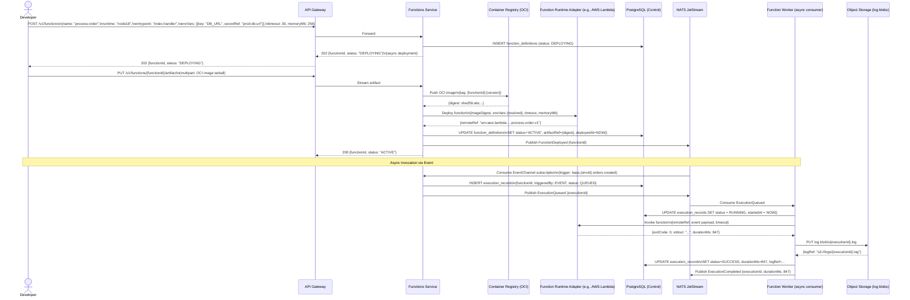

# System Sequence Diagrams — Backend as a Service (BaaS) Platform

---

## Diagram 1: Tenant Onboarding and Environment Provisioning

```mermaid
sequenceDiagram
    actor DEV as Developer
    participant GW as API Gateway
    participant CPS as Control Plane Service
    participant SEC as Secrets Service
    participant VAULT as HashiCorp Vault
    participant PG as PostgreSQL (Control)
    participant NATS as NATS JetStream
    participant AUTH as Auth Service
    participant DATA as Data Service

    DEV->>GW: POST /v1/tenants\n{name, billingEmail, plan: "PRO"}
    GW->>CPS: Forward (unauthenticated onboarding endpoint)
    CPS->>PG: INSERT tenants (status: PENDING_VERIFICATION)
    PG-->>CPS: tenantId generated
    CPS->>NATS: Publish TenantCreated {tenantId}
    CPS-->>GW: 201 {tenantId, apiKey (plaintext, one-time)}
    GW-->>DEV: 201 {tenantId, apiKey}

    DEV->>GW: POST /v1/tenants/{tenantId}/projects\n{name, slug, region}\nAuthorization: ApiKey
    GW->>CPS: Forward + inject x-tenant-id header
    CPS->>PG: INSERT projects
    CPS->>NATS: Publish ProjectCreated
    CPS-->>GW: 201 {projectId}
    GW-->>DEV: 201 {projectId}

    DEV->>GW: POST /v1/projects/{projectId}/environments\n{label: "PRODUCTION"}
    GW->>CPS: Forward
    CPS->>PG: INSERT environments
    CPS->>SEC: Create Vault namespace for environment\nbaas/{tenantId}/env/{envId}/
    SEC->>VAULT: sys/namespaces PUT
    VAULT-->>SEC: Namespace created
    CPS->>NATS: Publish EnvironmentProvisioned {envId, projectId, tenantId}
    NATS-->>AUTH: Consume EnvironmentProvisioned → create auth project namespace
    NATS-->>DATA: Consume EnvironmentProvisioned → create PG schema env_{envId}
    AUTH->>PG: CREATE SCHEMA auth_{envId}; CREATE ROLE auth_{envId}_role
    DATA->>PG: CREATE SCHEMA env_{envId}; CREATE ROLE env_{envId}_role;\nALTER DEFAULT PRIVILEGES... ENABLE RLS
    CPS-->>GW: 201 {environmentId}
    GW-->>DEV: 201 {environmentId}
```

### Key Design Decisions

| Decision | Rationale |
|---|---|
| `TenantCreated` event triggers no side effects synchronously | Allows async service initialization without coupling Control Plane to every runtime service |
| `EnvironmentProvisioned` fan-out via NATS | Auth and Data services self-provision their namespaces; Control Plane does not need to know about each consumer |
| Vault namespace created synchronously before event | Ensures secret path exists before any CapabilityBinding is created; avoids race condition |
| API key returned once in plaintext | Follows zero-knowledge principle; key is hashed and stored; developer must store it immediately |
| PostgreSQL schema + role per environment | Provides hard isolation boundary; RLS roles prevent cross-environment data access even for platform bugs |

---

## Diagram 2: Provider Binding and Readiness Verification

```mermaid
sequenceDiagram
    actor DEV as Developer
    participant GW as API Gateway
    participant CPS as Control Plane Service
    participant PROV as Provider Registry
    participant SEC as Secrets Service
    participant VAULT as HashiCorp Vault
    participant ADAPT as DB Adapter (e.g., RDS Postgres)
    participant PG as PostgreSQL (Control)
    participant NATS as NATS JetStream

    DEV->>GW: POST /v1/environments/{envId}/bindings\n{capability: "DATABASE",\nproviderKey: "aws-rds-postgres",\nconfig: {host, port, dbName,\ncredentials: {secretRef: "prod-db-pass"}}}
    GW->>CPS: Forward

    CPS->>PROV: GET catalog entry for "aws-rds-postgres"
    PROV-->>CPS: ProviderCatalogEntry {configSchema, adapterClass}

    CPS->>CPS: Validate config against JSON Schema
    Note over CPS: Validation passes

    CPS->>SEC: Resolve SecretRef "prod-db-pass"
    SEC->>VAULT: GET baas/{tenantId}/prod-db-pass
    VAULT-->>SEC: {value: "s3cr3t"}
    SEC-->>CPS: Resolved credential (in-memory only)

    CPS->>PG: INSERT bindings (status: PENDING, encryptedConfig)
    CPS->>ADAPT: Run readiness probe:\nCONNECT with resolved credentials\nSELECT 1; check latency < 500ms
    ADAPT-->>CPS: HealthProbeResult {success: true, latencyMs: 42}

    CPS->>PG: UPDATE bindings SET status = 'ACTIVE', healthLastCheckedAt = NOW()
    CPS->>NATS: Publish BindingActivated {bindingId, envId, capability: "DATABASE"}
    CPS-->>GW: 201 {bindingId, status: "ACTIVE", probeLatencyMs: 42}
    GW-->>DEV: 201 {bindingId, status: "ACTIVE"}

    Note over CPS,ADAPT: Background: Probe scheduler runs every 60s
    PROV->>ADAPT: Re-run health probe
    ADAPT-->>PROV: HealthProbeResult {success: false, error: "connection refused"}
    PROV->>PG: UPDATE bindings SET status = 'DEGRADED'
    PROV->>NATS: Publish BindingDegraded {bindingId}
```

### Key Design Decisions

| Decision | Rationale |
|---|---|
| Config validated against JSON Schema before storing | Prevents binding creation with structurally invalid config; fails fast at developer time |
| Credentials resolved in-memory, never persisted in binding record | Zero-knowledge: DB stores only the SecretRef alias; actual passwords never touch platform DB |
| Readiness probe is synchronous on first bind | Provides immediate feedback to developer; they know right away if credentials are wrong |
| Background probe runs every 60s | Detects provider degradation without waiting for a user request to fail |
| `BindingDegraded` event triggers SLO Engine | Allows automated switchover trigger if degradation persists beyond threshold |

---

## Diagram 3: User Registration via Auth Facade

```mermaid
sequenceDiagram
    actor USER as End User (Browser / Mobile)
    participant GW as API Gateway
    participant AUTH as Auth Service
    participant ADAPT as Auth Adapter (Email/Password)
    participant PG as PostgreSQL (Data Plane, auth schema)
    participant REDIS as Redis Cluster
    participant EMAIL as Email Provider (SES/SendGrid)
    participant NATS as NATS JetStream
    participant METR as Metering Service

    USER->>GW: POST /v1/projects/{projectId}/auth/register\n{email, password}
    GW->>GW: Validate JWT (project-scope token from SDK)
    GW->>AUTH: Forward + x-project-id: {projectId}

    AUTH->>ADAPT: Validate email format; check password strength policy
    ADAPT-->>AUTH: Validation result (pass)

    AUTH->>PG: SELECT * FROM auth_{envId}.users WHERE email = ?
    PG-->>AUTH: No rows (email not in use)

    AUTH->>ADAPT: Hash password with argon2id (time=2, memory=64MB, threads=1)
    ADAPT-->>AUTH: {passwordHash}

    AUTH->>PG: INSERT INTO auth_{envId}.users\n{userId, email, passwordHash,\nstatus: PENDING_VERIFICATION, createdAt}
    PG-->>AUTH: userId

    AUTH->>EMAIL: Send verification email\n{to: user@example.com, verifyLink: ...}
    EMAIL-->>AUTH: 202 Accepted

    AUTH->>REDIS: SET verify:{userId} {token} EX 86400
    AUTH->>NATS: Publish UserRegistered {userId, projectId, email}
    NATS-->>METR: Consume UsageSampled {metric: AUTH_REGISTRATIONS}

    AUTH-->>GW: 201 {userId, status: "PENDING_VERIFICATION"}
    GW-->>USER: 201 {userId, message: "Check your email"}

    Note over USER,AUTH: User clicks verification link
    USER->>GW: GET /v1/projects/{projectId}/auth/verify?token={token}
    GW->>AUTH: Forward
    AUTH->>REDIS: GET verify:{userId}
    REDIS-->>AUTH: token (match confirmed)
    AUTH->>PG: UPDATE users SET status = 'ACTIVE', emailVerified = true
    AUTH->>REDIS: DEL verify:{userId}
    AUTH->>NATS: Publish UserEmailVerified {userId}
    AUTH-->>GW: 200 {message: "Email verified"}
    GW-->>USER: 200 OK
```

### Key Design Decisions

| Decision | Rationale |
|---|---|
| Auth schema isolated per environment (`auth_{envId}`) | Users of different environments cannot bleed across dev/staging/prod; RLS enforced |
| Argon2id for password hashing | Recommended by OWASP 2024; resistant to GPU and ASIC attacks; parameterised by project security policy |
| Verification token stored in Redis, not DB | Fast O(1) lookup; automatic TTL expiry without a cron job |
| Email sending is fire-and-forget (async) | Registration does not block on email delivery; SDK receives immediate 201 |
| `UserRegistered` event drives metering asynchronously | Decouples billing concerns from auth hot path |

---

## Diagram 4: Schema Migration — Dev to Staging Promotion

```mermaid
sequenceDiagram
    actor DEV as Developer
    participant GW as API Gateway
    participant DATA as Data Service
    participant PG_DEV as PostgreSQL (env_dev schema)
    participant PG_STG as PostgreSQL (env_staging schema)
    participant NATS as NATS JetStream
    participant AUDIT as Audit Service
    participant PG_CTL as PostgreSQL (Control)

    DEV->>GW: POST /v1/environments/{envId_dev}/promote\n{targetEnvironmentId: envId_staging,\nresource: "SCHEMA"}
    GW->>DATA: Forward + x-tenant-id, x-project-id

    DATA->>PG_CTL: SELECT environments WHERE id IN (envId_dev, envId_staging)\nValidate same project, valid promotion chain order
    PG_CTL-->>DATA: Both environments valid; promotion allowed

    DATA->>PG_DEV: SELECT table definitions from control schema\nfor env_{envId_dev} (version snapshot)
    PG_DEV-->>DATA: TableDefinitions [{tableName, columns, indexes, rlsPolicies, version}]

    DATA->>PG_CTL: SELECT last applied migration version for env_{envId_staging}
    PG_CTL-->>DATA: stagingVersion = 7; devVersion = 12

    DATA->>DATA: Compute diff: migrations 8..12\nGenerate DDL: ALTER TABLE, CREATE INDEX, etc.
    Note over DATA: Dry-run validation passes

    DATA->>PG_CTL: INSERT INTO schema_promotions\n{source: envId_dev, target: envId_staging,\nfromVersion: 7, toVersion: 12, status: IN_PROGRESS}

    loop For each migration step 8..12
        DATA->>PG_STG: BEGIN;\nSET search_path = env_{envId_staging};\n[DDL statement];\nCOMMIT;
        PG_STG-->>DATA: Statement applied
    end

    DATA->>PG_CTL: UPDATE schema_promotions SET status = COMPLETED\nUPDATE table_definitions SET version = 12 for env_staging
    DATA->>NATS: Publish EnvironmentPromotionCompleted\n{source: envId_dev, target: envId_staging, newVersion: 12}
    NATS-->>AUDIT: Consume → write AuditLog entry\n{action: SCHEMA_PROMOTED, before: v7 snapshot, after: v12 snapshot}
    AUDIT->>PG_CTL: INSERT audit_logs

    DATA-->>GW: 200 {promotionId, migrationsApplied: 5, newVersion: 12}
    GW-->>DEV: 200 {promotionId, newVersion: 12}
```

### Key Design Decisions

| Decision | Rationale |
|---|---|
| Promotion chain validated before execution | Prevents out-of-order promotions (e.g., prod → dev); enforces pipeline discipline |
| Diff computed from stored TableDefinition versions | Platform tracks schema version separately from PG system catalogs; enables deterministic migration |
| Each DDL step in its own transaction | Allows partial rollback visibility; step-level error reporting |
| `EnvironmentPromotionCompleted` event triggers Audit | Full before/after snapshot for compliance; no audit gap during migration |
| Advisory lock on target environment during promotion | Prevents concurrent promotions to the same environment from racing |

---

## Diagram 5: Function Deployment and Async Invocation



### Key Design Decisions

| Decision | Rationale |
|---|---|
| Artifact upload is a separate step from definition creation | Allows pre-registration of function metadata and validation before costly image push |
| 202 Accepted on deploy; polling for status | Deployment to Lambda/Workers is asynchronous; avoids long-held HTTP connections |
| Async invocation via NATS subscription | Decouples triggering event from execution; enables fan-out, buffering, and backpressure |
| Execution logs stored as blobs, not inline | Log volumes can be large; blob storage is cheaper and avoids bloating the PostgreSQL execution table |
| `ExecutionRecord` is append-only | Provides tamper-evident audit trail; status transitions are one-way and never edited |

---

## Diagram 6: Provider Switchover with Rollback Scenario

```mermaid
sequenceDiagram
    actor OPS as Platform Operator
    participant GW as API Gateway
    participant CPS as Control Plane Service
    participant ADAPT_OLD as Old DB Adapter (Neon)
    participant ADAPT_NEW as New DB Adapter (AWS RDS)
    participant PG as PostgreSQL (Control)
    participant NATS as NATS JetStream
    participant SLO as SLO Engine
    participant TSDB as TimescaleDB
    participant ALERT as Alertmanager

    OPS->>GW: POST /v1/switchover-plans\n{environmentId, capability: DATABASE,\nfromBindingId: binding-neon,\ntoBindingId: binding-rds,\nstrategy: CANARY,\nrollbackTrigger: {metric: ERROR_RATE, threshold: 0.05}}
    GW->>CPS: Forward

    CPS->>PG: INSERT switchover_plans (status: DRAFT)
    CPS-->>GW: 201 {planId, status: "DRAFT"}
    GW-->>OPS: 201 {planId}

    OPS->>GW: PUT /v1/switchover-plans/{planId}/approve
    GW->>CPS: Forward
    CPS->>PG: UPDATE switchover_plans SET status = APPROVED
    CPS->>NATS: Publish SwitchoverPlanApproved {planId}
    CPS-->>GW: 200 {status: "APPROVED"}

    OPS->>GW: POST /v1/switchover-plans/{planId}/execute
    GW->>CPS: Forward
    CPS->>PG: UPDATE switchover_plans SET status = IN_PROGRESS
    CPS->>NATS: Publish SwitchoverStarted {planId}

    Note over CPS,ADAPT_NEW: CANARY Phase 1: Route 10% traffic to RDS
    CPS->>ADAPT_OLD: Set traffic weight: 90%
    CPS->>ADAPT_NEW: Activate binding-rds (10% weight)
    ADAPT_NEW-->>CPS: Probe OK; routing started

    Note over CPS,TSDB: Monitor for 5 minutes
    SLO->>TSDB: Query error_rate for binding-rds (last 5m)
    TSDB-->>SLO: error_rate = 0.12 (exceeds threshold 0.05)
    SLO->>NATS: Publish RollbackTriggerFired {planId, metric: ERROR_RATE, value: 0.12}

    CPS->>NATS: Consume RollbackTriggerFired
    CPS->>ADAPT_NEW: Set traffic weight: 0% (drain)
    CPS->>ADAPT_OLD: Set traffic weight: 100% (restore)
    CPS->>PG: UPDATE bindings SET status = DEGRADED WHERE id = binding-rds
    CPS->>PG: UPDATE bindings SET status = ACTIVE WHERE id = binding-neon
    CPS->>PG: UPDATE switchover_plans SET status = ROLLED_BACK, rollbackAt = NOW()
    CPS->>NATS: Publish SwitchoverRolledBack {planId, reason: "ERROR_RATE_EXCEEDED: 12%"}

    NATS-->>ALERT: Consume SwitchoverRolledBack → fire PagerDuty alert
    ALERT->>OPS: 🚨 Switchover rolled back: ERROR_RATE 12% on binding-rds\nEnvironment: prod, Plan: {planId}

    CPS-->>GW: 200 {status: "ROLLED_BACK", errorRate: 0.12}
    GW-->>OPS: 200 {status: "ROLLED_BACK"}
```

### Key Design Decisions

| Decision | Rationale |
|---|---|
| CANARY strategy routes traffic gradually (10% → 50% → 100%) | Limits blast radius of a bad provider; errors surface on small fraction of traffic before full cutover |
| Rollback trigger based on real-time SLO metric | Automated rollback removes human reaction time from the loop for fast-degrading providers |
| Traffic weights applied at adapter layer, not network layer | Allows switchover without DNS changes or load balancer reconfiguration; purely in-process routing |
| Old binding restored to ACTIVE on rollback | Previous binding state is preserved; rollback is a valid transition, not a delete-and-recreate |
| `SwitchoverRolledBack` event drives PagerDuty alert | Operator is notified with rich context (error rate, environment, plan details) for post-mortem |
| Switchover plan requires explicit APPROVE step | Two-person rule for production changes; draft plans cannot be accidentally executed |
