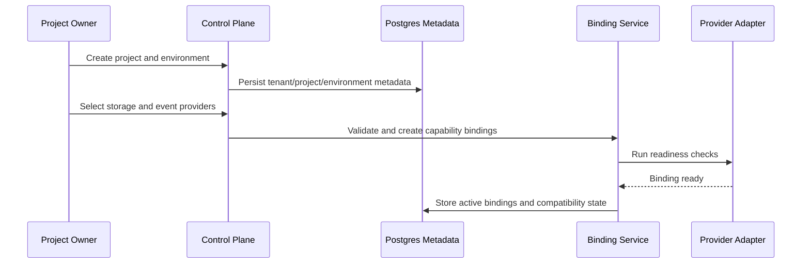
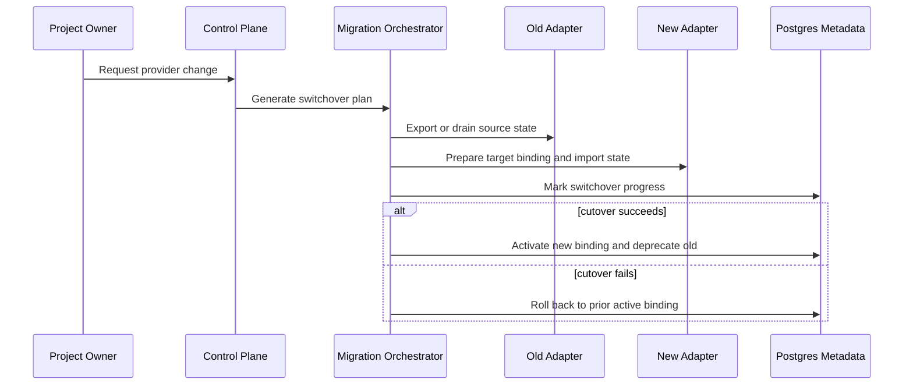

# System Sequence Diagram - Backend as a Service Platform

## Project Setup and Binding Sequence

```mermaid
sequenceDiagram
    participant Owner as Project Owner
    participant CP as Control Plane
    participant Meta as Postgres Metadata
    participant Bind as Binding Service
    participant Adapter as Provider Adapter

    Owner->>CP: Create project and environment
    CP->>Meta: Persist tenant/project/environment metadata
    Owner->>CP: Select storage and event providers
    CP->>Bind: Validate and create capability bindings
    Bind->>Adapter: Run readiness checks
    Adapter-->>Bind: Binding ready
    Bind->>Meta: Store active bindings and compatibility state
```

## Provider Switchover Sequence

```mermaid
sequenceDiagram
    participant Owner as Project Owner
    participant CP as Control Plane
    participant Mig as Migration Orchestrator
    participant Old as Old Adapter
    participant New as New Adapter
    participant Meta as Postgres Metadata

    Owner->>CP: Request provider change
    CP->>Mig: Generate switchover plan
    Mig->>Old: Export or drain source state
    Mig->>New: Prepare target binding and import state
    Mig->>Meta: Mark switchover progress
    alt cutover succeeds
        Mig->>Meta: Activate new binding and deprecate old
    else cutover fails
        Mig->>Meta: Roll back to prior active binding
    end
```
