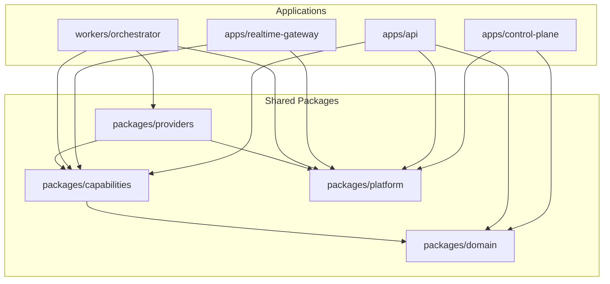
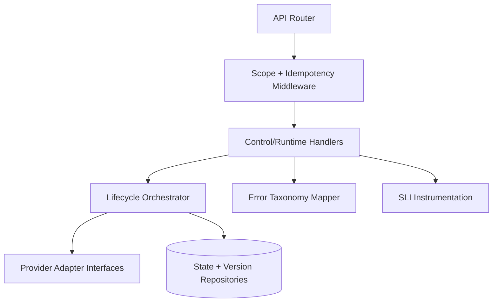

# C4 Code Diagram - Backend as a Service Platform

```mermaid
flowchart TB
    subgraph apps[Applications]
        api[apps/api]
        control[apps/control-plane]
        realtime[apps/realtime-gateway]
        workers[workers/orchestrator]
    end

    subgraph packages[Shared Packages]
        domain[packages/domain]
        capabilities[packages/capabilities]
        providers[packages/providers]
        platform[packages/platform]
    end

    control --> domain
    control --> platform
    api --> domain
    api --> capabilities
    api --> platform
    realtime --> capabilities
    realtime --> platform
    workers --> capabilities
    workers --> providers
    workers --> platform
    capabilities --> domain
    providers --> capabilities
    providers --> platform
```

## Code-Level Addendum

```mermaid
graph TD
    Router[API Router] --> Middleware[Scope + Idempotency Middleware]
    Middleware --> Handlers[Control/Runtime Handlers]
    Handlers --> Orchestrator[Lifecycle Orchestrator]
    Orchestrator --> Adapters[Provider Adapter Interfaces]
    Handlers --> Errors[Error Taxonomy Mapper]
    Handlers --> Metrics[SLI Instrumentation]
    Orchestrator --> Repo[(State + Version Repositories)]
```
