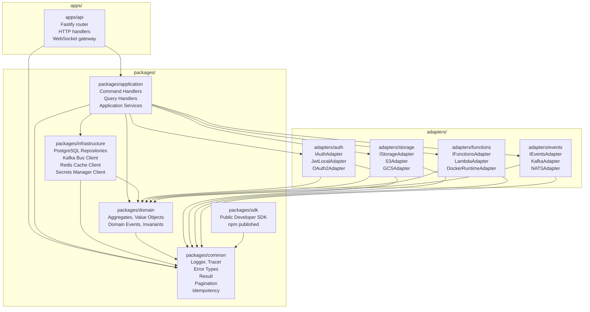

# C4 Code Diagram – Backend as a Service Platform

## Module Dependency Graph (API Service)



## Module Interface Contracts

### `packages/domain` Exports
```typescript
// Aggregates
export class Tenant { id: TenantId; name: string; plan: PlanTier; createdAt: Date }
export class Project { id: ProjectId; tenantId: TenantId; name: string; state: ProjectState }
export class Environment { id: EnvId; projectId: ProjectId; tier: EnvTier; state: EnvState }
export class CapabilityBinding { id: BindingId; envId: EnvId; capabilityKey: string; providerKey: string; state: BindingState }
export class AuthUser { id: UserId; projectId: ProjectId; email: Email; state: UserState }
export class SessionRecord { id: SessionId; userId: UserId; expiresAt: Date; state: SessionState }
export class DataNamespace { id: NamespaceId; envId: EnvId; schemaName: string }
export class FileObject { id: FileId; bucketId: BucketId; path: string; sizeBytes: number }
export class FunctionDefinition { id: FunctionId; envId: EnvId; name: string; runtime: string; state: FunctionState }
export class ExecutionRecord { id: ExecutionId; functionId: FunctionId; state: ExecutionState; durationMs: number }
export class EventChannel { id: ChannelId; envId: EnvId; name: string; type: ChannelType }
// Domain events
export class ProjectCreated implements DomainEvent { ... }
export class CapabilityBindingActivated implements DomainEvent { ... }
export class UserRegistered implements DomainEvent { ... }
// Value objects
export type TenantId = string & { readonly __brand: 'TenantId' }
export type ProjectId = string & { readonly __brand: 'ProjectId' }
export type Email = string & { readonly __brand: 'Email' }
```

### `packages/application` Exports
```typescript
export class ProjectService {
  createProject(cmd: CreateProjectCommand): Promise<Result<Project, DomainError>>
  deleteProject(cmd: DeleteProjectCommand): Promise<Result<void, DomainError>>
  addEnvironment(cmd: AddEnvironmentCommand): Promise<Result<Environment, DomainError>>
}
export class CapabilityBindingService {
  createBinding(cmd: CreateBindingCommand): Promise<Result<CapabilityBinding, DomainError>>
  startSwitchover(cmd: StartSwitchoverCommand): Promise<Result<SwitchoverPlan, DomainError>>
  rollbackSwitchover(cmd: RollbackSwitchoverCommand): Promise<Result<void, DomainError>>
}
export class AuthApplicationService {
  registerUser(cmd: RegisterUserCommand): Promise<Result<AuthUser, DomainError>>
  createSession(cmd: CreateSessionCommand): Promise<Result<SessionRecord, DomainError>>
  revokeSession(cmd: RevokeSessionCommand): Promise<Result<void, DomainError>>
}
export class DataApiService {
  createNamespace(cmd: CreateNamespaceCommand): Promise<Result<DataNamespace, DomainError>>
  executeQuery(cmd: ExecuteQueryCommand): Promise<Result<QueryResult, DomainError>>
  runMigration(cmd: RunMigrationCommand): Promise<Result<MigrationResult, DomainError>>
}
export class StorageFacadeService {
  createBucket(cmd: CreateBucketCommand): Promise<Result<Bucket, DomainError>>
  initiateUpload(cmd: InitiateUploadCommand): Promise<Result<UploadIntent, DomainError>>
  generateSignedUrl(cmd: GenerateSignedUrlCommand): Promise<Result<SignedUrl, DomainError>>
}
export class FunctionsFacadeService {
  registerFunction(cmd: RegisterFunctionCommand): Promise<Result<FunctionDefinition, DomainError>>
  invokeFunction(cmd: InvokeFunctionCommand): Promise<Result<ExecutionRecord, DomainError>>
}
export class EventsFacadeService {
  createChannel(cmd: CreateChannelCommand): Promise<Result<EventChannel, DomainError>>
  publishMessage(cmd: PublishMessageCommand): Promise<Result<void, DomainError>>
  createSubscription(cmd: CreateSubscriptionCommand): Promise<Result<Subscription, DomainError>>
}
```

### Adapter Interfaces (`adapters/*/index.ts`)
```typescript
// adapters/auth
export interface IAuthAdapter {
  createUser(req: CreateUserRequest): Promise<Result<AdapterUser, AdapterError>>
  verifyCredentials(req: VerifyCredentialsRequest): Promise<Result<AdapterUser, AdapterError>>
  issueToken(req: IssueTokenRequest): Promise<Result<AdapterToken, AdapterError>>
  revokeToken(tokenId: string): Promise<Result<void, AdapterError>>
  capabilities(): AuthCapabilityFlags
}

// adapters/storage
export interface IStorageAdapter {
  createBucket(req: CreateBucketRequest): Promise<Result<void, AdapterError>>
  uploadObject(req: UploadObjectRequest): Promise<Result<ObjectMetadata, AdapterError>>
  downloadObject(req: DownloadObjectRequest): Promise<Result<ReadableStream, AdapterError>>
  generatePresignedUrl(req: PresignedUrlRequest): Promise<Result<string, AdapterError>>
  deleteObject(objectKey: string): Promise<Result<void, AdapterError>>
  copyObject(req: CopyObjectRequest): Promise<Result<void, AdapterError>>
}

// adapters/functions
export interface IFunctionsAdapter {
  deployFunction(req: DeployFunctionRequest): Promise<Result<DeploymentArtifact, AdapterError>>
  invokeFunction(req: InvokeFunctionRequest): Promise<Result<ExecutionResult, AdapterError>>
  getExecutionLogs(executionId: string): Promise<Result<string[], AdapterError>>
  deleteFunction(functionId: string): Promise<Result<void, AdapterError>>
}

// adapters/events
export interface IEventsAdapter {
  createTopic(req: CreateTopicRequest): Promise<Result<void, AdapterError>>
  publishMessage(req: PublishMessageRequest): Promise<Result<void, AdapterError>>
  subscribe(req: SubscribeRequest): Promise<Result<AsyncIterable<Message>, AdapterError>>
  unsubscribe(subscriptionId: string): Promise<Result<void, AdapterError>>
}
```

## Module Responsibility Table

| Module | Exports | Depends On | Design Pattern |
|--------|---------|-----------|----------------|
| `packages/domain` | Aggregates, value objects, domain events | `packages/common` | Domain-Driven Design |
| `packages/application` | Command/query handlers, application services | `domain`, `infrastructure`, `adapters/*`, `common` | CQRS, Application Service |
| `packages/infrastructure` | Repositories, bus clients, cache clients | `domain`, `common` | Repository Pattern |
| `packages/common` | Logger, tracer, Result type, errors | None | Utility |
| `packages/sdk` | Developer-facing SDK classes | `common` | Facade |
| `adapters/auth` | `IAuthAdapter` + implementations | `domain`, `common` | Adapter Pattern |
| `adapters/storage` | `IStorageAdapter` + implementations | `domain`, `common` | Adapter Pattern |
| `adapters/functions` | `IFunctionsAdapter` + implementations | `domain`, `common` | Adapter Pattern |
| `adapters/events` | `IEventsAdapter` + implementations | `domain`, `common` | Adapter Pattern |
| `apps/api` | HTTP routes, middleware | `application`, `common` | MVC / Handler |

## Dependency Injection Wiring

The `apps/api` bootstrap module wires all dependencies at startup using a lightweight DI container (`awilix`):

```typescript
// apps/api/src/container.ts
const container = createContainer();
container.register({
  // Infrastructure
  db: asValue(pgPool),
  redis: asValue(redisClient),
  kafka: asValue(kafkaClient),
  secretsClient: asValue(awsSecretsClient),
  // Adapters (selected per environment binding from DB)
  authAdapter: asClass(OAuth2Adapter).singleton(),
  storageAdapter: asClass(S3Adapter).singleton(),
  functionsAdapter: asClass(LambdaAdapter).singleton(),
  eventsAdapter: asClass(KafkaAdapter).singleton(),
  // Repositories
  projectRepo: asClass(PostgresProjectRepository).singleton(),
  authUserRepo: asClass(PostgresAuthUserRepository).singleton(),
  fileRepo: asClass(PostgresFileRepository).singleton(),
  // Application Services
  projectService: asClass(ProjectService).singleton(),
  authService: asClass(AuthApplicationService).singleton(),
  storageService: asClass(StorageFacadeService).singleton(),
  functionsService: asClass(FunctionsFacadeService).singleton(),
  eventsService: asClass(EventsFacadeService).singleton(),
});
```

## Build and Test Isolation Rules

| Rule | Enforcement |
|------|-------------|
| `packages/domain` has zero runtime dependencies (only `packages/common`) | Turborepo boundary lint |
| Adapter implementations are never imported directly by `packages/application` | ESLint `no-restricted-imports` |
| `packages/sdk` never imports from `packages/infrastructure` | Turborepo boundary lint |
| Each adapter is independently buildable and testable | Separate `package.json` and `tsconfig.json` per adapter |
| Go worker binary imports no TypeScript packages | Separate Go module (`go.mod`) in `apps/worker/` |
