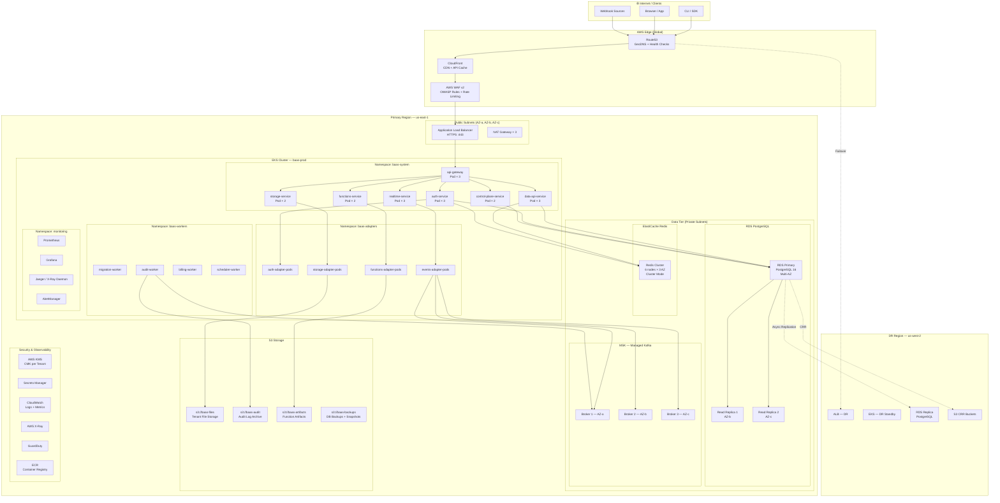

# Cloud Architecture — Backend as a Service Platform (AWS Reference)

## 1. Overview

This document describes the AWS-based cloud architecture for the BaaS Platform. The platform is designed for multi-tenant, multi-region deployment with high availability (99.99% SLA), horizontal scalability, and defense-in-depth security. PostgreSQL is the primary database for all tenant data and platform metadata.

---

## 2. Multi-Region Architecture Overview

The platform operates across two AWS regions in an **active-passive** configuration with automatic failover capability. The primary region handles all live traffic; the DR region maintains warm standby with continuous replication.

| Region Role | AWS Region | Purpose |
|---|---|---|
| Primary | us-east-1 | Live traffic, full stack |
| DR / Standby | us-west-2 | Warm standby, cross-region replication |
| Edge (CDN) | Global | CloudFront POPs for static assets and API caching |

---

## 3. Architecture Diagram

---

## 4. Availability Zone Strategy

| AZ | CIDR (Public) | CIDR (App Private) | CIDR (Data Private) | CIDR (Isolated) |
|---|---|---|---|---|
| us-east-1a | 10.0.0.0/24 | 10.0.10.0/23 | 10.0.30.0/24 | 10.0.50.0/24 |
| us-east-1b | 10.0.1.0/24 | 10.0.12.0/23 | 10.0.31.0/24 | 10.0.51.0/24 |
| us-east-1c | 10.0.2.0/24 | 10.0.14.0/23 | 10.0.32.0/24 | 10.0.52.0/24 |

All EKS node groups span all 3 AZs. RDS Multi-AZ places the standby in a different AZ from the primary. MSK brokers are distributed one-per-AZ.

---

## 5. Compute — EKS Node Groups

| Node Group | Instance Type | Min/Max Nodes | Tier | Workloads |
|---|---|---|---|---|
| control-plane-ng | m6i.xlarge | 2 / 6 | On-Demand | api-gateway, control-plane-service |
| runtime-ng | m6i.2xlarge | 3 / 12 | On-Demand | auth, data-api, storage, realtime |
| adapter-ng | c6i.xlarge | 2 / 10 | On-Demand + Spot (50%) | adapter pods |
| worker-ng | c6i.large | 2 / 20 | Spot (80%) | background workers, migrations |
| monitoring-ng | m6i.large | 2 / 4 | On-Demand | Prometheus, Grafana, Jaeger |

**Cluster Autoscaler** is configured on all node groups. Karpenter is used for worker-ng burst scaling.

---

## 6. Data Tier

### 6.1 RDS PostgreSQL 16 (Multi-AZ)

| Parameter | Value |
|---|---|
| Engine | PostgreSQL 16.x |
| Instance Class | db.r6g.2xlarge (primary), db.r6g.xlarge (replicas) |
| Storage | 500 GB gp3, autoscaling to 5 TB |
| Multi-AZ | Yes — synchronous standby in AZ-b |
| Read Replicas | 2 (AZ-b, AZ-c) — async replication |
| Backup Retention | 35 days PITR |
| Maintenance Window | Sunday 03:00–05:00 UTC |
| Parameter Group | custom — `shared_preload_libraries=pg_stat_statements,pgaudit` |
| Encryption | KMS CMK (aws/rds) |
| Deletion Protection | Enabled |
| Performance Insights | Enabled, 7-day retention |

Automated failover: RDS promotes standby within ~60 seconds. DNS CNAME is automatically updated. Application uses a connection pool (PgBouncer) that reconnects automatically.

### 6.2 ElastiCache Redis (Cluster Mode)

| Parameter | Value |
|---|---|
| Engine | Redis 7.x |
| Mode | Cluster Mode Enabled |
| Shards | 3 shards × 2 nodes (1 primary + 1 replica) |
| Node Type | cache.r6g.large |
| AZ Distribution | One shard primary per AZ |
| Encryption at rest | Yes (KMS) |
| Encryption in transit | TLS |
| Eviction Policy | allkeys-lru |
| Use Cases | Session cache, idempotency keys, rate-limit counters, pub/sub |

### 6.3 MSK (Managed Kafka)

| Parameter | Value |
|---|---|
| Kafka Version | 3.6.x |
| Broker Count | 3 (one per AZ) |
| Broker Instance | kafka.m5.xlarge |
| Storage per broker | 2 TB EBS gp3 |
| Replication Factor | 3 |
| Min In-Sync Replicas | 2 |
| Encryption | TLS in-transit + KMS at-rest |

**Topic Strategy:**

| Topic | Partitions | Retention | Consumers |
|---|---|---|---|
| `baas.events.realtime` | 12 | 24h | realtime-service |
| `baas.audit.log` | 6 | 90d | audit-worker |
| `baas.functions.invocations` | 12 | 7d | functions-service |
| `baas.webhooks.outbound` | 6 | 7d | webhook-worker |
| `baas.storage.events` | 6 | 24h | storage-service |

### 6.4 S3 Buckets

| Bucket | Purpose | Lifecycle | Versioning | Replication |
|---|---|---|---|---|
| `baas-files-{env}` | Tenant file storage | Intelligent-Tiering after 30d | Enabled | CRR to DR region |
| `baas-audit-{env}` | Audit log archive | Glacier after 90d | Enabled | CRR to DR region |
| `baas-artifacts-{env}` | Function ZIP/container artifacts | Standard, deleted on function removal | Enabled | CRR |
| `baas-backups-{env}` | RDS snapshots + exports | Glacier after 30d | Enabled | CRR |

---

## 7. Security Controls

### 7.1 KMS Encryption

- **Customer Managed Keys (CMK)** per service category: `baas/rds`, `baas/s3`, `baas/secrets`, `baas/kafka`
- Tenant-level CMKs provisioned on project creation via Control Plane
- Key rotation: automatic annual rotation enabled
- Cross-account key access denied via key policy

### 7.2 IAM Roles (IRSA — IAM Roles for Service Accounts)

| Service Account | IAM Role | Permissions |
|---|---|---|
| api-gateway | `baas-api-gateway-role` | SecretsManager:GetSecretValue, XRay:PutTraceSegments |
| auth-service | `baas-auth-role` | SecretsManager, KMS:Decrypt, SES:SendEmail |
| storage-service | `baas-storage-role` | S3:GetObject, S3:PutObject, S3:DeleteObject (scoped to bucket prefix) |
| functions-service | `baas-functions-role` | Lambda:InvokeFunction, S3:GetObject (artifacts), ECR:GetAuthorizationToken |
| audit-worker | `baas-audit-worker-role` | S3:PutObject (audit bucket), KMS:GenerateDataKey |
| migration-worker | `baas-migration-role` | SecretsManager:GetSecretValue (DB creds only) |

### 7.3 VPC Security Groups

| SG Name | Inbound | Outbound |
|---|---|---|
| `sg-alb` | 443 from 0.0.0.0/0 | 8080 to `sg-eks-nodes` |
| `sg-eks-nodes` | 8080 from `sg-alb`, all from `sg-eks-nodes` | All |
| `sg-rds` | 5432 from `sg-eks-nodes` | None |
| `sg-redis` | 6379 from `sg-eks-nodes` | None |
| `sg-msk` | 9092,9094 from `sg-eks-nodes` | None |

### 7.4 AWS WAF Rules

- AWS Managed Rules: `AWSManagedRulesCommonRuleSet`, `AWSManagedRulesSQLiRuleSet`, `AWSManagedRulesKnownBadInputsRuleSet`
- Rate limiting: 2000 requests/5min per IP; 500 req/5min for `/auth/*`
- Geo-blocking: configurable per tenant project
- Custom rule: block requests without `X-Baas-Project-Id` header on data endpoints

---

## 8. Disaster Recovery

| Metric | Target | Mechanism |
|---|---|---|
| RPO | ≤ 5 minutes | RDS asynchronous cross-region replica + S3 CRR |
| RTO | ≤ 30 minutes | Pre-warmed EKS cluster in DR region, automated Route53 failover |

### DR Failover Runbook (Automated + Manual)

1. **Detection**: CloudWatch alarm triggers on primary ALB 5xx > 50% for 5 minutes
2. **Notification**: PagerDuty alert → on-call engineer
3. **Automatic**: Route53 health check fails → DNS weight shifts to DR region ALB (TTL 60s)
4. **Manual gate**: Engineer confirms RDS DR replica promotion via AWS Console or runbook script
5. **Promotion**: `aws rds promote-read-replica --db-instance-identifier baas-dr-replica`
6. **Validation**: Smoke test suite runs against DR endpoint
7. **Communication**: Status page updated, tenant notification via email

---

## 9. Cost Optimization

| Strategy | Component | Estimated Saving |
|---|---|---|
| Spot instances (80%) | worker-ng node group | ~65% vs On-Demand |
| Reserved Instances (1yr) | RDS primary + replicas | ~35% vs On-Demand |
| Reserved Instances (1yr) | control-plane-ng, runtime-ng | ~30% vs On-Demand |
| S3 Intelligent-Tiering | baas-files bucket | ~40% on infrequently accessed objects |
| S3 Glacier | audit + backups after retention | ~80% vs S3 Standard |
| NAT Gateway sharing | 1 NAT GW per AZ (shared) | Reduces data transfer cost |
| CloudFront caching | API responses, static assets | Reduces ALB + origin compute cost |

---

## 10. Service-to-AWS Mapping Table

| Platform Service | Primary AWS Service | Supporting AWS Services |
|---|---|---|
| API Gateway | EKS (Deployment) | ALB, WAF, CloudFront |
| Auth Service | EKS (Deployment) | RDS PostgreSQL, ElastiCache Redis, SES, Secrets Manager |
| Control Plane | EKS (Deployment) | RDS PostgreSQL, Secrets Manager, KMS |
| Data API | EKS (Deployment) | RDS PostgreSQL, ElastiCache Redis |
| Storage Service | EKS (Deployment) | S3, KMS |
| Functions Service | EKS (Deployment) | Lambda (adapter), S3 (artifacts), ECR |
| Realtime Service | EKS (Deployment) | MSK (Kafka), ElastiCache Redis |
| Workers | EKS (Spot Nodes) | RDS, MSK, S3 |
| Secrets | AWS Secrets Manager | KMS CMK |
| Observability | CloudWatch + X-Ray | Managed Prometheus (AMP), Managed Grafana (AMG) |
| Container Registry | ECR | — |
| DNS | Route53 | ACM |
