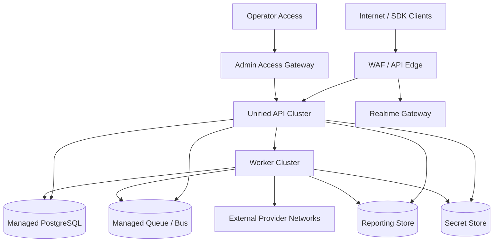
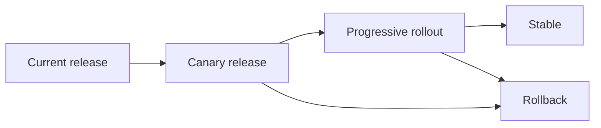

# Deployment Diagram - Backend as a Service Platform

## Deployment Notes

- Separate API, realtime gateway, and worker concerns so bursty client activity does not starve orchestration tasks.
- PostgreSQL should be treated as a critical tier for metadata and core data services.
- Provider-facing adapter traffic should originate from controlled worker or adapter runtimes with explicit secret access.

## Deployment States and Upgrade Path

- Each stage validates API compatibility, error budget, and isolation-policy integrity before promotion.
