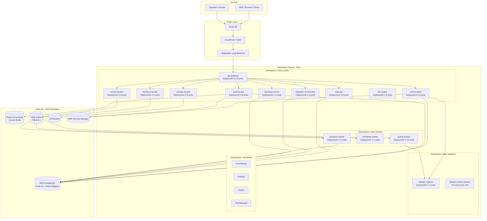

# Deployment Diagram – Backend as a Service Platform

## Kubernetes Cluster Topology

## Kubernetes Resource Specifications

### baas-system Namespace

| Service | Replicas (dev/stage/prod) | CPU Request/Limit | Memory Request/Limit | HPA Min/Max | HPA Trigger |
|---------|--------------------------|-------------------|----------------------|-------------|-------------|
| api-gateway | 1/2/3 | 250m / 1000m | 256Mi / 512Mi | 3 / 10 | CPU 60% |
| control-plane | 1/2/2 | 200m / 800m | 256Mi / 512Mi | 2 / 6 | CPU 70% |
| auth-facade | 1/2/3 | 200m / 800m | 256Mi / 512Mi | 2 / 8 | CPU 60% |
| data-api | 1/2/3 | 300m / 1200m | 512Mi / 1Gi | 2 / 8 | CPU 65% |
| storage-facade | 1/2/2 | 200m / 800m | 256Mi / 512Mi | 2 / 6 | CPU 70% |
| functions-facade | 1/2/2 | 200m / 800m | 256Mi / 512Mi | 2 / 6 | CPU 70% |
| events-facade | 1/2/3 | 250m / 1000m | 256Mi / 768Mi | 2 / 8 | CPU 60% |
| migration-orchestrator | 1/1/1 | 200m / 600m | 256Mi / 512Mi | 1 / 3 | Queue depth |
| slo-engine | 1/1/2 | 150m / 500m | 256Mi / 512Mi | 1 / 3 | CPU 70% |
| reporting-service | 1/1/2 | 200m / 600m | 256Mi / 512Mi | 1 / 3 | CPU 70% |

### baas-workers Namespace

| Worker | Replicas (dev/stage/prod) | CPU Request/Limit | Memory Request/Limit | HPA Min/Max | HPA Trigger |
|--------|--------------------------|-------------------|----------------------|-------------|-------------|
| queue-worker | 1/2/3 | 300m / 1500m | 256Mi / 1Gi | 2 / 20 | Kafka lag > 500 |
| scheduler-worker | 1/1/1 | 100m / 400m | 128Mi / 256Mi | 1 / 3 | CPU 70% |
| projector-worker | 1/1/2 | 200m / 600m | 256Mi / 512Mi | 1 / 4 | Kafka lag > 200 |

## Health Check Endpoints

| Service | Liveness | Readiness | Startup Probe |
|---------|----------|-----------|---------------|
| api-gateway | GET /internal/health/live | GET /internal/health/ready | delay 5s, period 5s, failure 12 |
| auth-facade | GET /internal/health/live | GET /internal/health/ready | delay 10s, period 5s, failure 12 |
| data-api | GET /internal/health/live | GET /internal/health/ready | delay 10s, period 5s, failure 12 |
| migration-orchestrator | GET /internal/health/live | GET /internal/health/ready | delay 15s, period 10s, failure 6 |
| queue-worker | GET /internal/health/live | GET /internal/health/ready | delay 5s, period 10s, failure 6 |

## Deployment Strategies

| Service | Strategy | maxUnavailable | maxSurge | Notes |
|---------|----------|---------------|---------|-------|
| api-gateway | RollingUpdate | 1 | 2 | Zero-downtime; drain connections before termination |
| auth-facade | RollingUpdate | 1 | 2 | Session cache warm-up via readiness gate |
| data-api | RollingUpdate | 0 | 1 | Conservative – never reduce capacity mid-migration |
| migration-orchestrator | Recreate | N/A | N/A | Singleton; safe to replace with quorum check |
| queue-worker | RollingUpdate | 1 | 3 | Consumer group rebalance tolerated |

## PodDisruptionBudgets

| Service | minAvailable |
|---------|-------------|
| api-gateway | 2 |
| auth-facade | 1 |
| data-api | 1 |
| events-facade | 1 |
| queue-worker | 1 |

## Namespace Resource Quotas

| Namespace | CPU Limit | Memory Limit | Pod Count |
|-----------|-----------|-------------|-----------|
| baas-system | 40 cores | 80Gi | 60 |
| baas-adapters | 8 cores | 16Gi | 20 |
| baas-workers | 30 cores | 60Gi | 40 |
| monitoring | 4 cores | 8Gi | 20 |

## ConfigMap and Secret Management

- **ConfigMaps**: non-sensitive runtime configuration (log levels, feature flags, timeouts) managed via Helm values + Kustomize overlays per environment.
- **Secrets**: all sensitive values sourced from AWS Secrets Manager via the External Secrets Operator; never stored in Git or environment variables directly.
- **Secret rotation**: External Secrets Operator polls for updates every 5 minutes; pods receive updated secrets via projected volumes without restart where possible.

## Sidecar and Init Containers

| Service | Init Container | Sidecar |
|---------|---------------|---------|
| data-api | `migration-check` – verifies schema version before serving | `otel-collector` – OpenTelemetry sidecar |
| queue-worker | `kafka-ready` – waits for Kafka broker availability | `otel-collector` |
| migration-orchestrator | `lock-acquire` – acquires distributed lock via Redis | None |
| All services | None | `istio-proxy` (Envoy) – injected by Istio |
