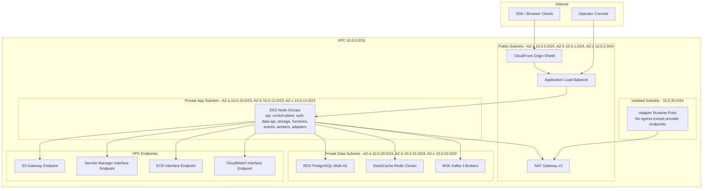

# Network Infrastructure – Backend as a Service Platform

## Overview

The platform uses a layered, zero-trust network model hosted on AWS. All traffic is encrypted in transit (TLS 1.2+ everywhere), no service trusts another solely because it is on the same network, and every inter-service call carries a short-lived mTLS certificate issued by Istio's CA.

---

## VPC Topology



---

## CIDR Block Allocation

| Subnet Type | CIDR | AZs | Purpose |
|-------------|------|-----|---------|
| VPC | 10.0.0.0/16 | — | Entire platform |
| Public AZ-a | 10.0.0.0/24 | us-east-1a | ALB, NAT GW |
| Public AZ-b | 10.0.1.0/24 | us-east-1b | ALB, NAT GW |
| Public AZ-c | 10.0.2.0/24 | us-east-1c | ALB, NAT GW |
| App AZ-a | 10.0.10.0/23 | us-east-1a | EKS worker nodes |
| App AZ-b | 10.0.12.0/23 | us-east-1b | EKS worker nodes |
| App AZ-c | 10.0.14.0/23 | us-east-1c | EKS worker nodes |
| Data AZ-a | 10.0.20.0/24 | us-east-1a | RDS, Redis, Kafka |
| Data AZ-b | 10.0.21.0/24 | us-east-1b | RDS, Redis, Kafka |
| Data AZ-c | 10.0.22.0/24 | us-east-1c | RDS, Redis, Kafka |
| Isolated | 10.0.30.0/24 | us-east-1a/b | Adapter runtime pods |

---

## Security Group Rules

### ALB Security Group (`sg-alb`)
| Direction | Protocol | Port | Source | Purpose |
|-----------|----------|------|--------|---------|
| Inbound | HTTPS | 443 | 0.0.0.0/0 | Public API traffic |
| Inbound | HTTP | 80 | 0.0.0.0/0 | Redirect to HTTPS |
| Outbound | TCP | 8080 | sg-eks-api | Forward to API pods |

### EKS API Nodes (`sg-eks-api`)
| Direction | Protocol | Port | Source | Purpose |
|-----------|----------|------|--------|---------|
| Inbound | TCP | 8080 | sg-alb | Traffic from ALB |
| Inbound | TCP | 15017 | sg-eks-api | Istio control plane |
| Inbound | TCP | 9090 | sg-monitoring | Prometheus scrape |
| Outbound | TCP | 5432 | sg-rds | PostgreSQL |
| Outbound | TCP | 6379 | sg-redis | Redis |
| Outbound | TCP | 9092 | sg-kafka | Kafka |
| Outbound | HTTPS | 443 | 0.0.0.0/0 | External providers via NAT |

### RDS Security Group (`sg-rds`)
| Direction | Protocol | Port | Source | Purpose |
|-----------|----------|------|--------|---------|
| Inbound | TCP | 5432 | sg-eks-api | API and worker access |
| Inbound | TCP | 5432 | sg-eks-workers | Worker access |
| Outbound | — | — | — | No outbound rules |

### Redis Security Group (`sg-redis`)
| Direction | Protocol | Port | Source | Purpose |
|-----------|----------|------|--------|---------|
| Inbound | TCP | 6379 | sg-eks-api | Session/cache access |
| Outbound | — | — | — | No outbound rules |

### Kafka Security Group (`sg-kafka`)
| Direction | Protocol | Port | Source | Purpose |
|-----------|----------|------|--------|---------|
| Inbound | TCP | 9092 | sg-eks-api | Producer/consumer (PLAINTEXT TLS) |
| Inbound | TCP | 9094 | sg-eks-workers | Worker consumer |
| Inbound | TCP | 2181 | sg-kafka | ZooKeeper internal |
| Outbound | TCP | 2181 | sg-kafka | ZooKeeper internal |

---

## Service Mesh (Istio) Configuration

All pods in `baas-system`, `baas-workers`, and `baas-adapters` namespaces have Istio sidecars injected automatically.

### mTLS Policy
```yaml
apiVersion: security.istio.io/v1beta1
kind: PeerAuthentication
metadata:
  name: default
  namespace: baas-system
spec:
  mtls:
    mode: STRICT
```

### Traffic Policies (Example: data-api → PostgreSQL)

| Policy | Setting | Value |
|--------|---------|-------|
| Connection pool TCP max connections | 100 per pod | Prevents connection storms |
| Connection pool HTTP pending requests | 50 | Back-pressure gate |
| Outlier detection consecutive errors | 5 | Eject unhealthy upstream |
| Outlier detection interval | 30s | Re-check interval |
| Retry attempts | 3 | For 503/504 responses only |
| Retry perTryTimeout | 5s | Per-attempt budget |

### Circuit Breaker (Adapter Mesh)
- Consecutive 5xx threshold: **10 in 60 seconds** → open circuit for 30 seconds.
- Half-open probe: 1 request every 15 seconds to test recovery.
- Applied to all external provider endpoints via `DestinationRule`.

---

## DNS Strategy

| Zone Type | Name | Purpose |
|-----------|------|---------|
| Public hosted zone | `api.baas.example.com` | Developer-facing API endpoints |
| Public hosted zone | `realtime.baas.example.com` | WebSocket endpoints |
| Private hosted zone | `baas.internal` | Internal EKS service-to-service DNS |
| CoreDNS | `*.baas-system.svc.cluster.local` | Kubernetes service discovery |

Internal service URLs follow the pattern: `http://{service-name}.baas-system.svc.cluster.local:{port}`

---

## TLS / Certificate Management

| Tier | Tool | Certificate Authority | Rotation |
|------|------|-----------------------|----------|
| External (ALB) | AWS ACM | Amazon CA | Auto-renewed 60 days before expiry |
| Ingress (NGINX) | cert-manager + Let's Encrypt | Let's Encrypt | Auto-renewed 30 days before expiry |
| Internal mTLS | Istio CA (istiod) | Self-signed per cluster | Rotated every 24 hours automatically |
| PostgreSQL (RDS) | AWS ACM | Amazon CA | Managed by RDS |

---

## VPC Endpoints

| Service | Endpoint Type | Purpose |
|---------|--------------|---------|
| S3 | Gateway | File storage and artifact access without NAT cost |
| Secrets Manager | Interface (PrivateLink) | Secret retrieval without internet exposure |
| ECR API + DKR | Interface (PrivateLink) | Container image pulls |
| CloudWatch Logs | Interface (PrivateLink) | Log shipping |
| STS | Interface (PrivateLink) | IAM role assumption from pods |

---

## Network Monitoring

| Signal | Tool | Retention | Alert Threshold |
|--------|------|-----------|----------------|
| VPC Flow Logs | CloudWatch Logs → S3 | 90 days | Rejected connections spike > 500/min |
| DNS query logs | Route53 Resolver Logs | 30 days | NXDOMAIN rate > 1% |
| WAF logs | CloudWatch Logs | 30 days | Block rate > 5% of requests |
| GuardDuty | AWS GuardDuty | 90 days | Any HIGH finding |
| Istio access logs | Fluentd → CloudWatch | 30 days | 5xx rate > 1% per service |

---

## Zero-Trust Access Model

1. **No implicit trust** – every service authenticates with a short-lived mTLS certificate; IP-based trust is never used.
2. **Least privilege IAM** – each EKS pod has an IAM role (IRSA) with only the permissions required for that service; no shared node roles.
3. **Secrets never in environment variables** – all secrets come from AWS Secrets Manager via External Secrets Operator as mounted files.
4. **Egress allowlist** – adapter runtime pods may only reach their registered provider endpoints; all other egress is denied at the security group level.
5. **Audit trail** – all inbound requests carry a `X-Correlation-Id`; all CloudTrail API calls and VPC Flow Logs are retained for 90 days.
