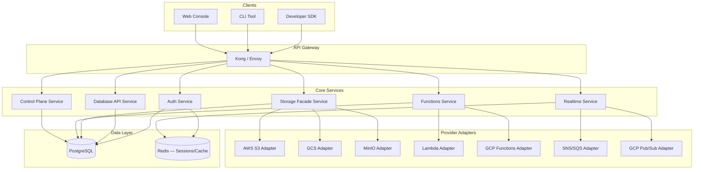

# Requirements Document — Backend as a Service (BaaS) Platform

**Version:** 1.0  
**Status:** Approved  
**Last Updated:** 2025-01-01  
**Owner:** Platform Engineering  

---

## Table of Contents

1. [Project Overview](#1-project-overview)
2. [Scope](#2-scope)
3. [Stakeholders](#3-stakeholders)
4. [System Architecture Summary](#4-system-architecture-summary)
5. [Functional Requirements](#5-functional-requirements)
6. [Non-Functional Requirements](#6-non-functional-requirements)
7. [Acceptance Criteria](#7-acceptance-criteria)
8. [Requirements Traceability Matrix](#8-requirements-traceability-matrix)
9. [Glossary](#9-glossary)

---

## 1. Project Overview

### 1.1 Purpose

The BaaS Platform is a self-hostable, multi-tenant Backend as a Service system that provides application developers with unified, API-first access to core backend primitives — Authentication, PostgreSQL-backed Database, Object Storage, Serverless Functions, Realtime Messaging, and a Control Plane for managing multi-tenant projects and external provider bindings.

Inspired by Appwrite but deliberately PostgreSQL-native, the platform removes the need for teams to provision and wire together separate services for each project. Developers interact with a single, consistent API surface regardless of which underlying cloud provider (AWS, GCP, Azure, MinIO, etc.) backs each capability.

### 1.2 Background

Modern application teams spend significant time bootstrapping the same backend concerns — user auth, database access, file storage, background jobs, and push/realtime updates — for every new project. Existing BaaS solutions either lock tenants into proprietary data stores, offer limited self-hosting support, or lack the pluggable provider model required for enterprise multi-cloud strategies.

This platform addresses those gaps with:
- **PostgreSQL-first data layer** — transactional semantics, SQL power, rich ecosystem tooling.
- **Provider abstraction** — each capability (storage, compute, messaging) has a typed adapter interface; cloud providers are pluggable at configuration time.
- **Multi-tenant control plane** — projects and environments are first-class resources with isolated credentials, schemas, and provider bindings.
- **Zero-trust-ready security** — row-level security policies, scoped JWT tokens, secrets never in logs or API responses.

### 1.3 Goals

| Goal | Metric |
|------|--------|
| Reduce project bootstrap time | < 15 minutes from signup to first authenticated API call |
| Provide consistent API surface | Single SDK covers all six capability areas |
| Support any major cloud provider | Adapters for AWS, GCP, Azure, MinIO, Cloudflare, Twilio, SendGrid |
| Enable safe multi-environment promotion | Schema migrations gated by environment-level approval policy |
| Achieve high availability | 99.9% uptime SLO for the API gateway and Auth service |

---

## 2. Scope

### 2.1 In Scope

| Area | Description |
|------|-------------|
| **Tenancy & Projects** | Create and manage tenants, projects, and environments (dev/staging/prod) |
| **Authentication** | Email/password, OAuth2, magic link, API keys, RBAC with custom roles |
| **Database API** | Namespace and table management, CRUD via REST/GraphQL, schema migrations |
| **Storage** | Bucket and file management, signed URLs, access policies, provider adapters |
| **Functions & Jobs** | Stateless function deployment, triggered and scheduled invocation, logs |
| **Realtime & Messaging** | WebSocket channels, webhook delivery, event-driven subscriptions |
| **Control Plane** | Provider catalog, capability bindings, switchover orchestration, quota enforcement |
| **Security** | Secrets management, audit logging, RBAC, data encryption, compliance policies |
| **Observability** | Metrics, distributed tracing, usage metering, SLO dashboards |
| **Developer SDK** | TypeScript/JavaScript, Python, Go client libraries |

### 2.2 Out of Scope

| Area | Reason |
|------|--------|
| Managed PostgreSQL hosting | Platform assumes an externally provisioned Postgres; it does not operate the database server |
| CI/CD pipeline management | Function code deployment is supported; full pipeline orchestration is not |
| Native mobile SDKs (iOS/Android) | REST API is accessible from mobile but dedicated native SDKs are v2 scope |
| Data warehouse / analytics | OLAP queries and ETL pipelines are out of scope |
| Billing and payment processing | Quota enforcement is in scope; financial invoicing is not |
| Full GraphQL schema stitching | GraphQL query layer is provided but federation/stitching is deferred |

### 2.3 Assumptions

- PostgreSQL 15+ is available and network-reachable for each environment.
- Infrastructure (Kubernetes, or Docker Compose for local) is provisioned externally.
- Secrets are stored in Vault, AWS Secrets Manager, or GCP Secret Manager; the platform references but does not own the secret store.
- TLS termination occurs at the load balancer; internal services communicate over mTLS.

---

## 3. Stakeholders

| Role | Name / Team | Interest | Influence |
|------|-------------|----------|-----------|
| Product Owner | Platform Product | Feature prioritization, roadmap | High |
| Platform Operator | DevOps / SRE | Deployment, SLO adherence, incident response | High |
| App Developer (Tenant) | External / Internal Dev Teams | API usability, SDK quality, documentation | High |
| Tenant Admin / Project Owner | Customer organizations | Project setup, user management, billing | High |
| Security & Compliance Admin | Security Team | Audit logs, RBAC, secret rotation, compliance | High |
| Adapter Maintainer | Platform Engineering | Provider adapters, abstraction contracts | Medium |
| End User (Application) | Users of tenant apps | Authentication experience, data privacy | Medium |
| Legal / DPO | Legal Department | GDPR, data residency, retention policies | Medium |

---

## 4. System Architecture Summary

---

## 5. Functional Requirements

### 5.1 Tenancy & Projects

| ID | Requirement | Priority |
|----|-------------|----------|
| FR-001 | The system SHALL allow platform operators to create a **Tenant** with a unique slug, display name, and billing contact. | Must |
| FR-002 | A Tenant SHALL be able to create one or more **Projects**. Each Project has a unique name scoped to the Tenant. | Must |
| FR-003 | Each Project SHALL support up to three named **Environments**: `development`, `staging`, and `production`. Additional custom environments may be provisioned per configuration. | Must |
| FR-004 | All data (database schemas, buckets, functions, secrets) SHALL be logically isolated per Environment. Cross-environment access via API SHALL be blocked. | Must |
| FR-005 | The system SHALL enforce per-Tenant **resource quotas**: max projects, max environments, max API key count, max storage bytes, max function invocations per month. | Must |
| FR-006 | The system SHALL provide a **Project API Key** scoped to a specific Environment. API keys SHALL be rotatable without downtime using a two-key overlap window. | Must |
| FR-007 | Tenants SHALL be soft-deletable; a 30-day retention window SHALL precede permanent deletion, during which all resources are frozen and read-only. | Should |
| FR-008 | The system SHALL emit a `ProjectCreated`, `EnvironmentProvisioned`, and `TenantDeleted` event on relevant lifecycle transitions. | Must |

### 5.2 Authentication

| ID | Requirement | Priority |
|----|-------------|----------|
| FR-009 | The Auth Service SHALL support **email/password registration and login** with bcrypt password hashing (cost factor ≥ 12). | Must |
| FR-010 | The Auth Service SHALL support **OAuth2 / OIDC login** for at least: Google, GitHub, Microsoft, and any OIDC-compliant provider. | Must |
| FR-011 | The Auth Service SHALL support **magic link (passwordless) login** via email. Links SHALL expire in 15 minutes and be single-use. | Should |
| FR-012 | The Auth Service SHALL issue **JWT access tokens** (HS256 or RS256, configurable per project) with a default 15-minute TTL and a refresh token with a configurable TTL (default 30 days). | Must |
| FR-013 | Refresh tokens SHALL be stored server-side (in Redis or PostgreSQL) and SHALL be revocable individually or in bulk (logout-all-devices). | Must |
| FR-014 | The system SHALL support **custom roles and RBAC**: project admins define roles, assign permissions (read/write/admin per resource type), and assign roles to users or API keys. | Must |
| FR-015 | The Auth Service SHALL support **multi-factor authentication (MFA)** via TOTP (RFC 6238). | Should |
| FR-016 | Failed login attempts SHALL be rate-limited: max 10 attempts per 15 minutes per IP per project, after which a CAPTCHA or lockout is enforced. | Must |
| FR-017 | The system SHALL provide **anonymous authentication** — a session token with limited, project-configured permissions, upgradeable to a full account on registration. | Should |
| FR-018 | Auth events (login, logout, password reset, MFA enroll/verify) SHALL be written to the **Audit Log** with timestamp, IP, user agent. | Must |

### 5.3 Database API

| ID | Requirement | Priority |
|----|-------------|----------|
| FR-019 | The Database API SHALL allow authorized callers to **create Namespaces** (PostgreSQL schemas) within the project's database. | Must |
| FR-020 | Within a Namespace, the Database API SHALL allow **defining Tables** with typed columns (text, integer, bigint, boolean, uuid, jsonb, timestamptz, numeric, array variants). | Must |
| FR-021 | The Database API SHALL expose **CRUD operations** (create record, list records with filtering/sorting/pagination, get by ID, update, delete) via REST. | Must |
| FR-022 | The Database API SHALL support **server-side filtering** using a structured query object (field, operator, value) and **compound filters** (AND/OR). Operators: eq, neq, gt, gte, lt, lte, like, ilike, in, is_null. | Must |
| FR-023 | The Database API SHALL enforce **Row-Level Security (RLS)** policies defined by the project. Policies are expressed as SQL predicates and bound to a role. | Must |
| FR-024 | The system SHALL support **schema migrations**: changes to table definitions are expressed as versioned migration scripts, queued for review, and promoted through environments in order. | Must |
| FR-025 | Schema migrations SHALL be **reversible**: each migration version includes an `up` and `down` script. The system SHALL validate that `up` and `down` scripts are syntactically valid SQL before queueing. | Must |
| FR-026 | The system SHALL prevent migration promotion to production unless: (a) the migration has been applied in staging, (b) all automated tests associated with the migration pass, and (c) an authorized approver has signed off. | Must |
| FR-027 | The Database API SHALL expose a **GraphQL query endpoint** that automatically generates a schema from the Namespace's table definitions. | Should |
| FR-028 | The system SHALL enforce **per-project database connection pool limits** to protect the shared PostgreSQL cluster from connection exhaustion. | Must |

### 5.4 Storage

| ID | Requirement | Priority |
|----|-------------|----------|
| FR-029 | The Storage Facade SHALL allow project admins to **create Buckets** with a name, access policy (public/private/signed), and associated provider binding. | Must |
| FR-030 | The Storage Facade SHALL support **file upload** (single-part for files ≤ 100 MB, multipart for files up to 5 GB) via REST. | Must |
| FR-031 | The Storage Facade SHALL support **generating signed URLs** for private file access with a configurable expiry (1 minute to 7 days). | Must |
| FR-032 | Access to private files SHALL be governed by **file access policies** that evaluate the requesting user's role and any project-defined conditions (e.g., file ownership attribute). | Must |
| FR-033 | The Storage Facade SHALL support **provider adapters**: AWS S3, GCP Cloud Storage, Azure Blob, MinIO. The adapter is resolved from the bucket's `CapabilityBinding`. | Must |
| FR-034 | File metadata (name, size, MIME type, checksum, owner, bucket, environment) SHALL be stored in PostgreSQL. The actual binary is stored in the provider. | Must |
| FR-035 | The system SHALL support **virus scanning** integration: uploaded files are quarantined until an async scan clears them. A `FileScanCompleted` event is emitted. | Should |

### 5.5 Functions & Jobs

| ID | Requirement | Priority |
|----|-------------|----------|
| FR-036 | The Functions Service SHALL allow project admins to **deploy Functions** by uploading a ZIP artifact or referencing a container image. | Must |
| FR-037 | Functions SHALL be invokable via: (a) direct HTTP call, (b) event trigger (subscribed to an EventChannel), (c) cron schedule (CRON expression, minimum resolution 1 minute). | Must |
| FR-038 | Function execution SHALL be **isolated per invocation**: ephemeral environment, no shared state between invocations. | Must |
| FR-039 | Function executions SHALL have a configurable **timeout** (default 30 s, maximum 900 s). Executions exceeding timeout are terminated and logged as `ExecutionTimeout`. | Must |
| FR-040 | The system SHALL **log stdout/stderr** for each execution, retaining logs for a configurable retention period (default 7 days). | Must |
| FR-041 | Functions SHALL have access to **injected environment variables** sourced from SecretRefs — the runtime resolves secret values at invocation time; values are never stored in the function definition. | Must |
| FR-042 | The system SHALL enforce **concurrent invocation limits** per function (default 10, configurable per plan). Excess invocations are queued or rejected with HTTP 429. | Must |
| FR-043 | Scheduled jobs SHALL be **idempotent by design**: the platform assigns a unique execution ID per scheduled slot; duplicate invocations triggered by clock skew are deduplicated by the worker. | Should |

### 5.6 Realtime & Messaging

| ID | Requirement | Priority |
|----|-------------|----------|
| FR-044 | The Realtime Service SHALL allow project admins to **create EventChannels** with a name, visibility (public/private), and authorization policy. | Must |
| FR-045 | App Developers SHALL be able to **subscribe to a channel** via WebSocket. Connection upgrade SHALL require a valid, in-scope JWT or API key. | Must |
| FR-046 | Authorized publishers SHALL be able to **publish messages** to a channel; all active subscribers receive the message with < 500 ms median end-to-end latency. | Must |
| FR-047 | The system SHALL support **Webhook Subscriptions**: project admins register an HTTPS endpoint; the platform delivers matching events via HTTP POST with HMAC-SHA256 signature. | Must |
| FR-048 | Failed webhook deliveries SHALL be **retried** using exponential backoff (initial 10 s, max 5 attempts, max 10 minutes total). After 5 failures a `WebhookDeliveryFailed` event is emitted. | Must |
| FR-049 | The system SHALL support **presence tracking** per channel: subscribers can query the current active member list. Member join/leave events are broadcast to channel subscribers. | Should |

### 5.7 Control Plane & Provider Management

| ID | Requirement | Priority |
|----|-------------|----------|
| FR-050 | The Control Plane SHALL maintain a **Provider Catalog**: a registry of available adapter types (storage, functions, messaging) and their required configuration schema. | Must |
| FR-051 | Project admins SHALL be able to create a **CapabilityBinding**: associate a capability (e.g., `storage`) with a specific provider entry and supply encrypted configuration (credentials, region, endpoint). | Must |
| FR-052 | The Control Plane SHALL **validate CapabilityBindings** at creation time by performing a lightweight connectivity check against the provider. | Must |
| FR-053 | The Control Plane SHALL support **SwitchoverPlans**: an orchestrated, multi-step procedure to migrate a capability from one provider to another with rollback support. | Must |
| FR-054 | A SwitchoverPlan SHALL progress through states: `draft → ready → in_progress → completed | rolled_back`. At each state transition the system emits a corresponding event. | Must |
| FR-055 | The Control Plane SHALL **enforce switchover safety gates**: (a) no in-flight operations on the old provider, (b) data reconciliation checksum verified, (c) new provider connectivity confirmed. | Must |
| FR-056 | The Control Plane SHALL expose a **quota dashboard** showing real-time usage vs. limits per project and environment. | Should |

### 5.8 Security & Compliance

| ID | Requirement | Priority |
|----|-------------|----------|
| FR-057 | All sensitive configuration values (credentials, connection strings) stored in the platform SHALL be **referenced via SecretRef** — only a pointer to the external secret store is persisted, never the raw value. | Must |
| FR-058 | The platform SHALL maintain an **immutable Audit Log**: every write operation (create, update, delete) on any resource records actor, timestamp, resource type/ID, before/after state snapshot, and IP. Audit log entries cannot be deleted via API. | Must |
| FR-059 | The platform SHALL support configurable **data retention policies** per project: automatic purge of execution logs, file metadata, and audit entries after a configurable TTL. | Should |
| FR-060 | The platform SHALL enforce **TLS 1.2+** on all external endpoints. Internal service-to-service communication SHALL use mTLS. | Must |
| FR-061 | The platform SHALL support **IP allowlisting** per project: API requests from non-allowlisted IPs are rejected with HTTP 403. | Should |
| FR-062 | The platform SHALL integrate with external **SIEM systems** by exporting audit events as structured JSON over a configurable Syslog/Webhook sink. | Should |

### 5.9 Observability & Reporting

| ID | Requirement | Priority |
|----|-------------|----------|
| FR-063 | Every API request SHALL produce a **structured log entry** (JSON) including: request ID, tenant ID, project ID, environment, latency, HTTP status, service, and operation name. | Must |
| FR-064 | Every service SHALL expose a **/metrics** endpoint in Prometheus text format covering: request rate, error rate, latency percentiles (p50, p95, p99), and resource-specific counters. | Must |
| FR-065 | The platform SHALL support **distributed tracing** using OpenTelemetry with W3C `traceparent` propagation. Traces SHALL be exportable to Jaeger, Zipkin, or OTLP-compatible collectors. | Should |
| FR-066 | The platform SHALL maintain a **UsageMeter** per project/environment, updated in near-real-time, tracking: API call count, storage bytes, function execution minutes, egress bytes. | Must |
| FR-067 | The platform SHALL provide a **health check endpoint** (`/health`) returning 200 OK when the service and its critical dependencies (database, cache) are reachable. | Must |

---

## 6. Non-Functional Requirements

### 6.1 Performance

| ID | Requirement | Target |
|----|-------------|--------|
| NFR-001 | API Gateway request routing overhead | < 5 ms p99 |
| NFR-002 | Auth token issuance latency (login → JWT) | < 200 ms p95 |
| NFR-003 | Database API simple read (single row by ID) | < 50 ms p95 |
| NFR-004 | Storage file upload initiation (metadata write) | < 100 ms p95 |
| NFR-005 | Function cold-start latency (container-based) | < 2 s p95 |
| NFR-006 | Realtime message fan-out latency | < 500 ms p99 (1,000 subscribers) |

### 6.2 Scalability

| ID | Requirement |
|----|-------------|
| NFR-007 | Each stateless service (Auth, Database API, Storage Facade, Functions, Realtime) SHALL scale horizontally to at least 50 replicas without architectural changes. |
| NFR-008 | The platform SHALL support 10,000 concurrent WebSocket connections per Realtime Service instance. |
| NFR-009 | The database connection pool manager SHALL support up to 500 concurrent project environments sharing a PostgreSQL cluster via PgBouncer or equivalent. |
| NFR-010 | The event bus (used for internal events and Realtime fan-out) SHALL handle 100,000 messages/second sustained throughput. |

### 6.3 Availability & Reliability

| ID | Requirement |
|----|-------------|
| NFR-011 | The API Gateway and Auth Service SHALL achieve **99.9% availability** (≤ 8.7 h downtime/year). |
| NFR-012 | The Control Plane SHALL achieve **99.5% availability** (maintenance windows excluded). |
| NFR-013 | All stateful services (PostgreSQL, Redis) SHALL use **multi-AZ replication** in production deployments. |
| NFR-014 | Provider switchover SHALL complete within **4 hours** for storage migrations up to 1 TB. |
| NFR-015 | The platform SHALL support **zero-downtime deployments** of all services via rolling update or blue-green strategy. |

### 6.4 Security

| ID | Requirement |
|----|-------------|
| NFR-016 | Secrets SHALL be encrypted at rest using AES-256-GCM. Secret values SHALL never appear in logs, error messages, or API responses. |
| NFR-017 | All JWTs SHALL be signed with RS256 (2048-bit minimum) or HS256 with a project-specific key of at least 256 bits. |
| NFR-018 | The platform SHALL pass OWASP Top 10 validation with zero critical or high findings before each major release. |
| NFR-019 | Dependency CVE scanning SHALL run on every CI build; critical CVEs SHALL block deployment. |

### 6.5 Maintainability

| ID | Requirement |
|----|-------------|
| NFR-020 | Each service SHALL be independently deployable and independently versioned. |
| NFR-021 | Public API contracts SHALL be versioned (`/v1/`, `/v2/`). Breaking changes require a new major version. Deprecated endpoints SHALL be supported for at least 12 months. |
| NFR-022 | All services SHALL expose structured JSON logs and conform to a shared log schema defined in the platform log standard. |

### 6.6 Compliance

| ID | Requirement |
|----|-------------|
| NFR-023 | The platform SHALL support **GDPR right-to-erasure**: a data erasure request SHALL delete all PII associated with a user within 30 days, with a deletion certificate emitted. |
| NFR-024 | The platform SHALL support **data residency configuration**: project admins can restrict all data storage to a specified geographic region; the Control Plane enforces this at provider binding time. |
| NFR-025 | The platform SHALL maintain audit logs for a minimum of **1 year** and SHALL support immutable export to customer-controlled storage. |

---

## 7. Acceptance Criteria

### 7.1 Tenancy & Projects (FR-001–FR-008)
- [ ] A tenant can be created via POST `/v1/tenants` and is immediately queryable.
- [ ] A project with three environments (dev/staging/prod) can be created within 30 seconds.
- [ ] Cross-environment API calls using an environment-scoped API key return HTTP 403.
- [ ] Quota enforcement rejects project creation once the tenant's project limit is reached.
- [ ] `ProjectCreated` event appears in the Audit Log within 1 second of API call return.

### 7.2 Authentication (FR-009–FR-018)
- [ ] Email/password login returns a JWT access token and a refresh token within 200 ms p95.
- [ ] OAuth2 login with Google redirects, exchanges code, and returns tokens in < 1 s.
- [ ] Magic link email is sent within 5 seconds; link works exactly once and expires after 15 minutes.
- [ ] After 10 failed login attempts in 15 minutes, the 11th returns HTTP 429.
- [ ] Revoking all sessions invalidates all existing refresh tokens for the user.
- [ ] MFA TOTP enroll/verify flow completes successfully with a standard authenticator app.

### 7.3 Database API (FR-019–FR-028)
- [ ] A Namespace can be created and immediately used for table definitions.
- [ ] A table with all supported column types can be defined and records inserted.
- [ ] Filter with compound AND/OR returns correct rows; wrong-project API key returns HTTP 403.
- [ ] RLS policy blocks rows from being returned to unauthorized roles.
- [ ] A migration cannot be promoted to production if staging has not applied it.
- [ ] A malformed migration SQL is rejected at upload time with a descriptive error.

### 7.4 Storage (FR-029–FR-035)
- [ ] A file uploaded to a private bucket is not accessible without a signed URL.
- [ ] A signed URL with 1-hour expiry returns HTTP 403 after expiry.
- [ ] Multipart upload of a 1 GB file completes without error.
- [ ] Swapping the provider binding of a bucket and re-uploading routes to the new provider.
- [ ] File metadata is persisted in PostgreSQL and queryable independently of the provider.

### 7.5 Functions & Jobs (FR-036–FR-043)
- [ ] A function ZIP artifact deploys and is invokable via HTTP within 60 seconds.
- [ ] A cron-scheduled function fires within ±30 seconds of the scheduled time.
- [ ] A function that exceeds the timeout returns HTTP 504 and logs `ExecutionTimeout`.
- [ ] Concurrent invocations exceeding the limit return HTTP 429.
- [ ] Injected secrets appear in the function's environment at runtime and are absent from any API response.

### 7.6 Realtime (FR-044–FR-049)
- [ ] WebSocket connection with valid JWT subscribes successfully and receives published messages.
- [ ] Webhook delivery includes a valid HMAC-SHA256 `X-Signature` header.
- [ ] After 5 failed webhook deliveries, `WebhookDeliveryFailed` event is in the Audit Log.
- [ ] Presence list accurately reflects connected members within 1 second of join/leave.

### 7.7 Control Plane (FR-050–FR-056)
- [ ] A CapabilityBinding with invalid credentials fails validation at creation time.
- [ ] A SwitchoverPlan can be created, advanced through all states, and rolled back.
- [ ] Switchover with in-flight operations pending is blocked until the queue drains.

---

## 8. Requirements Traceability Matrix

| Requirement | User Story | Use Case | Design Artifact |
|-------------|------------|----------|-----------------|
| FR-001–FR-008 | US-001–US-005 | UC-001 | `analysis/use-case-descriptions.md`, `detailed-design/erd-database-schema.md` |
| FR-009–FR-018 | US-006–US-012 | UC-003 | `detailed-design/sequence-diagram.md` (Auth flows) |
| FR-019–FR-028 | US-013–US-018 | UC-004 | `detailed-design/erd-database-schema.md`, `detailed-design/api-design.md` |
| FR-029–FR-035 | US-019–US-022 | UC-005 | `detailed-design/component-diagram.md` (Storage Facade) |
| FR-036–FR-043 | US-023–US-025 | UC-006 | `detailed-design/component-diagram.md` (Functions) |
| FR-044–FR-049 | US-026–US-028 | UC-007 | `detailed-design/sequence-diagram.md` (Realtime) |
| FR-050–FR-056 | US-029–US-032 | UC-002, UC-008 | `detailed-design/c4-component.md`, `analysis/bpmn-swimlane-diagram.md` |
| FR-057–FR-062 | US-033–US-036 | UC-001–UC-008 | `analysis/business-rules.md` |
| FR-063–FR-067 | US-037–US-038 | All | `infrastructure/cloud-architecture.md` |
| NFR-001–NFR-006 | — | All | `high-level-design/architecture-diagram.md` |
| NFR-016–NFR-019 | US-033–US-036 | UC-003 | `analysis/business-rules.md`, `edge-cases/security-and-compliance.md` |
| NFR-023–NFR-025 | US-036 | All | `analysis/business-rules.md` |

---

## 9. Glossary

| Term | Definition |
|------|------------|
| **Tenant** | The top-level organizational entity. A company or individual that owns one or more Projects. |
| **Project** | A logical grouping of resources (databases, buckets, functions) scoped to a Tenant. |
| **Environment** | A named deployment context within a Project (e.g., `development`, `staging`, `production`). |
| **Namespace** | A PostgreSQL schema created within the project's database, used to group related tables. |
| **CapabilityBinding** | An association between a Project Environment and a specific Provider, for a specific capability (storage, functions, messaging). |
| **Provider Catalog** | Registry of supported provider adapter types and their configuration schemas. |
| **SwitchoverPlan** | A structured, reversible plan to migrate a capability from one provider binding to another. |
| **SecretRef** | A reference (path/ID) to a secret stored in an external secret manager. The raw value is never persisted in the platform database. |
| **RLS (Row-Level Security)** | A PostgreSQL feature that restricts which rows a role can access based on a policy predicate. |
| **JWT** | JSON Web Token — a signed, self-describing token used for authentication and authorization. |
| **API Key** | A long-lived credential scoped to a Project Environment, used by server-side services. |
| **EventChannel** | A named, policy-governed publish/subscribe channel used for Realtime messaging. |
| **Webhook Subscription** | A project-registered HTTPS endpoint that receives event payloads via HTTP POST. |
| **UsageMeter** | A real-time counter of resource consumption per project/environment used for quota enforcement. |
| **Audit Log** | An immutable, append-only record of all write operations on platform resources. |
| **Migration** | A versioned SQL script pair (`up`/`down`) that evolves a Namespace's table definitions. |
| **Function** | A stateless, event-driven unit of code deployed to the platform and executed on demand or on schedule. |
| **Signed URL** | A time-limited, pre-authorized URL that grants access to a specific private file. |
| **BaaS** | Backend as a Service — a platform providing pre-built backend services via API. |
| **mTLS** | Mutual TLS — both client and server authenticate using certificates. |
