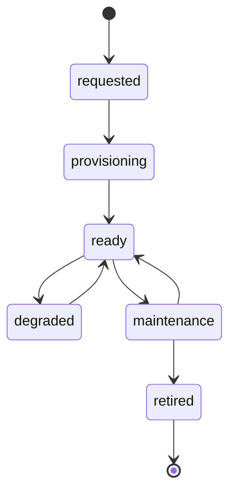

# Requirements Document - Backend as a Service Platform

## 1. Project Overview

### 1.1 Purpose
Build a production-ready backend-as-a-service platform that provides Appwrite/Supabase-like developer capabilities through a stable facade over pluggable packages and providers, while using PostgreSQL as the mandatory relational, metadata, and policy backbone.

### 1.2 Scope

| In Scope | Out of Scope |
|----------|--------------|
| Multi-tenant projects, environments, and control-plane management | Full custom implementation of every backend primitive from scratch |
| Unified auth, data API, storage, functions/jobs, and realtime/event abstractions | Build-your-own cloud provider |
| Provider adapters and capability bindings | Arbitrary unsupported package execution without certification |
| PostgreSQL-backed metadata and data API control | Non-Postgres primary database engines in v1 |
| Secrets, auditing, usage visibility, and switchover workflows | Full billing engine or marketplace |
| SDK/API contracts independent of provider choice | Unlimited one-off provider-specific customizations that break facade semantics |

### 1.3 Operating Model
- The platform is multi-tenant and organizes work into tenants, projects, environments, and capability bindings.
- PostgreSQL is mandatory for shared platform metadata and for the platform's core data API model.
- Capability providers are pluggable, but only through certified adapters that implement stable internal contracts.
- Provider choices may be changed later through documented migration and switchover flows.
- The platform is API-first and should expose stable SDK-facing semantics even when underlying providers differ.

### 1.4 Primary Actors

| Actor | Goals |
|-------|-------|
| Project Owner / Tenant Admin | Provision projects, choose providers, manage secrets and policies |
| App Developer | Integrate auth, data, storage, functions, and realtime through one surface |
| Platform Operator | Keep the platform healthy, scalable, and observable |
| Security / Compliance Admin | Protect secrets, enforce auditability, and reduce provider-risk exposure |
| Adapter Maintainer | Add or evolve provider integrations without breaking facade contracts |
| Application End User | Use applications built on the BaaS without knowing provider specifics |

## 2. Functional Requirements

### 2.1 Tenancy, Projects, and Environments

| ID | Requirement | Priority |
|----|-------------|----------|
| FR-CTL-001 | System shall support tenants, projects, and environments with scoped access control | Must Have |
| FR-CTL-002 | System shall support project provisioning with capability selection and provider binding at environment scope | Must Have |
| FR-CTL-003 | System shall maintain environment metadata, region preferences, status, and capability readiness | Must Have |
| FR-CTL-004 | System shall support controlled provider switchover workflows per capability | Must Have |

### 2.2 Authentication and Identity Abstraction

| ID | Requirement | Priority |
|----|-------------|----------|
| FR-AUTH-001 | System shall expose a stable auth facade for user identity, sessions, tokens, recovery, and verification flows | Must Have |
| FR-AUTH-002 | System shall support adapter-backed auth capabilities such as local credentials, SSO/OIDC, and token/session handling | Must Have |
| FR-AUTH-003 | System shall support project-level auth configuration, roles, and policy hooks | Must Have |
| FR-AUTH-004 | System shall audit privileged auth changes and security-sensitive account actions | Must Have |

### 2.3 Postgres Data API and Schema Control

| ID | Requirement | Priority |
|----|-------------|----------|
| FR-DATA-001 | System shall expose a Postgres-backed data API for schema-managed application data access | Must Have |
| FR-DATA-002 | System shall support database schema, migrations, row/role policy metadata, and access configuration | Must Have |
| FR-DATA-003 | System shall provide environment-scoped schema deployment and migration tracking | Must Have |
| FR-DATA-004 | System shall support query, mutation, and filtering semantics through stable facade endpoints or SDK methods | Must Have |

### 2.4 Storage Abstraction

| ID | Requirement | Priority |
|----|-------------|----------|
| FR-STO-001 | System shall expose a stable file-storage facade across supported providers | Must Have |
| FR-STO-002 | System shall support provider-backed file upload, download, metadata, signed access, and lifecycle management | Must Have |
| FR-STO-003 | System shall allow environment-specific storage provider bindings such as S3-compatible or object-storage providers | Must Have |
| FR-STO-004 | System shall support provider migration workflows for storage without changing consumer-facing contracts | Must Have |

### 2.5 Functions and Jobs Abstraction

| ID | Requirement | Priority |
|----|-------------|----------|
| FR-FNC-001 | System shall expose a stable facade for server-side functions, jobs, or worker executions | Must Have |
| FR-FNC-002 | System shall support adapter-backed runtimes or execution backends with versioned deployments | Must Have |
| FR-FNC-003 | System shall support invocation, scheduling, environment variables, and execution status tracking | Must Have |
| FR-FNC-004 | System shall provide logs, retries, and idempotency-aware execution semantics where applicable | Must Have |

### 2.6 Realtime, Events, and Messaging Abstraction

| ID | Requirement | Priority |
|----|-------------|----------|
| FR-RT-001 | System shall expose a stable facade for realtime subscriptions and event delivery | Must Have |
| FR-RT-002 | System shall support adapter-backed pub/sub, event fanout, or messaging providers | Must Have |
| FR-RT-003 | System shall support event subscriptions, webhook-like deliveries, and project-scoped channels/topics | Must Have |
| FR-RT-004 | System shall track delivery outcomes, retries, and backpressure-related operational signals | Must Have |

### 2.7 Control Plane, Secrets, and Governance

| ID | Requirement | Priority |
|----|-------------|----------|
| FR-GOV-001 | System shall provide an admin control plane for capability bindings, provider settings, secrets, and project status | Must Have |
| FR-GOV-002 | System shall store provider bindings, secret references, and capability metadata in PostgreSQL | Must Have |
| FR-GOV-003 | System shall provide audit logs for provider changes, secret rotations, access changes, and migration operations | Must Have |
| FR-GOV-004 | System shall support usage tracking, quota visibility, and operational health indicators by project and environment | Must Have |

### 2.8 SDK and Developer Experience

| ID | Requirement | Priority |
|----|-------------|----------|
| FR-DX-001 | System shall expose stable API/SDK contracts across supported languages or generated clients | Must Have |
| FR-DX-002 | The facade shall preserve consistent semantics regardless of adapter/provider choice within supported capability profiles | Must Have |
| FR-DX-003 | System shall surface provider-specific constraints only where abstraction cannot safely hide them | Should Have |

## 3. Non-Functional Requirements

| ID | Requirement | Target |
|----|-------------|--------|
| NFR-P-001 | Control-plane API latency | < 300 ms p95 for standard metadata operations |
| NFR-P-002 | Data API latency | < 250 ms p95 for standard CRUD requests |
| NFR-P-003 | Event publication to adapter dispatch | < 5 seconds for normal workloads |
| NFR-A-001 | Service availability | 99.9% monthly |
| NFR-S-001 | Supported projects | 100,000+ |
| NFR-S-002 | Supported environments | 500,000+ |
| NFR-SEC-001 | Encryption | TLS 1.3 in transit, AES-256 at rest |
| NFR-SEC-002 | Audit coverage | 100% privileged and migration operations logged |
| NFR-PORT-001 | Provider portability | Supported capability providers can be switched through documented migration flows |
| NFR-OPS-001 | Worker resilience | Async processing remains recoverable after restart or provider fault |

## 4. Constraints and Assumptions

- PostgreSQL is the required core platform dependency and is not optional in v1.
- Adapters may wrap existing packages or cloud-provider SDKs rather than reimplementing capability internals.
- Only certified adapters are allowed to participate in project capability bindings.
- Provider switching may require explicit migration steps, double-write periods, or temporary degraded mode depending on capability.
- The platform must preserve facade stability even when underlying providers differ in optional features.

## 5. Success Metrics

- 100% of provider-binding changes are auditable and reversible where supported.
- 95% of app-developer workflows do not require provider-specific code changes after capability selection.
- 100% of supported adapters pass contract conformance tests before activation.
- Platform operators can identify adapter failures, migration state, and project capability health from one control plane.

## 6. Contract and Isolation Requirements (Normative)

### 6.1 Canonical API Contract
| Contract ID | Requirement |
|---|---|
| API-CON-001 | All control-plane APIs SHALL be exposed under `/api/v1/control/*` and data-plane APIs under `/api/v1/runtime/*`. |
| API-CON-002 | Mutations SHALL require `Idempotency-Key` and return identical response bodies for equivalent replays within 24 hours. |
| API-CON-003 | Errors SHALL follow `{error:{code,category,message,retryable,correlationId,details}}`. |
| API-CON-004 | Async operations SHALL return `202` + `operationId` and support `GET /api/v1/control/operations/{operationId}`. |

### 6.2 Tenancy and Isolation Requirements
| Model Area | MUST requirement |
|---|---|
| Identity boundary | Tenant, project, environment identifiers are mandatory on every mutable command. |
| Data isolation | PostgreSQL row-level policies enforce `(tenant_id, project_id, env_id)` predicates for all runtime data tables. |
| Compute isolation | Function workers execute with environment-scoped service accounts and secret scopes. |
| Network isolation | Per-environment egress policy objects block cross-tenant private endpoint access. |

### 6.3 Lifecycle States (Required)

### 6.4 Error Taxonomy (Required)
- `VAL_*` validation/schema violations (HTTP 400/422).
- `AUTHN_*` authentication/session failures (HTTP 401).
- `AUTHZ_*` authorization/policy failures (HTTP 403).
- `STATE_*` invalid transitions or optimistic lock conflicts (HTTP 409).
- `DEP_*` provider or network dependency failures (HTTP 502/503/504).
- `INT_*` internal platform failures (HTTP 500).

### 6.5 SLI/SLO Mapping
| Journey | SLI | SLO |
|---|---|---|
| Provision environment | Success ratio of `POST /control/environments` | >= 99.9% monthly |
| Facade CRUD request | p95 latency + non-2xx rate | p95 < 250 ms, errors < 0.5% |
| Function invoke | Queue delay + completion ratio | p95 delay < 2s, completion >= 99.5% |
| Realtime delivery | publish->deliver latency | p95 < 5s |

### 6.6 Migration and Versioning Guidance
1. Use expand/contract schema migrations with dual-write only during migration windows.
2. Switchover providers per capability using ring rollout: dev -> staging -> prod-canary -> prod.
3. Maintain compatibility matrix for SDK version to API major/minor support.
4. Deprecations require published sunset date and one full minor cycle warning.
