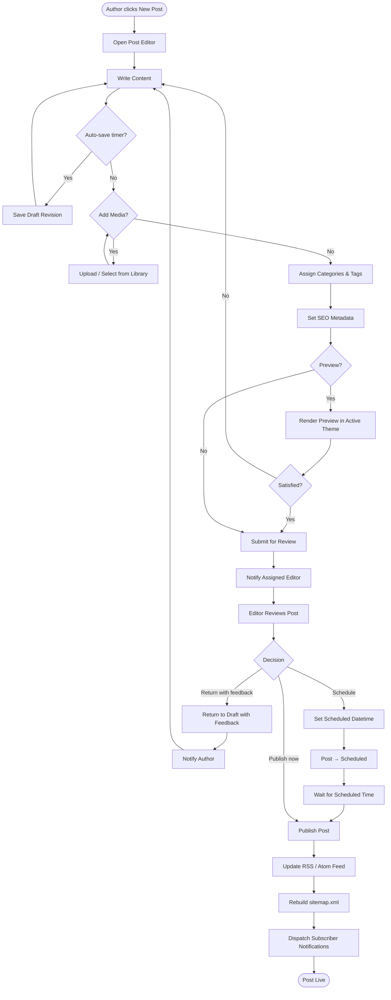
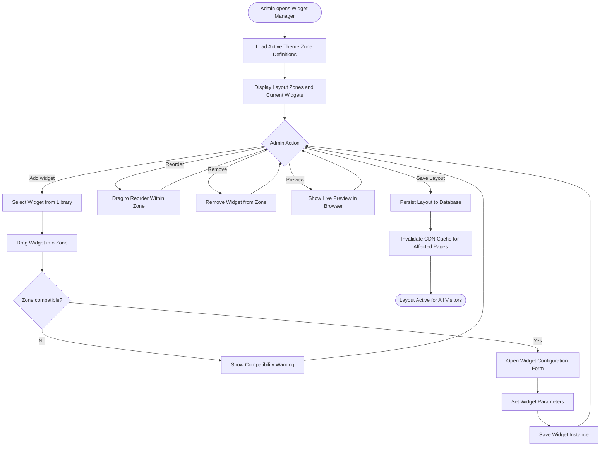
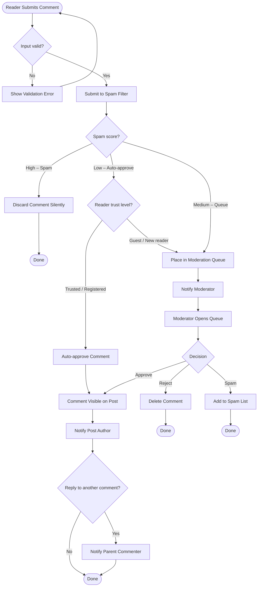
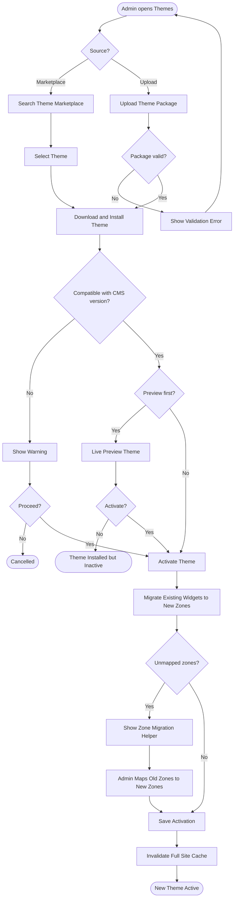
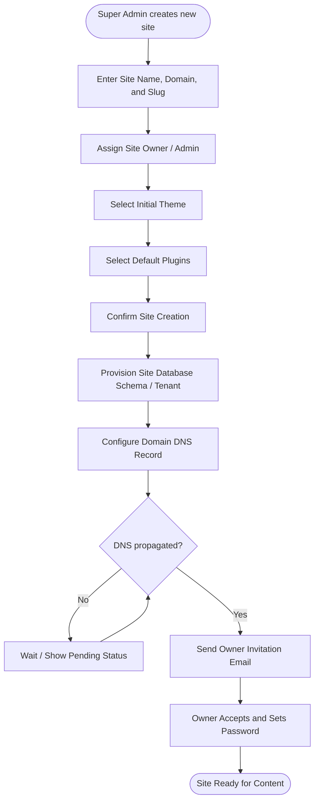

# Activity Diagrams

## Overview
Activity diagrams model the key business processes and workflows within the CMS platform.

---

## 1. Post Creation and Publishing Workflow

---

## 2. Widget Layout Customization Workflow

---

## 3. Comment Submission and Moderation Workflow

---

## 4. Theme Installation and Activation Workflow

---

## 5. Multi-Site Setup Workflow

