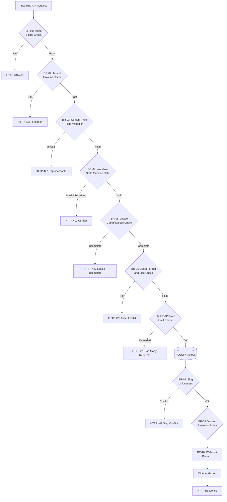

# Business Rules — Content Management System

**Version:** 1.0  
**Status:** Approved  
**Last Updated:** 2025-01-01  

---

## Table of Contents

1. [Overview](#overview)
2. [Rule Evaluation Pipeline](#rule-evaluation-pipeline)
3. [Enforceable Rules](#enforceable-rules)
4. [Exception and Override Handling](#exception-and-override-handling)
5. [Traceability Table](#traceability-table)

---

## Overview

This document defines the enforceable business rules governing the Content Management System. Rules span editorial workflows, publishing lifecycle, asset management, locale completeness, webhook delivery, and API rate limiting. They are platform-level invariants applied across all tenants and enforced by designated services at request validation, pre-write check, and post-write event stages.

---

## Rule Evaluation Pipeline



---

## Enforceable Rules

### BR-01 — API Token Scope Enforcement

**Category:** Authentication  
**Enforcer:** API Gateway / Auth Service  

Every API request MUST present a valid API token or OAuth2 access token whose scope includes the requested resource and action. A token scoped to `content:read` MUST NOT be accepted for write operations. A token belonging to Space A MUST NOT access resources in Space B.

**Rule Logic:**
```
ALLOW if:
  token.space_id == request.target_space_id
  AND token.scope includes request.action
  AND token.not_expired
DENY with HTTP 403 otherwise
```

1. Tokens with `content:write` can create, update, and delete entries.
2. Tokens with `media:write` can upload and delete assets.
3. Tokens with `workflow:manage` can approve and reject content in review.
4. Tokens with `admin` scope can manage spaces, content types, locales, and webhooks.
5. Preview tokens are read-only and scoped to unpublished content only.

**Exceptions:** Platform admin tokens with `platform:admin` bypass space-level scope checks for support operations; all such uses are audit-logged.

---

### BR-02 — Tenant and Space Isolation

**Category:** Tenancy  
**Enforcer:** All Services  

No API response MUST include resources belonging to a different Tenant or Space than the authenticated caller's context. All database queries, CDN asset URLs, and webhook payloads are filtered to the caller's space and environment before being returned.

```
All database queries MUST include:
  WHERE space_id = :caller_space_id
  AND environment_id = :caller_environment_id
```

---

### BR-03 — Content Type Field Validation

**Category:** Data Integrity  
**Enforcer:** Content Service  

When creating or updating a ContentItem, every field value MUST satisfy the field definition constraints defined in the ContentType model:

1. Required fields MUST be present and non-empty.
2. Field type constraints MUST be enforced (e.g., integer fields reject strings).
3. Text fields with `maxLength` MUST NOT exceed the configured limit.
4. Reference fields MUST point to existing ContentItems of the allowed linked type.
5. Enumeration fields MUST contain a value from the configured allowed set.
6. Rich-text fields MUST pass XSS sanitization before persistence.
7. Slug fields MUST match the regex `^[a-z0-9][a-z0-9-]*[a-z0-9]$` and be ≤ 180 characters.

---

### BR-04 — Editorial Workflow State Machine

**Category:** Lifecycle  
**Enforcer:** Workflow Service  

ContentItems MUST follow the defined lifecycle: `Draft → PendingReview → Approved → Scheduled/Published → Archived`. Transitions are enforced:

1. Only Authors (or higher) may submit `Draft → PendingReview`.
2. A Reviewer MUST NOT approve their own submissions unless `allowSelfApproval=true` is set in space settings.
3. Published content MUST transition through `PendingReview` on any substantive edit (title, slug, body); minor metadata edits may bypass review if configured.
4. Scheduled transitions require the publish time to be at least 2 minutes in the future.
5. Archived content requires a separate unpublish step before it can be re-edited.

---

### BR-05 — Locale Completeness Before Publishing

**Category:** Internationalization  
**Enforcer:** Publishing Service  

A ContentItem MUST NOT be published for a locale unless ALL required fields for that locale have non-empty, validated translations. The publishing service checks:

1. All mandatory fields have a translation in the target locale.
2. The translation passes the same field validation rules as the default locale.
3. Fallback locales are only used for display, never for publishing validation bypass.

---

### BR-06 — Asset Format and Size Limits

**Category:** Media Management  
**Enforcer:** Asset Service  

Uploaded assets MUST conform to the configured limits per space:

1. Image formats: JPEG, PNG, WebP, GIF, SVG (SVG requires sanitization).
2. Video formats: MP4, WebM, MOV (max 2 GB per file, default configurable).
3. Document formats: PDF, DOCX, XLSX (max 50 MB per file).
4. Image dimensions: max 20 000 × 20 000 pixels.
5. Total storage per space is quota-enforced; upload is rejected when quota is exceeded.
6. Dangerous file types (EXE, DMG, SH) MUST always be rejected.

---

### BR-07 — Slug Uniqueness and Redirect Creation

**Category:** URL Integrity  
**Enforcer:** Content Service  

Slug uniqueness is enforced per space and locale. A slug change after first publish MUST atomically create a redirect from the old slug to the new one in the same database transaction. The redirect is marked `permanent` (HTTP 301) by default and MUST be surfaced via the Delivery API.

---

### BR-08 — Content Version Retention Policy

**Category:** Data Governance  
**Enforcer:** Version Management Service  

ContentItem versions are retained for 18 months from creation by default. Space administrators may configure a longer retention period (up to 7 years) or request permanent retention for regulatory compliance. Versions outside the retention window are soft-deleted and permanently purged after a 30-day grace period. Published versions MUST be retained until the ContentItem is unpublished.

---

### BR-09 — API Rate Limiting by Token

**Category:** Platform Protection  
**Enforcer:** API Gateway  

Rate limits are enforced per API token:

| Token Type | Read Limit | Write Limit | Asset Upload Limit |
|-----------|-----------|-------------|-------------------|
| Management token | 10 req/s | 5 req/s | 20 uploads/min |
| Delivery token | 500 req/s | N/A | N/A |
| Preview token | 50 req/s | N/A | N/A |

Requests exceeding limits receive HTTP 429 with a `Retry-After` header. Sustained abuse (10× normal rate) triggers automatic token suspension.

---

### BR-10 — Webhook Delivery and Retry Policy

**Category:** Integrations  
**Enforcer:** Webhook Delivery Service  

Webhook delivery MUST follow an exponential retry policy:

1. Initial attempt within 10 seconds of event occurrence.
2. Retry schedule: 30 s, 2 min, 10 min, 1 h (4 retries, 5 total attempts).
3. Success: target returns HTTP 2xx within 30-second timeout.
4. After 5 consecutive failures, the webhook endpoint is suspended; no retries until manually re-enabled.
5. Each delivery includes `X-CMS-Signature` HMAC-SHA256 over the raw body.
6. Delivery logs are retained for 30 days.

---

### BR-11 — Rollback Eligibility

**Category:** Content Safety  
**Enforcer:** Publishing Service  

Content rollback MUST only target revisions that have a complete rendering artifact stored in object storage. Rollback creates a new revision from the target snapshot and initiates the standard publishing workflow; it does NOT bypass workflow approvals if the space requires them. The rollback actor and original revision ID are recorded in the audit log.

---

## Exception and Override Handling

Overrides to normal business rules are permitted only under the following controlled conditions:

- **Self-approval override:** Requires `allowSelfApproval=true` in space settings, set by a Space Administrator. Logged in audit trail.
- **Rate limit bypass:** Available to platform operator tokens for bulk migration operations only. TTL 24 hours max.
- **Retention extension:** Requires support ticket with legal justification; applied by platform admin.
- **Workflow bypass publish:** Requires `bypassWorkflow` flag on a token with `admin` scope; every use generates a `WorkflowBypassed` audit event.
- **Override windows expire:** All manual overrides must include an expiration timestamp. Expired overrides are automatically revoked.
- **Pattern escalation:** Three or more overrides of the same type within 7 days triggers a policy review notification to the space owner.

---

## Traceability Table

| Rule ID | Rule Name | Related Use Cases | Enforcer Service |
|---------|-----------|-------------------|-----------------|
| BR-01 | Token Scope Enforcement | UC-001–UC-012 | API Gateway, Auth Service |
| BR-02 | Tenant Isolation | UC-001–UC-012 | All Services |
| BR-03 | Content Type Field Validation | UC-003, UC-004 | Content Service |
| BR-04 | Editorial Workflow State Machine | UC-005, UC-006 | Workflow Service |
| BR-05 | Locale Completeness Before Publishing | UC-007 | Publishing Service |
| BR-06 | Asset Format and Size Limits | UC-009 | Asset Service |
| BR-07 | Slug Uniqueness and Redirect | UC-004, UC-008 | Content Service |
| BR-08 | Version Retention Policy | UC-011 | Version Management Service |
| BR-09 | API Rate Limiting | UC-001–UC-012 | API Gateway |
| BR-10 | Webhook Retry Policy | UC-012 | Webhook Delivery Service |
| BR-11 | Rollback Eligibility | UC-010 | Publishing Service |
