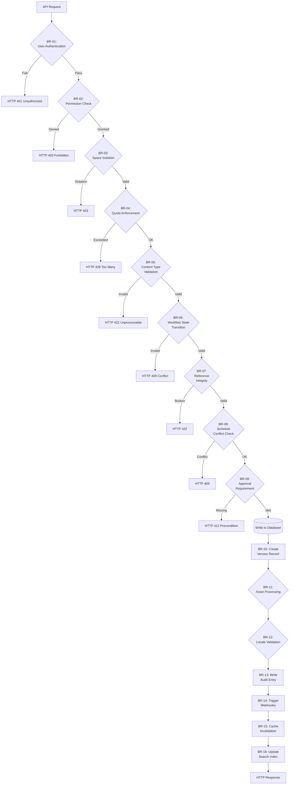

# Business Rules — Content Management System

**Version:** 1.0  
**Status:** Approved  
**Last Updated:** 2025-01-01  

---

## Table of Contents

1. [Overview](#1-overview)
2. [Rule Evaluation Pipeline](#2-rule-evaluation-pipeline)
3. [Enforceable Rules](#3-enforceable-rules)
4. [Exception and Override Handling](#4-exception-and-override-handling)
5. [Traceability Matrix](#5-traceability-matrix)

---

## Overview

This document defines the enforceable business rules governing the Content Management System's operational behavior. These rules represent platform-level invariants that ensure content integrity, workflow compliance, security, and performance. Rules are evaluated at specific lifecycle stages (request validation, pre-write check, post-publish event, scheduled execution) and are enforced by designated services and middleware components.

Business rules apply universally across all organizations and spaces unless explicitly marked as overridable. Rules that support organization-level configuration are noted with their permissible override scopes.

---

## Rule Evaluation Pipeline



---

## Enforceable Rules

---

### BR-01 — User Authentication and Session Validity

**Category:** Security  
**Enforcer:** API Gateway / Auth Middleware  

Every API request MUST present a valid authentication credential. Supported credential types include:
- **Session Token**: Bearer JWT issued upon successful login, valid for 24 hours (configurable per organization: 1-48 hours).
- **API Key**: Long-lived credential scoped to a specific space and permission set.
- **Preview Token**: Time-limited read-only token for previewing unpublished content.

**Rule Logic:**
```
ALLOW if:
  (credential.type == "session_token" AND token.not_expired AND token.signature_valid)
  OR (credential.type == "api_key" AND api_key.status == "active" AND api_key.space_id == request.space_id)
  OR (credential.type == "preview_token" AND preview_token.not_expired AND preview_token.entry_id == request.entry_id)
DENY with HTTP 401 otherwise
```

**Exceptions:**  
Public content delivery API endpoints (`/cdn/entries/:id`) permit anonymous access if the entry's `visibility` field is set to `public` and the entry's `published_at` timestamp is in the past.

---

### BR-02 — Role-Based Permission Enforcement

**Category:** Authorization  
**Enforcer:** Permission Service  

All operations MUST verify that the authenticated user possesses the required permission for the target resource. Permissions are evaluated hierarchically:
1. **User → Role → Permission** assignments at the space level.
2. **Field-level permissions** for sensitive content type fields (e.g., `salary` in `Employee` content type).
3. **Entry-level permissions** for co-authoring scenarios (creator can always edit their own drafts).

**Permission Matrix (minimum required):**

| Action | Required Permission | Scope |
|--------|-------------------|-------|
| Create Entry | `content:write` | Space |
| Update Own Draft | `content:write` OR entry creator | Entry |
| Update Any Entry | `content:edit_all` | Space |
| Publish Entry | `content:publish` | Space |
| Delete Entry | `content:delete` | Space |
| Manage Content Types | `schema:manage` | Space |
| Manage Workflows | `workflow:manage` | Space |
| View Audit Logs | `audit:read` | Space |
| Manage Users | `user:manage` | Organization |

**Rule Logic:**
```
user_permissions = roles[user.role_id].permissions
ALLOW if:
  user_permissions.contains(required_permission)
  AND (field_level_check_passes OR not_field_restricted)
  AND (entry_creator_check_passes OR not_entry_restricted)
DENY with HTTP 403 otherwise
```

**Exceptions:**  
Organization owners bypass all space-level permission checks. Super admins bypass all checks globally.

---

### BR-03 — Multi-Tenant Space Isolation

**Category:** Data Isolation  
**Enforcer:** All Services  

API responses MUST NEVER include resources from a different space than the authenticated credential's authorized scope. Database queries, cache lookups, and search operations MUST enforce space filtering at the query level (not post-retrieval filtering).

**Rule Logic:**
```
All queries MUST include:
  WHERE space_id = :authenticated_space_id
  AND organization_id = :authenticated_org_id

Cross-space references are ONLY allowed via:
  - Explicit cross-space entry references (if enabled in organization settings)
  - Super admin operations with explicit --target-space parameter
```

**Violation Response:**  
HTTP 403 if attempting to access a resource ID belonging to another space. Log a `CrossSpaceAccessAttempt` security event.

---

### BR-04 — Resource Quota Enforcement

**Category:** Resource Management  
**Enforcer:** Quota Service  

Resource-consuming operations MUST verify the current usage against the organization's configured quota limits before proceeding. If the quota is met or exceeded, the operation is rejected with HTTP 429.

**Quota Dimensions (per organization):**

| Resource | Free Tier | Standard | Enterprise | Enforced At |
|----------|-----------|----------|------------|-------------|
| Entries per space | 1,000 | 50,000 | Unlimited | Entry creation |
| Asset storage (GB) | 5 | 500 | 5,000 | Asset upload |
| API requests/hour | 1,000 | 100,000 | 1,000,000 | API Gateway |
| Concurrent workflows | 5 | 50 | 500 | Workflow initiation |
| Spaces per org | 3 | 50 | 500 | Space creation |
| Locales per space | 3 | 25 | 100 | Locale creation |
| Webhooks per space | 5 | 50 | 200 | Webhook registration |
| Custom roles | 3 | 20 | Unlimited | Role creation |

**Rule Logic:**
```
current_usage = usage_meter.get(org_id, resource_dimension)
quota_limit = org.plan_tier.limits[resource_dimension]

ALLOW if current_usage < quota_limit
REJECT with HTTP 429 if current_usage >= quota_limit
```

**Cache TTL:** Quota checks use a cached usage counter with 30-second TTL to reduce database load.

---

### BR-05 — Content Type Field Validation

**Category:** Data Integrity  
**Enforcer:** Content Validation Service  

Entry field values MUST conform to the constraints defined in the associated ContentType schema. Validation occurs before any database write operation.

**Supported Field Types and Validations:**

| Field Type | Validations |
|------------|-------------|
| `ShortText` | `minLength`, `maxLength`, `pattern` (regex), `unique` |
| `LongText` | `minLength`, `maxLength` |
| `RichText` | `allowedMarks` (bold, italic, etc.), `allowedNodes` (heading, list, etc.), `maxLength` |
| `Number` | `min`, `max`, `integer` (boolean) |
| `Date` | `min`, `max`, `format` (ISO 8601) |
| `Boolean` | No validation (true/false) |
| `Reference` | `allowedContentTypes[]`, `requiredDepth` (for circular ref detection) |
| `Media` | `allowedMimeTypes[]`, `maxFileSizeBytes` |
| `Array` | `minItems`, `maxItems`, `itemValidations` (nested) |
| `JSON` | `jsonSchema` (JSON Schema Draft 7) |
| `Location` | `lat` (-90 to 90), `lng` (-180 to 180) |

**Rule Logic:**
```
FOR EACH field IN entry.fields:
  field_def = content_type.fields[field.name]
  VALIDATE field.value AGAINST field_def.validations
  IF validation_fails:
    REJECT with HTTP 422 and error details
```

**Required Field Enforcement:**
```
FOR EACH required_field IN content_type.required_fields:
  IF entry.fields[required_field.name] IS NULL OR EMPTY:
    REJECT with HTTP 422
```

---

### BR-06 — Workflow State Transition Validation

**Category:** Workflow Enforcement  
**Enforcer:** Workflow Engine  

Entry state transitions MUST follow the configured workflow's state machine. Invalid transitions are rejected to maintain workflow integrity.

**Standard Workflow States:**
- `draft` → Initial state for new entries
- `in_review` → Submitted for editorial review
- `approved` → Review passed, ready for publishing
- `published` → Live and visible to end users
- `archived` → Removed from public visibility, retained for historical record

**Valid Transition Matrix:**

| From State | To State(s) | Required Permission | Additional Checks |
|------------|-------------|-------------------|------------------|
| `draft` | `in_review` | `content:write` | All required fields populated |
| `draft` | `archived` | `content:delete` | None |
| `in_review` | `approved` | `content:approve` | Reviewer ≠ Author |
| `in_review` | `draft` | `content:approve` | Rejection reason required |
| `approved` | `published` | `content:publish` | Scheduled publish time valid |
| `approved` | `draft` | `content:write` | None |
| `published` | `archived` | `content:publish` | Unpublish reason logged |
| `published` | `draft` | `content:publish` | Creates new version |
| `archived` | `draft` | `content:write` | Restore confirmation required |

**Rule Logic:**
```
current_state = entry.workflow_state
requested_state = request.workflow_state
allowed_transitions = workflow_config.transitions[current_state]

ALLOW if:
  requested_state IN allowed_transitions
  AND user.has_permission(transition.required_permission)
  AND additional_checks_pass()
DENY with HTTP 409 otherwise
```

---

### BR-07 — Reference Integrity and Circular Dependency Prevention

**Category:** Data Integrity  
**Enforcer:** Reference Validator  

Entry reference fields MUST point to existing, non-deleted entries. Circular references (A → B → C → A) are detected and rejected to prevent infinite resolution loops.

**Rule Logic:**
```
FOR EACH reference_field IN entry.fields WHERE field.type == "Reference":
  referenced_entry = Entry.find(reference_field.entry_id)
  
  REJECT if:
    - referenced_entry NOT EXISTS
    - referenced_entry.deleted_at IS NOT NULL
    - referenced_entry.workflow_state == "archived" (unless allow_archived_refs = true)
    - circular_reference_detected(entry.id, reference_field.entry_id, max_depth=10)
  
  ALLOW otherwise
```

**Circular Reference Detection:**
```python
def circular_reference_detected(entry_id, ref_id, max_depth):
    visited = set()
    queue = [(ref_id, 0)]
    
    while queue:
        current_id, depth = queue.pop(0)
        if current_id == entry_id:
            return True  # Circular reference detected
        if depth > max_depth or current_id in visited:
            continue
        visited.add(current_id)
        
        # Traverse all reference fields in current entry
        for ref in get_references(current_id):
            queue.append((ref, depth + 1))
    
    return False
```

---

### BR-08 — Schedule Conflict Prevention

**Category:** Publishing  
**Enforcer:** Schedule Coordinator  

Scheduled publish/unpublish operations for the same entry MUST NOT overlap in time. Multiple schedules for different entries are permitted.

**Rule Logic:**
```
existing_schedules = EntrySchedule.where(entry_id = request.entry_id, status = "pending")

FOR EACH schedule IN existing_schedules:
  REJECT with HTTP 409 if:
    (request.execute_at >= schedule.execute_at AND request.execute_at < schedule.execute_at + 60 seconds)
```

**Additional Constraints:**
- Scheduled time MUST be at least 5 minutes in the future
- Unpublish schedule MUST be after publish schedule (if both present)
- Recurring schedules (e.g., weekly republish) MUST specify a valid cron expression

---

### BR-09 — Approval Requirement Enforcement

**Category:** Workflow  
**Enforcer:** Approval Service  

Entries marked `requires_approval = true` in their content type MUST obtain the configured minimum number of approvals before state transition to `published`.

**Rule Logic:**
```
IF content_type.requires_approval == true:
  approvals = Approval.where(entry_id = entry.id, status = "approved")
  required_count = content_type.min_approvals (default: 1)
  
  ALLOW publish if:
    approvals.count >= required_count
    AND all_approvers_have_permission("content:approve")
    AND no_approver_is_entry_author
  
  REJECT with HTTP 412 otherwise
```

**Approval Invalidation:**
- Any edit to the entry after approval invalidates all existing approvals
- Approvals MUST be re-requested after invalidation

---

### BR-10 — Automatic Versioning on Publish

**Category:** Versioning  
**Enforcer:** Entry Service  

Every publish operation (including updates to already-published entries) MUST create an immutable EntryVersion record capturing the full entry state at that moment.

**Rule Logic:**
```
ON entry.workflow_state TRANSITION TO "published":
  version = EntryVersion.create(
    entry_id: entry.id,
    version_number: entry.version_counter + 1,
    snapshot: entry.to_json(),  // Full entry data serialization
    created_by: current_user.id,
    created_at: now()
  )
  entry.version_counter += 1
  entry.current_version_id = version.id
```

**Version Retention:**
- Versions are retained indefinitely for `published` and `archived` states
- Draft versions MAY be pruned after 90 days (configurable)
- Organizations on Enterprise tier can enable full draft version retention

---

### BR-11 — Asset Processing and Transformation Constraints

**Category:** Media Management  
**Enforcer:** Asset Processing Service  

Uploaded assets MUST be validated for mime type, file size, and malware before storage. Image transformations MUST be restricted to prevent resource exhaustion.

**Upload Validation:**
```
REJECT if:
  - file.size > org.max_asset_size_bytes (default: 100 MB)
  - file.mime_type NOT IN allowed_mime_types
  - virus_scan_positive(file)
```

**Allowed MIME Types (default):**
- Images: `image/jpeg`, `image/png`, `image/webp`, `image/gif`, `image/svg+xml`
- Documents: `application/pdf`, `text/plain`, `text/csv`
- Video: `video/mp4`, `video/webm`
- Audio: `audio/mpeg`, `audio/wav`

**Transformation Constraints:**
```
FOR transformation IN request.transformations:
  REJECT if:
    - transformation.width > 5000 OR transformation.height > 5000
    - transformation.quality < 1 OR transformation.quality > 100
    - transformation.format NOT IN ["jpeg", "png", "webp", "avif"]
    - transformation.resize_mode NOT IN ["fit", "fill", "crop", "thumb"]
```

**Concurrent Processing Limit:** Maximum 5 transformations processed simultaneously per organization.

---

### BR-12 — Locale Validation and Fallback Chain

**Category:** Localization  
**Enforcer:** Locale Service  

Entry locale fields MUST reference a locale defined in the space's locale configuration. Locale fallback chains MUST NOT contain cycles.

**Rule Logic:**
```
FOR EACH locale_field IN entry.localized_fields:
  locale = Locale.find_by(space_id: space.id, code: locale_field.locale_code)
  
  REJECT if:
    - locale NOT EXISTS
    - locale.status == "disabled"
    - circular_fallback_detected(locale.code, locale.fallback_chain)
```

**Fallback Chain Validation:**
```
fallback_chain = ["en-US", "en", "en-GB", "en"]  // INVALID: cycle detected
fallback_chain = ["fr-CA", "fr", "en"]           // VALID
```

**Required Locale:**
- Every space MUST have exactly one `default_locale`
- The default locale MUST NOT have a fallback chain
- All entries MUST have content in the default locale

---

### BR-13 — Audit Log Immutability and Completeness

**Category:** Compliance  
**Enforcer:** Audit Service  

All mutation operations (create, update, delete, publish, unpublish) MUST generate an immutable audit log entry within 1 second of the operation.

**Rule Logic:**
```
ON entry.save() OR entry.delete() OR entry.publish():
  AuditLog.create(
    organization_id: org.id,
    space_id: space.id,
    resource_type: "Entry",
    resource_id: entry.id,
    action: operation_type,  // "created", "updated", "published", etc.
    actor_id: current_user.id,
    actor_ip: request.ip_address,
    changes: compute_diff(entry.previous_state, entry.current_state),
    occurred_at: now()
  )
```

**Retention Policy:**
- Audit logs are retained for a minimum of 1 year (configurable up to 7 years)
- Audit logs MUST be stored in an append-only table with no UPDATE/DELETE grants to application roles
- Export to external immutable storage (S3 Object Lock) is available for Enterprise tier

---

### BR-14 — Webhook Delivery and Retry Policy

**Category:** Integration  
**Enforcer:** Webhook Delivery Service  

Registered webhooks MUST be triggered for matching events. Delivery follows a strict retry policy with exponential backoff.

**Triggering Events:**
- `entry.created`, `entry.updated`, `entry.published`, `entry.unpublished`, `entry.deleted`
- `asset.uploaded`, `asset.deleted`
- `content_type.created`, `content_type.updated`, `content_type.deleted`

**Delivery Retry Schedule:**
- Attempt 1: Immediate
- Attempt 2: +10 seconds
- Attempt 3: +1 minute
- Attempt 4: +10 minutes
- Attempt 5: +1 hour

**Success Criteria:** Target endpoint returns HTTP 2xx within 30-second timeout.

**Suspension:** After 5 consecutive failures, the webhook is marked `suspended`. Manual re-enablement required.

**Rule Logic:**
```
ON event OCCURS:
  FOR EACH webhook WHERE webhook.events INCLUDES event.type:
    payload = {
      event: event.type,
      resource: event.resource.to_json(),
      occurred_at: event.timestamp,
      space_id: space.id
    }
    signature = HMAC_SHA256(payload, webhook.secret)
    
    delivery = WebhookDelivery.create(
      webhook_id: webhook.id,
      payload: payload,
      signature: signature,
      status: "pending"
    )
    
    WebhookDeliveryWorker.perform_async(delivery.id)
```

---

### BR-15 — Cache Invalidation on Content Update

**Category:** Performance  
**Enforcer:** Cache Manager  

Published entry updates MUST invalidate all associated CDN and application cache entries to ensure content freshness.

**Invalidation Targets:**
```
ON entry.publish() OR entry.update() WHERE entry.workflow_state == "published":
  invalidate_cache_keys([
    "entry:#{entry.id}",
    "entry:#{entry.slug}",
    "space:#{space.id}:entries",
    "content-type:#{entry.content_type_id}:entries",
    "locale:#{entry.locale}:entries"
  ])
  
  FOR EACH tag IN entry.tags:
    invalidate_cache_key("tag:#{tag.id}:entries")
  
  FOR EACH category IN entry.categories:
    invalidate_cache_key("category:#{category.id}:entries")
  
  cdn_purge(urls: entry.cdn_urls)
```

**CDN Purge SLA:** Cache invalidation MUST propagate to all CDN edge nodes within 60 seconds (p99).

---

### BR-16 — Search Index Update on Content Change

**Category:** Search  
**Enforcer:** Search Indexer  

Published entries MUST be indexed in the full-text search engine within 5 seconds of publish/update. Deleted or unpublished entries MUST be removed from the index immediately.

**Indexing Logic:**
```
ON entry.publish():
  search_document = {
    id: entry.id,
    space_id: space.id,
    content_type: entry.content_type.name,
    title: entry.fields["title"],
    body: extract_text(entry.fields),
    tags: entry.tags.map(&:name),
    categories: entry.categories.map(&:name),
    published_at: entry.published_at,
    locale: entry.locale
  }
  SearchIndex.upsert(search_document)

ON entry.unpublish() OR entry.delete():
  SearchIndex.remove(entry.id)
```

**Indexing Priority Queue:**
- Publish events: High priority (indexed within 5 seconds)
- Update events: Medium priority (indexed within 30 seconds)
- Bulk operations: Low priority (indexed within 5 minutes)

---

### BR-17 — API Rate Limiting Per Client

**Category:** Performance  
**Enforcer:** API Gateway  

API requests are rate-limited per client credential to prevent abuse and ensure fair resource allocation.

**Rate Limit Tiers (per credential per hour):**

| Credential Type | Free Tier | Standard | Enterprise |
|----------------|-----------|----------|------------|
| Session Token | 1,000 | 10,000 | 100,000 |
| API Key | 5,000 | 50,000 | 500,000 |
| Preview Token | 100 | 100 | 100 |

**Rule Logic:**
```
request_count = rate_limiter.incr("credential:#{credential.id}", ttl: 3600)
limit = credential.rate_limit

ALLOW if request_count <= limit
REJECT with HTTP 429 if request_count > limit
  headers:
    X-RateLimit-Limit: limit
    X-RateLimit-Remaining: max(0, limit - request_count)
    X-RateLimit-Reset: next_hour_epoch
```

**Burst Allowance:** Clients can burst up to 2× their hourly limit within any 5-minute window, provided they remain under the hourly limit.

---

### BR-18 — Preview Token Scope Restriction

**Category:** Security  
**Enforcer:** Preview Service  

Preview tokens MUST be scoped to a single entry and MUST expire within 7 days. Tokens MUST NOT grant write access.

**Rule Logic:**
```
ON generate_preview_token(entry_id):
  token = PreviewToken.create(
    entry_id: entry_id,
    expires_at: now() + org.preview_token_ttl (max: 7 days),
    permissions: ["read"]
  )
  
ON validate_preview_token(token):
  ALLOW if:
    token.not_expired
    AND token.entry_id == request.entry_id
    AND request.method == "GET"
  DENY otherwise
```

---

### BR-19 — Asset CDN URL Signing

**Category:** Security  
**Enforcer:** CDN Service  

Private assets MUST be delivered via signed CDN URLs with configurable expiry. URL signatures MUST use HMAC-SHA256 with organization-specific secret.

**Rule Logic:**
```
ON generate_asset_url(asset, ttl):
  IF asset.visibility == "private":
    expiry = now() + ttl (max: 24 hours)
    signature = HMAC_SHA256("#{asset.id}:#{expiry}", org.cdn_secret)
    url = "#{cdn_base}/assets/#{asset.id}?expires=#{expiry}&sig=#{signature}"
  ELSE:
    url = "#{cdn_base}/assets/#{asset.id}"  // Public, no signature
  
  RETURN url
```

---

### BR-20 — Content Export and Import Validation

**Category:** Data Portability  
**Enforcer:** Import/Export Service  

Exported content MUST include all entry data, assets, content types, and metadata in a standardized JSON format. Imports MUST validate against the target space's schema before applying changes.

**Export Format:**
```json
{
  "version": "1.0",
  "exported_at": "2025-01-15T10:30:00Z",
  "space": { "id": "...", "name": "..." },
  "content_types": [...],
  "entries": [...],
  "assets": [...],
  "locales": [...]
}
```

**Import Validation:**
```
ON import(payload):
  VALIDATE payload.version == current_export_version
  VALIDATE all content_types match or are compatible
  VALIDATE all referenced entries exist or are included in import
  VALIDATE all locales exist in target space
  
  IF validation_passes:
    APPLY import in transaction
  ELSE:
    REJECT with detailed validation error report
```

---

## Exception and Override Handling

### Organization-Level Overrides

The following business rules support organization-level configuration overrides:

| Rule ID | Configurable Parameter | Default | Min | Max |
|---------|----------------------|---------|-----|-----|
| BR-01 | Session token TTL | 24 hours | 1 hour | 48 hours |
| BR-04 | Resource quotas | See BR-04 table | N/A | N/A |
| BR-08 | Min schedule advance time | 5 minutes | 1 minute | 1 hour |
| BR-10 | Draft version retention | 90 days | 0 days | Unlimited |
| BR-13 | Audit log retention | 1 year | 1 year | 7 years |
| BR-17 | API rate limits | See BR-17 table | 50% of default | 10× default |
| BR-19 | Asset URL expiry | 1 hour | 5 minutes | 24 hours |

### Emergency Override Protocol

Super admins can temporarily bypass the following rules in emergency situations:
- BR-04 (Quota Enforcement) — for critical operations during incident response
- BR-06 (Workflow Transitions) — to force-publish critical security updates
- BR-08 (Schedule Conflicts) — to resolve scheduling deadlocks

All emergency overrides MUST:
1. Require two-factor authentication confirmation
2. Log to a separate `emergency_audit_log` table
3. Trigger immediate notification to organization owners
4. Auto-expire after 1 hour unless explicitly extended

---

## Traceability Matrix

| Rule ID | Rule Name | Related Use Cases | Related Requirements | Enforcer Service |
|---------|-----------|-------------------|---------------------|-----------------|
| BR-01 | User Authentication | UC-001, UC-002, UC-003 | FR-001, FR-002, NFR-003 | API Gateway, Auth Service |
| BR-02 | Permission Enforcement | UC-001–UC-010 | FR-003, FR-004 | Permission Service |
| BR-03 | Space Isolation | All | FR-005, NFR-002 | All Services |
| BR-04 | Quota Enforcement | UC-001, UC-005, UC-007 | FR-006, NFR-004 | Quota Service |
| BR-05 | Field Validation | UC-003, UC-004 | FR-010, FR-011 | Content Validation Service |
| BR-06 | Workflow Transitions | UC-004, UC-006 | FR-015, FR-016 | Workflow Engine |
| BR-07 | Reference Integrity | UC-003, UC-004 | FR-012 | Reference Validator |
| BR-08 | Schedule Conflicts | UC-006 | FR-020 | Schedule Coordinator |
| BR-09 | Approval Requirements | UC-006 | FR-016 | Approval Service |
| BR-10 | Auto Versioning | UC-004, UC-006 | FR-017 | Entry Service |
| BR-11 | Asset Validation | UC-005 | FR-025, NFR-005 | Asset Processing Service |
| BR-12 | Locale Validation | UC-008 | FR-030, FR-031 | Locale Service |
| BR-13 | Audit Immutability | All | FR-040, NFR-010 | Audit Service |
| BR-14 | Webhook Delivery | UC-009 | FR-035 | Webhook Delivery Service |
| BR-15 | Cache Invalidation | UC-004, UC-006 | NFR-006, NFR-007 | Cache Manager |
| BR-16 | Search Indexing | UC-010 | FR-037 | Search Indexer |
| BR-17 | API Rate Limiting | All | NFR-004, NFR-008 | API Gateway |
| BR-18 | Preview Token Scope | UC-007 | FR-018 | Preview Service |
| BR-19 | Asset CDN Signing | UC-005 | FR-026, NFR-009 | CDN Service |
| BR-20 | Import/Export Validation | UC-011 | FR-041 | Import/Export Service |

---

**Document Control:**  
- Approved by: CTO, Lead Architect  
- Review Cycle: Quarterly  
- Next Review: 2025-04-01
