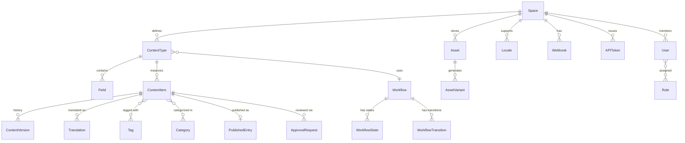

# Data Dictionary — Content Management System

**Version:** 1.0  
**Status:** Approved  
**Last Updated:** 2025-01-01  

---

## Table of Contents

1. [Core Entities](#core-entities)
2. [Canonical Relationship Diagram](#canonical-relationship-diagram)
3. [Data Quality Controls](#data-quality-controls)
4. [Field Definitions](#field-definitions)

---

## Core Entities

| Entity | Description | Primary Key | Owner | Retention |
|--------|-------------|-------------|-------|-----------|
| `Space` | Top-level organizational unit containing all CMS resources | `space_id` UUID | Platform Team | Indefinite |
| `ContentType` | Schema definition (fields, validations) for a class of content | `content_type_id` UUID | Content Team | Life of space |
| `Field` | Individual field definition within a ContentType | `field_id` UUID | Content Team | Life of ContentType |
| `ContentItem` | A single instance of a ContentType with versioned field values | `item_id` UUID | Editorial Team | 7 years |
| `ContentVersion` | Immutable snapshot of a ContentItem at a point in time | `version_id` UUID | Editorial Team | 18 months (configurable) |
| `Asset` | Binary file (image, video, document) uploaded to the space | `asset_id` UUID | Media Team | Life of space |
| `AssetVariant` | Processed rendition of an Asset (thumbnail, WebP, etc.) | `variant_id` UUID | Media Team | Life of Asset |
| `Workflow` | Configurable approval chain definition | `workflow_id` UUID | Editorial Team | Life of space |
| `WorkflowState` | A named state within a Workflow (e.g., Draft, Review, Approved) | `state_id` UUID | Editorial Team | Life of Workflow |
| `WorkflowTransition` | Allowed edge between two WorkflowStates with role guards | `transition_id` UUID | Editorial Team | Life of Workflow |
| `ApprovalRequest` | Instance of a review task for a ContentItem revision | `approval_id` UUID | Editorial Team | 400 days |
| `Locale` | Language/region configuration (e.g., `en-US`, `fr-FR`) | `locale_id` UUID | Platform Team | Indefinite |
| `Translation` | Field values for a ContentItem in a specific Locale | `translation_id` UUID | Editorial Team | Life of ContentItem |
| `Tag` | Free-form label applied to ContentItems | `tag_id` UUID | Editorial Team | Life of space |
| `Category` | Hierarchical taxonomy node applied to ContentItems | `category_id` UUID | Editorial Team | Life of space |
| `PublishedEntry` | Delivery-optimized snapshot of a published ContentItem | `entry_id` UUID | Publishing Team | Until unpublished |
| `Webhook` | Outbound event subscription targeting an external URL | `webhook_id` UUID | Integration Team | Life of space |
| `APIToken` | Scoped credential for Management or Delivery API access | `token_id` UUID | Platform Team | Configurable TTL |
| `User` | Platform user with roles within one or more spaces | `user_id` UUID | Auth Team | 5 years post-deactivation |
| `Role` | Named permission set assignable to users within a space | `role_id` UUID | Auth Team | Life of space |

---

## Canonical Relationship Diagram

---

## Data Quality Controls

| Control | Target Field | Rule | Error Code | Severity |
|---------|-------------|------|------------|----------|
| Slug format | `ContentItem.slug` | Must match `^[a-z0-9][a-z0-9-]*[a-z0-9]$`, max 180 chars | `INVALID_SLUG_FORMAT` | Error |
| Slug uniqueness | `ContentItem.slug` | Unique per `space_id + locale_id` | `SLUG_ALREADY_EXISTS` | Error |
| Required field presence | `ContentVersion.field_values` | All `required=true` fields must be non-empty | `REQUIRED_FIELD_MISSING` | Error |
| Asset file size | `Asset.file_size_bytes` | Image ≤ 20 MB; Video ≤ 2 GB; Document ≤ 50 MB | `ASSET_TOO_LARGE` | Error |
| Asset MIME type | `Asset.content_type` | Must be in allowed list per asset class | `UNSUPPORTED_MEDIA_TYPE` | Error |
| Rich-text XSS | `ContentVersion.field_values[type=richText]` | Must pass XSS sanitization pipeline | `XSS_CONTENT_DETECTED` | Critical |
| Translation completeness | `Translation` for locale | All required fields translated before publish | `TRANSLATION_INCOMPLETE` | Error |
| Publish time future | `ContentItem.scheduled_publish_at` | Must be ≥ 2 minutes from now | `SCHEDULE_TOO_SOON` | Error |
| Field max length | `ContentVersion.field_values[type=text]` | Must not exceed `Field.max_length` | `FIELD_TOO_LONG` | Error |
| Reference integrity | `ContentVersion.field_values[type=reference]` | Referenced item must exist in same space | `BROKEN_REFERENCE` | Error |

---

## Field Definitions

### ContentItem

| Field | Type | Constraints | Description |
|-------|------|-------------|-------------|
| `item_id` | UUID | PK, not null | Globally unique content item identifier |
| `space_id` | UUID | FK → Space, not null | Owning space |
| `content_type_id` | UUID | FK → ContentType, not null | Schema governing this item |
| `slug` | VARCHAR(180) | Unique per space+locale, not null | URL-safe identifier |
| `status` | ENUM | `Draft`, `PendingReview`, `Approved`, `Scheduled`, `Published`, `Archived` | Current lifecycle state |
| `current_version_id` | UUID | FK → ContentVersion, not null | Active working version |
| `published_version_id` | UUID | FK → ContentVersion, nullable | Version currently live on delivery |
| `workflow_id` | UUID | FK → Workflow, nullable | Workflow governing this item |
| `locale_id` | UUID | FK → Locale, not null | Primary locale |
| `created_by` | UUID | FK → User, not null | Author who created the item |
| `published_at` | TIMESTAMPTZ | nullable | Timestamp of last publish |
| `scheduled_publish_at` | TIMESTAMPTZ | nullable | Scheduled future publish time |
| `created_at` | TIMESTAMPTZ | not null | Creation timestamp (UTC) |
| `updated_at` | TIMESTAMPTZ | not null | Last modification timestamp |

### ContentVersion

| Field | Type | Constraints | Description |
|-------|------|-------------|-------------|
| `version_id` | UUID | PK, not null | Version unique identifier |
| `item_id` | UUID | FK → ContentItem, not null | Parent content item |
| `version_number` | INTEGER | > 0, unique per item | Sequential version counter |
| `field_values` | JSONB | max 2 MB; schema-validated | Serialized field value map |
| `checksum` | CHAR(64) | SHA-256 of field_values | Integrity fingerprint |
| `created_by` | UUID | FK → User, not null | Who authored this version |
| `created_at` | TIMESTAMPTZ | not null, immutable | When version was created |

### Asset

| Field | Type | Constraints | Description |
|-------|------|-------------|-------------|
| `asset_id` | UUID | PK, not null | Asset unique identifier |
| `space_id` | UUID | FK → Space, not null | Owning space |
| `file_name` | VARCHAR(255) | not null | Original uploaded file name |
| `content_type` | VARCHAR(100) | not null | MIME type |
| `file_size_bytes` | BIGINT | > 0 | File size in bytes |
| `storage_key` | VARCHAR(512) | not null | Object storage path |
| `scan_status` | ENUM | `Pending`, `Clean`, `Blocked` | Antivirus scan result |
| `uploaded_by` | UUID | FK → User, not null | Uploader |
| `created_at` | TIMESTAMPTZ | not null | Upload timestamp |

---

## Retention and Audit

- ContentItem records remain active until explicitly archived or deleted by a space administrator.
- ContentVersion records are retained for 18 months by default; published versions are exempt until unpublished.
- Asset records are retained for the life of the space; soft-deleted assets are permanently purged after 30 days.
- ApprovalRequest records are retained for 400 days to support editorial audit queries.
- All state transitions are logged in the `audit_log` table with actor, action, reason, and evidence hash (SHA-256); logs are retained for 7 years.
