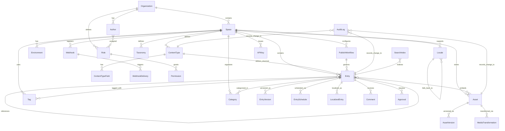

# Data Dictionary — Content Management System

**Version:** 1.0  
**Status:** Approved  
**Last Updated:** 2025-01-01  

---

## Table of Contents

1. [Overview](#1-overview)
2. [Core Entities](#2-core-entities)
3. [Canonical Relationship Diagram](#3-canonical-relationship-diagram)
4. [Entity Definitions](#4-entity-definitions)
5. [Data Quality Controls](#5-data-quality-controls)
6. [Enumeration Catalogs](#6-enumeration-catalogs)

---

## 1. Overview

This document provides comprehensive definitions for all persistent entities in the Content Management System. Each entity definition includes attribute specifications, data types, validation rules, relationships, and business context.

The data model supports multi-tenancy (Organization → Space → Content), flexible content modeling (ContentType → Entry), comprehensive versioning (EntryVersion), workflow management (PublishWorkflow, Approval), and extensive localization (Locale, LocalizedEntry).

---

## 2. Core Entities

| Entity | Type | Description |
|--------|------|-------------|
| Organization | Aggregate Root | Top-level tenant representing a company or team |
| Space | Aggregate Root | Isolated content workspace within an organization |
| ContentType | Domain Entity | Schema definition for structured content |
| ContentTypeField | Value Object | Individual field definition within a content type |
| Entry | Aggregate Root | Content instance conforming to a ContentType |
| EntryVersion | Immutable Record | Historical snapshot of an Entry at a point in time |
| EntrySchedule | Domain Entity | Scheduled publish/unpublish automation |
| Asset | Aggregate Root | Uploaded media file (image, video, document) |
| AssetVersion | Immutable Record | Historical snapshot of asset metadata and file reference |
| MediaTransformation | Value Object | Image transformation parameters (resize, crop, format) |
| Tag | Domain Entity | Folksonomy classification label |
| Category | Domain Entity | Hierarchical taxonomy classification |
| Taxonomy | Aggregate Root | Custom classification system definition |
| Author | Domain Entity | Content creator profile |
| Role | Domain Entity | Permission grouping |
| Permission | Value Object | Granular access control capability |
| APIKey | Domain Entity | Long-lived authentication credential |
| CDN | Configuration Entity | Content delivery network configuration |
| Locale | Domain Entity | Supported language/region combination |
| LocalizedEntry | Value Object | Entry field values for a specific locale |
| Webhook | Domain Entity | Event notification endpoint |
| WebhookDelivery | Immutable Record | Individual webhook invocation attempt |
| Preview | Domain Entity | Temporary preview session |
| Comment | Domain Entity | Editorial comment on entry field or section |
| Approval | Domain Entity | Editorial approval record |
| PublishWorkflow | Domain Entity | State machine configuration for content lifecycle |
| AuditLog | Immutable Record | Compliance record of all mutations |
| SearchIndex | Derived Entity | Full-text search representation of published entries |
| UsageMetrics | Derived Entity | Aggregated analytics data |
| Migration | Domain Entity | Content model schema migration |
| Environment | Aggregate Root | Isolated deployment context (production, staging, development) |

---

## 3. Canonical Relationship Diagram



---

## 4. Entity Definitions

---

### 4.1 Organization

**Description:** The top-level multi-tenant boundary. All resources are scoped to an Organization. Billing, quota enforcement, and top-level role assignments occur at the organization level.

**Table:** `core.organizations`

| Attribute | Type | Nullable | Description | Validation |
|-----------|------|----------|-------------|------------|
| `id` | `UUID` | No | Primary key | Auto-generated (UUID v4) |
| `slug` | `VARCHAR(63)` | No | URL-safe identifier | Regex: `^[a-z0-9][a-z0-9-]{1,61}[a-z0-9]$`; unique |
| `name` | `VARCHAR(255)` | No | Display name | 1–255 characters |
| `billing_email` | `VARCHAR(320)` | No | Contact email for billing | Valid RFC 5321 email |
| `plan_tier` | `VARCHAR(20)` | No | Subscription level | Enum: `free`, `standard`, `enterprise` |
| `status` | `VARCHAR(20)` | No | Lifecycle state | Enum: `active`, `suspended`, `deleted`; default `active` |
| `quota_config` | `JSONB` | No | Per-resource quota limits | Valid JSON object |
| `feature_flags` | `JSONB` | No | Enabled feature toggles | Valid JSON object |
| `created_at` | `TIMESTAMPTZ` | No | UTC creation timestamp | Auto-set; immutable |
| `updated_at` | `TIMESTAMPTZ` | No | UTC last update timestamp | Auto-updated on write |
| `deleted_at` | `TIMESTAMPTZ` | Yes | Soft delete timestamp | Null if active |

**Indexes:**  
- `UNIQUE(slug)`
- `INDEX(status, deleted_at)`
- `INDEX(plan_tier)`

**Business Rules:**  
- Organization slug cannot be changed after creation
- Organization deletion is a soft delete; permanent deletion occurs after 30-day grace period
- Plan tier upgrades take effect immediately; downgrades take effect at next billing cycle

---

### 4.2 Space

**Description:** An isolated content workspace within an Organization. Spaces provide complete data isolation for different projects, brands, or environments. Each Space has its own ContentTypes, Entries, Assets, and permissions.

**Table:** `core.spaces`

| Attribute | Type | Nullable | Description | Validation |
|-----------|------|----------|-------------|------------|
| `id` | `UUID` | No | Primary key | Auto-generated (UUID v4) |
| `organization_id` | `UUID` | No | FK → `organizations.id` | Must reference existing org |
| `name` | `VARCHAR(255)` | No | Display name | 1–255 characters; unique per org |
| `slug` | `VARCHAR(63)` | No | URL-safe identifier | Regex: `^[a-z0-9-]+$`; unique per org |
| `default_locale_id` | `UUID` | No | FK → `locales.id` | Required locale for all entries |
| `status` | `VARCHAR(20)` | No | Lifecycle state | Enum: `active`, `archived`, `deleted`; default `active` |
| `environment_type` | `VARCHAR(20)` | No | Classification | Enum: `production`, `staging`, `development` |
| `cdn_config` | `JSONB` | Yes | CDN delivery settings | Valid JSON object |
| `created_at` | `TIMESTAMPTZ` | No | UTC creation timestamp | Auto-set |
| `updated_at` | `TIMESTAMPTZ` | No | UTC last update timestamp | Auto-updated |

**Indexes:**  
- `UNIQUE(organization_id, slug)`
- `INDEX(organization_id, status)`
- `INDEX(default_locale_id)`

---

### 4.3 Environment

**Description:** Named deployment context within a Space. Environments enable content promotion workflows (e.g., develop content in `development`, promote to `staging`, then to `production`).

**Table:** `core.environments`

| Attribute | Type | Nullable | Description | Validation |
|-----------|------|----------|-------------|------------|
| `id` | `UUID` | No | Primary key | Auto-generated (UUID v4) |
| `space_id` | `UUID` | No | FK → `spaces.id` | Must reference existing space |
| `name` | `VARCHAR(63)` | No | Environment name | `production`, `staging`, `development`, or custom |
| `status` | `VARCHAR(20)` | No | Lifecycle state | Enum: `active`, `inactive` |
| `api_endpoint` | `VARCHAR(512)` | No | Base URL for API access | Valid URL |
| `is_default` | `BOOLEAN` | No | Default environment for space | Only one per space can be true |
| `created_at` | `TIMESTAMPTZ` | No | UTC creation timestamp | Auto-set |

**Indexes:**  
- `UNIQUE(space_id, name)`
- `INDEX(space_id, is_default)`

---

### 4.4 ContentType

**Description:** Schema definition for structured content. Defines the fields, validations, and behavior for a category of entries (e.g., "BlogPost", "Product", "Author").

**Table:** `schema.content_types`

| Attribute | Type | Nullable | Description | Validation |
|-----------|------|----------|-------------|------------|
| `id` | `UUID` | No | Primary key | Auto-generated (UUID v4) |
| `space_id` | `UUID` | No | FK → `spaces.id` | Must reference existing space |
| `name` | `VARCHAR(255)` | No | Display name | 1–255 characters; unique per space |
| `api_id` | `VARCHAR(63)` | No | Programmatic identifier | Regex: `^[a-zA-Z][a-zA-Z0-9_]*$`; unique per space |
| `description` | `TEXT` | Yes | Human-readable description | Max 2,000 characters |
| `display_field` | `VARCHAR(63)` | Yes | Field to use for entry title | Must match a field name |
| `requires_approval` | `BOOLEAN` | No | Enforce approval before publish | Default: false |
| `min_approvals` | `INT` | No | Minimum approval count | Default: 1; range: 1–10 |
| `workflow_id` | `UUID` | Yes | FK → `workflows.id` | Custom workflow if not using default |
| `is_localizable` | `BOOLEAN` | No | Enable per-locale field values | Default: false |
| `version` | `INT` | No | Schema version number | Incremented on field changes |
| `created_at` | `TIMESTAMPTZ` | No | UTC creation timestamp | Auto-set |
| `updated_at` | `TIMESTAMPTZ` | No | UTC last update timestamp | Auto-updated |
| `deleted_at` | `TIMESTAMPTZ` | Yes | Soft delete timestamp | Null if active |

**Indexes:**  
- `UNIQUE(space_id, api_id)`
- `INDEX(space_id, deleted_at)`
- `INDEX(workflow_id)`

---

### 4.5 ContentTypeField

**Description:** Individual field definition within a ContentType. Defines data type, validation rules, localization settings, and UI presentation hints.

**Table:** `schema.content_type_fields`

| Attribute | Type | Nullable | Description | Validation |
|-----------|------|----------|-------------|------------|
| `id` | `UUID` | No | Primary key | Auto-generated (UUID v4) |
| `content_type_id` | `UUID` | No | FK → `content_types.id` | Must reference existing content type |
| `name` | `VARCHAR(255)` | No | Display name | 1–255 characters |
| `api_id` | `VARCHAR(63)` | No | Programmatic identifier | Regex: `^[a-zA-Z][a-zA-Z0-9_]*$`; unique per content type |
| `field_type` | `VARCHAR(50)` | No | Data type | Enum: `short_text`, `long_text`, `rich_text`, `number`, `date`, `boolean`, `reference`, `media`, `array`, `json`, `location` |
| `is_required` | `BOOLEAN` | No | Field must have value | Default: false |
| `is_unique` | `BOOLEAN` | No | Value must be unique within content type | Default: false |
| `is_localizable` | `BOOLEAN` | No | Field supports per-locale values | Default: false |
| `validations` | `JSONB` | Yes | Type-specific validation rules | Valid JSON object |
| `default_value` | `JSONB` | Yes | Default value for new entries | Type-compatible value |
| `ui_config` | `JSONB` | Yes | Editor UI presentation hints | Valid JSON object |
| `position` | `INT` | No | Display order in editor | Auto-assigned |
| `created_at` | `TIMESTAMPTZ` | No | UTC creation timestamp | Auto-set |

**Indexes:**  
- `UNIQUE(content_type_id, api_id)`
- `INDEX(content_type_id, position)`

**Validation Schema Examples:**

```json
// ShortText validations
{
  "minLength": 1,
  "maxLength": 255,
  "pattern": "^[a-zA-Z0-9 ]+$",
  "unique": true
}

// Number validations
{
  "min": 0,
  "max": 1000000,
  "integer": true
}

// Reference validations
{
  "allowedContentTypes": ["author", "category"],
  "maxDepth": 3
}

// Media validations
{
  "allowedMimeTypes": ["image/jpeg", "image/png"],
  "maxFileSizeBytes": 10485760
}
```

---

### 4.6 Entry

**Description:** Content instance conforming to a ContentType schema. Represents an article, product, author profile, or any other structured content entity.

**Table:** `content.entries`

| Attribute | Type | Nullable | Description | Validation |
|-----------|------|----------|-------------|------------|
| `id` | `UUID` | No | Primary key | Auto-generated (UUID v4) |
| `space_id` | `UUID` | No | FK → `spaces.id` | Must reference existing space |
| `content_type_id` | `UUID` | No | FK → `content_types.id` | Must reference existing content type |
| `locale_id` | `UUID` | No | FK → `locales.id` | Default locale for this entry |
| `slug` | `VARCHAR(255)` | Yes | URL-friendly identifier | Unique per content type; auto-generated from display field |
| `fields` | `JSONB` | No | Entry field values | Must conform to content type schema |
| `workflow_state` | `VARCHAR(50)` | No | Current workflow state | Enum: `draft`, `in_review`, `approved`, `published`, `archived` |
| `published_at` | `TIMESTAMPTZ` | Yes | When entry became publicly visible | Set on first publish |
| `unpublished_at` | `TIMESTAMPTZ` | Yes | When entry was removed from public visibility | Set on unpublish |
| `version_counter` | `INT` | No | Number of published versions | Incremented on each publish |
| `current_version_id` | `UUID` | Yes | FK → `entry_versions.id` | Most recent published version |
| `created_by` | `UUID` | No | FK → `authors.id` | Entry creator |
| `updated_by` | `UUID` | No | FK → `authors.id` | Last modifier |
| `created_at` | `TIMESTAMPTZ` | No | UTC creation timestamp | Auto-set |
| `updated_at` | `TIMESTAMPTZ` | No | UTC last update timestamp | Auto-updated |
| `deleted_at` | `TIMESTAMPTZ` | Yes | Soft delete timestamp | Null if active |

**Indexes:**  
- `INDEX(space_id, content_type_id, workflow_state)`
- `UNIQUE(space_id, content_type_id, slug) WHERE deleted_at IS NULL`
- `INDEX(created_by)`
- `INDEX(published_at) WHERE workflow_state = 'published'`
- `INDEX(workflow_state, updated_at)`

---

### 4.7 EntryVersion

**Description:** Immutable historical snapshot of an Entry at a specific point in time. Created automatically on publish operations and manual "Save Version" actions.

**Table:** `content.entry_versions`

| Attribute | Type | Nullable | Description | Validation |
|-----------|------|----------|-------------|------------|
| `id` | `UUID` | No | Primary key | Auto-generated (UUID v4) |
| `entry_id` | `UUID` | No | FK → `entries.id` | Must reference existing entry |
| `version_number` | `INT` | No | Sequential version number | Auto-incremented |
| `snapshot` | `JSONB` | No | Complete entry state at version time | Full entry serialization |
| `change_summary` | `TEXT` | Yes | Human-readable change description | Max 1,000 characters |
| `created_by` | `UUID` | No | FK → `authors.id` | User who created version |
| `created_at` | `TIMESTAMPTZ` | No | UTC creation timestamp | Auto-set; immutable |

**Indexes:**  
- `UNIQUE(entry_id, version_number)`
- `INDEX(entry_id, created_at DESC)`

**Immutability:** This table has no UPDATE or DELETE operations permitted at the application level.

---

### 4.8 EntrySchedule

**Description:** Scheduled publish or unpublish operation for an Entry. Supports one-time and recurring schedules.

**Table:** `content.entry_schedules`

| Attribute | Type | Nullable | Description | Validation |
|-----------|------|----------|-------------|------------|
| `id` | `UUID` | No | Primary key | Auto-generated (UUID v4) |
| `entry_id` | `UUID` | No | FK → `entries.id` | Must reference existing entry |
| `action` | `VARCHAR(20)` | No | Scheduled action type | Enum: `publish`, `unpublish` |
| `execute_at` | `TIMESTAMPTZ` | No | When to execute the action | Must be future timestamp |
| `recurrence_rule` | `VARCHAR(255)` | Yes | Cron expression for recurring schedules | Valid cron syntax |
| `status` | `VARCHAR(20)` | No | Execution status | Enum: `pending`, `executed`, `failed`, `cancelled` |
| `executed_at` | `TIMESTAMPTZ` | Yes | When action was executed | Set on completion |
| `error_message` | `TEXT` | Yes | Failure reason if status = failed | Max 1,000 characters |
| `created_by` | `UUID` | No | FK → `authors.id` | User who created schedule |
| `created_at` | `TIMESTAMPTZ` | No | UTC creation timestamp | Auto-set |

**Indexes:**  
- `INDEX(entry_id, status)`
- `INDEX(execute_at) WHERE status = 'pending'`

---

### 4.9 Asset

**Description:** Uploaded media file stored in object storage (S3, GCS, etc.). Supports images, videos, documents, and other file types.

**Table:** `media.assets`

| Attribute | Type | Nullable | Description | Validation |
|-----------|------|----------|-------------|------------|
| `id` | `UUID` | No | Primary key | Auto-generated (UUID v4) |
| `space_id` | `UUID` | No | FK → `spaces.id` | Must reference existing space |
| `filename` | `VARCHAR(255)` | No | Original uploaded filename | Sanitized to prevent path traversal |
| `mime_type` | `VARCHAR(127)` | No | Content type | Valid MIME type |
| `size_bytes` | `BIGINT` | No | File size in bytes | Must be > 0 |
| `width` | `INT` | Yes | Image/video width in pixels | Null for non-media files |
| `height` | `INT` | Yes | Image/video height in pixels | Null for non-media files |
| `storage_provider` | `VARCHAR(50)` | No | Storage backend | Enum: `s3`, `gcs`, `azure_blob` |
| `storage_path` | `VARCHAR(1024)` | No | Object storage key/path | Provider-specific format |
| `cdn_url` | `VARCHAR(1024)` | No | Public CDN URL | Valid URL |
| `alt_text` | `TEXT` | Yes | Accessibility description | Max 500 characters |
| `visibility` | `VARCHAR(20)` | No | Access control | Enum: `public`, `private`; default `public` |
| `folder` | `VARCHAR(255)` | Yes | Organizational folder path | Path separator: `/` |
| `checksum_md5` | `VARCHAR(32)` | No | MD5 hash of file content | Hex-encoded |
| `metadata` | `JSONB` | Yes | EXIF and custom metadata | Valid JSON object |
| `version_counter` | `INT` | No | Number of re-uploads | Incremented on replace |
| `uploaded_by` | `UUID` | No | FK → `authors.id` | User who uploaded asset |
| `uploaded_at` | `TIMESTAMPTZ` | No | UTC upload timestamp | Auto-set |
| `updated_at` | `TIMESTAMPTZ` | No | UTC last update timestamp | Auto-updated |
| `deleted_at` | `TIMESTAMPTZ` | Yes | Soft delete timestamp | Null if active |

**Indexes:**  
- `INDEX(space_id, deleted_at)`
- `INDEX(mime_type)`
- `INDEX(folder)`
- `UNIQUE(space_id, checksum_md5) WHERE deleted_at IS NULL` (deduplication)

---

### 4.10 AssetVersion

**Description:** Historical snapshot of an Asset's metadata. Created when an asset is replaced or its metadata is updated.

**Table:** `media.asset_versions`

| Attribute | Type | Nullable | Description | Validation |
|-----------|------|----------|-------------|------------|
| `id` | `UUID` | No | Primary key | Auto-generated (UUID v4) |
| `asset_id` | `UUID` | No | FK → `assets.id` | Must reference existing asset |
| `version_number` | `INT` | No | Sequential version number | Auto-incremented |
| `snapshot` | `JSONB` | No | Complete asset metadata at version time | Full asset serialization |
| `storage_path` | `VARCHAR(1024)` | No | Object storage key for this version | Immutable reference |
| `created_at` | `TIMESTAMPTZ` | No | UTC creation timestamp | Auto-set |

**Indexes:**  
- `UNIQUE(asset_id, version_number)`
- `INDEX(asset_id, created_at DESC)`

---

### 4.11 MediaTransformation

**Description:** Cached transformed version of an Asset (e.g., resized image, WebP conversion, thumbnail).

**Table:** `media.media_transformations`

| Attribute | Type | Nullable | Description | Validation |
|-----------|------|----------|-------------|------------|
| `id` | `UUID` | No | Primary key | Auto-generated (UUID v4) |
| `asset_id` | `UUID` | No | FK → `assets.id` | Must reference existing asset |
| `transformation_key` | `VARCHAR(255)` | No | Unique identifier for transformation params | Hash of transformation config |
| `format` | `VARCHAR(20)` | No | Output format | Enum: `jpeg`, `png`, `webp`, `avif` |
| `width` | `INT` | Yes | Output width in pixels | 1–5000 |
| `height` | `INT` | Yes | Output height in pixels | 1–5000 |
| `quality` | `INT` | Yes | Compression quality | 1–100 |
| `resize_mode` | `VARCHAR(20)` | No | Resize behavior | Enum: `fit`, `fill`, `crop`, `thumb` |
| `storage_path` | `VARCHAR(1024)` | No | Object storage key for transformed file | Provider-specific format |
| `cdn_url` | `VARCHAR(1024)` | No | Public CDN URL | Valid URL |
| `size_bytes` | `BIGINT` | No | Transformed file size | Must be > 0 |
| `created_at` | `TIMESTAMPTZ` | No | UTC creation timestamp | Auto-set |

**Indexes:**  
- `UNIQUE(asset_id, transformation_key)`
- `INDEX(asset_id, created_at DESC)`

---

### 4.12 Tag

**Description:** Folksonomy label for categorizing entries. Tags have no hierarchy; they represent a flat classification system.

**Table:** `taxonomy.tags`

| Attribute | Type | Nullable | Description | Validation |
|-----------|------|----------|-------------|------------|
| `id` | `UUID` | No | Primary key | Auto-generated (UUID v4) |
| `space_id` | `UUID` | No | FK → `spaces.id` | Must reference existing space |
| `name` | `VARCHAR(100)` | No | Tag name | 1–100 characters; unique per space |
| `slug` | `VARCHAR(100)` | No | URL-safe identifier | Auto-generated from name |
| `usage_count` | `INT` | No | Number of entries tagged | Cached count; updated async |
| `created_at` | `TIMESTAMPTZ` | No | UTC creation timestamp | Auto-set |

**Indexes:**  
- `UNIQUE(space_id, name)`
- `UNIQUE(space_id, slug)`
- `INDEX(space_id, usage_count DESC)`

---

### 4.13 Category

**Description:** Hierarchical taxonomy node for organizing entries into tree structures.

**Table:** `taxonomy.categories`

| Attribute | Type | Nullable | Description | Validation |
|-----------|------|----------|-------------|------------|
| `id` | `UUID` | No | Primary key | Auto-generated (UUID v4) |
| `space_id` | `UUID` | No | FK → `spaces.id` | Must reference existing space |
| `taxonomy_id` | `UUID` | No | FK → `taxonomies.id` | Parent taxonomy |
| `parent_id` | `UUID` | Yes | FK → `categories.id` | Parent category (null for root) |
| `name` | `VARCHAR(255)` | No | Category name | 1–255 characters |
| `slug` | `VARCHAR(255)` | No | URL-safe identifier | Unique per taxonomy |
| `path` | `VARCHAR(1024)` | No | Materialized path | Format: `/parent/child/grandchild` |
| `depth` | `INT` | No | Hierarchy depth | 0 for root; max 10 |
| `position` | `INT` | No | Sort order within parent | Auto-assigned |
| `created_at` | `TIMESTAMPTZ` | No | UTC creation timestamp | Auto-set |

**Indexes:**  
- `UNIQUE(taxonomy_id, slug)`
- `INDEX(parent_id)`
- `INDEX(space_id, path)`

---

### 4.14 Taxonomy

**Description:** Custom hierarchical classification system (e.g., "Product Categories", "Geographic Regions").

**Table:** `taxonomy.taxonomies`

| Attribute | Type | Nullable | Description | Validation |
|-----------|------|----------|-------------|------------|
| `id` | `UUID` | No | Primary key | Auto-generated (UUID v4) |
| `space_id` | `UUID` | No | FK → `spaces.id` | Must reference existing space |
| `name` | `VARCHAR(255)` | No | Taxonomy name | 1–255 characters; unique per space |
| `api_id` | `VARCHAR(63)` | No | Programmatic identifier | Regex: `^[a-zA-Z][a-zA-Z0-9_]*$`; unique per space |
| `allow_multiple` | `BOOLEAN` | No | Entries can have multiple categories from this taxonomy | Default: true |
| `created_at` | `TIMESTAMPTZ` | No | UTC creation timestamp | Auto-set |

**Indexes:**  
- `UNIQUE(space_id, api_id)`

---

### 4.15 Author

**Description:** User account with content creation and management permissions. Authors may have different roles across different spaces.

**Table:** `identity.authors`

| Attribute | Type | Nullable | Description | Validation |
|-----------|------|----------|-------------|------------|
| `id` | `UUID` | No | Primary key | Auto-generated (UUID v4) |
| `organization_id` | `UUID` | No | FK → `organizations.id` | Must reference existing organization |
| `email` | `VARCHAR(320)` | No | Login email address | Valid RFC 5321 email; unique |
| `password_hash` | `VARCHAR(255)` | No | bcrypt hash of password | Cost factor ≥ 12 |
| `first_name` | `VARCHAR(100)` | Yes | First name | 1–100 characters |
| `last_name` | `VARCHAR(100)` | Yes | Last name | 1–100 characters |
| `display_name` | `VARCHAR(255)` | Yes | Public display name | Auto-generated from first_name + last_name |
| `avatar_url` | `VARCHAR(1024)` | Yes | Profile picture URL | Valid URL |
| `bio` | `TEXT` | Yes | Author biography | Max 2,000 characters |
| `status` | `VARCHAR(20)` | No | Account status | Enum: `active`, `suspended`, `deleted`; default `active` |
| `email_verified_at` | `TIMESTAMPTZ` | Yes | When email was verified | Null if unverified |
| `last_login_at` | `TIMESTAMPTZ` | Yes | Most recent login timestamp | Updated on session creation |
| `two_factor_enabled` | `BOOLEAN` | No | 2FA requirement | Default: false |
| `created_at` | `TIMESTAMPTZ` | No | UTC creation timestamp | Auto-set |
| `updated_at` | `TIMESTAMPTZ` | No | UTC last update timestamp | Auto-updated |

**Indexes:**  
- `UNIQUE(email)`
- `INDEX(organization_id, status)`

---

### 4.16 Role

**Description:** Named permission grouping. Roles are assigned to Authors at the Space level.

**Table:** `identity.roles`

| Attribute | Type | Nullable | Description | Validation |
|-----------|------|----------|-------------|------------|
| `id` | `UUID` | No | Primary key | Auto-generated (UUID v4) |
| `organization_id` | `UUID` | No | FK → `organizations.id` | Must reference existing organization |
| `name` | `VARCHAR(100)` | No | Role name | 1–100 characters; unique per organization |
| `description` | `TEXT` | Yes | Role description | Max 500 characters |
| `is_system_role` | `BOOLEAN` | No | Built-in non-editable role | Default: false |
| `permissions` | `JSONB` | No | Array of permission strings | Valid JSON array |
| `created_at` | `TIMESTAMPTZ` | No | UTC creation timestamp | Auto-set |

**Indexes:**  
- `UNIQUE(organization_id, name)`

**System Roles (is_system_role = true):**
- `owner`: Full access to organization and all spaces
- `admin`: Full access to specific space
- `editor`: Create, edit, publish content
- `author`: Create and edit own content
- `viewer`: Read-only access

---

### 4.17 Permission

**Description:** Granular capability represented as a string identifier (e.g., `content:write`, `schema:manage`).

Permissions are stored as a JSONB array within the Role entity. No separate permissions table.

**Permission Catalog:**

| Permission | Description | Scope |
|------------|-------------|-------|
| `content:read` | View entries and assets | Space |
| `content:write` | Create and edit own entries | Space |
| `content:edit_all` | Edit any entry | Space |
| `content:delete` | Delete entries | Space |
| `content:publish` | Publish and unpublish entries | Space |
| `content:approve` | Approve entries in workflow | Space |
| `schema:read` | View content types | Space |
| `schema:manage` | Create and edit content types | Space |
| `media:upload` | Upload assets | Space |
| `media:delete` | Delete assets | Space |
| `workflow:manage` | Configure workflows | Space |
| `user:read` | View user list | Organization |
| `user:manage` | Invite and remove users | Organization |
| `role:manage` | Create and edit roles | Organization |
| `webhook:manage` | Configure webhooks | Space |
| `api_key:manage` | Generate and revoke API keys | Space |
| `audit:read` | View audit logs | Space |
| `settings:manage` | Configure space settings | Space |

---

### 4.18 APIKey

**Description:** Long-lived authentication credential scoped to a Space. Used for server-to-server API access.

**Table:** `identity.api_keys`

| Attribute | Type | Nullable | Description | Validation |
|-----------|------|----------|-------------|------------|
| `id` | `UUID` | No | Primary key | Auto-generated (UUID v4) |
| `space_id` | `UUID` | No | FK → `spaces.id` | Must reference existing space |
| `name` | `VARCHAR(255)` | No | Human-readable key name | 1–255 characters |
| `key_hash` | `VARCHAR(255)` | No | bcrypt hash of API key | Cost factor ≥ 12 |
| `key_preview` | `VARCHAR(8)` | No | Last 8 characters (for display) | Derived from key |
| `permissions` | `JSONB` | No | Array of granted permissions | Valid JSON array |
| `status` | `VARCHAR(20)` | No | Key status | Enum: `active`, `revoked`; default `active` |
| `expires_at` | `TIMESTAMPTZ` | Yes | Expiry timestamp | Null = no expiry |
| `last_used_at` | `TIMESTAMPTZ` | Yes | Most recent usage timestamp | Updated on API request |
| `created_by` | `UUID` | No | FK → `authors.id` | User who created key |
| `created_at` | `TIMESTAMPTZ` | No | UTC creation timestamp | Auto-set |
| `revoked_at` | `TIMESTAMPTZ` | Yes | When key was revoked | Set on revocation |

**Indexes:**  
- `INDEX(space_id, status)`
- `INDEX(key_hash)`

---

### 4.19 Locale

**Description:** Supported language/region combination for content localization.

**Table:** `i18n.locales`

| Attribute | Type | Nullable | Description | Validation |
|-----------|------|----------|-------------|------------|
| `id` | `UUID` | No | Primary key | Auto-generated (UUID v4) |
| `space_id` | `UUID` | No | FK → `spaces.id` | Must reference existing space |
| `code` | `VARCHAR(10)` | No | Locale identifier | Format: `en-US`, `fr`, etc.; unique per space |
| `name` | `VARCHAR(100)` | No | Display name | E.g., "English (United States)" |
| `fallback_locale_id` | `UUID` | Yes | FK → `locales.id` | Fallback for missing translations |
| `is_default` | `BOOLEAN` | No | Default locale for space | Only one per space |
| `status` | `VARCHAR(20)` | No | Locale status | Enum: `active`, `disabled` |
| `created_at` | `TIMESTAMPTZ` | No | UTC creation timestamp | Auto-set |

**Indexes:**  
- `UNIQUE(space_id, code)`
- `INDEX(space_id, is_default)`
- `INDEX(fallback_locale_id)`

**Fallback Chain Resolution:**
```
fr-CA → fr → en-US (default)
es-MX → es → en-US (default)
en-GB → en-US (default)
```

---

### 4.20 LocalizedEntry

**Description:** Locale-specific field values for an Entry. Stored separately to support sparse localization (not all fields need translation).

**Table:** `content.localized_entries`

| Attribute | Type | Nullable | Description | Validation |
|-----------|------|----------|-------------|------------|
| `id` | `UUID` | No | Primary key | Auto-generated (UUID v4) |
| `entry_id` | `UUID` | No | FK → `entries.id` | Must reference existing entry |
| `locale_id` | `UUID` | No | FK → `locales.id` | Must reference existing locale |
| `fields` | `JSONB` | No | Locale-specific field values | Subset of entry fields marked localizable |
| `created_at` | `TIMESTAMPTZ` | No | UTC creation timestamp | Auto-set |
| `updated_at` | `TIMESTAMPTZ` | No | UTC last update timestamp | Auto-updated |

**Indexes:**  
- `UNIQUE(entry_id, locale_id)`
- `INDEX(locale_id)`

---

### 4.21 Webhook

**Description:** Event notification endpoint. Webhooks are triggered when specified events occur in the Space.

**Table:** `integration.webhooks`

| Attribute | Type | Nullable | Description | Validation |
|-----------|------|----------|-------------|------------|
| `id` | `UUID` | No | Primary key | Auto-generated (UUID v4) |
| `space_id` | `UUID` | No | FK → `spaces.id` | Must reference existing space |
| `name` | `VARCHAR(255)` | No | Webhook name | 1–255 characters |
| `url` | `VARCHAR(1024)` | No | Target endpoint URL | Valid HTTPS URL |
| `secret` | `VARCHAR(255)` | No | HMAC signing secret | Min 32 characters; encrypted at rest |
| `events` | `JSONB` | No | Array of subscribed event types | Valid JSON array |
| `status` | `VARCHAR(20)` | No | Webhook status | Enum: `active`, `suspended`; default `active` |
| `failure_count` | `INT` | No | Consecutive failure count | Reset to 0 on success |
| `last_triggered_at` | `TIMESTAMPTZ` | Yes | Most recent invocation timestamp | Updated on delivery attempt |
| `created_by` | `UUID` | No | FK → `authors.id` | User who created webhook |
| `created_at` | `TIMESTAMPTZ` | No | UTC creation timestamp | Auto-set |

**Indexes:**  
- `INDEX(space_id, status)`

**Subscribed Events:**
```json
[
  "entry.created",
  "entry.updated",
  "entry.published",
  "entry.unpublished",
  "entry.deleted",
  "asset.uploaded",
  "asset.deleted",
  "content_type.created",
  "content_type.updated"
]
```

---

### 4.22 WebhookDelivery

**Description:** Individual webhook invocation attempt with delivery status and response details.

**Table:** `integration.webhook_deliveries`

| Attribute | Type | Nullable | Description | Validation |
|-----------|------|----------|-------------|------------|
| `id` | `UUID` | No | Primary key | Auto-generated (UUID v4) |
| `webhook_id` | `UUID` | No | FK → `webhooks.id` | Must reference existing webhook |
| `event_type` | `VARCHAR(100)` | No | Event that triggered delivery | E.g., `entry.published` |
| `payload` | `JSONB` | No | Event payload sent to endpoint | Valid JSON object |
| `status` | `VARCHAR(20)` | No | Delivery status | Enum: `pending`, `delivered`, `failed` |
| `attempt_count` | `INT` | No | Retry attempt number | 1–5 |
| `http_status` | `INT` | Yes | Response HTTP status code | Set on delivery attempt |
| `response_body` | `TEXT` | Yes | Response body (truncated) | Max 10,000 characters |
| `error_message` | `TEXT` | Yes | Failure reason | Max 1,000 characters |
| `created_at` | `TIMESTAMPTZ` | No | UTC creation timestamp | Auto-set |
| `delivered_at` | `TIMESTAMPTZ` | Yes | Successful delivery timestamp | Set on success |

**Indexes:**  
- `INDEX(webhook_id, status, created_at DESC)`
- `INDEX(created_at) WHERE status = 'pending'`

---

### 4.23 Preview

**Description:** Temporary preview session for viewing unpublished content.

**Table:** `content.previews`

| Attribute | Type | Nullable | Description | Validation |
|-----------|------|----------|-------------|------------|
| `id` | `UUID` | No | Primary key | Auto-generated (UUID v4) |
| `entry_id` | `UUID` | No | FK → `entries.id` | Must reference existing entry |
| `token` | `VARCHAR(255)` | No | URL token for preview access | Cryptographically random; unique |
| `expires_at` | `TIMESTAMPTZ` | No | Expiry timestamp | Max 7 days from creation |
| `created_by` | `UUID` | No | FK → `authors.id` | User who created preview |
| `created_at` | `TIMESTAMPTZ` | No | UTC creation timestamp | Auto-set |

**Indexes:**  
- `UNIQUE(token)`
- `INDEX(entry_id, expires_at)`

---

### 4.24 Comment

**Description:** Editorial comment on an Entry or specific field. Used for collaborative review.

**Table:** `collaboration.comments`

| Attribute | Type | Nullable | Description | Validation |
|-----------|------|----------|-------------|------------|
| `id` | `UUID` | No | Primary key | Auto-generated (UUID v4) |
| `entry_id` | `UUID` | No | FK → `entries.id` | Must reference existing entry |
| `field_id` | `UUID` | Yes | FK → `content_type_fields.id` | Specific field (null for general comment) |
| `author_id` | `UUID` | No | FK → `authors.id` | Comment author |
| `body` | `TEXT` | No | Comment content | Max 5,000 characters |
| `is_resolved` | `BOOLEAN` | No | Comment resolution status | Default: false |
| `resolved_by` | `UUID` | Yes | FK → `authors.id` | User who resolved comment |
| `resolved_at` | `TIMESTAMPTZ` | Yes | Resolution timestamp | Set on resolution |
| `created_at` | `TIMESTAMPTZ` | No | UTC creation timestamp | Auto-set |

**Indexes:**  
- `INDEX(entry_id, is_resolved)`
- `INDEX(author_id, created_at DESC)`

---

### 4.25 Approval

**Description:** Editorial approval for an Entry in a workflow that requires approvals.

**Table:** `workflow.approvals`

| Attribute | Type | Nullable | Description | Validation |
|-----------|------|----------|-------------|------------|
| `id` | `UUID` | No | Primary key | Auto-generated (UUID v4) |
| `entry_id` | `UUID` | No | FK → `entries.id` | Must reference existing entry |
| `approver_id` | `UUID` | No | FK → `authors.id` | User who approved |
| `status` | `VARCHAR(20)` | No | Approval status | Enum: `approved`, `rejected` |
| `comment` | `TEXT` | Yes | Approval comment | Max 1,000 characters |
| `invalidated_at` | `TIMESTAMPTZ` | Yes | When approval was invalidated | Set if entry modified after approval |
| `created_at` | `TIMESTAMPTZ` | No | UTC creation timestamp | Auto-set |

**Indexes:**  
- `INDEX(entry_id, status, invalidated_at)`
- `INDEX(approver_id, created_at DESC)`

---

### 4.26 PublishWorkflow

**Description:** Configurable state machine for Entry lifecycle management.

**Table:** `workflow.publish_workflows`

| Attribute | Type | Nullable | Description | Validation |
|-----------|------|----------|-------------|------------|
| `id` | `UUID` | No | Primary key | Auto-generated (UUID v4) |
| `space_id` | `UUID` | No | FK → `spaces.id` | Must reference existing space |
| `name` | `VARCHAR(255)` | No | Workflow name | 1–255 characters |
| `states` | `JSONB` | No | Array of state definitions | Valid JSON array |
| `transitions` | `JSONB` | No | Allowed state transitions | Valid JSON object |
| `is_default` | `BOOLEAN` | No | Default workflow for space | Only one per space |
| `created_at` | `TIMESTAMPTZ` | No | UTC creation timestamp | Auto-set |

**State Definition Example:**
```json
{
  "states": [
    {"name": "draft", "color": "#gray"},
    {"name": "in_review", "color": "#yellow"},
    {"name": "approved", "color": "#green"},
    {"name": "published", "color": "#blue"},
    {"name": "archived", "color": "#red"}
  ],
  "transitions": {
    "draft": ["in_review", "archived"],
    "in_review": ["approved", "draft"],
    "approved": ["published", "draft"],
    "published": ["archived", "draft"],
    "archived": ["draft"]
  }
}
```

---

### 4.27 AuditLog

**Description:** Immutable compliance record of all mutation operations.

**Table:** `audit.audit_logs`

| Attribute | Type | Nullable | Description | Validation |
|-----------|------|----------|-------------|------------|
| `id` | `UUID` | No | Primary key | Auto-generated (UUID v4) |
| `organization_id` | `UUID` | No | FK → `organizations.id` | Must reference existing organization |
| `space_id` | `UUID` | Yes | FK → `spaces.id` | Null for org-level actions |
| `resource_type` | `VARCHAR(100)` | No | Entity type | E.g., `Entry`, `Asset`, `ContentType` |
| `resource_id` | `UUID` | No | Entity ID | Must reference existing resource |
| `action` | `VARCHAR(50)` | No | Operation type | E.g., `created`, `updated`, `deleted`, `published` |
| `actor_id` | `UUID` | No | FK → `authors.id` | User who performed action |
| `actor_ip` | `INET` | No | IP address of actor | IPv4 or IPv6 |
| `changes` | `JSONB` | Yes | Diff of old vs new state | Valid JSON object |
| `occurred_at` | `TIMESTAMPTZ` | No | UTC event timestamp | Auto-set; immutable |

**Indexes:**  
- `INDEX(organization_id, occurred_at DESC)`
- `INDEX(space_id, occurred_at DESC)`
- `INDEX(resource_type, resource_id, occurred_at DESC)`
- `INDEX(actor_id, occurred_at DESC)`

**Immutability:** This table has no UPDATE or DELETE operations permitted.

---

### 4.28 SearchIndex

**Description:** Full-text search representation of published Entries. Maintained by search indexer worker.

**Implementation:** Typically stored in Elasticsearch or PostgreSQL full-text search, not as a traditional table.

**Index Document Structure:**
```json
{
  "entry_id": "uuid",
  "space_id": "uuid",
  "content_type": "blog_post",
  "locale": "en-US",
  "title": "How to Use Content Management Systems",
  "body": "Full text of all searchable fields...",
  "tags": ["cms", "content", "guide"],
  "categories": ["Documentation", "Tutorials"],
  "published_at": "2025-01-15T10:00:00Z",
  "updated_at": "2025-01-15T15:30:00Z",
  "author_name": "Jane Doe"
}
```

---

## 5. Data Quality Controls

### 5.1 Referential Integrity

All foreign key relationships are enforced at the database level with appropriate ON DELETE behavior:

| Foreign Key | ON DELETE Behavior | Rationale |
|-------------|-------------------|-----------|
| `Entry.space_id → Space.id` | RESTRICT | Cannot delete space with existing entries |
| `Entry.content_type_id → ContentType.id` | RESTRICT | Cannot delete content type in use |
| `Entry.created_by → Author.id` | SET NULL | Preserve entry if creator deleted |
| `EntryVersion.entry_id → Entry.id` | CASCADE | Delete versions with entry |
| `Asset.space_id → Space.id` | RESTRICT | Cannot delete space with assets |
| `Comment.entry_id → Entry.id` | CASCADE | Delete comments with entry |
| `Approval.entry_id → Entry.id` | CASCADE | Delete approvals with entry |

### 5.2 Unique Constraints

| Table | Unique Constraint | Purpose |
|-------|------------------|---------|
| Organization | `slug` | URL-safe unique identifier |
| Space | `(organization_id, slug)` | Unique space names per org |
| ContentType | `(space_id, api_id)` | Unique content type identifiers per space |
| Entry | `(space_id, content_type_id, slug) WHERE deleted_at IS NULL` | Unique entry slugs (excluding soft-deleted) |
| Asset | `(space_id, checksum_md5) WHERE deleted_at IS NULL` | Automatic deduplication |
| Locale | `(space_id, code)` | Unique locale codes per space |

### 5.3 Check Constraints

```sql
-- Entry workflow state must be valid
ALTER TABLE entries ADD CONSTRAINT valid_workflow_state
  CHECK (workflow_state IN ('draft', 'in_review', 'approved', 'published', 'archived'));

-- Asset size must be positive
ALTER TABLE assets ADD CONSTRAINT positive_file_size
  CHECK (size_bytes > 0);

-- Media transformations must have valid dimensions
ALTER TABLE media_transformations ADD CONSTRAINT valid_dimensions
  CHECK (width > 0 AND width <= 5000 AND height > 0 AND height <= 5000);

-- Approval status must be valid
ALTER TABLE approvals ADD CONSTRAINT valid_approval_status
  CHECK (status IN ('approved', 'rejected'));

-- Category depth must be within limits
ALTER TABLE categories ADD CONSTRAINT max_depth
  CHECK (depth >= 0 AND depth <= 10);
```

### 5.4 Soft Delete Pattern

Entities supporting soft delete (Organization, Space, Entry, Asset) use the `deleted_at` timestamp pattern:
- `deleted_at IS NULL` indicates active record
- `deleted_at IS NOT NULL` indicates soft-deleted record
- Unique constraints and indexes include `WHERE deleted_at IS NULL` clause
- Application queries MUST filter `WHERE deleted_at IS NULL` unless explicitly querying deleted records

---

## 6. Enumeration Catalogs

### 6.1 Workflow States

| State | Description | Terminal |
|-------|-------------|----------|
| `draft` | Work in progress, not visible to reviewers | No |
| `in_review` | Submitted for editorial review | No |
| `approved` | Review passed, awaiting publish | No |
| `published` | Live and publicly visible | No |
| `archived` | Removed from public visibility | Yes |

### 6.2 Field Types

| Type | Description | Example Value |
|------|-------------|---------------|
| `short_text` | Single-line text | `"Hello World"` |
| `long_text` | Multi-line plain text | `"Paragraph content..."` |
| `rich_text` | HTML or Markdown formatted text | `{"html": "<p>Content</p>"}` |
| `number` | Integer or decimal | `42` or `3.14159` |
| `date` | ISO 8601 date/datetime | `"2025-01-15T10:30:00Z"` |
| `boolean` | True/false value | `true` |
| `reference` | Link to another entry | `{"entry_id": "uuid"}` |
| `media` | Link to asset | `{"asset_id": "uuid"}` |
| `array` | List of values | `[1, 2, 3]` |
| `json` | Arbitrary JSON object | `{"key": "value"}` |
| `location` | Geographic coordinates | `{"lat": 40.7128, "lng": -74.0060}` |

### 6.3 Permission Scopes

| Scope | Description |
|-------|-------------|
| `organization` | Applies across all spaces in organization |
| `space` | Applies to specific space only |
| `entry` | Applies to specific entry (creator permissions) |

### 6.4 Event Types

| Event | Trigger |
|-------|---------|
| `entry.created` | New entry created |
| `entry.updated` | Entry fields modified |
| `entry.published` | Entry published or republished |
| `entry.unpublished` | Entry removed from public visibility |
| `entry.deleted` | Entry soft-deleted |
| `asset.uploaded` | New asset uploaded |
| `asset.updated` | Asset metadata modified |
| `asset.deleted` | Asset soft-deleted |
| `content_type.created` | New content type defined |
| `content_type.updated` | Content type schema modified |
| `content_type.deleted` | Content type soft-deleted |
| `webhook.failed` | Webhook delivery failed after all retries |

---

**Document Control:**  
- Approved by: Data Architect, Lead Engineer  
- Review Cycle: Quarterly  
- Next Review: 2025-04-01
