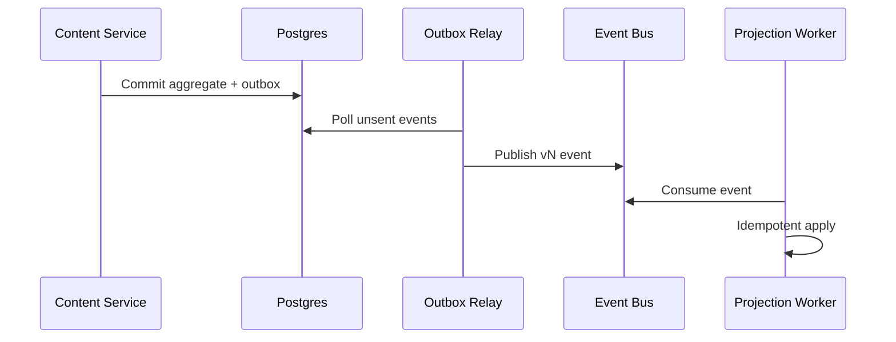

# Event Catalog

## Scope
Canonical event definitions for domain, integration, and observability pipelines.

## Domain Events (v1)
| Event | Trigger | Required Attributes | Consumers |
|---|---|---|---|
| `content.draft.created` | Draft created | `contentId`, `authorId`, `tenantId`, `revisionId` | Search indexer, analytics ingest |
| `content.review.submitted` | Draft submitted for review | `workflowId`, `reviewerPool`, `slaMinutes` | Workflow tasking, notifications |
| `content.status.changed` | Lifecycle transition | `from`, `to`, `reason`, `actorId` | Cache invalidation, audit |
| `content.published` | Publication succeeded | `channel`, `publishedUrl`, `renderVersion` | CDN purge, feed generator |
| `content.rollback.completed` | Rollback finalized | `rolledBackToRevisionId`, `incidentId` | Incident timeline, analytics correction |

## Event Envelope Schema
```json
{
  "eventId": "01JQ3NQKKAY2KXPZZC3V9A2F7S",
  "eventType": "content.published",
  "eventVersion": 1,
  "tenantId": "0e0d08f3-2a5d-4d85-8f1d-5fce2abf913e",
  "occurredAt": "2026-03-28T12:40:21Z",
  "traceId": "8f5cfdc0b9db4b23",
  "payload": {"contentId": "...", "channel": "web"}
}
```


## Mermaid Diagram


## Detailed Flow
1. Domain service commits aggregate and outbox row in same transaction.
2. Relay publishes ordered events to event bus with partition key tenant_id.
3. Subscribers apply idempotency window and schema-version compatibility checks.
4. Failed consumers route to DLQ with replay metadata.
5. Event lineage dashboard traces command -> aggregate -> event -> projection.

## Component Responsibilities
| Component | Responsibilities | Key Decisions |
|---|---|---|
| API Gateway | Authentication, authorization, throttling, request validation | Enforce idempotency and version headers |
| Content Service | Aggregate commands, revision management, lifecycle transitions | Maintain invariant-safe transitions |
| Workflow Service | Task routing, SLA timers, escalation | Deterministic assignment and timeout behavior |
| Publishing Service | Render, publish, cache invalidation, rollback | Idempotent publish and compensating actions |
| Data Platform | Event projections, analytics, audit archive | Exactly-once processing and retention compliance |

## Schema-Level Examples
```sql
CREATE TABLE content_item (
  id UUID PRIMARY KEY,
  tenant_id UUID NOT NULL,
  slug VARCHAR(180) NOT NULL,
  locale VARCHAR(10) NOT NULL DEFAULT 'en-US',
  status VARCHAR(40) NOT NULL,
  current_revision_id UUID NOT NULL,
  published_at TIMESTAMPTZ,
  created_by UUID NOT NULL,
  updated_at TIMESTAMPTZ NOT NULL,
  UNIQUE (tenant_id, locale, slug)
);

CREATE TABLE content_revision (
  id UUID PRIMARY KEY,
  content_id UUID NOT NULL REFERENCES content_item(id),
  version INT NOT NULL,
  body_json JSONB NOT NULL,
  checksum CHAR(64) NOT NULL,
  created_at TIMESTAMPTZ NOT NULL,
  UNIQUE (content_id, version)
);
```

```json
{
  "eventType": "content.status.changed",
  "eventVersion": 1,
  "tenantId": "0e0d08f3-2a5d-4d85-8f1d-5fce2abf913e",
  "contentId": "3c917a78-0cbf-4f07-97d7-8f94a4f2df80",
  "fromStatus": "PENDING_REVIEW",
  "toStatus": "PUBLISHED",
  "actorId": "dfe334d4-8a7d-4d52-b3ad-a1fb36aa0508",
  "occurredAt": "2026-03-28T09:15:00Z",
  "traceId": "7f1aa03bc7d7440a"
}
```

## Non-Functional Requirements
- **Availability:** Authoring plane 99.95% monthly; publishing pipeline 99.99%.
- **Performance:** p95 command latency < 350 ms; p95 read latency < 180 ms.
- **Scalability:** Handle 8x baseline publish spikes and 20x comment spikes.
- **Security:** OIDC + MFA for privileged users; signed asset URLs; immutable audit logs.
- **Reliability:** Outbox/inbox deduplication with idempotency keys for external side effects.
- **Operability:** SLO alerts for queue lag, task SLA breaches, cache invalidation failures.

## Cross-Document Traceability
- [Requirements](../requirements/requirements.md)
- [User Stories](../requirements/user-stories.md)
- [Use Case Descriptions](../analysis/use-case-descriptions.md)
- [API Design](../detailed-design/api-design.md)
- [ERD and Database Schema](../detailed-design/erd-database-schema.md)
- [Sequence Diagrams](../detailed-design/sequence-diagrams.md)
- [Deployment Diagram](../infrastructure/deployment-diagram.md)
- [Backend Status Matrix](../implementation/backend-status-matrix.md)
- [Edge Cases Index](../edge-cases/README.md)
