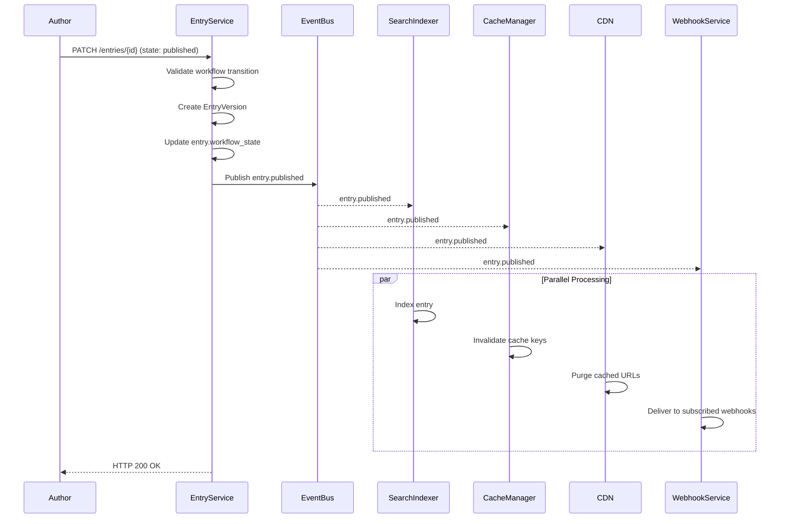
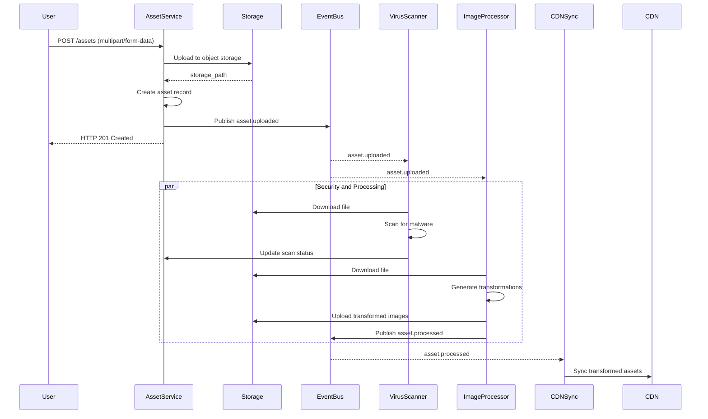
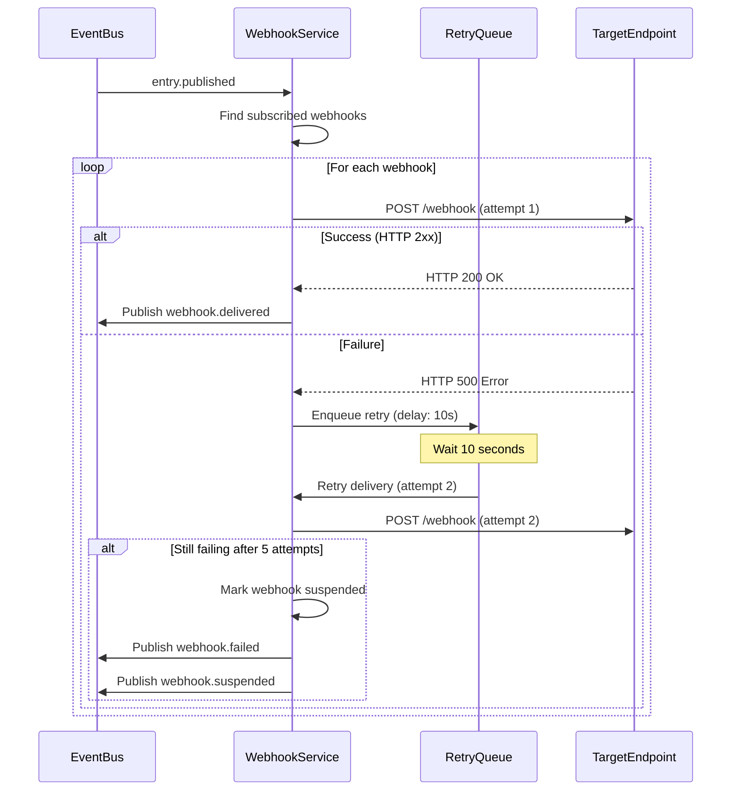

# Event Catalog — Content Management System

**Version:** 1.0  
**Status:** Approved  
**Last Updated:** 2025-01-01  

---

## Table of Contents

1. [Overview](#1-overview)
2. [Contract Conventions](#2-contract-conventions)
3. [Domain Events](#3-domain-events)
4. [Publish and Consumption Sequence](#4-publish-and-consumption-sequence)
5. [Operational SLOs](#5-operational-slos)
6. [Event Schema Registry](#6-event-schema-registry)

---

## 1. Overview

This document catalogs all asynchronous domain events published by the Content Management System. Events enable reactive workflows, external integrations via webhooks, and internal system coordination (cache invalidation, search indexing, analytics aggregation).

Events are published to an event bus (Kafka/RabbitMQ/SQS) with at-least-once delivery semantics. Consumers MUST be idempotent. All events conform to CloudEvents 1.0 specification for interoperability.

**Event Categories:**
- **Content Lifecycle**: Entry creation, updates, publication, deletion
- **Media Management**: Asset uploads, transformations, deletions
- **Schema Evolution**: ContentType creation and modification
- **Workflow**: State transitions, approvals, schedule executions
- **Integration**: Webhook deliveries, API key operations
- **Security**: Authentication, permission changes, audit events

---

## 2. Contract Conventions

### 2.1 Event Structure

All events conform to CloudEvents 1.0 specification:

```json
{
  "specversion": "1.0",
  "id": "uuid-v4",
  "source": "/cms/spaces/{space_id}",
  "type": "com.cms.entry.published",
  "datacontenttype": "application/json",
  "time": "2025-01-15T10:30:00.123Z",
  "subject": "entry/{entry_id}",
  "data": {
    "entry_id": "uuid",
    "space_id": "uuid",
    "content_type_id": "uuid",
    "workflow_state": "published",
    "published_at": "2025-01-15T10:30:00Z",
    "published_by": "uuid",
    "version_number": 5,
    "locale": "en-US",
    "changes": {
      "workflow_state": {"old": "approved", "new": "published"}
    }
  }
}
```

### 2.2 Naming Convention

Event types follow the pattern: `com.cms.{aggregate}.{action}`

| Pattern | Example | Description |
|---------|---------|-------------|
| `{aggregate}` | `entry`, `asset`, `content_type` | Core domain entity |
| `{action}` | `created`, `updated`, `deleted`, `published` | Past-tense verb |

### 2.3 Backward Compatibility

- Events MUST be append-only: new fields may be added, but existing fields cannot be removed or have their type changed
- Consumers MUST ignore unknown fields (forward compatibility)
- Event schema versions are tracked in the Event Schema Registry
- Breaking changes require a new event type with version suffix (e.g., `entry.published.v2`)

### 2.4 Envelope Metadata

All events include standard envelope fields:

| Field | Type | Description |
|-------|------|-------------|
| `event_id` | `UUID` | Unique event identifier (idempotency key) |
| `correlation_id` | `UUID` | Links related events across service boundaries |
| `causation_id` | `UUID` | ID of the event that caused this event |
| `timestamp` | `ISO 8601` | Event occurrence time (UTC) |
| `actor_id` | `UUID` | User who triggered the event |
| `space_id` | `UUID` | Space context |
| `organization_id` | `UUID` | Organization context |

---

## 3. Domain Events

### 3.1 Event Catalog Table

| Event Type | Aggregate | Trigger | Published By | Consumers |
|------------|-----------|---------|--------------|-----------|
| `entry.created` | Entry | New entry created | Entry Service | Webhook Delivery, Analytics |
| `entry.updated` | Entry | Entry fields modified | Entry Service | Cache Manager, Webhook Delivery |
| `entry.published` | Entry | Entry published | Entry Service | Search Indexer, Cache Manager, CDN Purge, Webhook Delivery |
| `entry.unpublished` | Entry | Entry removed from visibility | Entry Service | Search Indexer, Cache Manager, CDN Purge |
| `entry.deleted` | Entry | Entry soft-deleted | Entry Service | Search Indexer, Webhook Delivery |
| `entry.version_created` | EntryVersion | Version snapshot created | Entry Service | Version Archive |
| `entry.scheduled` | EntrySchedule | Publish/unpublish scheduled | Schedule Service | Schedule Executor |
| `entry.schedule_executed` | EntrySchedule | Scheduled action completed | Schedule Executor | Entry Service, Webhook Delivery |
| `asset.uploaded` | Asset | New asset uploaded | Asset Service | Image Processor, Virus Scanner, Webhook Delivery |
| `asset.processed` | Asset | Transformations completed | Image Processor | CDN Sync, Webhook Delivery |
| `asset.deleted` | Asset | Asset soft-deleted | Asset Service | CDN Purge, Webhook Delivery |
| `content_type.created` | ContentType | New content type defined | Schema Service | Migration Tracker, Webhook Delivery |
| `content_type.updated` | ContentType | Content type schema modified | Schema Service | Entry Validator, Migration Tracker |
| `content_type.deleted` | ContentType | Content type soft-deleted | Schema Service | Webhook Delivery |
| `workflow.state_changed` | Entry | Workflow state transition | Workflow Engine | Notification Service, Analytics |
| `approval.created` | Approval | Approval granted | Approval Service | Entry Service, Notification Service |
| `approval.invalidated` | Approval | Approval invalidated by edit | Entry Service | Notification Service |
| `comment.created` | Comment | Comment added to entry | Comment Service | Notification Service, Webhook Delivery |
| `comment.resolved` | Comment | Comment marked resolved | Comment Service | Notification Service |
| `webhook.delivered` | WebhookDelivery | Webhook successfully delivered | Webhook Service | Analytics |
| `webhook.failed` | WebhookDelivery | Webhook delivery failed | Webhook Service | Alert Service, Webhook Service (retry) |
| `webhook.suspended` | Webhook | Webhook auto-suspended | Webhook Service | Notification Service |
| `locale.created` | Locale | New locale added | Locale Service | Entry Service, Webhook Delivery |
| `tag.created` | Tag | New tag created | Tag Service | Analytics |
| `category.created` | Category | New category created | Category Service | Analytics |
| `api_key.created` | APIKey | New API key generated | Auth Service | Audit Service |
| `api_key.revoked` | APIKey | API key revoked | Auth Service | Audit Service, Notification Service |
| `preview.created` | Preview | Preview session created | Preview Service | Analytics |
| `user.login` | Author | User authenticated | Auth Service | Audit Service, Analytics |
| `user.permission_changed` | Author | User role/permissions updated | Permission Service | Audit Service, Cache Manager |
| `space.created` | Space | New space created | Space Service | Provisioning Service, Webhook Delivery |
| `space.deleted` | Space | Space soft-deleted | Space Service | Cleanup Service, Webhook Delivery |

---

### 3.2 Detailed Event Schemas

---

#### entry.created

**Trigger:** New entry is created in draft state.

**Payload:**
```json
{
  "entry_id": "uuid",
  "space_id": "uuid",
  "content_type_id": "uuid",
  "content_type_name": "blog_post",
  "workflow_state": "draft",
  "locale": "en-US",
  "created_by": "uuid",
  "created_at": "2025-01-15T10:00:00Z",
  "fields": {
    "title": "My First Blog Post",
    "body": "Content here..."
  }
}
```

**Consumers:**
- Webhook Delivery Service: Notify subscribed webhooks
- Analytics Service: Track entry creation metrics

---

#### entry.updated

**Trigger:** Entry fields are modified.

**Payload:**
```json
{
  "entry_id": "uuid",
  "space_id": "uuid",
  "content_type_id": "uuid",
  "workflow_state": "draft",
  "updated_by": "uuid",
  "updated_at": "2025-01-15T11:30:00Z",
  "changes": {
    "title": {"old": "Draft Title", "new": "Final Title"},
    "body": {"old": "...", "new": "..."}
  },
  "invalidated_approvals": ["approval_id_1", "approval_id_2"]
}
```

**Consumers:**
- Cache Manager: Invalidate cached entry (if published)
- Webhook Delivery Service: Notify subscribed webhooks
- Approval Service: Invalidate existing approvals

---

#### entry.published

**Trigger:** Entry transitions to published state.

**Payload:**
```json
{
  "entry_id": "uuid",
  "space_id": "uuid",
  "content_type_id": "uuid",
  "content_type_name": "blog_post",
  "slug": "my-blog-post",
  "locale": "en-US",
  "published_at": "2025-01-15T12:00:00Z",
  "published_by": "uuid",
  "version_number": 1,
  "is_first_publish": true,
  "cdn_urls": [
    "https://cdn.example.com/entries/uuid",
    "https://cdn.example.com/blog/my-blog-post"
  ],
  "tags": ["cms", "tutorial"],
  "categories": ["Documentation"],
  "fields": {
    "title": "How to Use Content Management Systems",
    "body": "..."
  }
}
```

**Consumers:**
- Search Indexer: Add/update entry in search index
- Cache Manager: Invalidate related cache keys
- CDN Purge Service: Purge CDN cache for entry URLs
- Webhook Delivery Service: Notify subscribed webhooks
- Analytics Service: Track publication metrics

---

#### entry.unpublished

**Trigger:** Published entry is removed from public visibility.

**Payload:**
```json
{
  "entry_id": "uuid",
  "space_id": "uuid",
  "slug": "my-blog-post",
  "unpublished_at": "2025-01-20T15:00:00Z",
  "unpublished_by": "uuid",
  "reason": "Content needs revision",
  "cdn_urls": [
    "https://cdn.example.com/entries/uuid",
    "https://cdn.example.com/blog/my-blog-post"
  ]
}
```

**Consumers:**
- Search Indexer: Remove entry from search index
- Cache Manager: Invalidate cached entry
- CDN Purge Service: Purge CDN cache
- Webhook Delivery Service: Notify subscribed webhooks

---

#### entry.deleted

**Trigger:** Entry is soft-deleted.

**Payload:**
```json
{
  "entry_id": "uuid",
  "space_id": "uuid",
  "content_type_id": "uuid",
  "deleted_by": "uuid",
  "deleted_at": "2025-01-25T10:00:00Z",
  "was_published": true
}
```

**Consumers:**
- Search Indexer: Remove entry from search index (if published)
- Webhook Delivery Service: Notify subscribed webhooks

---

#### entry.version_created

**Trigger:** Entry version snapshot is created.

**Payload:**
```json
{
  "version_id": "uuid",
  "entry_id": "uuid",
  "version_number": 5,
  "created_by": "uuid",
  "created_at": "2025-01-15T12:00:00Z",
  "snapshot_size_bytes": 15234,
  "change_summary": "Updated hero image and fixed typos"
}
```

**Consumers:**
- Version Archive Service: Archive version to long-term storage

---

#### asset.uploaded

**Trigger:** New asset is uploaded.

**Payload:**
```json
{
  "asset_id": "uuid",
  "space_id": "uuid",
  "filename": "hero-image.jpg",
  "mime_type": "image/jpeg",
  "size_bytes": 2048576,
  "width": 1920,
  "height": 1080,
  "storage_path": "s3://bucket/spaces/uuid/assets/uuid.jpg",
  "uploaded_by": "uuid",
  "uploaded_at": "2025-01-15T10:00:00Z"
}
```

**Consumers:**
- Image Processor: Generate transformations (thumbnails, WebP, etc.)
- Virus Scanner: Scan for malware
- Webhook Delivery Service: Notify subscribed webhooks
- Analytics Service: Track asset usage

---

#### asset.processed

**Trigger:** Asset transformations are completed.

**Payload:**
```json
{
  "asset_id": "uuid",
  "transformations": [
    {
      "transformation_id": "uuid",
      "format": "webp",
      "width": 800,
      "height": 600,
      "size_bytes": 102400,
      "cdn_url": "https://cdn.example.com/assets/uuid/w800.webp"
    },
    {
      "transformation_id": "uuid",
      "format": "jpeg",
      "width": 400,
      "height": 300,
      "size_bytes": 51200,
      "cdn_url": "https://cdn.example.com/assets/uuid/w400.jpg"
    }
  ],
  "processing_duration_ms": 1234
}
```

**Consumers:**
- CDN Sync Service: Sync transformed assets to CDN
- Webhook Delivery Service: Notify subscribed webhooks

---

#### content_type.created

**Trigger:** New content type is defined.

**Payload:**
```json
{
  "content_type_id": "uuid",
  "space_id": "uuid",
  "name": "Product",
  "api_id": "product",
  "field_count": 8,
  "created_by": "uuid",
  "created_at": "2025-01-15T10:00:00Z",
  "fields": [
    {
      "name": "Title",
      "api_id": "title",
      "field_type": "short_text",
      "is_required": true
    }
  ]
}
```

**Consumers:**
- Migration Tracker: Log schema change
- Webhook Delivery Service: Notify subscribed webhooks

---

#### content_type.updated

**Trigger:** Content type schema is modified (fields added/removed/changed).

**Payload:**
```json
{
  "content_type_id": "uuid",
  "space_id": "uuid",
  "name": "Product",
  "version": 2,
  "updated_by": "uuid",
  "updated_at": "2025-01-15T11:00:00Z",
  "changes": {
    "fields_added": [
      {"name": "SKU", "api_id": "sku", "field_type": "short_text"}
    ],
    "fields_removed": [],
    "fields_modified": [
      {
        "name": "Price",
        "changes": {"is_required": {"old": false, "new": true}}
      }
    ]
  }
}
```

**Consumers:**
- Entry Validator: Revalidate existing entries against new schema
- Migration Tracker: Log schema migration

---

#### workflow.state_changed

**Trigger:** Entry workflow state transitions.

**Payload:**
```json
{
  "entry_id": "uuid",
  "space_id": "uuid",
  "from_state": "in_review",
  "to_state": "approved",
  "changed_by": "uuid",
  "changed_at": "2025-01-15T14:00:00Z",
  "comment": "Looks good, approved for publish"
}
```

**Consumers:**
- Notification Service: Notify entry creator of state change
- Analytics Service: Track workflow progression metrics

---

#### approval.created

**Trigger:** Approval is granted for an entry.

**Payload:**
```json
{
  "approval_id": "uuid",
  "entry_id": "uuid",
  "approver_id": "uuid",
  "status": "approved",
  "comment": "Content is accurate and well-written",
  "created_at": "2025-01-15T13:30:00Z"
}
```

**Consumers:**
- Entry Service: Check if entry now meets publish criteria
- Notification Service: Notify entry creator

---

#### webhook.delivered

**Trigger:** Webhook delivery succeeds.

**Payload:**
```json
{
  "delivery_id": "uuid",
  "webhook_id": "uuid",
  "event_type": "entry.published",
  "http_status": 200,
  "response_time_ms": 234,
  "delivered_at": "2025-01-15T12:00:01Z"
}
```

**Consumers:**
- Analytics Service: Track webhook reliability metrics

---

#### webhook.failed

**Trigger:** Webhook delivery fails after all retry attempts.

**Payload:**
```json
{
  "delivery_id": "uuid",
  "webhook_id": "uuid",
  "webhook_url": "https://example.com/webhook",
  "event_type": "entry.published",
  "attempt_count": 5,
  "last_http_status": 500,
  "error_message": "Connection timeout",
  "failed_at": "2025-01-15T14:00:00Z"
}
```

**Consumers:**
- Alert Service: Notify webhook owner of failure
- Webhook Service: Check if suspension threshold reached

---

#### webhook.suspended

**Trigger:** Webhook is auto-suspended after consecutive failures.

**Payload:**
```json
{
  "webhook_id": "uuid",
  "webhook_name": "Production Integration",
  "failure_count": 5,
  "suspended_at": "2025-01-15T14:05:00Z",
  "reason": "5 consecutive delivery failures"
}
```

**Consumers:**
- Notification Service: Alert webhook owner with re-enablement instructions

---

#### api_key.created

**Trigger:** New API key is generated.

**Payload:**
```json
{
  "api_key_id": "uuid",
  "space_id": "uuid",
  "name": "Production API Key",
  "permissions": ["content:read", "media:upload"],
  "expires_at": "2026-01-15T00:00:00Z",
  "created_by": "uuid",
  "created_at": "2025-01-15T10:00:00Z"
}
```

**Consumers:**
- Audit Service: Log API key creation
- Notification Service: Send key to creator (one-time only)

---

#### api_key.revoked

**Trigger:** API key is revoked.

**Payload:**
```json
{
  "api_key_id": "uuid",
  "space_id": "uuid",
  "name": "Production API Key",
  "revoked_by": "uuid",
  "revoked_at": "2025-01-20T15:00:00Z",
  "reason": "Compromised credential"
}
```

**Consumers:**
- Audit Service: Log revocation
- Notification Service: Alert key creator
- Cache Manager: Invalidate auth cache for key

---

## 4. Publish and Consumption Sequence

### 4.1 Entry Publish Flow



### 4.2 Asset Upload and Processing Flow



### 4.3 Webhook Delivery with Retry



---

## 5. Operational SLOs

### 5.1 Event Publication

| Metric | Target | Measurement |
|--------|--------|-------------|
| Time to publish (write to event bus) | < 100ms | p99 latency |
| Event ordering guarantee | Per-partition FIFO | Kafka partition key = space_id |
| Publish success rate | > 99.9% | Failed publishes / total publishes |
| Event payload size | < 256 KB | Average and max payload size |

### 5.2 Event Consumption

| Metric | Target | Measurement |
|--------|--------|-------------|
| Search indexing latency | < 5 seconds | Time from entry.published to indexed |
| Cache invalidation latency | < 1 second | Time from event to cache cleared |
| Webhook delivery latency (first attempt) | < 10 seconds | Time from event to HTTP request sent |
| Consumer lag | < 1000 messages | Kafka consumer group lag |

### 5.3 Webhook Delivery

| Metric | Target | Measurement |
|--------|--------|-------------|
| Delivery success rate (all attempts) | > 95% | Successful deliveries / total deliveries |
| Delivery latency (successful) | < 30 seconds | Time from event to HTTP 2xx response |
| Retry exhaustion rate | < 5% | Failed after 5 attempts / total deliveries |
| Suspension rate | < 1% | Auto-suspended webhooks / active webhooks |

### 5.4 Event Processing SLA

| Event Type | Processing SLA | Critical Path |
|------------|---------------|---------------|
| `entry.published` | 5 seconds | Search indexing |
| `entry.updated` | 1 second | Cache invalidation |
| `asset.uploaded` | 60 seconds | Image transformations |
| `webhook.*` | 30 seconds | Delivery attempt |

---

## 6. Event Schema Registry

All event schemas are versioned and stored in a centralized schema registry (Confluent Schema Registry or equivalent).

### 6.1 Schema Evolution Rules

| Change Type | Compatibility | Allowed |
|-------------|--------------|---------|
| Add optional field | Forward compatible | ✅ Yes |
| Remove optional field | Backward compatible | ❌ No (use deprecation) |
| Change field type | Breaking | ❌ No (create new event version) |
| Rename field | Breaking | ❌ No (create new event version) |
| Add required field | Breaking | ❌ No (create new event version) |

### 6.2 Schema Versioning

Event schemas follow semantic versioning:
- **Major version**: Breaking changes (new event type: `entry.published.v2`)
- **Minor version**: Backward-compatible additions (new optional fields)
- **Patch version**: Documentation or metadata changes

### 6.3 Deprecation Policy

Deprecated event types:
1. Must be supported for at least 6 months after deprecation announcement
2. Must include `deprecated: true` flag in event metadata
3. Must document migration path to new event version

---

**Document Control:**  
- Approved by: Solutions Architect, Event Platform Lead  
- Review Cycle: Quarterly  
- Next Review: 2025-04-01
