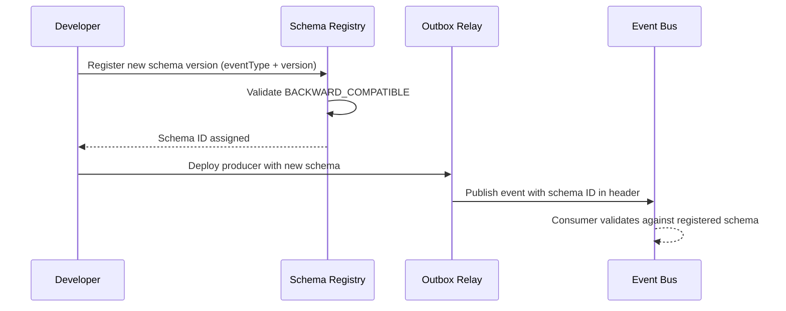

# Event Catalog — Content Management System

**Version:** 1.0 | **Status:** Approved | **Last Updated:** 2026-01-01

---

## Table of Contents

1. [Contract Conventions](#contract-conventions)
2. [Domain Events](#domain-events)
3. [Publish and Consumption Sequence](#publish-and-consumption-sequence)
4. [Operational SLOs](#operational-slos)

---

## Contract Conventions

All domain events conform to the following envelope schema and versioning strategy.

### Event Envelope Schema

```json
{
  "eventId":      "01JQ3NQKKAY2KXPZZC3V9A2F7S",
  "eventType":    "content.published",
  "eventVersion": 1,
  "tenantId":     "0e0d08f3-2a5d-4d85-8f1d-5fce2abf913e",
  "spaceId":      "7a3c1f90-4d22-4e3b-b891-1abc23d456ef",
  "occurredAt":   "2026-03-28T12:40:21Z",
  "traceId":      "8f5cfdc0b9db4b23",
  "correlationId":"req_4f8a9d23e1c047b3",
  "payload":      {}
}
```

### Versioning Strategy

| Change Type | Action | Consumer Impact |
|-------------|--------|-----------------|
| Add optional field | Bump `eventVersion` minor | Backwards compatible; consumers ignore unknown fields |
| Rename or remove field | Bump `eventVersion` major; publish both versions in parallel | Consumers must migrate before old version is retired |
| New event type | Introduce new `eventType`; announce in catalog | Consumers opt-in to subscribe |
| Schema correction (non-breaking) | No version bump; changelog note only | None |

### Idempotency and Ordering

- Every consumer must deduplicate by `eventId` within a 24-hour window.
- Events are partitioned by `tenantId` on the event bus to preserve per-tenant ordering.
- Schema Registry enforces compatibility checks (`BACKWARD_COMPATIBLE`) before any version is promoted.

### DLQ Policy

Failed events are routed to a per-consumer dead-letter queue after **3 retry attempts** (exponential back-off: 30 s, 5 min, 30 min). DLQ messages include original `eventId`, `eventType`, `failureReason`, and a replay timestamp.

---

## Domain Events

| Event Type | Producer | Trigger | Key Payload Fields | Consumers |
|------------|----------|---------|-------------------|-----------|
| `content.draft.created` | Content Service | Author creates a new draft | `contentId`, `authorId`, `revisionId`, `contentTypeId`, `locale` | Search Indexer, Analytics Ingest |
| `content.review.submitted` | Content Service | Draft submitted for editorial review | `contentId`, `revisionId`, `workflowId`, `reviewerPool`, `slaMinutes` | Workflow Service, Notification Service |
| `content.review.approved` | Workflow Service | Reviewer approves a revision | `contentId`, `revisionId`, `reviewerId`, `approvedAt` | Content Service, Notification Service |
| `content.review.rejected` | Workflow Service | Reviewer rejects a revision | `contentId`, `revisionId`, `reviewerId`, `rejectionReason` | Content Service, Notification Service |
| `content.status.changed` | Content Service | Any lifecycle state transition | `contentId`, `fromStatus`, `toStatus`, `reason`, `actorId` | Cache Invalidation Worker, Audit Log, Analytics |
| `content.scheduled` | Content Service | Publish scheduled for future time | `contentId`, `revisionId`, `scheduledPublishAt`, `channel` | Scheduler Service |
| `content.published` | Publishing Service | Content successfully published to channel | `contentId`, `revisionId`, `channel`, `publishedUrl`, `renderVersion` | CDN Purge Worker, Feed Generator, Search Indexer |
| `content.unpublished` | Publishing Service | Content removed from channel | `contentId`, `channel`, `unpublishedAt`, `actorId` | CDN Purge Worker, Feed Generator |
| `content.rollback.completed` | Publishing Service | Rollback to prior revision finalized | `contentId`, `rolledBackToRevisionId`, `incidentId`, `rollbackActorId` | Incident Timeline, Analytics Correction |
| `content.deleted` | Content Service | Content item soft-deleted | `contentId`, `deletedBy`, `legalHoldActive` | Search Indexer (remove), Archive Service |
| `asset.uploaded` | Media Service | Binary file upload received and scanned | `assetId`, `spaceId`, `mimeType`, `sizeBytes`, `scanStatus` | Thumbnail Generator, Search Indexer |
| `asset.scan.completed` | Security Service | AV scan finished | `assetId`, `scanStatus`, `threatDetails` | Publishing Service Gate, Notification Service |
| `workflow.task.expired` | Workflow Service | Review SLA deadline breached | `workflowId`, `taskId`, `contentId`, `assigneeId`, `slaDeadline` | Escalation Handler, Notification Service |
| `webhook.dispatched` | Webhook Service | Outbound webhook fired for a space event | `webhookId`, `spaceId`, `eventType`, `targetUrl`, `httpStatus` | Webhook Delivery Log, Retry Queue |

---

## Publish and Consumption Sequence

The following diagram illustrates the outbox-based event publication flow from the Content Service through to downstream consumers.

```mermaid
sequenceDiagram
    participant Author
    participant CS as Content Service
    participant DB as PostgreSQL (Outbox)
    participant Relay as Outbox Relay
    participant Bus as Event Bus (Kafka)
    participant CDN as CDN Purge Worker
    participant Idx as Search Indexer
    participant Ntf as Notification Service

    Author->>CS: POST /entries/{id}/publish
    CS->>DB: BEGIN; UPDATE content_items SET status='PUBLISHED'; INSERT outbox(event); COMMIT
    Relay->>DB: Poll outbox WHERE dispatched_at IS NULL
    Relay->>Bus: Produce content.published (partition=tenantId)
    Bus-->>CDN: content.published consumed
    CDN->>CDN: Purge edge cache for published URL
    Bus-->>Idx: content.published consumed
    Idx->>Idx: Upsert document in search index
    Bus-->>Ntf: content.published consumed
    Ntf->>Author: "Your content is live" email/in-app
    Relay->>DB: UPDATE outbox SET dispatched_at=now()
```

### Schema Registry Flow



---

## Operational SLOs

| SLO | Metric | Target | Alert Threshold | Owner |
|-----|--------|--------|-----------------|-------|
| Event publication latency (p95) | Time from DB commit to Bus produce | < 500 ms | > 1 s for 5 min | Platform Team |
| Event delivery latency (p99) | Time from Bus produce to consumer ack | < 2 s | > 10 s for 5 min | Platform Team |
| DLQ message rate | DLQ entries per hour per consumer | < 5 / hr | > 20 / hr | Owning Service Team |
| Outbox relay lag | Unprocessed outbox row count | < 100 rows | > 500 rows | Platform Team |
| Webhook delivery success rate | HTTP 2xx / total dispatched (1 hr) | ≥ 98% | < 95% for 15 min | Integrations Team |
| Schema compatibility violations | Incompatible schema publish attempts | 0 | Any violation | Developer Experience |
| Event replay success rate | Successfully replayed DLQ messages | ≥ 99% | < 95% over 24 hr | Platform Team |
| Consumer offset lag (per partition) | Max offset lag across consumer groups | < 10,000 | > 50,000 | Platform Team |

### Observability Labels

All event bus metrics are tagged with: `tenant_id`, `event_type`, `consumer_group`, `partition`, `environment`.

### Alerting Runbook Reference

| Alert | Runbook |
|-------|---------|
| `outbox_lag_high` | Check outbox relay pod logs; verify Postgres connectivity; scale relay replicas |
| `dlq_spike` | Inspect DLQ messages for schema mismatches or downstream service unavailability; replay after fix |
| `webhook_delivery_failure` | Verify target URL reachability; check TLS cert validity; review retry backlog |
| `schema_incompatibility` | Rollback producer deployment; notify consumers; re-register compatible schema version |
