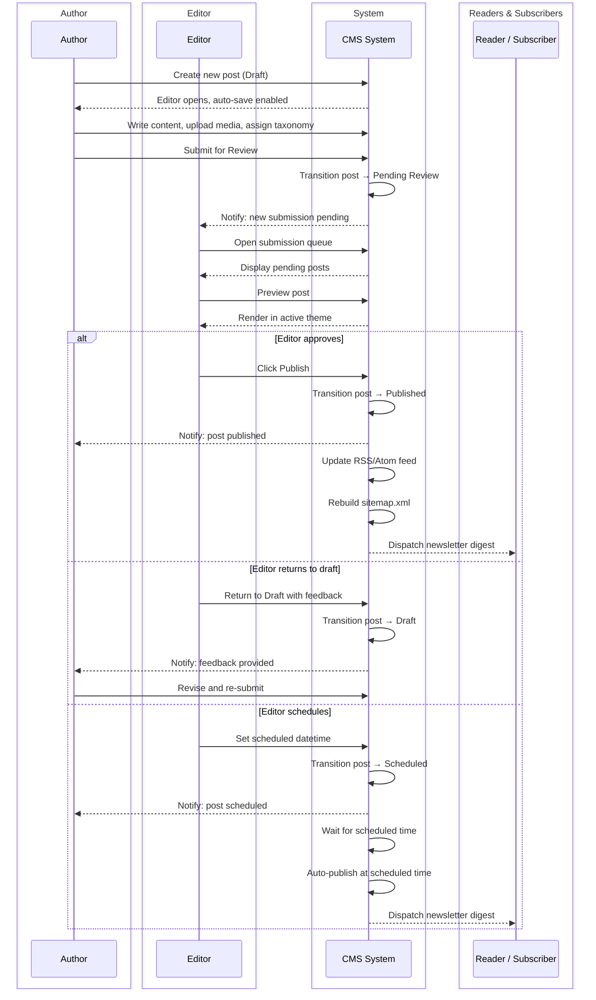
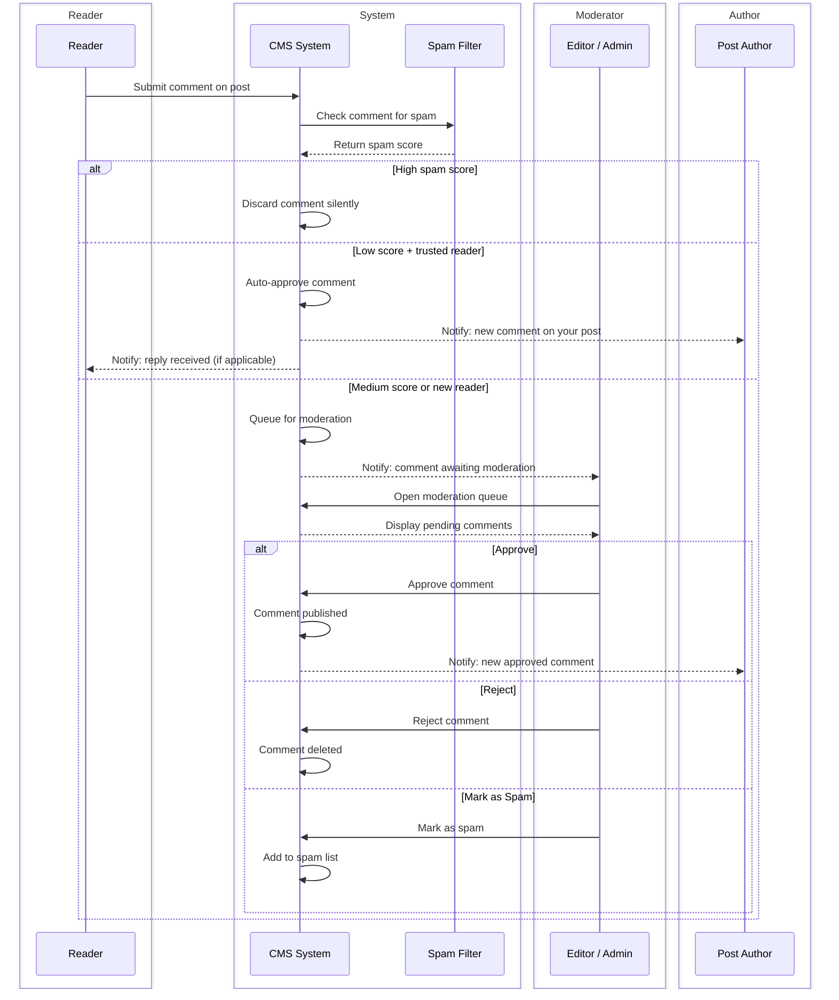
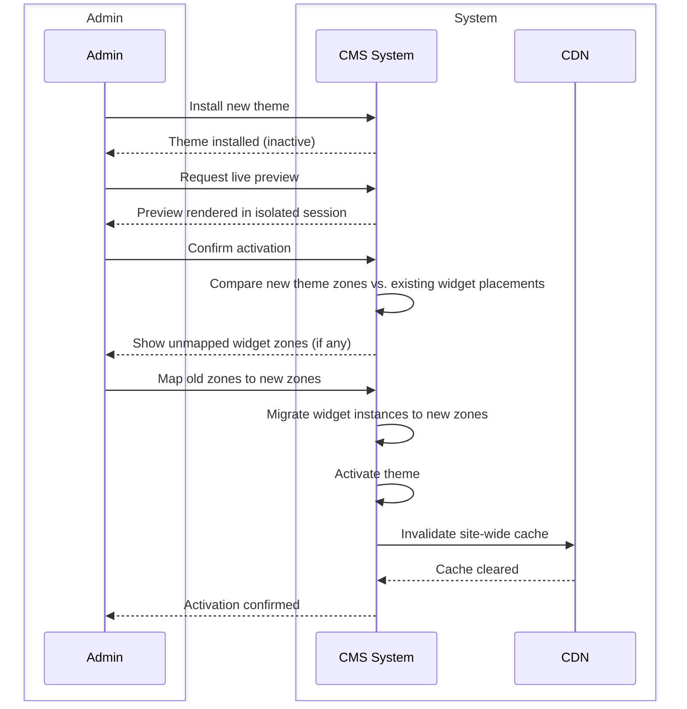
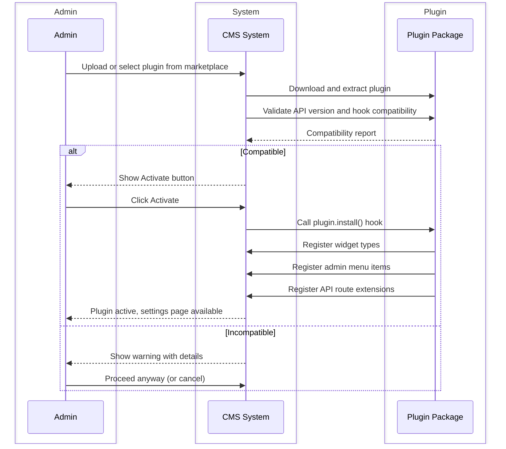
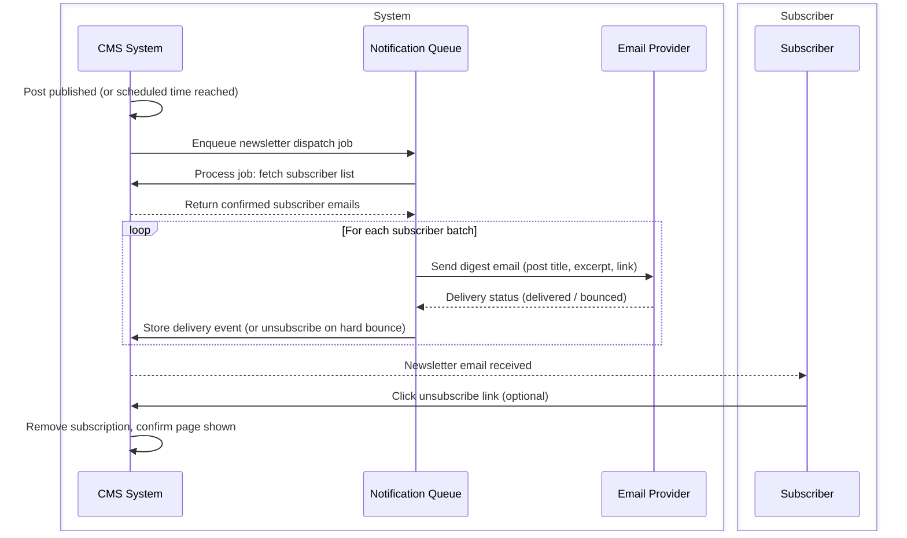
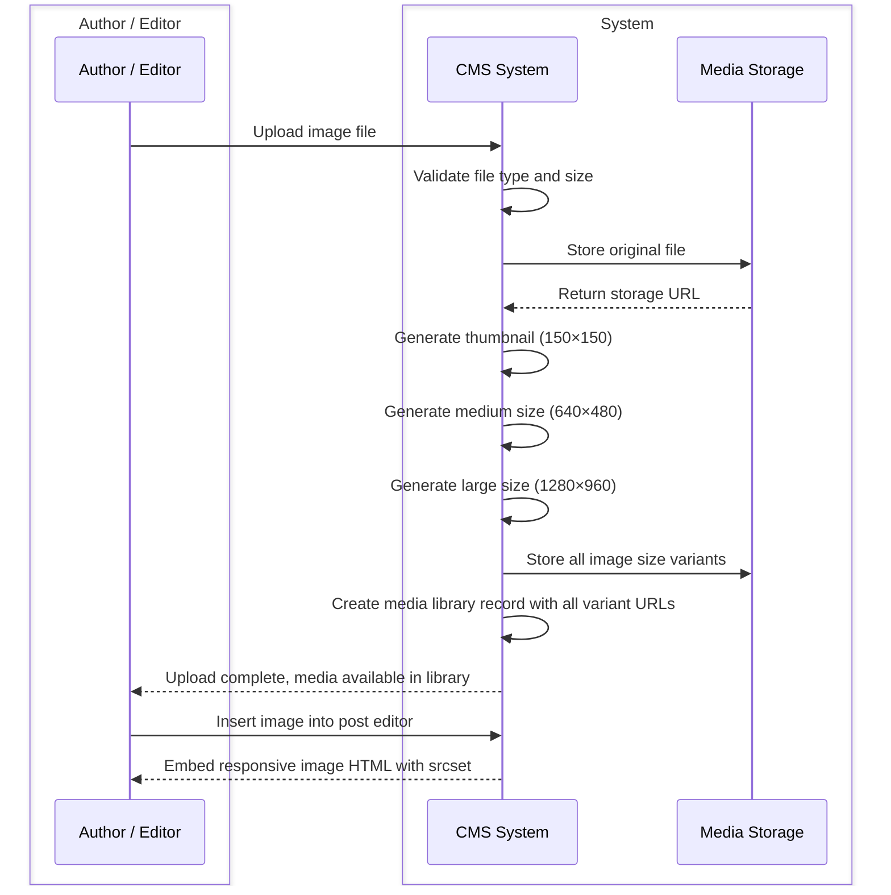

# Swimlane Diagrams

## Overview
Swimlane (BPMN-style) diagrams show cross-role workflows and responsibilities within the CMS platform.

---

## 1. End-to-End Post Publishing Workflow

---

## 2. Comment Submission and Moderation

---

## 3. Theme Activation with Widget Migration

---

## 4. Plugin Installation and Hook Registration

---

## 5. Subscriber Newsletter Dispatch

---

## 6. Media Upload and Processing

