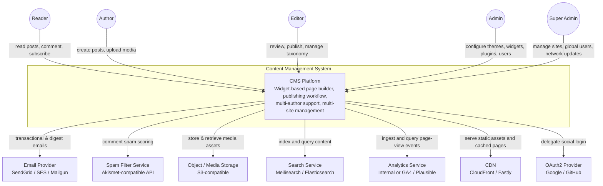

# System Context Diagram

## Overview
The system context diagram shows the CMS and its interactions with external actors and systems at the highest level of abstraction.

---

## System Context

---

## External System Descriptions

| External System | Purpose | Interaction |
|-----------------|---------|-------------|
| **Email Provider** | Delivers transactional emails (invitations, comment notifications, newsletter digests, password resets) | CMS calls provider API to send; provider webhooks report delivery/bounce status |
| **Spam Filter Service** | Scores incoming comments for spam probability | CMS submits comment text, author, and IP; service returns spam score and classification |
| **Object / Media Storage** | Stores uploaded images, documents, theme assets, and plugin packages | CMS uploads files on ingest; serves via CDN-backed presigned URLs |
| **Search Service** | Provides fast full-text search over published posts and pages | CMS indexes documents on publish/update/delete events; frontend queries via CMS API proxy |
| **Analytics Service** | Collects and aggregates page-view events for the analytics dashboard | CMS frontend sends beacon events; admin dashboard reads aggregated data via API |
| **CDN** | Caches and serves static assets and optionally full HTML pages at edge nodes | CMS invalidates CDN cache on publish/unpublish events |
| **OAuth2 Provider** | Enables social login for readers and authors | CMS acts as OAuth2 client; redirects users to provider; receives identity tokens |
