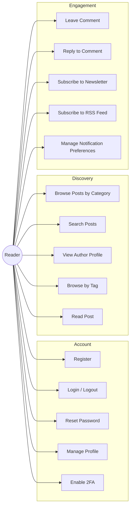
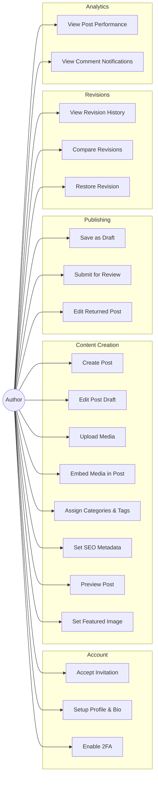
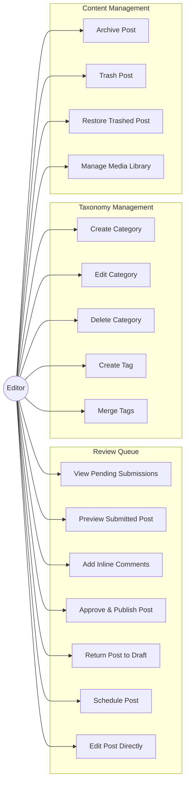
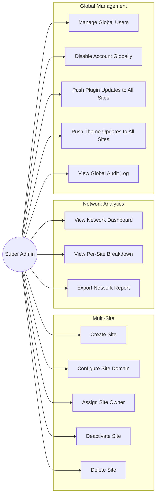
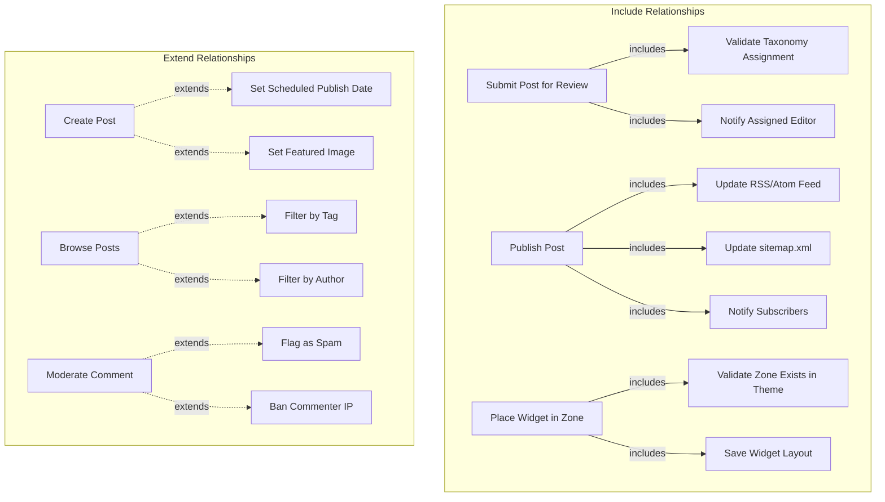

# Use Case Diagram

## Overview
This document contains use case diagrams for all major actors in the CMS: Reader, Author, Editor, Administrator, and Super Admin.

---

## Complete System Use Case Diagram

```mermaid
graph TB
    subgraph Actors
        Reader((Reader))
        Author((Author))
        Editor((Editor))
        Admin((Admin))
        SuperAdmin((Super Admin))
        EmailProvider((Email Provider))
        SpamFilter((Spam Filter))
        SearchEngine((Search Engine))
    end

    subgraph "CMS Platform"
        UC1[Browse & Search Content]
        UC2[Comment on Posts]
        UC3[Subscribe to Newsletter]
        UC4[Manage Reader Profile]

        UC10[Create & Edit Posts]
        UC11[Upload Media]
        UC12[Submit for Review]
        UC13[View Revisions]
        UC14[View Author Analytics]

        UC20[Review Submissions]
        UC21[Publish / Schedule Posts]
        UC22[Return Post to Draft]
        UC23[Manage Taxonomies]

        UC30[Manage Themes & Widgets]
        UC31[Manage Navigation Menus]
        UC32[Manage Users & Roles]
        UC33[Moderate Comments]
        UC34[Manage Plugins]
        UC35[View Site Analytics]
        UC36[Manage Redirects]

        UC40[Manage Sites]
        UC41[View Network Analytics]
        UC42[Push Global Updates]
    end

    Reader --> UC1
    Reader --> UC2
    Reader --> UC3
    Reader --> UC4

    Author --> UC10
    Author --> UC11
    Author --> UC12
    Author --> UC13
    Author --> UC14

    Editor --> UC20
    Editor --> UC21
    Editor --> UC22
    Editor --> UC23
    Editor --> UC10
    Editor --> UC11

    Admin --> UC30
    Admin --> UC31
    Admin --> UC32
    Admin --> UC33
    Admin --> UC34
    Admin --> UC35
    Admin --> UC36
    Admin --> UC20
    Admin --> UC21

    SuperAdmin --> UC40
    SuperAdmin --> UC41
    SuperAdmin --> UC42
    SuperAdmin --> UC32

    UC2 --> SpamFilter
    UC3 --> EmailProvider
    UC1 --> SearchEngine
```

---

## Reader Use Cases

---

## Author Use Cases

---

## Editor Use Cases

---

## Administrator Use Cases

```mermaid
graph LR
    Admin((Admin))

    subgraph "Site Configuration"
        UC1[Configure Site Settings]
        UC2[Install Theme]
        UC3[Activate Theme]
        UC4[Preview Theme]
        UC5[Configure Widget Zones]
        UC6[Add/Remove Widgets]
        UC7[Configure Widget Instance]
        UC8[Build Navigation Menu]
        UC9[Assign Menu to Zone]
        UC10[Manage Redirects]
    end

    subgraph "User Management"
        UC11[Invite Author/Editor]
        UC12[Change User Role]
        UC13[Suspend User]
        UC14[Delete User Account]
        UC15[View Audit Log]
    end

    subgraph "Moderation"
        UC16[Approve Comments]
        UC17[Reject / Spam Comments]
        UC18[Configure Spam Filter]
        UC19[Manage Comment Allowlist/Blocklist]
    end

    subgraph "Plugins"
        UC20[Install Plugin]
        UC21[Activate Plugin]
        UC22[Configure Plugin]
        UC23[Deactivate Plugin]
        UC24[Update Plugin]
        UC25[Uninstall Plugin]
    end

    subgraph "Analytics & Reporting"
        UC26[View Site Dashboard]
        UC27[View Author Performance]
        UC28[Export Subscriber List]
        UC29[Generate Reports]
    end

    Admin --> UC1
    Admin --> UC2
    Admin --> UC3
    Admin --> UC4
    Admin --> UC5
    Admin --> UC6
    Admin --> UC7
    Admin --> UC8
    Admin --> UC9
    Admin --> UC10
    Admin --> UC11
    Admin --> UC12
    Admin --> UC13
    Admin --> UC14
    Admin --> UC15
    Admin --> UC16
    Admin --> UC17
    Admin --> UC18
    Admin --> UC19
    Admin --> UC20
    Admin --> UC21
    Admin --> UC22
    Admin --> UC23
    Admin --> UC24
    Admin --> UC25
    Admin --> UC26
    Admin --> UC27
    Admin --> UC28
    Admin --> UC29
```

---

## Super Admin Use Cases

---

## Use Case Relationships

